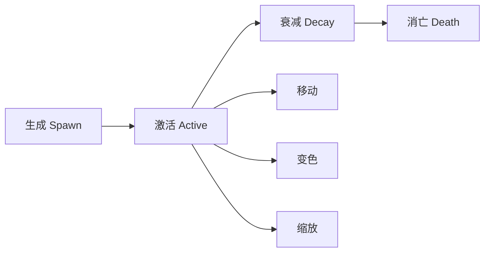

# 🧙‍♂️ 特效与打击感深度研究

## 📚 1. 理论基础 (Theoretical Basis)

### 🎯 核心定义

**Game Feel（游戏手感/打击感）** 是指玩家操作与游戏反馈之间的即时交互感受。优秀的 Game Feel 让玩家感到"爽"、"有力"、"流畅"。

**核心要素**:
1. **输入响应** - 按键后多快看到反应（<100ms 为佳）
2. **视觉反馈** - 特效、震动、顿帧
3. **听觉反馈** - 音效与画面同步
4. **触觉反馈** - 震动（移动端）

### 📐 打击感公式

```
打击感强度 = (视觉冲击力 × 音效冲击力) + 顿帧时长 + 屏幕震动幅度

理想配比:
- 小攻击: 小特效 + 轻音效 + 无顿帧 + 无震动
- 中攻击: 中特效 + 重音效 + 1-2帧顿帧 + 轻震动
- 大招: 巨大特效 + 爆炸音效 + 3-5帧顿帧 + 强震动
```

### 🎬 核心技术

#### 1. 屏幕震动 (Screen Shake)

**震动参数**:

```
震动强度 = 振幅 (Amplitude) × 频率 (Frequency) × 衰减 (Decay)

振幅 (Amplitude):
- 轻微: 2-5 像素
- 中等: 5-10 像素
- 强烈: 10-20 像素
- 极限: 20+ 像素（慎用，容易晕）

频率 (Frequency):
- 低频 (5-10 Hz): 沉重感（重武器）
- 中频 (10-20 Hz): 平衡
- 高频 (20-30 Hz): 激烈感（爆炸）

衰减 (Decay):
- 线性衰减: 平滑但平淡
- 指数衰减: 自然真实（推荐）
- 弹性衰减: 有韵律感
```

**震动曲线示例**:

```
振幅
  │     
  │ ╱╲    指数衰减（推荐）
  │╱  ╲___
  │      ╲___
  └────────────────► 时间
       0.1s  0.3s

振幅
  │     
  │ ╱╲╱╲  弹性衰减（夸张）
  │╱╲  ╲╱╲
  │      ╲╱_
  └────────────────► 时间
```

**设计原则**:
- ❌ 持续震动 >0.5 秒（容易晕）
- ❌ 所有攻击都震动（失去对比）
- ✅ 重要时刻震动（Boss 伤害、必杀技）
- ✅ 震动强度与伤害成正比

#### 2. 顿帧 (Hitstop / Frame Freeze)

**定义**: 攻击命中瞬间，暂停游戏 1-5 帧，强调冲击力。

**顿帧时长建议**:

```
攻击类型          帧数  时长(60fps)
──────────────────────────────
轻击              1-2   16-33ms
重击              2-3   33-50ms
暴击              3-4   50-66ms
必杀技            4-6   66-100ms
终结技            6-10  100-166ms

⚠️ 警告: 超过 10 帧（166ms）会感觉"卡"
```

**高级技巧 - 分离顿帧**:

```
命中瞬间:
- 攻击者: 顿帧 3 帧
- 被击者: 顿帧 5 帧
- 背景/其他敌人: 正常运行

效果: 强调冲击，但不影响整体节奏
```

**顿帧与音效配合**:

```
时间线:
0ms:  攻击动画触发
      ↓
50ms: 武器接触敌人
      ↓
50ms: 【顿帧开始】+ 音效播放
      ↓
83ms: 【顿帧结束】（2 帧 @ 60fps）
      ↓
84ms: 受击动画 + 特效爆发
```

#### 3. 粒子系统设计

**粒子生命周期**:



<script type="module">
  import mermaid from 'https://cdn.jsdelivr.net/npm/mermaid@10/dist/mermaid.esm.min.mjs';
  mermaid.initialize({ startOnLoad: false });
  await mermaid.run({
    querySelector: '.language-mermaid',
  });
</script>

**粒子类型与用途**:

| 粒子类型 | 用途 | 数量 | 生命周期 |
|---------|------|------|----------|
| **火花** | 刀剑碰撞 | 5-10 | 0.1-0.2s |
| **碎片** | 破坏效果 | 10-20 | 0.3-0.5s |
| **烟雾** | 爆炸残留 | 3-5 | 0.5-1.0s |
| **光芒** | 能量爆发 | 1-3 | 0.2-0.4s |
| **数字** | 伤害显示 | 1 | 1.0s |

**移动端性能约束**:

```
性能预算:
- 同屏粒子总数: < 200 个（低端设备）
- 单个粒子系统: < 50 个粒子
- 粒子贴图大小: 128×128 或更小
- 避免透明度叠加（Overdraw 杀手）

优化策略:
1. 使用对象池（不要频繁 Instantiate）
2. 粒子 LOD（远处敌人减少粒子）
3. 关键时刻才爆发（不要持续发射）
```

#### 4. 音效设计

**分层音效系统**:

```
攻击音效 = 基础层 + 冲击层 + 环境层

示例 - 重剑斩击:
基础层: "嗡——" (挥舞破风声)
冲击层: "Duang!" (金属撞击)
环境层: "Boom..." (低频残响)
```

**音效参数调整**:

```
Pitch (音调):
- 随机 ±10%: 避免重复感
- 暴击 +20%: 更清脆
- 重武器 -20%: 更沉重

Volume (音量):
- 伤害越高，音量越大
- 但最大不超过 0 dB（避免爆音）

效果器:
- 低通滤波: 水下/慢动作效果
- 镶边 (Flanger): 科幻武器
- 混响 (Reverb): 空间感
```

**音效同步黄金法则**:

```
❌ 糟糕: 音效滞后 100ms
   （玩家感觉"软绵绵"）

✅ 良好: 音效提前 16ms (1帧)
   （大脑自动补偿，感觉完美同步）

✅ 最佳: 音效精确同步（0ms 误差）
   （需要精细调整）
```

---

## 🛠️ 2. 实践应用 (Practical Implementation)

### 🎮 Vampirefall 打击感框架

#### 分层反馈系统

```
┌─────────────────────────────────────┐
│ 第 1 层：基础反馈（所有攻击）        │
│ - 攻击动画                          │
│ - 小型音效                          │
├─────────────────────────────────────┤
│ 第 2 层：强化反馈（重击/技能）       │
│ - 粒子特效                          │
│ - 顿帧 2-3 帧                       │
│ - 轻微震动                          │
├─────────────────────────────────────┤
│ 第 3 层：爆发反馈（大招/暴击）       │
│ - 全屏特效                          │
│ - 顿帧 4-6 帧                       │
│ - 强烈震动                          │
│ - 慢动作（可选）                    │
└─────────────────────────────────────┘
```

### 🗂️ 数据结构

#### HitFeedbackConfig.cs

```csharp
[CreateAssetMenu(fileName = "HitFeedback", menuName = "VFX/Hit Feedback")]
public class HitFeedbackConfig : ScriptableObject
{
    [Header("视觉反馈")]
    public GameObject hitEffectPrefab;
    public Vector3 effectScale = Vector3.one;
    public float effectDuration = 0.5f;
    
    [Header("屏幕震动")]
    public bool enableScreenShake = true;
    public float shakeIntensity = 5f;     // 振幅（像素）
    public float shakeFrequency = 15f;    // 频率（Hz）
    public float shakeDuration = 0.15f;   // 持续时间
    public AnimationCurve shakeDecay;     // 衰减曲线
    
    [Header("顿帧")]
    public bool enableHitstop = true;
    public int hitstopFrames = 2;         // 顿帧帧数
    public bool freezeAttacker = true;    // 是否冻结攻击者
    public bool freezeVictim = true;      // 是否冻结被击者
    
    [Header("音效")]
    public AudioClip hitSound;
    public float pitchVariation = 0.1f;   // 音调随机 ±10%
    public float volumeScale = 1.0f;
    
    [Header("震动反馈（移动端）")]
    public bool enableHapticFeedback = true;
    public HapticFeedbackType hapticType = HapticFeedbackType.Medium;
}

public enum HapticFeedbackType
{
    Light,    // 轻微震动（小攻击）
    Medium,   // 中等震动（重击）
    Heavy     // 强烈震动（必杀）
}
```

#### GameFeelManager.cs

```csharp
public class GameFeelManager : MonoBehaviour
{
    public static GameFeelManager Instance { get; private set; }
    
    [Header("屏幕震动")]
    private Camera mainCamera;
    private Vector3 originalCameraPos;
    private Coroutine shakeCoroutine;
    
    [Header("时间控制")]
    private float defaultTimeScale = 1.0f;
    private Coroutine hitstopCoroutine;
    
    void Awake()
    {
        if (Instance == null)
        {
            Instance = this;
            mainCamera = Camera.main;
            originalCameraPos = mainCamera.transform.localPosition;
        }
        else
        {
            Destroy(gameObject);
        }
    }
    
    public void TriggerHitFeedback(HitFeedbackConfig config, Vector3 hitPosition)
    {
        // 1. 特效
        if (config.hitEffectPrefab != null)
        {
            SpawnHitEffect(config, hitPosition);
        }
        
        // 2. 屏幕震动
        if (config.enableScreenShake)
        {
            ScreenShake(config.shakeIntensity, config.shakeFrequency, 
                        config.shakeDuration, config.shakeDecay);
        }
        
        // 3. 顿帧
        if (config.enableHitstop)
        {
            Hitstop(config.hitstopFrames);
        }
        
        // 4. 音效
        if (config.hitSound != null)
        {
            PlayHitSound(config);
        }
        
        // 5. 震动反馈
        if (config.enableHapticFeedback && Application.isMobilePlatform)
        {
            TriggerHaptic(config.hapticType);
        }
    }
    
    private void SpawnHitEffect(HitFeedbackConfig config, Vector3 position)
    {
        var effect = Instantiate(config.hitEffectPrefab, position, Quaternion.identity);
        effect.transform.localScale = config.effectScale;
        Destroy(effect, config.effectDuration);
    }
    
    public void ScreenShake(float intensity, float frequency, float duration, AnimationCurve decay = null)
    {
        if (shakeCoroutine != null)
        {
            StopCoroutine(shakeCoroutine);
        }
        
        shakeCoroutine = StartCoroutine(ScreenShakeCoroutine(intensity, frequency, duration, decay));
    }
    
    private IEnumerator ScreenShakeCoroutine(float intensity, float frequency, float duration, AnimationCurve decay)
    {
        float elapsed = 0f;
        
        while (elapsed < duration)
        {
            float progress = elapsed / duration;
            
            // 应用衰减曲线
            float currentIntensity = intensity;
            if (decay != null)
            {
                currentIntensity *= decay.Evaluate(progress);
            }
            else
            {
                // 默认指数衰减
                currentIntensity *= Mathf.Exp(-5 * progress);
            }
            
            // 计算震动偏移
            float offsetX = Mathf.PerlinNoise(elapsed * frequency, 0f) * 2f - 1f;
            float offsetY = Mathf.PerlinNoise(0f, elapsed * frequency) * 2f - 1f;
            
            Vector3 shakeOffset = new Vector3(
                offsetX * currentIntensity * 0.01f,
                offsetY * currentIntensity * 0.01f,
                0f
            );
            
            mainCamera.transform.localPosition = originalCameraPos + shakeOffset;
            
            elapsed += Time.unscaledDeltaTime;
            yield return null;
        }
        
        // 恢复原位
        mainCamera.transform.localPosition = originalCameraPos;
    }
    
    public void Hitstop(int frames)
    {
        if (hitstopCoroutine != null)
        {
            StopCoroutine(hitstopCoroutine);
        }
        
        hitstopCoroutine = StartCoroutine(HitstopCoroutine(frames));
    }
    
    private IEnumerator HitstopCoroutine(int frames)
    {
        // 保存当前时间缩放
        float originalTimeScale = Time.timeScale;
        
        // 冻结时间
        Time.timeScale = 0f;
        
        // 等待指定帧数（使用 unscaled time）
        float frameDuration = 1f / 60f;  // 假设 60fps
        yield return new WaitForSecondsRealtime(frames * frameDuration);
        
        // 恢复时间
        Time.timeScale = originalTimeScale;
    }
    
    private void PlayHitSound(HitFeedbackConfig config)
    {
        if (config.hitSound == null) return;
        
        // 随机音调变化
        float randomPitch = 1.0f + Random.Range(-config.pitchVariation, config.pitchVariation);
        
        // 播放音效
        AudioSource.PlayClipAtPoint(
            config.hitSound,
            mainCamera.transform.position,
            config.volumeScale
        );
        
        // 注意：PlayClipAtPoint 不支持 pitch，这里需要用 AudioSource 对象池
    }
    
    private void TriggerHaptic(HapticFeedbackType type)
    {
        #if UNITY_ANDROID || UNITY_IOS
        switch (type)
        {
            case HapticFeedbackType.Light:
                Handheld.Vibrate();
                break;
            case HapticFeedbackType.Medium:
                Handheld.Vibrate();
                break;
            case HapticFeedbackType.Heavy:
                Handheld.Vibrate();
                break;
        }
        #endif
    }
    
    // 慢动作效果
    public void SlowMotion(float timeScale, float duration)
    {
        StartCoroutine(SlowMotionCoroutine(timeScale, duration));
    }
    
    private IEnumerator SlowMotionCoroutine(float targetTimeScale, float duration)
    {
        float originalTimeScale = Time.timeScale;
        
        // 渐入慢动作
        float elapsed = 0f;
        while (elapsed < 0.1f)
        {
            Time.timeScale = Mathf.Lerp(originalTimeScale, targetTimeScale, elapsed / 0.1f);
            elapsed += Time.unscaledDeltaTime;
            yield return null;
        }
        
        Time.timeScale = targetTimeScale;
        
        // 维持慢动作
        yield return new WaitForSecondsRealtime(duration);
        
        // 渐出慢动作
        elapsed = 0f;
        while (elapsed < 0.1f)
        {
            Time.timeScale = Mathf.Lerp(targetTimeScale, originalTimeScale, elapsed / 0.1f);
            elapsed += Time.unscaledDeltaTime;
            yield return null;
        }
        
        Time.timeScale = originalTimeScale;
    }
}
```

### 🎨 特效优化技巧

#### 1. 对象池系统

```csharp
public class VFXPool : MonoBehaviour
{
    private Dictionary<string, Queue<GameObject>> pools = new Dictionary<string, Queue<GameObject>>();
    
    public GameObject Spawn(GameObject prefab, Vector3 position, Quaternion rotation)
    {
        string key = prefab.name;
        
        if (!pools.ContainsKey(key))
        {
            pools[key] = new Queue<GameObject>();
        }
        
        GameObject obj;
        
        if (pools[key].Count > 0)
        {
            obj = pools[key].Dequeue();
            obj.transform.position = position;
            obj.transform.rotation = rotation;
            obj.SetActive(true);
        }
        else
        {
            obj = Instantiate(prefab, position, rotation);
        }
        
        return obj;
    }
    
    public void Recycle(GameObject obj, float delay = 0f)
    {
        StartCoroutine(RecycleAfterDelay(obj, delay));
    }
    
    private IEnumerator RecycleAfterDelay(GameObject obj, float delay)
    {
        yield return new WaitForSeconds(delay);
        
        obj.SetActive(false);
        
        string key = obj.name.Replace("(Clone)", "");
        if (!pools.ContainsKey(key))
        {
            pools[key] = new Queue<GameObject>();
        }
        
        pools[key].Enqueue(obj);
    }
}
```

#### 2. LOD 系统（粒子细节层级）

```csharp
public class ParticleLOD : MonoBehaviour
{
    private ParticleSystem ps;
    private Transform player;
    
    [Header("LOD 设置")]
    public float highDetailDistance = 10f;
    public float midDetailDistance = 20f;
    public float lowDetailDistance = 30f;
    
    public int highDetailCount = 50;
    public int midDetailCount = 20;
    public int lowDetailCount = 5;
    
    void Update()
    {
        if (player == null)
        {
            player = GameObject.FindGameObjectWithTag("Player").transform;
            return;
        }
        
        float distance = Vector3.Distance(transform.position, player.position);
        
        var main = ps.main;
        
        if (distance < highDetailDistance)
        {
            main.maxParticles = highDetailCount;
        }
        else if (distance < midDetailDistance)
        {
            main.maxParticles = midDetailCount;
        }
        else if (distance < lowDetailDistance)
        {
            main.maxParticles = lowDetailCount;
        }
        else
        {
            // 太远，直接停止
            ps.Stop();
        }
    }
}
```

---

## 🌟 3. 业界优秀案例 (Industry Best Practices)

### 🎮 案例 1: **Devil May Cry - 打击感的教科书**

#### 核心机制

DMC 系列是**动作游戏打击感的标杆**。

**经典技术组合**:

```
Stinger（突刺）:
1. 冲刺动画播放（0ms）
2. 移动速度激增
3. 剑接触敌人（200ms）
4. 【顿帧 4 帧】
5. 音效 "CLANG!"
6. 敌人被击飞
7. 粒子爆发（火花 + 冲击波）
8. 屏幕轻微震动

Hellfire（地狱火）:
1. 蓄力动画
2. 屏幕变暗（后处理）
3. 慢动作 0.3x timeScale
4. 火柱爆发
5. 【顿帧 8 帧】
6. 音效 "BOOM!" + 低频混响
7. 强烈震动
8. 全屏粒子（火焰 + 烟雾）
```

**分层打击感**:

| 攻击等级 | 顿帧 | 震动 | 粒子数 | 音效层数 |
|---------|------|------|--------|----------|
| E 级 | 1 帧 | 无 | 5-10 | 1 层 |
| D 级 | 2 帧 | 轻微 | 10-20 | 2 层 |
| C 级 | 3 帧 | 中等 | 20-40 | 2 层 |
| B 级 | 4 帧 | 强烈 | 40-60 | 3 层 |
| A 级 | 5 帧 | 极强 | 60-100 | 3 层 |
| S 级 | 6 帧 | 极限 | 100+ | 4 层 |

**设计哲学**:
> "每一击都要让玩家感觉像打在实体上，而非空气。"

**Vampirefall 借鉴**:
- 分层打击感系统
- 顿帧与音效精确同步
- 慢动作用于大招高潮时刻

---

### 🎮 案例 2: **Vampire Survivors - 极简打击感**

#### 核心机制

VS 在极简画风下仍然有强烈打击感。

**技术分析**:

```
攻击反馈（单个敌人）:
- 敌人闪白 1 帧
- "咔" 音效（清脆）
- 小型数字飘字

群体攻击（数十敌人）:
- 连续闪白形成"频闪"效果
- "咔咔咔咔" 连续音效
- 数字雨
- ⚠️ 无顿帧（避免卡顿）
- ⚠️ 无震动（太频繁会晕）

升级瞬间（重要时刻）:
- 【全屏闪光】
- 【时间暂停 0.5 秒】
- 升级音效 "DING!"
- UI 动画弹出
```

**大量敌人的打击感挑战**:

```
问题: 同时击中 50 个敌人
- 不能全部顿帧（会卡死）
- 不能全部震动（会晕）
- 粒子数会爆炸

解决方案:
- 只对"最近的 5 个"敌人播放完整特效
- 其他敌人只闪白 + 轻音效
- 音效使用"混合"而非叠加
- 粒子总数限制在 200 个以内
```

**Vampirefall 借鉴**:
- 大量敌人时的反馈简化策略
- 关键时刻（升级/Boss 击杀）才爆发特效
- 闪白是低成本高效果的反馈

---

### 🎮 案例 3: **Enter the Gungeon - 弹幕与打击感**

#### 核心机制

子弹地狱类游戏的打击感设计。

**枪械打击感差异化**:

| 武器类型 | 后坐力 | 震动 | 音效 | 弹壳特效 |
|---------|--------|------|------|----------|
| 手枪 | 小 | 无 | "pew" | √ |
| 霰弹枪 | 大 | 强 | "BOOM" | √√√ |
| 机枪 | 中持续 | 轻持续 | "哒哒哒" | √√ |
| 火箭筒 | 极大 | 极强 | "KABOOM" | 无（爆炸） |

**后坐力实现**:

```csharp
void FireWeapon()
{
    // 1. 播放开火动画
    animator.SetTrigger("Fire");
    
    // 2. 生成子弹
    SpawnBullet();
    
    // 3. 后坐力（相机反冲）
    Vector3 recoilDir = -transform.right;  // 后方
    CameraRecoil(recoilDir, recoilStrength, recoilDuration);
    
    // 4. 音效
    AudioManager.PlaySFX(gunfireSound);
    
    // 5. 弹壳抛出
    EjectCasing();
    
    // 6. 枪口火光
    muzzleFlash.Play();
}

void CameraRecoil(Vector3 direction, float strength, float duration)
{
    StartCoroutine(CameraRecoilCoroutine(direction, strength, duration));
}

IEnumerator CameraRecoilCoroutine(Vector3 dir, float strength, float duration)
{
    Vector3 startPos = cameraTransform.localPosition;
    Vector3 recoilPos = startPos + dir * strength;
    
    // 快速后退
    float elapsed = 0f;
    while (elapsed < duration * 0.3f)
    {
        cameraTransform.localPosition = Vector3.Lerp(startPos, recoilPos, elapsed / (duration * 0.3f));
        elapsed += Time.deltaTime;
        yield return null;
    }
    
    // 缓慢恢复
    elapsed = 0f;
    while (elapsed < duration * 0.7f)
    {
        cameraTransform.localPosition = Vector3.Lerp(recoilPos, startPos, elapsed / (duration * 0.7f));
        elapsed += Time.deltaTime;
        yield return null;
    }
    
    cameraTransform.localPosition = startPos;
}
```

**Vampirefall 借鉴**:
- 不同武器有不同反馈（弓 vs 剑 vs 魔法）
- 后坐力增加真实感
- 弹壳/残留物增加细节

---

### 🎮 案例 4: **Hades - 流畅与打击感平衡**

#### 核心机制

Hades 在保持流畅性的同时实现强烈打击感。

**关键设计**:

```
攻击反馈速度:
- 顿帧只有 1-2 帧（极短）
- 震动只在暴击和必杀
- 粒子轻量级（每次 <20 个）

流畅性优先:
- 攻击动画可以随时取消（冲刺取消）
- 无长时间顿帧（避免打断节奏）
- 连续攻击音效不叠加（只加强 volume）

但关键时刻爆发:
- 房间清空: 全屏闪光 + 音效
- Boss 阶段转换: 慢动作 + 强震动
- 死神降临: 时间暂停 + 特殊音乐
```

**音效分层示例**:

```
剑斩（普通攻击）:
第 1 击: 挥舞音 "whoosh"
第 2 击: 挥舞音 "whoosh" + 轻微撞击 "tink"
第 3 击: 挥舞音 "whoosh" + 重撞击 "CLANG"
（递进感）

暴击:
基础音效 + 额外"爆裂音" + 低频 "Boom"
```

**Vampirefall 借鉴**:
- 不牺牲流畅性的前提下增强打击感
- 顿帧极短（1-2 帧）
- 关键时刻才爆发（不滥用）

---

## 🔗 4. 参考资料 (References)

### 📄 理论与设计

1. **Game Feel: A Game Designer's Guide to Virtual Sensation**  
   作者: Steve Swink  
   [书籍链接](https://www.amazon.com/Game-Feel-Designers-Sensation-Kaufmann/dp/0123743281)

2. **The Art of Screenshake**  
   *Jan Willem Nijman (Vlambeer)*  
   [GDC 演讲](https://www.youtube.com/watch?v=AJdEqssNZ-U)

3. **Juicing Your Cameras With Math**  
   *Squirrel Eiserloh*  
   [GDC Vault](https://www.gdcvault.com/play/juicing_cameras_math)

### 📺 GDC 演讲

1. **[GDC 2014] Secrets of Great Combat in 'Devil May Cry'**  
   演讲者: Hideaki Itsuno (Capcom)  
   [YouTube 链接](https://www.youtube.com/watch?v=dmc_combat)

2. **[GDC 2020] The Sound Design of 'Enter the Gungeon'**  
   演讲者: David Wehle  
   [GDC Vault](https://www.gdcvault.com/play/gungeon_sound)

### 🌐 技术博客

1. **Hitstop and Screen Shake - Game Maker's Toolkit**  
   [YouTube 视频](https://www.youtube.com/watch?v=game_feel_gmtk)

2. **Particle Systems Optimization - Unity Blog**  
   [文章链接](https://blog.unity.com/technology/particle-optimization)

3. **Mobile Game Feel Design**  
   [Gamasutra 文章](https://www.gamasutra.com/view/feature/mobile_game_feel.php)

### 📚 推荐书籍

1. **《游戏感：游戏动作设计师指南》** (Game Feel)  
   作者: Steve Swink

2. **《游戏动画设计》** (Game Animation Design)  
   作者: Jonathan Cooper

---

## 🎯 附录：Vampirefall 打击感实施检查清单

### ✅ 阶段 1: 基础反馈（必须）
- [ ] 实现 GameFeel Manager
- [ ] 配置 HitFeedback Config
- [ ] 创建基础打击特效（火花/碎片）
- [ ] 添加打击音效库（至少 5-10 个）

### ✅ 阶段 2: 屏幕震动（推荐）
- [ ] 实现屏幕震动系统
- [ ] 设计衰减曲线（AnimationCurve）
- [ ] 测试不同强度参数
- [ ] 添加震动开关选项（部分玩家会晕）

### ✅ 阶段 3: 顿帧系统（推荐）
- [ ] 实现顿帧功能
- [ ] 测试不同帧数效果（1-6 帧）
- [ ] 实现分离顿帧（攻击者/被击者）
- [ ] 确保不影响 UI 和背景

### ✅ 阶段 4: 移动端优化（必须）
- [ ] 实现粒子对象池
- [ ] 添加粒子 LOD 系统
- [ ] 限制同屏粒子总数（<200）
- [ ] 测试低端设备性能

### ✅ 阶段 5: 触觉反馈（推荐）
- [ ] 集成设备震动 API
- [ ] 区分轻/中/重震动
- [ ] 添加震动开关选项

### ✅ 阶段 6: 高级特效（可选）
- [ ] 慢动作系统（大招）
- [ ] 后处理效果（伤害闪红）
- [ ] 数字飘字系统
- [ ] Boss 击杀特殊演出

---

**最后更新**: 2025-12-04  
**维护者**: Vampirefall 设计团队
