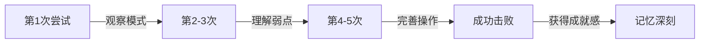

# 🧙‍♂️ Boss 战设计哲学深度研究

## 📚 1. 理论基础 (Theoretical Basis)

### 🎯 核心定义

**Boss（首领/头目）** 是游戏中设计用来测试玩家技能掌握度的特殊敌人，通常具有以下特征：
- 高于普通敌人的生命值和攻击力
- 独特的机制和攻击模式
- 明确的阶段划分
- 专属的战斗场地和音乐

**Boss 战的核心目的**：
1. **技能检验点 (Skill Gate)** - 确保玩家掌握了核心机制
2. **高潮节点 (Climax)** - 提供情绪上的爆发点
3. **奖励发放点 (Reward Node)** - 给予重要战利品和成就感

### 📐 设计理论

#### 1. 柱阶段系统 (Pillar Phase Design)

经典 Boss 战通常采用 **3-4 阶段** 设计，每个阶段称为一个"柱"：

```
生命值      阶段特性
100% ─┐     第一柱：教学阶段（攻击模式简单）
      │       
75%  ─┼─    第二柱：提速阶段（攻击速度 +30%）
      │       
50%  ─┼─    第三柱：混合阶段（组合技出现）
      │       
25%  ─┼─    第四柱：绝命阶段（大招频繁 + 狂暴）
      │       
0%   ─┘     胜利
```

**阶段设计公式**:

```
Phase_Difficulty = Base_Difficulty × (1 + Phase_Index × Scaling_Factor)

推荐参数:
- Phase_Index: 0, 1, 2, 3 (阶段索引)
- Scaling_Factor: 0.2 ~ 0.4 (每阶段难度增幅)
```

#### 2. 电报系统 (Telegraph System)

Boss 的攻击必须有**可读懂的前摇 (Tell)**，遵循"电报原则"：

```
威力越大 → 前摇越长 → 惩罚越重

示例:
┌──────────────────────────────────────┐
│ 攻击类型     │ 前摇时间 │ 伤害  │ 惩罚  │
├──────────────────────────────────────┤
│ 普通斩击     │  0.3s   │ 10%  │ 无   │
│ 重击         │  0.8s   │ 30%  │ 击晕  │
│ 终结技       │  2.0s   │ 80%  │ 秒杀  │
└──────────────────────────────────────┘
```

**电报设计三要素**:
1. **视觉提示**: 蓄力特效、发光、颜色变化
2. **听觉提示**: 音效提前 0.2 秒播放
3. **位置提示**: 攻击范围指示器（红圈、扇形区域）

#### 3. 学习曲线模型 (Learning Curve)

优秀的 Boss 战遵循 **"公平但困难"** 原则：



<script type="module">
  import mermaid from 'https://cdn.jsdelivr.net/npm/mermaid@10/dist/mermaid.esm.min.mjs';
  mermaid.initialize({ startOnLoad: false });
  await mermaid.run({
    querySelector: '.language-mermaid',
  });
</script>

**平均击败次数理论值**:
- **新手友好**: 3-5 次尝试
- **正常难度**: 5-10 次尝试
- **硬核难度**: 10-50 次尝试
- **超难关卡**: 50+ 次尝试（如魂系列）

#### 4. Boss 战心理学

##### 爽点设计公式

```
成就感 = (难度挑战 × 克服过程) + (视觉反馈 + 听觉反馈)

关键要素:
- 难度挑战: 适度挫败（不能太简单）
- 克服过程: 可感知的进步
- 视觉反馈: 血条突破、阶段转换特效
- 听觉反馈: 音乐变化、台词触发
```

##### 挫败感控制

| 糟糕设计 | 优秀设计 |
|---------|---------|
| ❌ 一击秒杀（无法学习） | ✅ 留活命机会（1-2 次容错） |
| ❌ 随机不可预测攻击 | ✅ 有规律可循的循环 |
| ❌ 过长的无敌时间 | ✅ 伤害窗口明确 |
| ❌ 战斗后无存档点 | ✅ Boss 门前自动存档 |

---

## 🛠️ 2. 实践应用 (Practical Implementation)

### 🎮 Vampirefall Boss 设计框架

#### 混合品类的挑战与机遇

Vampirefall 的**塔防 + 肉鸽 + Looter** 架构为 Boss 战带来独特可能性：

| 维度 | 传统 Boss 设计 | Vampirefall 创新点 |
|------|---------------|-------------------|
| **空间** | 固定竞技场 | **塔防地图上的移动 Boss** |
| **资源** | 玩家技能为主 | **塔 + 角色联动输出** |
| **奖励** | 固定掉落 | **智能掉落 + 词条强化** |
| **重玩性** | 记忆攻击模式 | **随机词条改变 Boss 属性** |

#### 三层 Boss 设计系统

```
┌─────────────────────────────────────────┐
│ 1. 静态基线 (Boss 原型)                 │
│    - 基础血量、伤害、移动速度          │
│    - 核心攻击模式（3-4 种）            │
├─────────────────────────────────────────┤
│ 2. 阶段变异 (Phase Modifiers)          │
│    - 每 25% 血量触发新阶段             │
│    - 召唤小怪 / 改变移动模式           │
├─────────────────────────────────────────┤
│ 3. 词条增幅 (Affix Layer)              │
│    - 地图词条影响 Boss                 │
│    - 例: "火焰灌注" → Boss 攻击附带燃烧 │
└─────────────────────────────────────────┘
```

### 🗂️ 数据结构

#### BossConfig.cs

```csharp
[System.Serializable]
public class BossConfig : EnemyConfig
{
    [Header("Boss 专属属性")]
    public string bossName = "暗影巨龙";
    public BossType bossType = BossType.ChapterBoss;
    
    [Header("阶段设计")]
    public PhaseData[] phases = new PhaseData[4];
    
    [Header("电报系统")]
    public float telegraphDuration = 1.5f;  // 大招前摇
    public GameObject telegraphEffectPrefab;
    
    [Header("战斗场地")]
    public Vector2 arenaCenter;
    public float arenaRadius = 10f;
    public bool lockPlayerInArena = true;
    
    [Header("音乐与氛围")]
    public AudioClip bossMusicTrack;
    public AudioClip phaseTransitionSFX;
    
    [Header("奖励")]
    public LootTableConfig bossLootTable;
    public int guaranteedGoldCoins = 500;
}

[System.Serializable]
public class PhaseData
{
    [Range(0f, 1f)] public float healthThreshold = 0.75f;  // 触发阈值
    public float attackSpeedMultiplier = 1.0f;
    public float moveSpeedMultiplier = 1.0f;
    public AttackPattern[] newAttackPatterns;
    public bool summonMinions = false;
    public int minionCount = 5;
}

public enum BossType
{
    MiniBoss,      // 小 Boss（每 3-5 关）
    ChapterBoss,   // 章节 Boss（每 10 关）
    WorldBoss,     // 世界 Boss（赛季特殊）
    SecretBoss     // 隐藏 Boss（彩蛋）
}
```

#### BossAIController.cs

```csharp
public class BossAIController : MonoBehaviour
{
    private BossConfig config;
    private int currentPhaseIndex = 0;
    private float currentHealth;
    private StateMachine<BossState> stateMachine;
    
    void Start()
    {
        currentHealth = config.maxHealth;
        InitializeStateMachine();
        TriggerBossIntro();
    }
    
    void Update()
    {
        // 检查阶段转换
        float healthRatio = currentHealth / config.maxHealth;
        CheckPhaseTransition(healthRatio);
        
        // 更新状态机
        stateMachine.Update();
    }
    
    private void CheckPhaseTransition(float healthRatio)
    {
        if (currentPhaseIndex >= config.phases.Length) return;
        
        var nextPhase = config.phases[currentPhaseIndex];
        if (healthRatio <= nextPhase.healthThreshold)
        {
            EnterNewPhase(currentPhaseIndex);
            currentPhaseIndex++;
        }
    }
    
    private void EnterNewPhase(int phaseIndex)
    {
        // 1. 播放转换特效
        PlayPhaseTransitionEffect();
        
        // 2. 短暂无敌（给玩家喘息）
        StartCoroutine(PhaseTransitionInvincibility(1.5f));
        
        // 3. 更新 AI 行为
        var phase = config.phases[phaseIndex];
        UpdateAttackPatterns(phase.newAttackPatterns);
        
        // 4. 召唤小怪（如果需要）
        if (phase.summonMinions)
        {
            SummonMinions(phase.minionCount);
        }
        
        // 5. 音效与台词
        PlayVoiceLine($"Phase{phaseIndex + 1}");
        
        Debug.Log($"[Boss] 进入第 {phaseIndex + 1} 阶段");
    }
    
    private IEnumerator PhaseTransitionInvincibility(float duration)
    {
        isInvincible = true;
        stateMachine.ChangeState(BossState.PhaseTransition);
        
        yield return new WaitForSeconds(duration);
        
        isInvincible = false;
        stateMachine.ChangeState(BossState.Combat);
    }
}
```

#### 电报系统实现

```csharp
public class BossTelegraphSystem : MonoBehaviour
{
    public void TelegraphAttack(AttackData attack)
    {
        StartCoroutine(TelegraphSequence(attack));
    }
    
    private IEnumerator TelegraphSequence(AttackData attack)
    {
        // 1. 显示攻击范围指示器
        var indicator = ShowAttackIndicator(attack.attackRange, attack.attackType);
        
        // 2. 提前播放音效 (0.2s 提前量)
        yield return new WaitForSeconds(0.2f);
        audioSource.PlayOneShot(attack.telegraphSFX);
        
        // 3. 等待前摇时间
        float elapsed = 0.2f;
        while (elapsed < attack.telegraphDuration)
        {
            // 指示器闪烁加速（紧张感）
            float pulseFactor = Mathf.PingPong(elapsed * 4f, 1f);
            indicator.SetAlpha(0.3f + pulseFactor * 0.7f);
            
            elapsed += Time.deltaTime;
            yield return null;
        }
        
        // 4. 执行攻击
        HideAttackIndicator(indicator);
        ExecuteAttack(attack);
    }
    
    private GameObject ShowAttackIndicator(AttackRange range, AttackType type)
    {
        GameObject prefab = type switch
        {
            AttackType.Melee => circlePrefab,
            AttackType.Cone => conePrefab,
            AttackType.Line => linePrefab,
            _ => circlePrefab
        };
        
        var obj = Instantiate(prefab, range.center, Quaternion.identity);
        obj.transform.localScale = new Vector3(range.radius, range.radius, 1f);
        
        return obj;
    }
}
```

### 🎯 Vampirefall 专属机制

#### 1. 塔防互动型 Boss

```csharp
// Boss 可以攻击和摧毁玩家的塔
public class BossTowerInteraction : MonoBehaviour
{
    public void TargetNearbyTowers()
    {
        var towers = FindObjectsOfType<TowerController>();
        var nearestTower = towers
            .OrderBy(t => Vector3.Distance(transform.position, t.transform.position))
            .FirstOrDefault();
        
        if (nearestTower != null && Vector3.Distance(transform.position, nearestTower.transform.position) < 5f)
        {
            // Boss 专属技能：摧塔一击
            AttackTower(nearestTower);
        }
    }
    
    private void AttackTower(TowerController tower)
    {
        tower.TakeDamage(config.towerDamage);
        PlayEffect("BossSmashTower");
        
        // 玩家需要保护塔或重建
    }
}
```

#### 2. 肉鸽词条联动

```csharp
// Boss 受地图词条影响
public class BossAffixSystem : MonoBehaviour
{
    public void ApplyMapAffixes(List<MapAffix> affixes)
    {
        foreach (var affix in affixes)
        {
            switch (affix.affixType)
            {
                case AffixType.ElementalInfusion:
                    // Boss 攻击附加元素伤害
                    AddElementalDamage(affix.elementType);
                    break;
                    
                case AffixType.SpeedBuff:
                    // Boss 移动速度 +50%
                    moveSpeed *= 1.5f;
                    break;
                    
                case AffixType.ReflectDamage:
                    // Boss 反伤 20%
                    enableReflectDamage = true;
                    reflectRatio = 0.2f;
                    break;
            }
        }
    }
}
```

---

## 🌟 3. 业界优秀案例 (Industry Best Practices)

### 🎮 案例 1: **Kingdom Rush - 塔防类 Boss**

#### 核心机制

Kingdom Rush 的 Boss 设计巧妙平衡了**塔防的静态部署**和 **Boss 战的动态对抗**。

**经典案例: Vez'nan（最终 Boss）**

```
阶段 1 (100% → 66%):
- 缓慢移动，血厚
- 定期召唤骷髅小兵（干扰塔的输出）
- 教学阶段：让玩家理解"控制小兵 + 集火 Boss"

阶段 2 (66% → 33%):
- 瞬移机制（跳过塔的火力网）
- 范围魔法攻击（必须用英雄躲避）
- 混合挑战：塔 + 英雄操作

阶段 3 (33% → 0%):
- 狂暴：攻击速度翻倍
- 终极技：陨石雨（范围伤害，必须走位）
- 高潮期：极限压力测试
```

**设计亮点**:
- ✅ **阶段分明**: 每阶段有明确的挑战重点
- ✅ **英雄互动**: Boss 战强制玩家使用英雄（不能纯挂机）
- ✅ **视觉反馈**: 血量门槛时有震屏特效 + 台词

**Vampirefall 借鉴**:
- 塔防 Boss 必须有"反塔机制"（摧塔 / 瞬移 / 范围免疫）
- 强制玩家参与战斗（不能纯塔防通关）
- 阶段转换要有仪式感（特效 + 音乐变化）

---

### 🎮 案例 2: **Hades - 肉鸽类 Boss**

#### 核心机制

Hades 的 Boss 设计是**肉鸽类的教科书**，每个 Boss 都有：
1. 固定的核心模式（可学习）
2. 随机的词条变异（重玩性）
3. 对话与剧情整合（情感联结）

**经典案例: 九头蛇 Lernie（第一关 Boss）**

```
核心模式（固定）:
- 3 个头，每个头有独立血条
- 左头：横扫攻击
- 中头：远程吐息
- 右头：冲锋撞击

词条变异（随机）:
Run 1: "强化装甲" → 伤害减免 +30%
Run 2: "极速再生" → 每秒回血 2%
Run 3: "召唤增援" → 周期性刷小怪

剧情整合:
- 击败后有扎格雷乌斯的吐槽
- 多次击败后有新对话（避免重复感）
```

**设计哲学**:
> "玩家需要在 50 次 Run 中击败同一个 Boss 50 次，如何避免无聊？"

答案：**固定框架 + 随机变量**

**Vampirefall 借鉴**:
- Boss 的核心模式要固定（公平性）
- 但每次遇到的词条组合不同（新鲜感）
- 可以考虑台词系统（第 1/10/50 次击败有不同反馈）

---

### 🎮 案例 3: **Dark Souls - 动作类 Boss**

#### 核心机制

魂系列 Boss 遵循**"困难但公平"**的铁律：

**设计原则**:
1. **所有攻击都可以通过翻滚/格挡/走位躲避**
2. **每次死亡都能学到新东西**
3. **击败后的成就感极强**

**经典案例: Ornstein & Smough（双人 Boss）**

```
第一阶段：
- 两个 Boss 同时在场
- 快速的 Ornstein + 缓慢的 Smough
- 玩家必须学会分割战场

第二阶段（根据击杀顺序）:
- 先杀 O → Smough 吸收力量变巨大
- 先杀 S → Ornstein 获得闪电能力
- 双结局设计（增加重玩性）
```

**电报系统大师课**:

| 攻击 | 前摇 | 视觉提示 | 听觉提示 | 危险度 |
|------|------|----------|----------|--------|
| 普通刺击 | 0.4s | 举枪动作 | 轻微破风声 | 低 |
| 跳跃猛击 | 1.2s | 高高跃起 | 大吼 | 中高 |
| 闪电冲锋 | 2.0s | 全身发光 | 电流爆鸣 | 极高 |

**Vampirefall 借鉴**:
- 双 Boss / 多 Boss 机制可以增加战术深度
- 电报系统必须精确（前摇时间 = 玩家反应窗口）
- 失败后可以立即重试（减少挫败感）

---

### 🎮 案例 4: **Cuphead - 横版多阶段 Boss**

#### 核心机制

Cuphead 的 Boss 设计是**纯粹的模式记忆 + 反应力测试**。

**设计特色**:
- **短平快**: 每场战斗 2-4 分钟
- **阶段密集**: 通常 3-5 个阶段快速切换
- **视觉狂欢**: 每个阶段都有全新的美术和动画

**经典案例: Cala Maria（美人鱼 Boss）**

```
阶段 1: 水面战斗
- 吐泡泡弹幕
- 召唤飞鱼

阶段 2: 石化光线
- 眼睛发射石化射线（必须躲在掩体后）
- 电鳗攻击

阶段 3: 美杜莎形态
- 头发变成蛇（独立攻击）
- 全屏弹幕地狱

阶段 4: 棺材型态（死亡阶段）
- 最后的绝命攻势
```

**设计哲学**:
> "每个阶段都应该感觉像一个全新的 Boss。"

**Vampirefall 借鉴**:
- 短回合多阶段设计适合肉鸽（快速迭代）
- 视觉变化要明显（让玩家觉得"进度感"）
- 可以考虑"假死复活"机制（增加戏剧性）

---

## 🔗 4. 参考资料 (References)

### 📄 学术与理论

1. **Boss Fight Design and Structure**  
   *Mark Brown - Game Maker's Toolkit*  
   [YouTube 视频](https://www.youtube.com/watch?v=8LhoIQ1h-yQ)

2. **The Art of Boss Battles**  
   *Extra Credits*  
   [YouTube 播放列表](https://www.youtube.com/watch?v=K1xgMrMvN8I)

### 📺 GDC 演讲

1. **[GDC 2018] Designing Cuphead's Bosses**  
   演讲者: Jared Moldenhauer (Studio MDHR)  
   [GDC Vault](https://www.gdcvault.com/play/1024998/)

2. **[GDC 2019] The Boss Design of 'Furi'**  
   演讲者: Emeric Thoa (The Game Bakers)  
   [YouTube 链接](https://www.youtube.com/watch?v=wJY2puGPcP8)

3. **[GDC 2015] Dark Souls: Difficulty Done Right**  
   演讲者: Hidetaka Miyazaki (FromSoftware)  
   [GDC Vault](https://www.gdcvault.com/play/1022054/)

### 🌐 技术博客

1. **Boss Design 101 - Gamasutra**  
   [文章链接](https://www.gamasutra.com/view/feature/134503/boss_design_101.php)

2. **The Psychology of Boss Fights**  
   [Medium 深度分析](https://medium.com/@gamedesignthoughts/psychology-of-boss-fights)

3. **Telegraph System in Action Games**  
   [AI and Games 频道](https://www.youtube.com/@AIandGames)

### 📚 推荐书籍

1. **《游戏关卡设计》** (Level Up! The Guide to Great Video Game Design)  
   作者: Scott Rogers  
   第 12 章: "Boss Fights and Big Baddies"

2. **《游戏设计梦工厂》** (Challenges for Game Designers)  
   作者: Brenda Romero, Ian Schreiber  
   第 8 章: "Combat and Challenge Design"

---

## 🎯 附录：Vampirefall Boss 设计检查清单

### ✅ 阶段 1: Boss 原型设计
- [ ] 确定 Boss 类型（小 Boss / 章节 Boss / 隐藏 Boss）
- [ ] 设计 3-4 个核心攻击模式
- [ ] 规划阶段划分（推荐 3 阶段：75% / 50% / 25%）
- [ ] 设计专属技能（大招）

### ✅ 阶段 2: 电报系统实现
- [ ] 为每个攻击设计前摇时间（0.3s ~ 2.0s）
- [ ] 创建攻击范围指示器 Prefab
- [ ] 添加音效提示（提前 0.2s 播放）
- [ ] 测试玩家反应窗口（确保公平）

### ✅ 阶段 3: 塔防互动
- [ ] 设计反塔机制（瞬移 / 摧塔 / 范围免疫）
- [ ] 实现 Boss 移动路径（A* 或 NavMesh）
- [ ] 添加召唤小怪逻辑（分散玩家注意力）
- [ ] 测试塔 + 玩家联动输出平衡

### ✅ 阶段 4: 肉鸽词条联动
- [ ] 实现地图词条影响 Boss
- [ ] 设计 Boss 专属词条池（5-10 个）
- [ ] 测试词条组合平衡性
- [ ] 确保没有"必死组合"

### ✅ 阶段 5: 视听打磨
- [ ] 创建 Boss 专属音乐轨道
- [ ] 设计阶段转换特效（震屏 + 粒子）
- [ ] 添加台词系统（可选）
- [ ] 制作战败 / 胜利过场动画

### ✅ 阶段 6: 奖励与反馈
- [ ] 配置 Boss 掉落表（智能掉落）
- [ ] 设计首次击败奖励
- [ ] 添加成就系统（速通 / 无伤 / 特殊条件）
- [ ] 实现战斗数据统计（用于平衡性调整）

---

**最后更新**: 2025-12-04  
**维护者**: Vampirefall 设计团队
