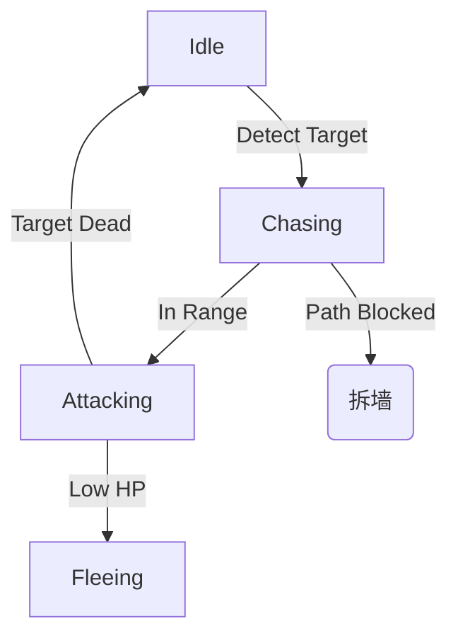

# 👹 怪物图鉴与AI行为 (Enemy Bestiary & AI)

本文档定义了怪物的分类、AI 行为模式及特殊词缀设计。

---

## 1. 怪物分级 (Hierarchy)

*   **⚪ 杂兵 (Trash / Chaff):**
    *   *目的:* 填充屏幕，提供割草快感，消耗玩家/塔的弹药。
    *   *血量:* 极低。
    *   *AI:* 简单寻路，直线冲向最近的目标（塔或人）。
*   **🟡 精英 (Elite):**
    *   *目的:* 战术干扰，需要玩家优先处理。
    *   *特征:* 体型较大，拥有 1-2 个特殊词缀 (Affix)。
    *   *AI:* 会使用技能，有一定的躲避逻辑（如预判弹道）。
*   **🔴 首领 (Boss):**
    *   *目的:* 关卡终极挑战，DPS 检测机。
    *   *特征:* 多阶段 (Phases)，免疫控制 (CC) 但有韧性槽 (Poise)。

## 2. 行为模式 (Behavior Archetypes)

为了代码复用，怪物 AI 基于几种核心模板构建。

### 2.1 冲锋者 (Rusher)
*   *代表怪物:* 僵尸犬、狂暴食尸鬼。
*   *逻辑:* 
    1.  寻找最近的可破坏目标。
    2.  无视仇恨列表，优先攻击阻挡路径的物体（拆塔）。
    3.  移动速度随距离增加而增加（加速冲锋）。

### 2.2 游击者 (Skirmisher)
*   *代表怪物:* 骷髅弓手、幽灵法师。
*   *逻辑:* 
    1.  保持距离 (Kiting)。如果在射程内且无遮挡，停止移动并攻击。
    2.  如果玩家靠近，试图向后闪避。
    3.  优先攻击防御塔，试图在射程外白嫖塔的血量。

### 2.3 坦克/肉盾 (Tank)
*   *代表怪物:* 憎恶缝合怪、重甲骑士。
*   *逻辑:* 
    1.  移动缓慢。
    2.  **自带嘲讽光环:** 吸引周围防御塔的火力。
    3.  死亡时可能自爆或分裂成小怪。

### 2.4 潜行者/刺客 (Assassin)
*   *代表怪物:* 吸血鬼侍从、影魔。
*   *逻辑:* 
    1.  隐身接近。
    2.  **切后排:** 优先寻找玩家本体，无视防御塔（除非被阻挡）。
    3.  高爆发，低血量。

## 3. 怪物词缀 (Monster Affixes)

精英怪通过随机组合词缀来产生变化。

*   **[🛡️ 护盾 (Shielded)]:** 拥有一个只能被物理伤害打破的护盾，或者只能被元素伤害打破。
*   **[⚡ 瞬移 (Teleporter)]:** 受击时有几率瞬移到玩家背后。
*   **[💀 复生 (Necromancer)]:** 每隔 10秒 复活周围一只死亡的杂兵。
*   **[🔥 熔岩 (Molten)]:** 移动路径上留下燃烧地面 (DoT)。
*   **[🚫 抑制 (Suppressor)]:** 开启一个罩子，罩子内免疫远程投射物伤害（强迫玩家近战肉搏）。

## 4. AI 状态机参考 (FSM)

