# 🧙‍♂️ 难度曲线与动态难度调整 (DDA) 深度研究

## 📚 1. 理论基础 (Theoretical Basis)

### 🎯 核心定义

**难度曲线 (Difficulty Curve)** 是指游戏挑战性随时间或进度增长的数学函数。良好的难度曲线能够让玩家始终保持在**心流通道 (Flow Channel)** 中。

**动态难度调整 (Dynamic Difficulty Adjustment, DDA)** 是一种根据玩家表现实时调整游戏难度的自适应系统，目标是让不同水平的玩家都能获得最佳体验。

### 📐 数学模型

#### 1. 心流理论曲线 (Flow Theory)

心流状态发生在挑战与技能的平衡区间：

```
Flow = Challenge ∈ [Skill × 0.8, Skill × 1.3]
```

- **焦虑区 (Anxiety)**: `Challenge > Skill × 1.3`（太难，放弃）
- **心流区 (Flow)**: `Skill × 0.8 ≤ Challenge ≤ Skill × 1.3`（恰到好处）
- **无聊区 (Boredom)**: `Challenge < Skill × 0.8`（太简单，流失）

#### 2. 难度锥形模型 (Difficulty Cone)

```
                    高手玩家上限
                   /
        心流通道  /
               /
    困难阈值 /__________ 平均玩家
           /
         /
  简单  /______________ 新手玩家下限
      ↓
    时间/关卡进度
```

理想难度曲线应该是**发散的锥形**，允许不同技能水平的玩家找到自己的舒适区。

#### 3. DDA 调整公式

**基础 DDA 模型 (Rubber Band Model)**:

```
Difficulty_t+1 = Difficulty_t + α × (Target_WinRate - Actual_WinRate)

其中:
- α: 学习率 (通常 0.05 ~ 0.15)
- Target_WinRate: 目标胜率 (通常 50% ~ 70%)
- Actual_WinRate: 玩家实际胜率 (滑动窗口统计)
```

**高级 DDA 模型 (Multi-Factor Model)**:

```
Difficulty_Score = Σ (w_i × factor_i)

常见因子:
- factor_1: 胜率 (WinRate)
- factor_2: 平均存活时间 (AvgSurvivalTime)
- factor_3: 资源利用率 (ResourceEfficiency)
- factor_4: 失误频率 (MistakeFrequency)
- factor_5: 连续失败次数 (StreakFailures)

权重: Σw_i = 1.0
```

### 🧠 设计心理学

#### 1. 挫败感与掌控感的平衡

- **挫败感来源**: 不可预测的随机性、无法应对的机制、惩罚过重
- **掌控感来源**: 清晰的反馈、可学习的模式、进步可见性

> 💡 **设计原则**: "玩家应该感觉他们**能够**获胜，但必须**努力**才能获胜。"

#### 2. 失败反馈循环 (Failure Feedback Loop)

成功的难度系统应该形成**正向学习循环**：

```mermaid
graph LR
    A[挑战失败] --> B[理解原因]
    B --> C[调整策略]
    C --> D[再次尝试]
    D --> E[成功通关]
    E --> F[获得成就感]
    F --> G[迎接更大挑战]
    G --> A
```



<script type="module">
  import mermaid from 'https://cdn.jsdelivr.net/npm/mermaid@10/dist/mermaid.esm.min.mjs';
  mermaid.initialize({ startOnLoad: false });
  await mermaid.run({
    querySelector: '.language-mermaid',
  });
</script>

#### 3. 奖励时间表与难度峰谷

借鉴 **Skinner Box** 理论，难度应该配合奖励节奏：

| 阶段 | 难度 | 奖励类型 | 心理效果 |
|------|------|----------|----------|
| **准备期** | 低 (80%) | 固定奖励 (FR) | 建立信心 |
| **挑战期** | 中高 (120%) | 变量奖励 (VR) | 提高期待值 |
| **高潮期** | 峰值 (150%) | 超级奖励 | 成就感爆发 |
| **恢复期** | 低 (70%) | 保底奖励 | 防止流失 |

---

## 🛠️ 2. 实践应用 (Practical Implementation)

### 🎮 Vampirefall 适配

#### 混合品类的难度挑战

Vampirefall 的**塔防 + 肉鸽 + Looter** 三位一体架构带来独特挑战：

| 维度 | 难度来源 | 调整策略 |
|------|----------|----------|
| **塔防层** | 敌人波次、精英刷新 | 基于通关时间动态调整波次间隔 |
| **肉鸽层** | 词条组合、随机事件 | 保底机制 + 标签加权防脸黑 |
| **Looter层** | 装备差距、数值碾压 | 装备分数归一化 + 百分比提升 |

#### 四层难度系统架构

```
┌─────────────────────────────────────┐
│ 1. 静态难度基线 (Static Baseline)   │ ← 关卡固有难度
├─────────────────────────────────────┤
│ 2. 进度难度伸缩 (Progression Scale) │ ← 角色等级增长
├─────────────────────────────────────┤
│ 3. 动态难度调节 (DDA Layer)         │ ← 玩家表现反馈
├─────────────────────────────────────┤
│ 4. 玩家主动选择 (Player Choice)     │ ← 诅咒/地图词条
└─────────────────────────────────────┘
```

### 🗂️ 数据结构

#### DifficultyConfig.cs

```csharp
[System.Serializable]
public class DifficultyConfig
{
    [Header("静态基线")]
    public float baseEnemyHealth = 100f;
    public float baseEnemyDamage = 10f;
    public int baseWaveCount = 5;
    
    [Header("进度伸缩")]
    public AnimationCurve healthScalingCurve;  // X: 关卡, Y: 倍率
    public AnimationCurve damageScalingCurve;
    
    [Header("DDA 参数")]
    [Range(0f, 1f)] public float targetWinRate = 0.65f;
    [Range(0.01f, 0.3f)] public float learningRate = 0.1f;
    public int statisticsWindowSize = 5;  // 滑动窗口大小
    
    [Header("安全阈值")]
    [Range(0.5f, 1.5f)] public float minDifficultyMultiplier = 0.7f;
    [Range(1.0f, 3.0f)] public float maxDifficultyMultiplier = 2.0f;
}
```

#### PlayerPerformanceTracker.cs

```csharp
public class PlayerPerformanceTracker
{
    // 滑动窗口统计
    private Queue<BattleResult> recentBattles = new Queue<BattleResult>();
    
    // 多因子评分
    public float CalculatePerformanceScore()
    {
        if (recentBattles.Count == 0) return 0.5f;
        
        float winRate = GetWinRate();
        float avgSurvivalRatio = GetAvgSurvivalTimeRatio();
        float resourceEfficiency = GetResourceEfficiency();
        
        // 加权平均
        return 0.5f * winRate + 
               0.3f * avgSurvivalRatio +
               0.2f * resourceEfficiency;
    }
    
    private float GetWinRate()
    {
        int wins = recentBattles.Count(b => b.isVictory);
        return (float)wins / recentBattles.Count;
    }
    
    private float GetAvgSurvivalTimeRatio()
    {
        float avg = recentBattles.Average(b => b.survivalTime / b.expectedTime);
        return Mathf.Clamp01(avg);
    }
    
    private float GetResourceEfficiency()
    {
        // 资源利用率：剩余生命值、金币使用率等
        float avg = recentBattles.Average(b => b.resourceScore);
        return Mathf.Clamp01(avg);
    }
}
```

### 🔄 核心算法逻辑

#### DDA 调整策略 (伪代码)

```csharp
public class DynamicDifficultyManager
{
    private DifficultyConfig config;
    private PlayerPerformanceTracker tracker;
    private float currentMultiplier = 1.0f;
    
    public void AdjustDifficulty(BattleResult result)
    {
        // 1. 记录战斗数据
        tracker.AddBattleResult(result);
        
        // 2. 计算表现分数
        float performanceScore = tracker.CalculatePerformanceScore();
        
        // 3. 橡皮筋调整
        float delta = config.learningRate * (config.targetWinRate - performanceScore);
        currentMultiplier += delta;
        
        // 4. 安全限制 (防止过度波动)
        currentMultiplier = Mathf.Clamp(
            currentMultiplier,
            config.minDifficultyMultiplier,
            config.maxDifficultyMultiplier
        );
        
        // 5. 连续失败保护
        if (tracker.GetConsecutiveFailures() >= 3)
        {
            currentMultiplier = Mathf.Max(currentMultiplier - 0.2f, 0.5f);
            Debug.Log("触发失败保护机制");
        }
    }
    
    public EnemyStats GetAdjustedEnemyStats(EnemyStats baseStats, int level)
    {
        // 静态基线
        var stats = baseStats.Clone();
        
        // 进度伸缩
        float progressionScale = config.healthScalingCurve.Evaluate(level);
        
        // DDA 叠加
        stats.health *= progressionScale * currentMultiplier;
        stats.damage *= progressionScale * currentMultiplier;
        
        return stats;
    }
}
```

### 🎯 Unity 实现建议

#### 1. 可见难度反馈 (透明化)

```csharp
// UI 显示当前难度等级
public void UpdateDifficultyUI()
{
    string difficultyLabel = currentMultiplier switch
    {
        < 0.8f => "简单",
        < 1.2f => "正常",
        < 1.5f => "困难",
        _ => "极难"
    };
    
    difficultyText.text = $"当前难度: {difficultyLabel}";
    
    // ⚠️ 可选：隐藏具体数值，避免"被系统操控"的负面感受
}
```

#### 2. 性能优化

- **延迟计算**: 不要每帧计算，在战斗结束后统一调整
- **缓存曲线采样**: `AnimationCurve.Evaluate()` 有开销，考虑预计算查找表
- **异步统计**: 复杂的性能分析放在后台线程

---

## 🌟 3. 业界优秀案例 (Industry Best Practices)

### 🎮 案例 1: **Left 4 Dead - The AI Director**

#### 核心机制

Valve 的 **AI Director** 是 DDA 的经典案例，它不调整敌人数值，而是调整**事件节奏**。

**工作原理**:

```
Tension_Score = f(Combat_Intensity, Time_Since_Last_Event, Player_Health)

if Tension_Score < Threshold_Low:
    Trigger_Event(Intensity.High)  // 刷特感、Tank
elif Tension_Score > Threshold_High:
    Trigger_RestPeriod()            // 安全屋、补给
```

**优点**:
- ✅ 玩家感知不到数值操控（透明度高）
- ✅ 自然的节奏起伏（紧张-放松循环）
- ✅ 适合多人合作（整体难度调节）

**缺点**:
- ❌ 需要精心设计的关卡模板
- ❌ 对单人游戏支持较弱

**Vampirefall 借鉴**:
- 塔防波次间隔动态调整（取代固定 30 秒）
- 精英刷新基于"紧张度"而非固定回合

---

### 🎮 案例 2: **Resident Evil 4 - 隐藏难度系统**

#### 核心机制

RE4 的 DDA 极其隐蔽，玩家通常不会察觉：

| 玩家表现 | 系统响应 |
|----------|----------|
| 生命值 < 30% | 敌人命中率 -20% |
| 连续死亡 ≥ 3 次 | Boss 削弱 15% 攻击力 |
| 完美通关（无伤） | 下一章敌人血量 +10% |
| 弹药富余 | 掉落弹药箱概率 -30% |

**设计哲学**:
> "玩家永远不应该知道系统在帮助他们。"

**优点**:
- ✅ 极致的透明度（玩家无感知）
- ✅ 保护挫败感的阈值
- ✅ 维护游戏的恐怖氛围

**缺点**:
- ❌ 可能引发"被欺骗"的争议（作弊感）
- ❌ 高手玩家可能感觉"不尊重"

**Vampirefall 借鉴**:
- 连续失败后暗降敌人命中率（不改数值面板）
- 智能掉落：缺什么补什么（参考 Loot_Table_Rules.md 的蓄水池机制）

---

### 🎮 案例 3: **Hades - 透明化难度选择 + DDA**

#### 核心机制

Hades 采用**双轨制**：

1️⃣ **显性难度 (Heat System)**:
- 玩家主动选择诅咒条件（增伤、限时等）
- 每层诅咒提供对应的奖励加成

2️⃣ **隐性 DDA (God Mode)**:
- 每次死亡，下次挑战伤害减免 +2%
- 最高累计 80% 减伤
- 玩家可随时关闭（可选特性）

**天才之处**:
```
玩家感知: "我选择了困难，所以我变强了"
实际情况: "系统检测到我菜，偷偷帮我降低了难度"
```

**优点**:
- ✅ 完美的心理平衡（玩家有掌控感）
- ✅ 满足不同技能水平
- ✅ 长期留存率高（新手不流失）

**缺点**:
- ❌ 需要大量可选难度内容（开发成本高）

**Vampirefall 借鉴**:
- **显性**: 地图词条、诅咒词条（参考 Map_Affix_Library.md）
- **隐性**: 连败保护、"新手守护"Buff（可关闭）

---

### 🎮 案例 4: **Celeste - 辅助模式的艺术**

#### 核心机制

Celeste 提供无数辅助选项，但**不羞辱玩家**：

```
[辅助模式] (不影响成就)
- 无敌模式
- 无限冲刺
- 游戏速度调节 (50% ~ 100%)
```

**关键设计**:
- ✅ 使用辅助模式**不会**禁用成就
- ✅ UI 文案强调"这是你的旅程"
- ✅ 不显示"简单模式"等负面标签

**Vampirefall 借鉴**:
- 提供"专注模式"（降低难度，但不显示"简单"字样）
- 允许中途调整难度而不重置进度

---

## 🔗 4. 参考资料 (References)

### 📄 学术论文

1. **Hunicke, R., & Chapman, V. (2004)**  
   *"AI for Dynamic Difficulty Adjustment in Games"*  
   GDC Proceedings  
   [链接](http://www.cs.northwestern.edu/~hunicke/pubs/Hamlet.pdf)

2. **Csikszentmihalyi, M. (1990)**  
   *"Flow: The Psychology of Optimal Experience"*  
   Harper & Row

3. **Andrade, G., et al. (2005)**  
   *"Dynamic Game Difficulty Balancing"*  
   University of Alberta

### 📺 GDC 演讲

1. **[GDC 2009] Left 4 Dead: The AI Director**  
   演讲者: Michael Booth (Valve)  
   [YouTube 链接](https://www.youtube.com/watch?v=KM68vYH2jn8)

2. **[GDC 2018] Designing Celeste's Difficulty**  
   演讲者: Maddy Thorson  
   [GDC Vault](https://www.gdcvault.com/play/1025238/)

3. **[GDC 2021] Balancing Hades**  
   演讲者: Greg Kasavin (Supergiant Games)  
   [YouTube 链接](https://www.youtube.com/watch?v=PaZVQu0ex7A)

### 🌐 技术博客

1. **Game Maker's Toolkit - Difficulty in Video Games**  
   [YouTube 系列](https://www.youtube.com/watch?v=A4_auMe1HsY)

2. **Gamasutra - The Chemistry Of Game Design**  
   [文章链接](https://www.gamasutra.com/view/feature/129948/the_chemistry_of_game_design.php)

3. **AI and Games - Dynamic Difficulty Adjustment**  
   [YouTube 频道](https://www.youtube.com/@AIandGames)

### 📚 相关书籍

1. **《游戏设计艺术》** (The Art of Game Design: A Book of Lenses)  
   作者: Jesse Schell  
   第 25 章: "The Lens of Challenge"

2. **《游戏感：游戏动作设计师指南》** (Game Feel)  
   作者: Steve Swink  
   第 7 章: "Challenge and Pacing"

---

## 🎯 附录：Vampirefall 实施检查清单

### ✅ 阶段 1: 基础系统 (MVP)
- [ ] 实现静态难度基线（关卡配置表）
- [ ] 创建进度伸缩曲线（AnimationCurve 配置）
- [ ] 战斗结果统计系统（胜率、生存时间）

### ✅ 阶段 2: DDA 核心
- [ ] 实现橡皮筋 DDA 算法
- [ ] 添加连续失败保护机制
- [ ] 多因子性能评估系统

### ✅ 阶段 3: 显性难度
- [ ] 玩家可选诅咒系统（Heat System）
- [ ] 地图词条难度标签
- [ ] 奖励倍率计算

### ✅ 阶段 4: 调优与验证
- [ ] 数据埋点与可视化（参考 Game_Analytics_Guide.md）
- [ ] A/B 测试不同 DDA 参数
- [ ] 玩家留存率分析

---

**最后更新**: 2025-12-04  
**维护者**: Vampirefall 设计团队
