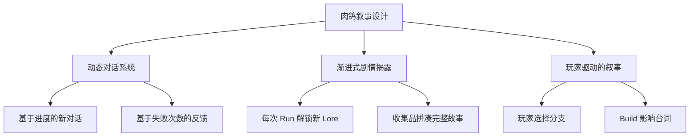

# 🧙‍♂️ 游戏剧情与包装深度研究

## 📚 1. 理论基础 (Theoretical Basis)

### 🎯 核心定义

**游戏叙事 (Game Narrative)** 不仅仅是"讲故事"，而是通过多种媒介（对话、环境、机制、UI）向玩家传达世界观、角色动机和情感体验。

对于**非剧情驱动型游戏**（如塔防、Roguelike、Looter），叙事的作用是：
1. **提供情感锚点 (Emotional Anchor)** - 让玩家关心游戏世界
2. **增强代入感 (Immersion)** - 解释"为什么要战斗"
3. **差异化包装 (Differentiation)** - 避免成为"纯数值计算器"

### 📐 叙事类型分类

#### 1. 显性叙事 (Explicit Narrative)

通过明确的文本、对话、过场动画传递：

```
强度等级:
5 级: 完整剧情（RPG，如《巫师 3》）
4 级: 关键剧情节点（如《Hades》每次逃脱后的对话）
3 级: 碎片化剧情（如《黑暗之魂》物品描述）
2 级: 极简背景设定（如《Vampire Survivors》开场字幕）
1 级: 无显性叙事（如《俄罗斯方块》）

推荐 Vampirefall 选择: 2-3 级（碎片化 + 极简）
```

#### 2. 环境叙事 (Environmental Storytelling)

通过场景、道具、美术风格传递信息：

**经典案例**:
- 《黑暗之魂》灰烬墓地：散落的盾牌暗示失败的冒险者
- 《生化奇兵》水下城市：海报和标语展现理想国的崩溃
- 《Inside》工厂场景：无对话，纯视觉叙事

**设计公式**:

```
环境叙事强度 = (视觉细节密度 × 暗示清晰度) ÷ 玩家注意力需求

优秀设计:
- 视觉细节: 丰富但不杂乱
- 暗示清晰度: 70% 玩家能理解
- 注意力需求: 低（不影响战斗）
```

#### 3. 机制驱动叙事 (Mechanics as Narrative)

游戏规则本身就是叙事工具：

| 游戏 | 机制 | 叙事含义 |
|------|------|----------|
| **Dark Souls** | 死亡重生 | "你是不死人，永远被诅咒" |
| **Hades** | 逃脱失败 | "你永远无法逃离冥界" |
| **Vampire Survivors** | 30 分钟死亡 | "死神最终会降临" |
| **Loop Hero** | 循环地图 | "你被困在时间循环中" |

**Vampirefall 潜在机制叙事**:
- 塔防失败 → "吸血鬼攻破了最后的防线"
- 肉鸽重生 → "每次轮回都更强大"
- Looter 装备 → "收集失落的神器对抗黑暗"

### 🧠 叙事心理学

#### 1. 重复游玩下的叙事挑战

Roguelike 类游戏面临独特问题：**玩家会重复体验同一内容 50+ 次**。

**传统叙事的问题**:
- ❌ 第 2 次看同样的过场动画 → 按 Skip
- ❌ 第 10 次听同样的台词 → 无视
- ❌ 第 50 次读同样的装备描述 → 审美疲劳

**解决方案**:



<script type="module">
  import mermaid from 'https://cdn.jsdelivr.net/npm/mermaid@10/dist/mermaid.esm.min.mjs';
  mermaid.initialize({ startOnLoad: false });
  await mermaid.run({
    querySelector: '.language-mermaid',
  });
</script>

#### 2. 叙事密度控制

**叙事密度公式**:

```
叙事密度 = 叙事内容总量 / 玩家游玩时间

过高 (>0.3): 干扰玩法（日式 RPG）
适中 (0.1-0.3): 平衡（Hades）
过低 (<0.1): 缺乏代入感（纯数值游戏）

推荐 Vampirefall: 0.15 左右
```

**实践建议**:
- ✅ 战斗中：零叙事干扰
- ✅ 战斗间隙：简短对话（5-10 秒）
- ✅ 大厅/商店：可选的深度 Lore

---

## 🛠️ 2. 实践应用 (Practical Implementation)

### 🎮 Vampirefall 世界观构建

#### 核心设定（极简版）

```markdown
# 世界观一句话描述
"最后的吸血鬼猎人，在堕落的王国中建立防线，对抗无尽的暗夜军团。"

# 核心冲突
玩家 (守护者) vs 吸血鬼大军 (入侵者)

# 独特设定
- 塔防要素：玩家建造"圣光塔"净化区域
- 肉鸽要素：每次轮回都是"不同的猎人后代"
- Looter 要素：收集"失落的圣物"变强

# 情感基调
黑暗但不绝望，史诗但不沉重（参考《暗黑破坏神》）
```

#### 三层叙事结构

```
┌─────────────────────────────────────┐
│ 第 1 层：核心循环包装（必须）        │
│  - 为什么要建塔？（保护圣地）       │
│  - 为什么要战斗？（净化暗夜）       │
├─────────────────────────────────────┤
│ 第 2 层：角色与装备 Lore（推荐）    │
│  - 每个装备有简短描述              │
│  - Boss 有背景故事                 │
├─────────────────────────────────────┤
│ 第 3 层：深度世界观（可选）         │
│  - 图鉴系统解锁完整历史            │
│  - 隐藏区域揭示真相                │
└─────────────────────────────────────┘
```

### 🗂️ 数据结构

#### LoreDatabase.cs

```csharp
[System.Serializable]
public class LoreEntry
{
    public string loreID;
    public LoreCategory category;
    
    [Header("基础信息")]
    public string title = "失落的圣剑";
    
    [TextArea(3, 10)]
    public string shortDescription = "曾属于第一位猎人的武器。";
    
    [TextArea(5, 15)]
    public string fullLore = "在暗夜降临之前，这把剑曾斩杀了无数恶魔...";
    
    [Header("解锁条件")]
    public UnlockCondition unlockCondition;
    public int requiredProgress = 0;
    
    [Header("奖励（可选）")]
    public bool grantsReward = false;
    public RewardData reward;
}

public enum LoreCategory
{
    Weapon,      // 武器传说
    Enemy,       // 敌人背景
    Location,    // 地点历史
    Character,   // 角色故事
    WorldEvent   // 世界事件
}

public enum UnlockCondition
{
    AlwaysAvailable,  // 始终可见
    DefeatBoss,       // 击败特定 Boss
    CollectItem,      // 收集特定物品
    ReachLevel,       // 达到等级
    CompleteRuns      // 完成 N 次 Run
}
```

#### DialogueSystem.cs

```csharp
public class DialogueSystem : MonoBehaviour
{
    private Dictionary<string, List<DialogueLine>> characterDialogues;
    private Dictionary<string, int> dialogueProgress;  // 追踪对话进度
    
    public DialogueLine GetDialogue(string characterID, GameContext context)
    {
        // 1. 获取角色的对话池
        if (!characterDialogues.ContainsKey(characterID))
            return null;
        
        var lines = characterDialogues[characterID];
        
        // 2. 根据上下文筛选
        var validLines = lines.Where(line => line.MatchContext(context)).ToList();
        
        if (validLines.Count == 0)
            return GetFallbackDialogue(characterID);
        
        // 3. 优先级排序（新对话 > 通用对话）
        validLines = validLines.OrderByDescending(line => line.priority).ToList();
        
        // 4. 返回未见过的对话（如果有）
        int progress = dialogueProgress.GetValueOrDefault(characterID, 0);
        
        if (progress < validLines.Count)
        {
            var newLine = validLines[progress];
            dialogueProgress[characterID] = progress + 1;
            return newLine;
        }
        
        // 5. 所有对话都见过，返回随机通用对话
        return validLines[Random.Range(0, validLines.Count)];
    }
}

[System.Serializable]
public class DialogueLine
{
    public string text;
    public int priority = 0;  // 优先级（新对话高优先级）
    
    [Header("上下文条件")]
    public int minRunsCompleted = 0;
    public int maxRunsCompleted = 999;
    public int minConsecutiveDeaths = 0;
    public bool requiresBossDefeated = false;
    public string requiredBossID;
    
    public bool MatchContext(GameContext context)
    {
        if (context.runsCompleted < minRunsCompleted ||
            context.runsCompleted > maxRunsCompleted)
            return false;
        
        if (context.consecutiveDeaths < minConsecutiveDeaths)
            return false;
        
        if (requiresBossDefeated && !context.defeatedBosses.Contains(requiredBossID))
            return false;
        
        return true;
    }
}
```

### 🎯 装备与敌人的 Lore 系统

#### 装备描述模板

```csharp
[System.Serializable]
public class ItemLore
{
    [Header("名称设计")]
    public string itemName = "暗影猎弓";
    public string subtitle = "月光下的复仇";  // 可选副标题
    
    [Header("描述层次")]
    [TextArea(2, 5)]
    public string mechanicsDesc = "攻击速度 +30%\n暴击率 +15%";  // 数值描述
    
    [TextArea(2, 5)]
    public string flavorText = "\"在黑暗中，我们是光明。\" - 猎人信条";  // 风味文本
    
    [Header("隐藏 Lore（需解锁）")]
    [TextArea(5, 10)]
    public string hiddenLore = "这把弓曾属于暗影猎人艾莉娅...";
    public bool loreUnlocked = false;
}
```

**最佳实践**:
- ✅ 风格统一（例如：所有暗金装备都有引言）
- ✅ 控制长度（风味文本 ≤ 20 字）
- ✅ 暗示关联（不同装备的 Lore 相互呼应）

#### 敌人图鉴系统

```csharp
[System.Serializable]
public class EnemyBestiary
{
    public string enemyID;
    public string displayName = "暗夜行者";
    
    [Header("基础信息")]
    [TextArea(2, 5)]
    public string basicInfo = "吸血鬼的低阶仆从，失去了人性。";
    
    [Header("战术信息（击杀 N 次后解锁）")]
    public int killsToUnlockTactics = 10;
    [TextArea(3, 6)]
    public string tacticalInfo = "弱点：圣光伤害\n抗性：物理攻击";
    
    [Header("深度 Lore（击杀 Boss 后解锁）")]
    public string requiredBossDefeat;
    [TextArea(5, 10)]
    public string deepLore = "他们曾是王国的守卫，如今沦为怪物...";
    
    // 解锁进度追踪
    [HideInInspector] public int currentKills = 0;
    [HideInInspector] public bool tacticsUnlocked = false;
    [HideInInspector] public bool loreUnlocked = false;
}
```

### 🎨 UI/UX 叙事整合

#### 1. 加载界面叙事

```csharp
public class LoadingScreenNarrative : MonoBehaviour
{
    private string[] loadingTips = new string[]
    {
        // 游戏提示（70%）
        "圣光塔可以减速附近的敌人",
        "诅咒虽然危险，但奖励丰厚",
        
        // Lore 提示（30%）
        "\"暗夜降临前，王国曾有七座圣塔。\" - 古老预言",
        "传说中，第一位吸血鬼是堕落的大主教",
    };
    
    void OnLoadingStart()
    {
        // 70% 概率显示提示，30% 显示 Lore
        bool showLore = Random.value < 0.3f;
        
        if (showLore)
        {
            var loreTips = loadingTips.Where(t => t.Contains("\"")).ToArray();
            loadingText.text = loreTips[Random.Range(0, loreTips.Length)];
        }
        else
        {
            var gameTips = loadingTips.Where(t => !t.Contains("\"")).ToArray();
            loadingText.text = gameTips[Random.Range(0, gameTips.Length)];
        }
    }
}
```

#### 2. 死亡界面叙事

```csharp
public class DeathScreenNarrative : MonoBehaviour
{
    void OnPlayerDeath(DeathContext context)
    {
        // 根据死亡原因显示不同文本
        string narrativeText = context.killerType switch
        {
            EnemyType.Boss => "你倒在了 Boss 的力量之下...",
            EnemyType.Elite => "精英敌人击碎了你的防线",
            EnemyType.Swarm => "数量终究压倒了一切",
            _ => "暗夜吞噬了又一位猎人"
        };
        
        deathQuote.text = narrativeText;
        
        // 连续死亡 ≥ 3 次，显示鼓励文本
        if (context.consecutiveDeaths >= 3)
        {
            encouragementText.text = "\"失败是通往胜利的必经之路。\" - 导师寄语";
        }
    }
}
```

---

## 🌟 3. 业界优秀案例 (Industry Best Practices)

### 🎮 案例 1: **Hades - 对话驱动的肉鸽叙事**

#### 核心机制

Hades 是**肉鸽类叙事设计的巅峰**，解决了"重复游玩 = 重复剧情"的难题。

**叙事系统架构**:

```
第 1 次 Run:
- 扎格雷乌斯: "我要逃出冥界！"
- 冥王: "你逃不掉的，孩子。"

第 10 次 Run:
- 扎格雷乌斯: "又失败了...但我学会了新技能。"
- 冥王: "你的执着令我...意外。"

第 50 次 Run:
- 扎格雷乌斯: "父亲，告诉我真相！"
- 冥王: "...好吧，是时候了。"（剧情转折）

第 100 次 Run:
- 新角色加入对话
- 已有角色关系发生变化
```

**设计亮点**:

1. **2000+ 行独特对话**
   - 基于进度的动态对话
   - 每次死亡后都有新反馈
   
2. **角色关系网络**
   - 送礼物 → 解锁新对话分支
   - 角色之间会互相提及
   
3. **"永远有新内容"的错觉**
   - 前 20 次 Run：几乎每次都有新对话
   - 20-50 次：逐渐减少但仍有惊喜
   - 50+ 次：进入"真结局"剧情

**Vampirefall 借鉴**:
- 商店 NPC 的动态对话（基于击杀数、装备等）
- 连续失败后的鼓励台词
- Boss 击败后解锁新剧情片段

---

### 🎮 案例 2: **Slay the Spire - 卡牌与敌人的微叙事**

#### 核心机制

Slay the Spire 几乎没有显性剧情，但通过**碎片化文本**构建了完整世界观。

**叙事载体**:

| 元素 | 叙事方式 | 例子 |
|------|----------|------|
| **卡牌名称** | 暗示技能来源 | "献祭" → 邪教仪式 |
| **卡牌描述** | 风味文本 | "疼痛是暂时的，力量是永恒的" |
| **敌人名称** | 暗示生态 | "培养者" → 他们在培养怪物 |
| **事件文本** | 环境叙事 | "你发现了一座古老的神龛..." |
| **遗物描述** | 历史碎片 | "曾属于第一位攀登者" |

**设计哲学**:
> "玩家会自己脑补完整的故事。"

**最佳实践**:
```
坏的风味文本: "这张卡增加 3 点力量"（纯机制描述）
好的风味文本: "\"力量源于绝望。\" - 无名战士"（暗示背景）

坏的遗物名: "+2 力量戒指"
好的遗物名: "堕落勇士的遗骸"（暗示前代冒险者）
```

**Vampirefall 借鉴**:
- 每个塔的名称和描述都有 Lore
- 装备套装有隐藏的背景故事
- 地图事件用简短文本营造氛围

---

### 🎮 案例 3: **Dead Cells - 环境叙事的教科书**

#### 核心机制

Dead Cells 用**纯视觉叙事**讲述了一个病毒爆发与王国覆灭的故事。

**环境叙事技巧**:

1. **背景细节暗示时间线**
   ```
   - 监狱：墙上的抓痕（暗示逃脱尝试）
   - 下水道：堆积的尸体（暗示瘟疫爆发）
   - 王座室：破碎的王冠（暗示王国陷落）
   ```

2. **NPC 对话补充信息**
   ```
   收集者: "你又死了？有趣...你似乎记不得之前的事。"
   （暗示玩家是不死生物）
   ```

3. **物品描述拼凑真相**
   ```
   物品 1: "国王的命令：封锁岛屿。"
   物品 2: "炼金术士的笔记：实验失败了。"
   物品 3: "王后的信：原谅我，我的爱。"
   （拼凑出完整剧情）
   ```

**设计公式**:

```
完整故事 = Σ(碎片 1 + 碎片 2 + ... + 碎片 N)

每个碎片:
- 独立时：有趣但不完整
- 组合后：拼凑出完整真相
```

**Vampirefall 借鉴**:
- 关卡设计：前期是守卫塔 → 中期是废弃村庄 → 后期是吸血鬼城堡
- 环境细节：血迹、破碎的圣光塔、逃亡者的遗物
- 收集品系统：集齐 10 个日记碎片解锁完整故事

---

### 🎮 案例 4: **Vampire Survivors - 极简叙事包装**

#### 核心机制

Vampire Survivors 证明了：**即使叙事极简，包装仍然重要**。

**叙事元素清单**:
```
✅ 开场字幕：简单背景设定（30 秒）
✅ 角色名称：暗示身份（"Imelda Belpaese" = 意大利裔）
✅ 武器名称：风格化（"圣水" "大蒜" = 吸血鬼克星）
✅ 地图名称：营造氛围（"绿色阴影" "不朽者的坟墓"）
❌ 无对话系统
❌ 无剧情推进
❌ 无过场动画
```

**设计哲学**:
> "叙事不能干扰核心玩法，但可以增强主题氛围。"

**成功要素**:
1. **主题一致性**: 所有元素都围绕"吸血鬼猎人"主题
2. **命名艺术**: 所有名称都有意大利风格（致敬《恶魔城》）
3. **音乐氛围**: 哥特式 BGM 强化主题

**Vampirefall 借鉴**:
- 即使不做复杂剧情，也要保持主题一致
- 音乐和美术是强大的叙事工具
- 名称设计很重要（塔名、技能名、地图名）

---

## 🔗 4. 参考资料 (References)

### 📄 理论与设计

1. **Environmental Storytelling**  
   *Henry Jenkins (MIT)*  
   [论文 PDF](http://web.mit.edu/~21fms/People/henry3/games&narrative.html)

2. **Narrative Design in Roguelikes**  
   *GDC 2021 - Greg Kasavin (Supergiant Games)*  
   [YouTube 链接](https://www.youtube.com/watch?v=bwdYL0KFA_U)

3. **The Narrative Potential of Replay**  
   *Extra Credits*  
   [YouTube 视频](https://www.youtube.com/watch?v=VXBHdGZl_iE)

### 📺 GDC 演讲

1. **[GDC 2021] Writing Hades**  
   演讲者: Greg Kasavin  
   [GDC Vault](https://www.gdcvault.com/play/1027260/)

2. **[GDC 2018] Narrative Design in Slay the Spire**  
   演讲者: Anthony Giovannetti  
   [YouTube 链接](https://www.youtube.com/watch?v=5swWx75w6kQ)

3. **[GDC 2017] Environmental Storytelling in The Last of Us**  
   演讲者: Richard Cambier (Naughty Dog)  
   [GDC Vault](https://www.gdcvault.com/play/1024700/)

### 🌐 技术博客

1. **Writing for Roguelikes - Gamasutra**  
   [文章链接](https://www.gamasutra.com/view/feature/writing_for_roguelikes.php)

2. **The Power of Flavor Text**  
   [Medium 分析](https://medium.com/@gamedesign/power-of-flavor-text)

3. **Narrative Systems in Games**  
   [Game Developer 深度文章](https://www.gamedeveloper.com/design/narrative-systems)

### 📚 推荐书籍

1. **《游戏叙事设计》** (Interactive Storytelling for Video Games)  
   作者: Josiah Lebowitz, Chris Klug

2. **《游戏写作手册》** (The Game Narrative Toolbox)  
   作者: Tobias Heussner 等

3. **《故事》** (Story)  
   作者: Robert McKee  
   （虽然不是游戏专著，但叙事原理通用）

---

## 🎯 附录：Vampirefall 叙事实施检查清单

### ✅ 阶段 1: 核心世界观（必须）
- [ ] 撰写核心设定（一句话描述 + 核心冲突）
- [ ] 确定情感基调（黑暗/史诗/幽默？）
- [ ] 设计主题关键词（3-5 个，如：救赎、牺牲、希望）

### ✅ 阶段 2: 基础包装（推荐）
- [ ] 设计角色背景（至少主角）
- [ ] 撰写开场介绍（30 秒-1 分钟）
- [ ] 设计 UI 风格（符合世界观）
- [ ] 音乐主题确立

### ✅ 阶段 3: 装备与敌人 Lore（推荐）
- [ ] 为所有暗金装备撰写风味文本
- [ ] 为 Boss 撰写背景故事
- [ ] 实现图鉴系统（击杀解锁）
- [ ] 设计套装 Lore（多件装备组合暗示完整故事）

### ✅ 阶段 4: 动态对话系统（可选）
- [ ] 设计 NPC 对话池（至少 20 行/角色）
- [ ] 实现基于进度的对话切换
- [ ] 添加失败鼓励台词
- [ ] 胜利/失败专属反馈

### ✅ 阶段 5: 环境叙事（可选）
- [ ] 关卡设计体现世界观（前→中→后期场景变化）
- [ ] 添加背景细节（废墟、血迹、遗物）
- [ ] 实现收集品系统（日记/信件碎片）

### ✅ 阶段 6: 深度内容（高级）
- [ ] 隐藏关卡与秘密 Boss
- [ ] 真结局条件
- [ ] 成就与 Lore 绑定
- [ ] 社区 Wiki 支持（导出 Lore 数据）

---

**最后更新**: 2025-12-04  
**维护者**: Vampirefall 设计团队
