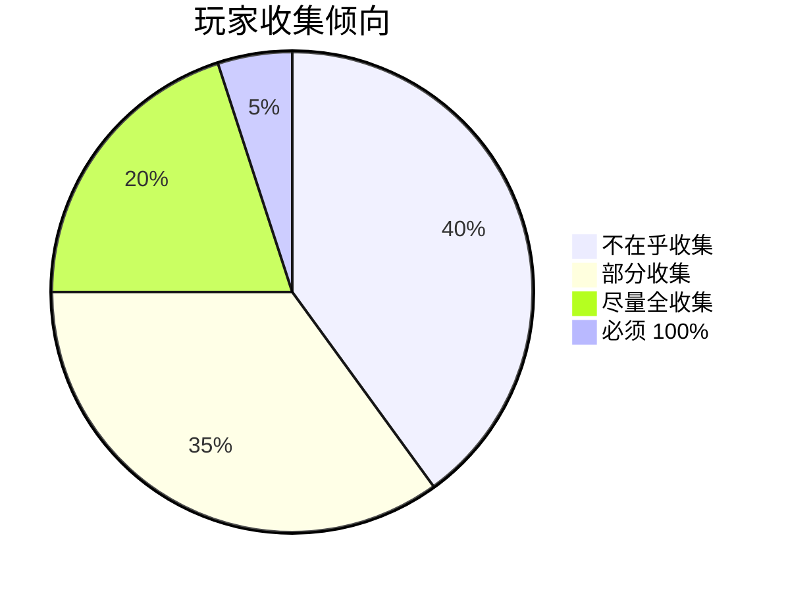

# 🧙‍♂️ 成就与收集系统深度研究

## 📚 1. 理论基础 (Theoretical Basis)

### 🎯 核心定义

**成就系统 (Achievement System)** 是奖励玩家完成特定目标的机制，而**收集系统 (Collection System)** 是鼓励玩家系统性地发现和获取游戏内容的机制。

两者的核心作用：
1. **延长游戏寿命** - 提供通关后的目标
2. **引导玩法探索** - 鼓励尝试不同玩法
3. **提供社交资本** - 展示稀有成就/收集品
4. **数据分析工具** - 了解玩家行为

### 📐 成就设计原则

#### 1. 成就分类矩阵

| 类型 | 难度 | 发现性 | 用途 |
|------|------|--------|------|
| **进度成就** | 简单 | 显而易见 | 新手引导（"完成第 1 关"） |
| **挑战成就** | 困难 | 显而易见 | 技术展示（"无伤通关 Boss"） |
| **收集成就** | 中等 | 需探索 | 长期目标（"收集全部武器"） |
| **隐藏成就** | 多样 | 隐藏 | 彩蛋奖励（"击败隐藏 Boss"） |
| **统计成就** | 简单-困难 | 显而易见 | 肝帝奖励（"击杀 10000 敌人"） |

#### 2. 成就难度曲线

```
成就数量
    │
    │ ███████  简单成就（70%）
    │ ███████  ← 大多数玩家能达成
    │ ██████
    │ ████      中等成就（20%）
    │ ██        ← 有一定挑战
    │ █         困难成就（8%）
    │ ▓         ← 展示技术
    │ ░         超难成就（2%）
    │           ← 传说级
    └───────────────────────────────►
                难度
```

**设计公式**:

```
成就达成率目标:
- 90% 玩家: 能完成至少 1 个成就（降低门槛）
- 50% 玩家: 能完成 30-50% 成就（主流玩法）
- 10% 玩家: 能完成 80%+ 成就（硬核玩家）
- 1% 玩家: 能完成 100% 成就（完成主义者）
```

#### 3. 成就通知设计

**通知时机黄金法则**:

```
❌ 糟糕: 战斗中弹出成就（打断沉浸）
✅ 良好: 战斗后结算时显示（自然节点）

❌ 糟糕: 无任何提示（玩家不知道解锁了什么）
✅ 良好: 小图标 + 声效 + 延迟 3 秒显示详情

❌ 糟糕: 一次性显示 10 个成就（信息过载）
✅ 良好: 队列显示，每个间隔 2 秒
```

### 🧠 收集品的心理学

#### 1. 蔡加尼克效应 (Zeigarnik Effect)

> **"未完成的事物比已完成的更容易被记住。"**

应用到游戏设计：

```
图鉴完成度: 47/50 (94%)

玩家心理:
"只差 3 个了！必须找到它们！"

vs.

图鉴完成度: 5/50 (10%)

玩家心理:
"算了，太多了，不想收集了。"
```

**设计启示**:
- ✅ 显示已收集数量（而非缺失数量）
- ✅ 分组收集（10 个小目标 vs 1 个大目标）
- ✅ 早期给予快速进展（前 10 个容易获得）

#### 2. 稀缺性心理 (Scarcity Psychology)

```
稀有度设计:
- 普通 (Common): 70% - 无特殊感
- 稀有 (Rare): 20% - 略有成就感
- 史诗 (Epic): 8% - 明显炫耀欲
- 传说 (Legendary): 2% - 社交资本

关键: 稀有度必须公平（不能氪金买到最稀有的）
```

#### 3. 完成主义心理 (Completionism)

**玩家类型分布**:



<script type="module">
  import mermaid from 'https://cdn.jsdelivr.net/npm/mermaid@10/dist/mermaid.esm.min.mjs';
  mermaid.initialize({ startOnLoad: false });
  await mermaid.run({
    querySelector: '.language-mermaid',
  });
</script>

**设计策略**:
- 为完成主义者设计 100% 奖励（但不要太强力，避免强制）
- 为休闲玩家设计 50% 奖励（参与即可）
- 提供明确的收集清单（不要隐藏太深）

---

## 🛠️ 2. 实践应用 (Practical Implementation)

### 🎮 Vampirefall 成就框架

#### 成就类别设计

```
📊 进度成就 (20%)
- "初次尝试": 完成第 1 关
- "步入深渊": 完成第 10 关
- "暗夜终结": 击败最终 Boss

⚔️ 战斗成就 (25%)
- "连击大师": 达成 50 连击
- "无伤战神": 无伤击败 Boss
- "速杀狂魔": 30 秒内击败精英怪

🏰 塔防成就 (15%)
- "完美防御": 无塔被摧毁通关
- "资源大师": 剩余 1000 金币通关
- "极限布局": 仅用 5 座塔通关

🎲 肉鸽成就 (20%)
- "全诅咒挑战": 携带 10 个诅咒通关
- "神装降临": 集齐传说套装
- "词条大师": 收集 100 个不同词条

📦 收集成就 (15%)
- "武器图鉴": 解锁全部武器
- "怪物图鉴": 击杀全部敌人类型
- "探索者": 发现全部隐藏区域

🎯 彩蛋成就 (5%)
- "？？？": 隐藏成就（发现后显示名称）
```

### 🗂️ 数据结构

#### AchievementConfig.cs

```csharp
[CreateAssetMenu(fileName = "Achievement", menuName = "Systems/Achievement")]
public class AchievementConfig : ScriptableObject
{
    [Header("基础信息")]
    public string achievementID = "ACH_001";
    public string displayName = "初次尝试";
    
    [TextArea(2, 5)]
    public string description = "完成第一个关卡";
    
    [Header("分类")]
    public AchievementCategory category = AchievementCategory.Progress;
    public AchievementRarity rarity = AchievementRarity.Common;
    
    [Header("解锁条件")]
    public TriggerCondition[] conditions;
    
    [Header("奖励")]
    public RewardData[] rewards;
    public bool grantsTitle = false;
    public string titleText = "新手猎人";
    
    [Header("显示设置")]
    public Sprite icon;
    public bool isHidden = false;  // 隐藏成就
    public bool showProgressBar = true;
    
    [Header("统计")]
    [ReadOnly] public float globalUnlockRate = 0f;  // 全球解锁率
}

public enum AchievementCategory
{
    Progress,      // 进度
    Combat,        // 战斗
    TowerDefense,  // 塔防
    Roguelike,     // 肉鸽
    Collection,    // 收集
    Easter Egg      // 彩蛋
}

public enum AchievementRarity
{
    Common,       // 普通 (70%+ 解锁率)
    Rare,         // 稀有 (30-70%)
    Epic,         // 史诗 (10-30%)
    Legendary     // 传说 (<10%)
}

[System.Serializable]
public class TriggerCondition
{
    public ConditionType type;
    public string targetID;  // 例如: "BOSS_001"
    public int requiredCount = 1;
    public int currentCount = 0;
    
    // 特殊条件
    public bool requiresNoDamage = false;
    public float timeLimit = 0f;  // 时限（0 = 无限制）
}

public enum ConditionType
{
    CompleteLevel,       // 完成关卡
    DefeatBoss,         // 击败 Boss
    ReachCombo,         // 达成连击
    CollectItem,        // 收集物品
    KillEnemies,        // 击杀敌人
    UseSkill,           // 使用技能
    BuildTowers,        // 建造塔
    SurviveTime,        // 生存时间
    Custom              // 自定义条件
}
```

#### AchievementManager.cs

```csharp
public class AchievementManager : MonoBehaviour
{
    public static AchievementManager Instance { get; private set; }
    
    private Dictionary<string, AchievementConfig> allAchievements;
    private HashSet<string> unlockedAchievements;
    private Queue<AchievementConfig> pendingNotifications;
    
    void Awake()
    {
        if (Instance == null)
        {
            Instance = this;
            DontDestroyOnLoad(gameObject);
            LoadAchievements();
        }
        else
        {
            Destroy(gameObject);
        }
    }
    
    private void LoadAchievements()
    {
        allAchievements = new Dictionary<string, AchievementConfig>();
        var configs = Resources.LoadAll<AchievementConfig>("Achievements");
        
        foreach (var config in configs)
        {
            allAchievements[config.achievementID] = config;
        }
        
        // 加载已解锁成就
        unlockedAchievements = LoadUnlockedFromSave();
    }
    
    public void NotifyProgress(string achievementID, int progress = 1)
    {
        if (!allAchievements.ContainsKey(achievementID))
        {
            Debug.LogWarning($"[Achievement] 未找到成就: {achievementID}");
            return;
        }
        
        var achievement = allAchievements[achievementID];
        
        // 已解锁，跳过
        if (unlockedAchievements.Contains(achievementID))
            return;
        
        // 更新进度
        bool unlocked = UpdateProgress(achievement, progress);
        
        if (unlocked)
        {
            UnlockAchievement(achievement);
        }
    }
    
    private bool UpdateProgress(AchievementConfig achievement, int progress)
    {
        bool allConditionsMet = true;
        
        foreach (var condition in achievement.conditions)
        {
            condition.currentCount += progress;
            
            if (condition.currentCount < condition.requiredCount)
            {
                allConditionsMet = false;
            }
        }
        
        return allConditionsMet;
    }
    
    private void UnlockAchievement(AchievementConfig achievement)
    {
        // 1. 记录解锁
        unlockedAchievements.Add(achievement.achievementID);
        SaveUnlockedToSave();
        
        // 2. 发放奖励
        foreach (var reward in achievement.rewards)
        {
            RewardSystem.GrantReward(reward);
        }
        
        // 3. 加入通知队列
        pendingNotifications.Enqueue(achievement);
        
        // 4. 上传到平台（Steam/TapTap）
        UploadToPlatform(achievement.achievementID);
        
        // 5. 触发事件
        OnAchievementUnlocked?.Invoke(achievement);
        
        Debug.Log($"[Achievement] 解锁: {achievement.displayName}");
    }
    
    void Update()
    {
        // 处理通知队列（避免同时显示多个）
        if (pendingNotifications.Count > 0 && !isShowingNotification)
        {
            var achievement = pendingNotifications.Dequeue();
            StartCoroutine(ShowAchievementNotification(achievement));
        }
    }
    
    private bool isShowingNotification = false;
    
    private IEnumerator ShowAchievementNotification(AchievementConfig achievement)
    {
        isShowingNotification = true;
        
        // 1. 播放音效
        AudioManager.PlaySFX("AchievementUnlock");
        
        // 2. 显示 UI
        var ui = Instantiate(achievementNotificationPrefab);
        ui.GetComponent<AchievementNotificationUI>().Show(achievement);
        
        // 3. 等待 3 秒
        yield return new WaitForSeconds(3f);
        
        // 4. 淡出
        ui.GetComponent<AchievementNotificationUI>().FadeOut();
        
        yield return new WaitForSeconds(1f);
        
        Destroy(ui);
        isShowingNotification = false;
    }
    
    public float GetGlobalProgress()
    {
        if (allAchievements.Count == 0) return 0f;
        return (float)unlockedAchievements.Count / allAchievements.Count;
    }
    
    public Dictionary<AchievementRarity, int> GetRarityDistribution()
    {
        var distribution = new Dictionary<AchievementRarity, int>();
        
        foreach (var achievement in allAchievements.Values)
        {
            if (unlockedAchievements.Contains(achievement.achievementID))
            {
                if (!distribution.ContainsKey(achievement.rarity))
                    distribution[achievement.rarity] = 0;
                
                distribution[achievement.rarity]++;
            }
        }
        
        return distribution;
    }
    
    // 事件
    public System.Action<AchievementConfig> OnAchievementUnlocked;
}
```

#### CollectionManager.cs（图鉴系统）

```csharp
public class CollectionManager : MonoBehaviour
{
    public static CollectionManager Instance { get; private set; }
    
    [System.Serializable]
    public class CollectionEntry
    {
        public string entryID;
        public string displayName;
        public CollectionCategory category;
        public Sprite icon;
        
        [TextArea(3, 8)]
        public string loreText;
        
        public bool isUnlocked = false;
        public System.DateTime unlockTime;
    }
    
    public enum CollectionCategory
    {
        Weapons,
        Enemies,
        Bosses,
        Towers,
        Perks,
        Locations
    }
    
    private Dictionary<CollectionCategory, List<CollectionEntry>> collections;
    
    public void UnlockEntry(string entryID, CollectionCategory category)
    {
        if (!collections.ContainsKey(category))
            return;
        
        var entry = collections[category].Find(e => e.entryID == entryID);
        
        if (entry != null && !entry.isUnlocked)
        {
            entry.isUnlocked = true;
            entry.unlockTime = System.DateTime.Now;
            
            // 检查是否完成该类别收集
            if (IsCategoryComplete(category))
            {
                AchievementManager.Instance.NotifyProgress($"COLLECT_{category.ToString().ToUpper()}");
            }
            
            // UI 通知
            ShowNewEntryNotification(entry);
        }
    }
    
    private bool IsCategoryComplete(CollectionCategory category)
    {
        if (!collections.ContainsKey(category))
            return false;
        
        return collections[category].All(e => e.isUnlocked);
    }
    
    public float GetCategoryProgress(CollectionCategory category)
    {
        if (!collections.ContainsKey(category))
            return 0f;
        
        int total = collections[category].Count;
        int unlocked = collections[category].Count(e => e.isUnlocked);
        
        return (float)unlocked / total;
    }
    
    public Dictionary<CollectionCategory, float> GetAllProgress()
    {
        var progress = new Dictionary<CollectionCategory, float>();
        
        foreach (var category in collections.Keys)
        {
            progress[category] = GetCategoryProgress(category);
        }
        
        return progress;
    }
}
```

### 🎨 UI 设计建议

#### 成就界面布局

```
┌─────────────────────────────────────┐
│ 成就 [进度: 47/100]  过滤: [全部▼] │
├─────────────────────────────────────┤
│                                     │
│ [✓] 初次尝试        普通  5/1/2025│
│     完成第一个关卡                  │
│     奖励: 100 金币                  │
│                                     │
│ [✓] 无伤战神        传说  5/1/2025│
│     无伤击败任意 Boss                │
│     奖励: 称号「战神」              │
│                                     │
│ [  ] ？？？         ????   未解锁  │
│     [隐藏成就]                      │
│     进度: 3/10                      │
│                                     │
│ [  ] 武器收藏家      稀有   未解锁  │
│     解锁全部 20 种武器              │
│     进度: ████████░░ 17/20         │
│                                     │
└─────────────────────────────────────┘
```

---

## 🌟 3. 业界优秀案例 (Industry Best Practices)

### 🎮 案例 1: **Steam 成就设计最佳实践**

#### 核心原则

Steam 通过数十万游戏数据总结出的成就设计黄金法则：

**1. 平衡难度分布**

```
理想分布（Steam 推荐）:
- 90%+ 解锁率: 20% 成就（新手友好）
- 50-90% 解锁率: 40% 成就（主流玩法）
- 10-50% 解锁率: 30% 成就（挑战性）
- <10% 解锁率: 10% 成就（传说级）

实际案例:《Portal 2》
- "欢迎来到光圈科学": 98% 解锁（第一关）
- "二人搭档": 65% 解锁（完成合作模式）
- "保存伙伴": 12% 解锁（困难挑战）
- "四人飞天": 2% 解锁（极限操作）
```

**2. 避免的设计错误**

| ❌ 糟糕设计 | ✅ 良好设计 |
|-----------|-----------|
| "启动游戏" 成就 | "完成教学" 成就 |
| "花费 1000 小时" | "精通 10 种武器" |
| "购买 DLC"（氪金） | "发现隐藏区域" |
| "联机 100 次"（依赖他人） | "单人完成挑战" |

**3. 成就命名艺术**

```
普通命名: "击败 Boss"
优秀命名: "暗夜终结者" (带情感)

普通命名: "达成 50 连击"
优秀命名: "连击大师" (带成就感)

普通命名: "完成游戏"
优秀命名: "传奇猎人" (带仪式感)
```

**Vampirefall 借鉴**:
- 遵循 20/40/30/10 难度分布
- 避免纯时长/氪金成就
- 使用有故事感的命名

---

### 🎮 案例 2: **Hollow Knight - 收集系统的教科书**

#### 核心机制

Hollow Knight 的收集系统是"完成主义者天堂"。

**收集品类别**:

```
1. 护符（40 个）
   - 功能性收集（影响玩法）
   - 有明确的获取提示
   - 部分需要探索发现

2. 日记条目（168 个）
   - 纯收集（不影响玩法）
   - 需要击杀每种敌人解锁
   - 提供 Lore 奖励

3. 地图（17 个）
   - 功能性 + 收集
   - 引导探索
   
4. 记忆（全14 个）
   - 隐藏收集
   - 解锁剧情
```

**设计巧思**:

1. **分层奖励**
```
25% 收集 → 无奖励（鼓励继续）
50% 收集 → 小奖励（里程碑）
75% 收集 → 中等奖励
100% 收集 → 终极奖励（称号 + 结局）
```

2. **进度可视化**
- 日记显示完成度：147/168 (87%)
- 地图上标记缺失位置
- Hunter's Mark（100% 日记）给予视觉炫耀

3. **适度提示**
- NPC 会暗示收集品位置
- 不直接给坐标（保持探索乐趣）

**Vampirefall 借鉴**:
- 武器/塔/词条图鉴系统
- 50%/75%/100% 分层奖励
- 图鉴完成度显示

---

### 🎮 案例 3: **Dead Cells - 解锁式 Roguelike**

#### 核心机制

Dead Cells 将传统 Roguelike 和解锁系统完美结合。

**永久解锁系统**:

```
玩家第 1 次 Run:
- 解锁: 弓 + 基础技能
- 进度: 2/100 武器

玩家第 10 次 Run:
- 解锁: 新武器 + 新技能 + 新区域
- 进度: 15/100 武器

玩家第 50 次 Run:
- 解锁: 大部分内容
- 进度: 70/100 武器

玩家第 100 次 Run:
- 全解锁
```

**设计哲学**:
> "每次死亡都有进步，没有'浪费的 Run'。"

**解锁货币设计**:

```
Cells（细胞）:
- 每次 Run 都会掉落
- 死亡会丢失
- 用于解锁永久升级

Boss Cells（Boss 细胞）:
- 击败 Boss 获得
- 不会丢失
- 解锁更高难度（和更好奖励）
```

**进度感设计**:

1. **初期快速解锁** （前 10 次 Run）
   - 每次都能解锁新东西
   - 保持新鲜感
   
2. **中期稳定解锁** （10-50 次）
   - 3-5 次 Run 解锁 1 样
   - 长期目标感
   
3. **后期稀有解锁** （50+ 次）
   - 10+ 次 Run 才解锁 1 样
   - 但都是超强力/超稀有物品

**Vampirefall 借鉴**:
- 每次 Run 后都有永久解锁
- Boss 细胞机制（难度等级奖励）
- 初期快速解锁曲线

---

### 🎮 案例 4: **Genshin Impact - 收集养成混合模式**

#### 核心机制

原神将收集、养成、成就融为一体。

**图鉴系统**:

```
角色图鉴:
- 收集所有角色（氪金向，争议）
- 我们不借鉴这个

武器图鉴:
- 锻造系统（可收集）
- 每把武器有背景故事
- ✅ 值得借鉴

圣遗物图鉴:
- 套装收集
- 词条养成
- ✅ 值得借鉴（对应 Vampirefall 的装备词条）

成就系统:
- 800+ 成就
- 分类：探索/战斗/收集/挑战
- 奖励: 原石（可转化为抽卡）
- ✅ 成就数量值得借鉴
```

**时效性收集**:

```
限时活动:
- 活动武器/角色（错过不再）
- ❌ 不推荐（FOMO 恶意设计）

赛季通行证:
- 赛季专属奖励
- ⚠️ 谨慎使用（可能引发负面情绪）
```

**Vampirefall 借鉴**:
- 大量成就（100+ 个）
- 套装收集系统
- 避免 FOMO 设计（不做限时独占）

---

## 🔗 4. 参考资料 (References)

### 📄 理论与设计

1. **The Design of Everyday Achievements**  
   *Scott Rigby (Immersive Effects)*  
   [论文 PDF](https://immersiveeffects.com/research/achievements)

2. **Steam Achievement Design Best Practices**  
   *Valve Corporation*  
   [官方指南](https://partner.steamgames.com/doc/features/achievements)

3. **The Psychology of Collecting**  
   *Extra Credits*  
   [YouTube 视频](https://www.youtube.com/watch?v=collecting_psychology)

### 📺 GDC 演讲

1. **[GDC 2018] Achievements: More Than Just Bragging Rights**  
   演讲者: Lucas Pope (Return of the Obra Dinn)  
   [GDC Vault](https://www.gdcvault.com/play/achievements_2018)

2. **[GDC 2015] Hollow Knight: Creating a Rich World Through Secrets**  
   演讲者: Ari Gibson & William Pellen (Team Cherry)  
   [YouTube 链接](https://www.youtube.com/watch?v=hollow_knight_secrets)

### 🌐 技术博客

1. **Steam Achievement Statistics Analysis**  
   [Steam Spy 数据](https://steamspy.com/achievements)

2. **How to Design Good Achievements - Gamasutra**  
   [文章链接](https://www.gamasutra.com/view/feature/achievement_design.php)

3. **Completionism in Game Design**  
   [Medium 深度分析](https://medium.com/@gamedesign/completionism)

### 📚 推荐书籍

1. **《游戏化设计》** (Gamification by Design)  
   作者: Gabe Zichermann, Christopher Cunningham  
   第 5 章: "成就系统设计"

2. **《游戏心理学》** (The Psychology of Video Games)  
   作者: Celia Hodent  
   第 7 章: "收集与完成主义"

---

## 🎯 附录：Vampirefall 成就与收集实施检查清单

### ✅ 阶段 1: 基础成就系统（必须）
- [ ] 设计成就列表（至少 50 个）
- [ ] 实现 AchievementManager
- [ ] 创建成就通知 UI
- [ ] 集成 Steam/TapTap API

### ✅ 阶段 2: 图鉴系统（推荐）
- [ ] 设计收集品类别（武器/敌人/塔/词条）
- [ ] 实现 CollectionManager
- [ ] 创建图鉴 UI（带进度条）
- [ ] 为每个收集品撰写 Lore

### ✅ 阶段 3: 难度分级（推荐）
- [ ] 调整成就难度分布（20/40/30/10）
- [ ] 添加隐藏成就（5-10 个）
- [ ] 设计传说级成就（2-3 个）

### ✅ 阶段 4: 奖励系统（必须）
- [ ] 为成就配置奖励（金币/称号/装备）
- [ ] 实现 50%/75%/100% 里程碑奖励
- [ ] 添加炫耀系统（展示稀有成就）

### ✅ 阶段 5: 数据分析（可选）
- [ ] 追踪成就解锁率
- [ ] 分析玩家完成度分布
- [ ] 根据数据调整成就难度

### ✅ 阶段 6: 社交功能（可选）
- [ ] 成就分享到社交平台
- [ ] 好友成就对比
- [ ] 全球排行榜（稀有成就数量）

---

**最后更新**: 2025-12-04  
**维护者**: Vampirefall 设计团队
