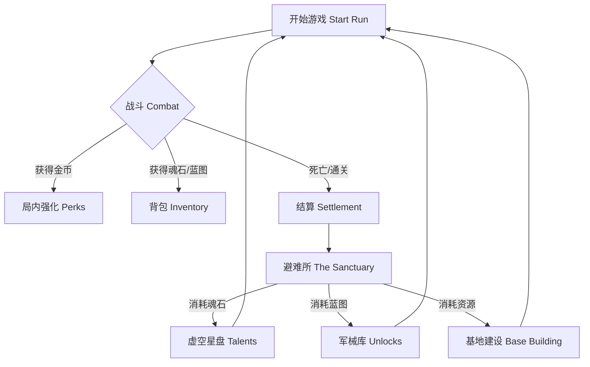

# 🌲 局外成长系统 (Meta-Progression)

本文档定义了 **Project Vampirefall** 的长期留存动力引擎。
Meta-Progression 是连接单局体验 (Session) 的桥梁，它负责将玩家的短期挫败感转化为长期的成就感。

---

## 💎 1. 核心设计哲学 (Core Philosophy)

### 1.1 为什么我们需要局外成长？
Roguelike 的核心矛盾在于 **"死亡的惩罚"** 与 **"玩家的时间价值"** 之间的冲突。
Meta-Progression 的本质是**投资 (Investment)**。玩家投入时间，游戏返还永久的资产。

*   **缓解挫败感 (Mitigate Frustration):** "虽然我死在了第50波，但我刷够了买【二段跳】的魂石，这波不亏。"
*   **改变游戏节奏 (Pacing Control):** 初期玩家弱小，体验生存恐怖；后期玩家强大，体验割草快感。
*   **扩展玩法维度 (Complexity Layering):** 不要一开始就给玩家所有机制。通过解锁逐步引入新塔、新武器、新敌人，保持新鲜感。

### 1.2 核心循环 (The Loop)

---

## 💰 2. 资源经济 (Economy & Resources)

为了避免资源通胀，我们采用**多轨制经济 (Multi-Track Economy)**。

| 资源名称 | 类型 | 获取方式 | 用途 | 贬值风险 |
| :--- | :--- | :--- | :--- | :--- |
| **金币 (Gold)** | 局内 (Soft) | 击杀怪物、利息 | 购买塔、刷新Perk | 💀 极高 (每局清零) |
| **魂石 (Soul Shards)** | 局外 (Hard) | 击杀Boss、成就、结算 | 升级天赋树 (数值) | ⚠️ 中 (后期溢出) |
| **蓝图 (Blueprints)** | 永久 (Unlock) | 精英怪掉落、隐藏房 | 解锁新物品/机制 | 🟢 无 (一次性) |
| **宇宙碎片 (Cosmic Frag)** | 赛季 (Prestige) | 转生、高难挑战 | 购买皮肤、开启词缀 | 🟢 无 (保值) |

### 2.1 魂石的获取曲线
遵循 **"对数增长"** 原则：
*   **波次 1-10:** 掉落很少。防止玩家反复刷第一关 (Grinding Level 1)。
*   **波次 11-30:** 线性增长。
*   **波次 30+:** 指数增长。鼓励玩家挑战极限，活得越久收益越高。

---

## 🌌 3. 虚空星盘 (The Void Constellation) - 天赋系统

我们摒弃线性的 "攻击力 Lv1 -> Lv2" 列表，采用**星盘 (Constellation)** 结构。
这不仅是 UI 的美化，更是为了提供**非线性的探索感**。

### 3.1 三大星系 (The Three Galaxies)

玩家从星盘中心的 **[原点]** 出发，向三个方向延伸：

#### 🔴 战争星系 (War) - *强化角色本体*
*   **风格:** 暴力、直观、高风险。
*   **属性:** 攻击力、暴击率、移动速度、吸血。
*   **核心节点 (Keystone):**
    *   **[狂战士之血]:** 每损失 1% 生命值，攻击力 +1%。
    *   **[武器大师]:** 允许携带两把主武器，但无法使用副手装备。

#### 🔵 工程星系 (Engineering) - *强化塔防机制*
*   **风格:** 策略、布局、自动化。
*   **属性:** 建塔折扣、塔攻速、塔耐久、维修效率。
*   **核心节点 (Keystone):**
    *   **[自动装填]:** 角色每 5秒 自动维修周围 10米 内受损最严重的塔。
    *   **[超频链接]:** 站在塔旁边时，你和塔的攻速都 +20%。

#### 🟡 财富星系 (Fortune) - *强化经济与掉落*
*   **风格:** 贪婪、赌博、后期发力。
*   **属性:** 金币获取、商店折扣、稀有掉落率 (MF)、利息上限。
*   **核心节点 (Keystone):**
    *   **[点金手]:** 敌人死后有 5% 几率变成金雕像（障碍物），打破后获得大量金币。
    *   **[黑市会员]:** 商店每次刷新必定出现一件 8 折商品。

### 3.2 节点设计规则
*   **小星点 (Minor):** 纯数值堆叠 (+3% 攻击)。作为连接路径。
*   **大星点 (Major):** 显著数值或小机制 (+10% 攻击，击杀回血)。
*   **核心星点 (Keystone):** **改变玩法机制**。通常位于星系末端，作为终极目标。

---

## 🏰 4. 避难所建设 (Sanctuary Building)

避难所是玩家的“家”。它随着游戏进程在视觉上发生变化（破败 -> 繁荣）。

### 4.1 建筑功能列表

| 建筑 | 功能 | 升级效果 (Lv1 -> Lv5) | 视觉变化 |
| :--- | :--- | :--- | :--- |
| **篝火 (Bonfire)** | 核心枢纽 | 增加最大生命值上限 | 熄灭的灰烬 -> 熊熊圣火 |
| **铁匠铺 (Smithy)** | 武器解锁 | 允许锻造更高 Tier 的初始装备 | 破棚子 -> 熔岩流动的工坊 |
| **炼金台 (Alchemy)** | 药水强化 | 增加药水充能次数 (3 -> 5) | 杂乱桌子 -> 充满发光液体的实验室 |
| **图书馆 (Library)** | 图鉴/统计 | 解锁怪物弱点显示、DPS统计 | 书堆 -> 宏伟的奥术图书馆 |
| **花园 (Garden)** | 挂机收益 | 每小时产出少量魂石 (Cap) | 枯草 -> 种植着发光植物 |

### 4.2 视觉反馈 (Visual Progression)
*   **原则:** 每一个升级都必须在场景中可见。
*   **例子:** 铁匠铺升到 Lv3 后，旁边会多出一个自动敲打的机械臂。
*   **目的:** 满足玩家的**占有欲**和**归属感** (Self-Determination Theory - Relatedness)。

---

## ⚔️ 5. 军械库与精通 (Arsenal & Mastery)

除了通用的天赋，武器本身也应该有成长，鼓励玩家尝试不同武器。

### 5.1 武器熟练度 (Weapon Mastery)
每把武器都有独立的经验条。
*   **获取:** 使用该武器击杀敌人。
*   **里程碑奖励:**
    *   **Lv 3:** 解锁该武器的 [替换技能] (Alt-Fire)。
    *   **Lv 5:** 开局携带该武器时，获得 +10% 伤害加成。
    *   **Lv 10:** 解锁该武器的 [黄金皮肤] (纯外观)。

### 5.2 蓝图解锁 (Blueprints)
*   **机制:** 类似 *Dead Cells*。
*   **流程:** 关卡内拾取 -> 必须活着带回基地 -> 交给铁匠 -> 花费魂石解锁 -> 加入掉落池。
*   **张力:** 拿到稀有蓝图后，玩家会变得极度谨慎（"Loss Aversion" 生效），这种紧张感是游戏的高光时刻。

---

## 🧠 6. 理论支撑与陷阱规避 (Theory & Pitfalls)

### 6.1 强度膨胀曲线 (Power Creep Curve)
局外成长的数值提升必须遵循 **对数曲线 (Logarithmic)**。

*   **前期 (0-10小时):** 快速提升。让新手玩家能明显感觉到“我变强了”，从而留存下来。
*   **中期 (10-50小时):** 线性平稳。
*   **后期 (50+小时):** 边际收益递减。
    *   *错误:* Lv100 的攻击力是 Lv1 的 100倍。 -> 导致数值崩坏。
    *   *正确:* Lv100 的攻击力是 Lv1 的 3倍。 -> 更多依赖机制和技巧。

### 6.2 禀赋效应 (Endowment Effect)
*   **理论:** 人们认为自己拥有的东西价值更高。
*   **应用:** 允许玩家对装备进行微小的定制（如改名、染色）。一旦玩家投入了感情，他们就更不愿意流失。

### 6.3 目标梯度效应 (Goal Gradient Effect)
*   **理论:** 越接近目标，人的动力越足。
*   **应用:** UI 上必须清晰显示“距离下一个天赋点还差 50 魂石”。
*   **技巧:** 在玩家刚解锁一个大天赋后，立刻送给他一点点通往下一个天赋的进度（"Progress Bar Illusion"）。

---

## 📚 7. 业界标杆案例 (Case Studies)

### 7.1 Hades (黑帝斯) - 夜之镜
*   **亮点:** **双面天赋 (Dual-sided Talents)**。
*   **借鉴:** 我们的星盘节点可以设计为“二选一”开关。例如：[增加 20% 血量] OR [增加 10% 闪避]。这增加了策略深度，而非单纯的刷刷刷。

### 7.2 Rogue Legacy 2 (盗贼遗产2) - 城堡建设
*   **亮点:** **继承与迭代**。每一代子孙都继承了城堡的属性，但有独特的特质。
*   **借鉴:** 强调“基地”的视觉成长。UI 只是辅助，场景才是本体。

### 7.3 Darkest Dungeon (暗黑地牢) - 设施升级
*   **亮点:** **资源互斥**。升级铁匠铺的资源和升级公会的是一样的，逼迫玩家做决策。
*   **借鉴:** 不要让魂石成为唯一资源。引入“木材”、“钢铁”等次级资源（通过分解装备获得），增加经济系统的厚度。

---

## 8. 总结 (Summary)

Project Vampirefall 的局外成长系统不应只是数值的堆砌，而是一个**多维度的投资组合**：
1.  **星盘:** 提供长期的数值底气。
2.  **基地:** 提供视觉成就感和功能解锁。
3.  **蓝图:** 提供单局内的惊喜和变数。
4.  **精通:** 鼓励横向玩法的探索。

最终目标是：**让每一次 Run，无论成败，都有意义。**

