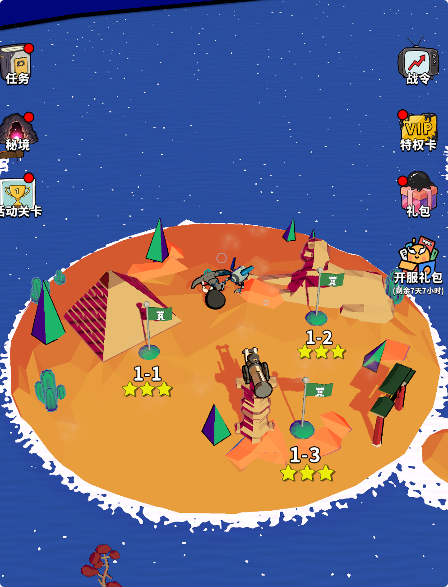

# 🎨 独立游戏美术突围：低成本、高统一性的资源策略

## 1. 🧠 核心哲学：一致性 > 精细度 (Consistency > Fidelity)

对于独立团队，最大的陷阱是**追求写实**。
*   **🕳️ 写实是无底洞**: 3A 游戏的写实依赖于数亿面数的扫描资产、动作捕捉和光线追踪。独立团队做写实，只会得到“廉价的写实” (Uncanny Valley)。
*   **🏰 风格化是护城河**: 像素、低多边形 (Low Poly)、卡通渲染 (Cel Shading) 不仅成本低，而且更容易建立独特的视觉识别度 (Visual Identity)。

### 🏆 黄金法则
> **"一个统一的丑陋世界，胜过一个拼凑的精美世界。"**
> 玩家可以接受简陋的画面，但不能接受**风格割裂** (例如：像素角色站在写实草地上)。

---

## 2. 📦 资产获取与重组 (Asset Acquisition & Kitbashing)

### 2.1 🛒 商店资产的正确用法
直接使用 Asset Store 的模型会被称为 "Asset Flip"。正确的做法是 **Kitbashing (模型拼装)**。
*   **🔨 拆解**: 买一套“中世纪村庄”包，不要直接用它的房子。拆出它的墙壁、窗户、木桶。
*   **🧱 重组**: 用这些基础零件拼出你自己的建筑。
*   **🎨 去材质**: 丢弃原资产自带的贴图（通常风格各异）。只保留模型网格 (Mesh)。

### 2.2 ⬜ 灰盒先行 (Greyboxing)
*   在没有任何美术资源的情况下，用简单的立方体和胶囊体搭建关卡。
*   验证玩法循环。如果方块打架都好玩，加上美术只会更好玩。

---

## 3. 🧪 技术美术作为粘合剂 (Tech Art as Glue)

如何让来自 5 个不同商店的资产看起来像是一个游戏？**统一的渲染管线**。

### 3.1 🖌️ 统一着色器 (Master Shader)
*   创建一个通用的 Master Shader (例如基于 Toon Shading)。
*   **🔄 强制替换**: 将所有外部资产的材质球替换为你的 Master Shader。
*   **🎨 色彩校正**: 通过 Shader 的参数（如 Tint Color, Rim Light）将所有模型的色调统一到你的调色板中。

### 3.2 🎞️ 屏幕后处理 (Post-Processing)
*   **🖼️ LUT (Look Up Table)**: 最廉价的风格化手段。一张 LUT 图可以瞬间改变整个画面的色调（冷峻、温暖、复古）。
*   **✏️ 描边 (Outline)**: 加上黑色描边可以有效掩盖模型精度的不足，增强卡通感。
*   **🌫️ 雾效 (Fog)**: 统一场景的深度感，遮挡远处的低精度细节。

---

## 4. 🤖 AI 与程序化生成 (AI & Procedural Tools)

### 4.1 🎨 AI 辅助概念设计
*   使用 Midjourney / Stable Diffusion 生成大量的概念图、UI 图标、技能特效参考。
*   **⚠️ 注意**: 目前 AI 直接生成的 3D 模型尚不可用，但用于生成**无缝贴图 (Seamless Textures)** 非常高效。

### 4.2 🎲 程序化生成 (WFC / PCG)
*   利用 [Wave Function Collapse (WFC)](../Technical_Implementation/Procedural_Generation_WFC.md) 算法，用少量的地块 (Tiles) 生成无限的地图。
*   这极大降低了关卡美术的工作量。

---

## 5. 📚 案例参考
*   **🌲 Valheim**: 低分辨率贴图 + 高质量光照。
*   **🌧️ Risk of Rain 2**: 极简的几何体 + 强烈的色彩对比。
*   **🧛 Vampire Survivors**: 极其廉价的像素素材 + 疯狂的特效堆叠（爽感掩盖了粗糙）。

---

## 6. ⚠️ 美术出图资源的坑点与经验 (Pitfalls & Best Practices)

很多独立开发者在购买或自制美术资源导入 Unity 时，会遇到各种“水土不服”的问题。以下是血泪总结：

### 6.1 📐 坐标轴与单位 (Axes & Units)
*   **🔄 Y-Up vs Z-Up**: Blender 默认是 Z-Up，Unity 是 Y-Up。
    *   *💣 坑点*: 导入的模型是躺着的 (-90度旋转)。
    *   *✅ 解法*: 在 Blender 导出 FBX 时，设置 `Apply Transform` 并选择 `Y Forward, Z Up` (视具体版本而定，关键是确保导入 Unity 后 Rotation 为 0,0,0 且正面朝前)。
*   **📏 单位比例 (Scale)**:
    *   *💣 坑点*: 导入的模型是巨型或微型的 (Scale = 100 或 0.01)。这会导致物理模拟、光照烘焙全部出错。
    *   *✅ 解法*: 始终以 **1 Unit = 1 Meter** 为标准。在建模软件中应用所有缩放 (Apply Scale/Freeze Transformations) 后再导出。

### 6.2 🎯 轴心点 (Pivot Point)
*   *💣 坑点*: 模型的轴心点在几何中心，而不是底部中心。
    *   *💥 后果*: 放置在地面时，模型的一半会埋在土里。
*   *✅ 解法*: 对于放置在地面的物体（树、石头、建筑），轴心点必须在 **底部中心 (Bottom Center)**。对于门轴，轴心点必须在 **合页处**。

### 6.3 🖼️ 材质与贴图 (Materials & Textures)
*   **📏 贴图尺寸**: 必须是 **2 的幂次方 (Power of 2)** (e.g., 512, 1024, 2048)。
    *   *💡 原因*: 显卡只能压缩 POT 贴图。非 POT 贴图无法压缩，显存占用会暴增 4 倍以上。
*   **🏷️ 材质命名**: 严禁使用默认名 (如 `Material.001`, `Lambert1`)。
    *   *💥 后果*: 当导入多个模型时，Unity 会自动合并同名材质，导致你的石头变成了树的颜色。
    *   *✅ 解法*: 命名必须带前缀，如 `M_Rock_01`, `M_Tree_Birch`。

### 6.4 🧹 模型清理 (Mesh Cleanup)
*   **🗑️ 多余数据**: 很多商店资产带有相机、灯光、甚至骨骼节点。
    *   *✅ 解法*: 导出前删除所有非 Mesh 物体。
*   **🌑 法线问题 (Normals)**:
    *   *💣 坑点*: 模型表面出现奇怪的黑斑或接缝。
    *   *✅ 解法*: 检查法线方向 (Face Orientation)。确保所有面朝外。对于硬表面物体，注意设置平滑组 (Smoothing Groups) 或标记 Sharp Edges。

### 6.5 🧱 碰撞体 (Colliders)
*   *💣 坑点*: 直接使用高面数的渲染模型作为 MeshCollider。
    *   *💥 后果*: 物理计算极其昂贵，且容易产生穿模 BUG。
*   *✅ 解法*: 
    *   简单物体：使用 Box/Sphere/Capsule Collider。
    *   复杂物体：在建模软件中制作一个极简的低模 (UCX_Name)，作为专用碰撞体导入。

---

## 7. 🖌️ 3D 渲染工作流详解 (Rendering Workflows)

选择正确的渲染管线决定了你的美术成本上限。

### 7.1 🕯️ PBR (Physically Based Rendering) - 物理渲染
*   **原理**: 模拟真实光线与材质的交互。核心是 Albedo (固有色) + Metallic (金属度) + Roughness (粗糙度) + Normal (法线)。
*   **👍 优点**: 真实，通用性强（Unity/Unreal 标准材质）。
*   **👎 缺点**: **极其昂贵**。
    *   *💸 制作成本*: 每个模型都需要展 UV、画贴图、烘焙法线。
    *   *📉 性能成本*: 纹理采样次数多，显存占用大。
*   **🛑 结论**: **独立团队慎用**。除非你买现成的 PBR 资产包且不打算修改。

### 7.2 🔺 Low Poly (Flat Shading) - 低多边形
*   **原理**: 不使用平滑组 (Smoothing Groups)，让每个面都棱角分明。通常只使用顶点色 (Vertex Color) 或一张极小的调色板贴图 (Palette Texture)。
*   **👍 优点**:
    *   *🚀 制作快*: 甚至不需要展 UV。
    *   *⚡ 性能高*: 几乎没有纹理开销。
*   **👎 缺点**: 容易显得“廉价”或“千篇一律”。
*   **✅ 结论**: **首选**。但必须配合优秀的光照和后处理（见下文）。

### 7.3 🔮 MatCap (Material Capture) - 材质捕获
*   **原理**: “作弊”的渲染方式。将光照、高光、反射全部“画”在一张小球贴图上。无论模型怎么转，它都反射这张图。
*   **👍 优点**: **极致性能**（不需要计算光照），**极致风格化**（想要什么风格就画什么球）。
*   **👎 缺点**: 无法响应场景灯光（比如走进暗室不会变黑）。
*   **✅ 结论**: 适合固定视角的上帝视角游戏，或特殊的魔法物品/UI 3D 物体。

### 7.4 📺 Toon / Cel Shading - 卡通渲染
*   **原理**: 将连续的光照离散化（从渐变变成色阶）。通常配合描边 (Outline)。
*   **👍 优点**: 二次元风格，讨喜，且能掩盖模型精度的不足。
*   **👎 缺点**: 需要编写或购买专用 Shader，对拓扑结构有一定要求。
*   **✅ 结论**: 如果你想做“塞尔达”或“原神”风格，这是必经之路。

---

## 8. 👨‍💻 程序员的美术救生圈 (Programmer's Guide to Style)

如果你是“色弱”或者“手残”的程序员，如何做出好看的画面？

### 8.1 🎨 调色板理论 (Palette Theory)
*   **🚫 禁忌**: 永远不要在 Color Picker 里选颜色！
    *   *❌ 错误*: 想要红色就选 (255, 0, 0)。
    *   *💥 后果*: 画面极其刺眼，像开发者测试图。
*   **✅ 解法**: 去 [Lospec](https://lospec.com/) 或 [Coolors](https://coolors.co/) 下载一套现成的调色板 (Palette)。
    *   **🔒 强制约束**: 你的游戏里所有颜色，只能从这 8 个或 16 个颜色里选。
    *   *✨ 效果*: 无论你怎么乱搭，画面看起来都是统一和谐的。

### 8.2 💡 灯光是化妆师 (Lighting)
一个白模，打好光就是艺术品；一个精模，打平光就是垃圾。
*   **🕯️ 三点布光法 (Three-Point Lighting)**:
    1.  **☀️ 主光 (Key Light)**: 最亮，决定阴影方向（暖色，如淡黄）。
    2.  **☁️ 补光 (Fill Light)**: 照亮阴影区，防止死黑（冷色，如淡蓝）。
    3.  **🔦 轮廓光 (Rim Light)**: 从背后打光，勾勒物体轮廓，将物体与背景分离（高亮）。
*   **🌌 环境光 (Ambient)**: 不要用纯黑。用深蓝色或深紫色作为阴影色。

### 8.3 🎞️ 后处理是滤镜 (Post-Processing)
这是“让画面变贵”的最后一步。Unity Post-Processing Stack 是免费的。
1.  **🎬 Color Grading (ACES)**: 开启 ACES Tone Mapping，画面对比度瞬间电影感。
2.  **✨ Bloom (辉光)**: 给发光物体（火焰、魔法、UI）加上光晕。**慎用**，阈值调高，强度调低。
3.  **🌑 Ambient Occlusion (AO)**: 增加物体接触面的阴影，增加体积感。

> **📝 总结**: **Low Poly 模型 + 严格调色板 + 三点布光 + ACES/Bloom = 看起来很贵的独立游戏。**

---

## 9. 📱 实战：移动端 Toony Colors Pro 2 (TCP2) 黄金配置

如何在手机上跑出 60 帧的同时，达到“看起来像主机游戏”的效果？
**核心思路**: **Fake it till you make it (假装直到成真)**。用廉价的贴图计算代替昂贵的光照计算。

### 9.1 💡 灯光配置 (Lighting Setup)
手机上**严禁**使用多盏实时灯光。
*   **☀️ Realtime Lights**: **1 盏 Directional Light** (作为主光 Key Light)。
    *   *🌑 Shadows*: Hard Shadows (软阴影太贵，且风格化游戏硬阴影更好看)。
*   **☁️ Fill Light (补光)**: **不要用灯！** 使用 `Environment Lighting` (全局环境光)。
    *   *📍 设置位置*: 菜单栏 `Window` -> `Rendering` -> `Lighting` -> `Environment` 选项卡。
    *   *⚙️ 模式*: Source = `Gradient` (梯度光/三色光)。
    *   *🌅 Sky Color*: 暖色 (对应天空，影响物体顶部)。
    *   *⚖️ Equator Color*: 中性色 (对应地平线，影响物体中部)。
    *   *⛰️ Ground Color*: 冷色 (对应地面反射，影响物体底部)。
    *   *💡 原理*: TCP2 Shader 会自动读取这些颜色作为 Ambient Light 叠加到物体上。
*   **🔦 Rim Light (轮廓光)**: **不要用灯！** 使用 Shader 里的 Fresnel Rim。

### 9.2 ⚙️ Shader 黄金配置 (TCP2 Generator)
在 TCP2 Shader Generator 中，勾选以下选项：

1.  **🌈 Ramp Style (核心)**: `Texture Ramp` (滑块图)。
    *   *原理*: 用一张 256x1 的渐变图来定义光照过渡。
    *   *技巧*: 在暗部区域画一点点暖色（模拟次表面散射 SSS），会让皮肤看起来通透。
2.  **✨ Specular (高光)**: `Off` (关掉！)。
    *   *替代方案*: 使用 **MatCap**。
3.  **🔮 MatCap (材质捕获)**: `Add` (叠加模式)。
    *   *用途*: 模拟金属反射、丝绸光泽。
    *   *🚀 性能*: 极快。比 PBR 的 Reflection Probe 快 10 倍。
    *   *用法*: 只有金属部件的材质开启此项。
4.  **🔦 Rim Light (边缘光)**: `Fresnel`。
    *   *用途*: 模拟背光，将角色从背景中剥离。
    *   *设置*: 颜色设为高亮色，Power 设为 3~5。

### 9.3 🎞️ 后处理 (Post-Processing) - 极简版
手机上后处理是性能杀手，只能留最关键的。

1.  **🎨 Color Grading (LUT)**: **必开**。
    *   *🚀 性能*: 几乎无消耗 (一张 2D 贴图查找)。
    *   *作用*: 决定整个游戏的色调（冷暖、电影感）。
2.  **✨ Bloom (辉光)**: **慎开**。
    *   *设置*: 必须开启 `Fast Mode`。Diffusion 降低。
    *   *阈值*: Threshold > 1.0，只让极亮的部分（特效、UI）发光。
3.  **📐 Anti-aliasing (抗锯齿)**: `FXAA` (最便宜) 或 `Off` (如果分辨率够高)。
    *   *🚫 禁忌*: 严禁在手机上开 MSAA (多重采样)，显存带宽会爆炸。

### 9.4 📊 性能总结
*   **Draw Calls**: 使用 GPU Instancing (TCP2 支持)。
*   **Overdraw**: 减少半透明特效的面积。
*   **顶点数**: Low Poly 风格天然优势。

> **📝 最终公式**: **1 盏灯 + 环境光渐变 + Ramp 贴图 + MatCap 金属 + LUT 调色 = 伪 3A 级移动端画面。**

---

## 10. 🔬 技术美术原理深挖 (Tech Art Deep Dive)

知其然，更要知其所以然。以下是上述配置背后的图形学原理。

### 10.1 🌈 Texture Ramp (渐变图)
*   **原理**:
    *   传统光照 (Lambert) 计算的是 `NdotL` (法线与光照方向的点积)，结果是 0 (黑) 到 1 (白) 的线性灰度。
    *   Ramp 则是把这个 0~1 的灰度值作为 **UV 坐标的 U 值**，去采样一张渐变图。
    *   *📐 公式*: `FinalColor = tex2D(RampTexture, float2(NdotL, 0.5))`。
*   **如何选择**:
    *   **🔪 硬边缘 (Hard Edge)**: 色块分明，适合塞尔达/日式二次元风格。
    *   **☁️ 软边缘 (Soft Edge)**: 像迪士尼/TF2，有平滑的明暗交界线。
    *   **🎨 色相偏移 (Hue Shift)**: **最关键点**。暗部不要只是变黑，要变冷（蓝/紫）；亮部变暖（黄/橙）。这比单纯的明暗更有“高级感”。

### 10.2 🔮 MatCap (材质捕获)
*   **原理**:
    *   全称 **Mat**erial **Cap**ture。它不计算光照，而是将**视图空间法线 (View Space Normal)** 映射到 UV 坐标上。
    *   想象一个完美的球体，它包含了你想要的光照和反射。无论你的模型怎么转，它都去采样这个球体上对应法线方向的颜色。
*   **为什么能替代高光?**
    *   如果 MatCap 贴图上画了一个高光点，那么模型上所有朝向摄像机的面都会采样到这个高光点，看起来就像产生了镜面反射。
    *   *👍 优势*: 真正的 Specular 计算需要 `pow(dot(N, H), power)`，而 MatCap 只是简单的纹理采样，极快。
*   **怎么做 MatCap 贴图?**
    *   **方法 A (3D 软件)**: 在 Blender 里建一个球，打上复杂的光，渲染出一张正方形图片。
    *   **方法 B (PS 手绘)**: 在 PS 里画一个圆，涂上你想要的金属质感和高光。

### 10.3 🔦 Rim Light vs Outline
*   **Rim Light (边缘光)**:
    *   *原理*: **Fresnel (菲涅尔) 效应**。计算视线与法线的夹角。夹角越接近 90 度（边缘），值越大。
    *   *作用*: **内发光**。模拟背光照在物体绒毛或边缘产生的透光感。主要用于**将物体与背景分离**。
*   **✏️ Outline (描边)**:
    *   *原理*: 通常使用 **Inverted Hull (法线外扩)** 技术。把模型复制一份，沿法线向外膨胀一点点，剔除正面 (Cull Front)，只显示背面，涂成黑色。
    *   *作用*: **外轮廓**。漫画感的核心。
*   **⚖️ 区别**: Rim 是光影效果（在模型内），Outline 是几何效果（在模型外）。

### 10.4 🖼️ LUT (Look Up Table)
*   **原理**:
    *   LUT 是一张颜色映射表。输入一个颜色 (R, G, B)，把它当作坐标 (X, Y, Z)，去表里查出一个新的颜色。
    *   它本质上是一个 3D 纹理 (256x16 或 32x32x32)，为了方便存储，被平铺成了一张 2D 长条图 (Strip)。
*   **如何制作**:
    1.  在 Unity 运行游戏，**📷 截图**。
    2.  放入 Photoshop。
    3.  使用 PS 的调整图层 (曲线、色阶、色彩平衡) 把截图调成你想要的样子。
    4.  **🔑 关键步**: 把一张标准的 "Neutral LUT" (原色表) 放入 PS，**应用完全相同的调整图层**。
    5.  导出这张修改后的 LUT 图。
*   **URP 设置**:
    *   `Global Volume` -> `Add Override` -> `Color Lookup`。
    *   Mode 选 `Neutral` (如果不换 LUT) 或 `External` (如果使用自制 LUT)。

### 10.5 🔺 Low Poly 顶点数之谜
*   **❓ Q: 为什么 Low Poly 看起来面少，顶点数反而多？**
*   **💡 A: 因为硬边 (Hard Edges) 需要裂开顶点。**
    *   **Smooth Shading (平滑)**: 一个立方体的 8 个顶点，每个顶点只有一个法线 (平均值)。相邻面共用顶点。
    *   **Flat Shading (硬边)**: 为了让立方体的棱角分明，每个面必须有自己独立的法线。因此，一个角上的顶点必须分裂成 3 个（分别属于 Top, Front, Right 面）。
    *   *🔢 结果*: 一个平滑立方体有 8 个顶点；一个 Low Poly 立方体有 4 * 6 = 24 个顶点。
    *   *🚀 性能影响*: 虽然顶点多了 3 倍，但因为不用计算复杂的 PBR 和光照，整体性能依然是吊打高模的。


---

## 11. 💻 程序员专用：TCP2 调参协议 (The TCP2 Tuning Protocol)

美感不是玄学，是**参数的特定组合**。我们将“好看”翻译成代码逻辑和约束条件。

### 11.1 🚫 `assert(false)` - 绝对禁止 (Strict Constraints)
如果违反以下规则，画面**必崩**。

1.  **💡 `Light.Count > 1` (Realtime)**:
    *   *🧠 逻辑*: 多光源会导致阴影杂乱 (Shadow Acne) 且破坏二次元的纯净感。
    *   *⚠️ 异常*: 画面变脏，性能 O(N) 下降。
2.  **🎨 `Color.sRGB == (255, 0, 0)` (纯色)**:
    *   *🧠 逻辑*: 物理世界不存在饱和度 100% 的颜色。
    *   *⚠️ 异常*: 刺眼，像 Debug 模式。
    *   *✅ 修正*: `Clamp(Saturation, 0, 0.85)`.
3.  **🌑 `Shadows.Type == Soft` (软阴影)**:
    *   *🧠 逻辑*: 风格化需要明确的明暗边界 (Hard Edge)。软阴影会让画面看起来像“渲染未完成”。
4.  **✨ `Material.Specular == true` (高光)**:
    *   *🧠 逻辑*: 传统的高光计算 (Phong) 会产生一个白点，看起来像塑料。
    *   *✅ 修正*: 使用 `MatCap` 代替。

### 11.2 ✅ `require(true)` - 必须执行 (Core Logic)
这是“好看”的最小集 (Minimum Viable Aesthetics)。

1.  **🌈 `Ramp.Texture != null`**:
    *   *🧠 逻辑*: 拒绝线性光照。必须通过查表 (LUT) 来控制光照衰减。
    *   *⚙️ 参数*: 使用 `256x1` 的水平渐变图。
2.  **🔦 `Rim.Fresnel > 0`**:
    *   *🧠 逻辑*: 确保 `Silhouette` (剪影) 与 `Background` (背景) 有对比度。
    *   *⚙️ 参数*: `Power = 3.0`, `Color = BaseColor * 1.5`.
3.  **🖼️ `PostProcessing.LUT.Active == true`**:
    *   *🧠 逻辑*: 全局颜色矩阵变换。这是统一所有资产色调的唯一低成本方案。

### 11.3 🔀 `optional()` - 可选参数 (Parameters)
根据对象类型 (Type) 决定是否开启。

*   **✏️ `Outline`**:
    *   `if (Object.Type == Character)`: **Enable**. (强调角色)
    *   `if (Object.Type == Environment)`: **Disable**. (环境要后退，不要抢戏)
*   **🔮 `MatCap`**:
    *   `if (Material.Type == Metal || Silk)`: **Enable**. (模拟高反射)
    *   `if (Material.Type == Cloth || Skin)`: **Disable**. (漫反射为主)

### 11.4 🧮 美感的算法化翻译 (Translating Aesthetics to Logic)
如何把美术总监嘴里的“通透”、“空气感”翻译成代码？

1.  **💎 "通透感" (Translucency) -> `Hue Shift`**:
    *   *📐 算法*: 暗部的颜色不要只是 `BaseColor * 0.5` (变黑)。
    *   *📝 公式*: `ShadowColor = HSV(BaseColor.H - 15°, BaseColor.S + 0.2, BaseColor.V * 0.6)`.
    *   *💡 解释*: 暗部要**偏冷** (色相偏移) 且**更饱和** (次表面散射模拟)。
2.  **🌫️ "空气感" (Atmosphere) -> `Fog Match`**:
    *   *📐 算法*: `Fog.Color == Skybox.BottomColor`.
    *   *💡 解释*: 远处的物体必须融入天空的颜色，减少对比度。
3.  **🎩 "高级感" (Premium Feel) -> `ACES Tone Mapping`**:
    *   *📐 算法*: `FinalColor = ACES(LinearColor)`.
    *   *💡 解释*: 增加对比度，压暗部，提亮部，去除灰蒙蒙的感觉。

### 11.5 🛑 FAQ: 就算是风格化，也不能动 Highlight/Shadow Color 吗？

**Q: 既然是风格化 (Stylized)，我为了艺术效果，手动把阴影调成紫色不行吗？**

**A: 可以，但代价很高。请遵循以下“三层级”操作规范：**

#### 🟢 Level 1: 坚决不动 (The Systemic Way) - **推荐**
*   **操作**: `Highlight = White`, `Shadow = Grey/Black` (保持默认)。
*   **控制权**: 交给 **环境光 (Environment Lighting)**。
*   *🧠 逻辑*:
    *   你的物体处于一个“世界”中。如果世界是黄昏，环境光是紫色，那么所有物体的阴影自然就是紫色。
    *   如果你手动把物体阴影锁死为紫色，当场景切换到“正午”时，这个物体就会像个格格不入的 Bug。

#### 🟡 Level 2: 用贴图动 (The Ramp Way) - **进阶**
*   **操作**: 依然保持 `Shadow = Grey`，但是 **画一张带颜色的 Ramp 图**。
*   **控制权**: 交给 **Ramp Texture**。
*   *🧠 逻辑*:
    *   如果你想要“皮肤的阴影偏红 (SSS)”或者“金属的阴影偏冷”：
    *   **不要**直接改颜色属性。
    *   **要**画一张 Ramp 图：在 Ramp 的暗部（左侧）画上你想要的红色或冷蓝色。
    *   *✨ 优势*: Ramp 是对光照反应的映射。当光照变强时，它会滑向亮部；变弱时滑向暗部。它是**动态**的，而 `ShadowColor` 是**死**的。

#### 🔴 Level 3: 只有这时候才动 (The Exception)
*   **操作**: 手动修改 `ShadowColor`。
*   **适用情况**:
    1.  **UI 3D 物体**: 永远处于固定光照下，不受环境影响。
    2.  **魔法/特效**: 比如一个自发光的幽灵，它的阴影必须是绿色的，无论在什么环境下。
    3.  **完全 2D 化的渲染**: 你根本不想要任何光照计算，只想画成什么样就显示什么样 (Unlit)。

> **📝 总结**:
> *   想改**整体氛围**？改 **Environment Light**。
> *   想改**材质质感**（如皮肤通透感）？改 **Ramp Texture**。
> *   只有做 **UI 或 特效** 时，才去动 **Shadow Color**。

---

## 12. 🖼️ 案例分析：一张图看懂 TCP2 协议 (Case Study)

我们用刚才定义的“程序员协议”来分析这张参考图：



### 12.1 ✅ 做对了什么 (Compliance)

1.  **💡 单光源 + 硬阴影 (Light & Shadow)**
    *   *观察*: 大炮和树木的阴影边缘非常锐利 (Hard Edge)，且方向一致。
    *   *协议*: 符合 `Light.Count == 1` 和 `Shadows.Type == Hard`。
    *   *效果*: 画面干净利落，没有脏乎乎的软阴影过渡。

2.  **🌈 阴影色相偏移 (Hue Shift)**
    *   *观察*: **重点看地面**。地面的亮部是**橙色**，但阴影部不是黑色或灰色，而是**深红褐色**。
    *   *协议*: 符合 `Ramp.Texture` 的使用。暗部发生了色相偏移 (Orange -> Red)，而不是单纯的亮度降低 (Orange -> Dark Orange)。这让沙地看起来很“透气”。

3.  **✏️ 选择性描边 (Selective Outline)**
    *   *观察*:
        *   **树木/石头**: **没有描边**。
        *   **大炮/角色**: 有明显的黑色轮廓（或者是深色贴图边缘）。
    *   *协议*: 符合 `if (Object.Type == Environment) Disable Outline`。如果那堆仙人掌也有黑描边，画面就会乱成一团线稿。

### 12.2 🌊 特殊 Shader 技术 (Tech Art)

1.  **水体泡沫 (Depth Fade)**
    *   岸边的白色波浪线不是手画的贴图，而是 **Depth Fade** 技术。
    *   *原理*: Shader 计算 `水面深度` 和 `地形深度` 的差值。如果差值很小（水很浅），就显示白色。

2.  **顶点色 (Vertex Colors)**
    *   注意那些圆锥体的树。它们没有复杂的纹理，很可能是直接给顶点涂了颜色（一面绿，一面紫），或者用了一张极小的 Palette 贴图。

### 12.3 🧠 总结
这张图是典型的 **"Low Poly + Ramp Shading"** 组合。它没有使用昂贵的 PBR，也没有乱打光。它的美感来自于：
1.  **高饱和度的互补色** (橙色沙地 vs 蓝色海洋)。
2.  **干净的阴影** (硬阴影 + 色相偏移)。
3.  **克制的细节** (环境无描边，只强调主体)。

### 12.4 🔧 还可以优化的地方 (Areas for Improvement)

虽然这张图已经达到了及格线，但作为《Vampirefall》的参考，我们还可以更进一步：

1.  **🔦 缺少轮廓光 (Missing Rim Light)**
    *   *问题*: 角色和塔在橙色背景下虽然有轮廓线，但缺乏“体积感”。
    *   *优化*: 给角色材质开启 **Fresnel Rim** (边缘光)。
    *   *预期效果*: 角色边缘会有一层淡淡的亮光，像被阳光照亮一样，能更强烈地从背景中“跳”出来。

2.  **🏜️ 地面过于单调 (Flat Ground)**
    *   *问题*: 大面积的橙色色块虽然风格化，但显得有点“空”。
    *   *优化*:
        *   **方案 A (低成本)**: 在 Ramp 贴图的亮部增加一点点噪点 (Noise)，模拟沙粒感。
        *   **方案 B (中成本)**: 使用 **Decals (贴花)** 技术，在地面随机撒一些小石子或裂缝的贴图。

3.  **🌫️ 缺乏大气透视 (No Fog)**
    *   *问题*: 远处的岛屿边缘和近处一样清晰，缺乏深度感。
    *   *优化*: 开启 Unity 的 **Fog**，颜色设为海水的深蓝色。
    *   *预期效果*: 远处的物体会微微融入背景，增加场景的层次感 (Depth)。

4.  **🌵 颜色调和 (Color Harmony)**
    *   *问题*: 绿色的仙人掌/旗帜在橙色背景上显得有点“生硬”（红绿对比过于强烈）。
    *   *优化*: 将绿色的色相稍微向**青色 (Cyan)** 或 **黄色 (Yellow)** 偏移，避免使用纯正的 RGB 绿色。这会让画面看起来更高级。

---

## 13. 🛍️ 商店资产生存指南：混合工作流 (Mixed Asset Workflow)

**Q: 我买的资产有些是画好贴图的 (Textured)，有些是只用色板的 (Palette/Vertex Color)，它们能混用吗？**

**A: 可以，但必须通过“Shader 统一化”来强制融合。**

### 13.1 两种流派的区别 (The Difference)

| 特性 | 🎨 贴图流 (Textured) | 🌈 色板流 (Palette / Synty) |
| :--- | :--- | :--- |
| **原理** | 每个模型有独立的 UV 和一张专属贴图 (e.g., `Sword_Albedo.png`)。 | 所有模型共用一张 256x256 的色块图。UV 缩成一个点，放在对应颜色上。 |
| **优势** | 细节丰富，可以画纹理、污渍、手绘光影。 | 极其省内存 (1张贴图管全家)，Draw Call 容易合并。 |
| **劣势** | 内存占用大，风格差异大 (不同画师画风不同)。 | 细节缺失，看起来像“塑料积木”。 |

### 13.2 🚫 绝对禁止 (Must Not)
*   **禁止使用原作者的 Shader**: 商店资产通常自带 Standard Shader 或自定义 Shader。**全部丢弃！**
*   **禁止混用光照模型**: 不要让 A 资产受 PBR 光照影响，而 B 资产只受 Unlit 影响。这会产生严重的“拼凑感”。

### 13.3 ✅ 统一工作流 (The Unification Pipeline)

我们要用 **TCP2 Master Shader** 作为“熔炉”，把它们熔铸成同一种风格。

#### 步骤 1: 材质球统一 (Material Standardization)
所有资产，无论来源，必须换成 **Project Vampirefall 标准材质球**。
*   **Shader**: 选择 `Toony Colors Pro 2/Hybrid Shader` (或你生成的 Mobile Shader)。

#### 步骤 2: 贴图处理 (Texture Handling)
*   **对于贴图流资产**:
    *   将 `Albedo` 贴图放入 Shader 的 `Main Texture` 槽位。
    *   **关键**: 如果贴图自带了强烈的手绘光影（比如画死的阴影），需要用 PS 减淡，或者在 Shader 里调高 `Ramp Threshold` 来冲淡它。
*   **对于色板流资产**:
    *   将 `Palette` 贴图放入 Shader 的 `Main Texture` 槽位。
    *   **关键**: 设置贴图的 `Filter Mode` 为 **Point (No Filter)**。否则颜色边缘会模糊串色。

#### 步骤 3: 光照签名 (The Lighting Signature)
这是让它们看起来像“同一个游戏”的核心魔法。**必须在两个材质球上开启完全相同的以下设置**：

1.  **Ramp Texture (光照衰减)**: 两个材质球使用**同一张 Ramp 图**。
    *   *效果*: 无论是精细的贴图模型，还是简单的色块模型，它们的**阴影颜色和衰减方式**将完全一致。
2.  **Rim Light (边缘光)**: 开启相同的 Fresnel Rim。
    *   *效果*: 它们都会被同样的“阳光”勾勒出轮廓。
3.  **Outline (描边)**: (可选) 统一开启或关闭。
    *   *注意*: 色板流模型的法线通常很硬 (Hard Normals)，描边可能会断裂。如果必须描边，可能需要用 Blender 重新平滑法线 (Smooth Normals by Angle)。

### 13.4 💡 进阶技巧：色板重映射 (Palette Remapping)
如果你觉得 Synty 的色板颜色太饱和（太卡通），与你的手绘贴图不搭：
*   **不要**去改模型 UV。
### 13.5 🛠️ 自动化工具：批量法线平滑 (Batch Normal Smoothing for Outlines)

**Q: 为了描边不断裂，我需要把所有 Low Poly 模型的法线都平滑吗？**

**A: 千万别直接平滑模型法线！那会毁了你的 Low Poly 风格！**

#### 核心矛盾 (The Conflict)
*   **光照 (Lighting)** 需要 **硬法线 (Hard Normals)**：这样才能看到棱角分明的面。
*   **描边 (Outline)** 需要 **软法线 (Smooth Normals)**：这样描边才会连续，不会在棱角处断开。

#### 解决方案：双法线流 (The Dual-Normal Workflow)
我们保持模型的原始法线不变（用于光照），但计算一套平滑法线**烘焙到数据通道 (UV3, UV4 或 Vertex Color)** 中，专门给 Shader 画描边用。

#### ✅ TCP2 官方工具 (The Built-in Way)
Toony Colors Pro 2 自带了一个工具：`Window > Toony Colors Pro 2 > Smoothed Normals Utility`。
1.  选中你的所有模型（Project 窗口中）。
2.  打开工具，选择 **Vertex Colors** (最通用) 或 **UV2/3/4**。
3.  点击 **Apply to Selection**。
4.  在 Shader 中，找到 **Outline** 设置，勾选 **Use Smoothed Normals** 并指定对应的通道。

#### ⚡ 程序员的批量自动化 (The Programmer's Way)
如果你有 1000 个资产，不想手动点工具，可以写一个 `AssetPostprocessor` 脚本，在导入模型时自动处理。

```csharp
// 放在 Editor 文件夹下
using UnityEngine;
using UnityEditor;
using System.Collections.Generic;

public class SmoothNormalBaker : AssetPostprocessor
{
    // 命名包含 "_Outline" 的模型会自动触发
    void OnPostprocessModel(GameObject g)
    {
        if (!assetPath.Contains("_Outline")) return; 

        foreach (var meshFilter in g.GetComponentsInChildren<MeshFilter>())
        {
            var mesh = meshFilter.sharedMesh;
            // 1. 计算平滑法线
            var smoothNormals = CalculateSmoothNormals(mesh); 
            // 2. 写入 UV3 (或者 Colors)
            mesh.SetUVs(2, smoothNormals); 
            // 3. 上传 Mesh 数据
            mesh.UploadMeshData(false);
        }
    }

    // 简单的平均法线算法 (示意)
    List<Vector3> CalculateSmoothNormals(Mesh mesh)
    {
        // ... (这里通常使用 TCP2 的 API: TCP2_SmoothedNormalsUtility.GetSmoothedNormals(mesh))
        return new List<Vector3>();
    }
}
```

> **💡 总结**:
> *   **不要**在 Blender 里把模型平滑了导出来。
> *   **要**使用工具把平滑法线**存到侧面的通道里**。
> *   这样你既拥有 Low Poly 的硬朗光影，又拥有丝滑不断的描边。
