# 🔗 Odin Inspector + Luban 深度集成指南

> 🎯 **目标**: 结合 Odin 的强大 Inspector 可视化能力与 Luban 的配置表生成能力，打造双向编辑工作流  
> 💡 **核心理念**: 策划在 Unity 中用 Odin 可视化编辑，导出为 Luban 格式；程序用 Luban 生成高性能运行时数据

---

## 📚 1. 理论基础：两者的定位与协作模式

### 1.1 工具定位

| 工具 | 核心职责 | 优势 | 劣势 |
|------|---------|------|------|
| **Odin Inspector** | Unity 编辑器增强 | 可视化强、验证丰富、策划友好 | 运行时性能一般、不支持热更 |
| **Luban** | 配置表代码生成 | 多语言支持、类型安全、热更友好 | Excel 编辑体验差、无可视化 |

### 1.2 协作模式

```mermaid
graph LR
    A[策划在 Unity<br/>用 Odin 编辑] --> B[ScriptableObject<br/>配置文件]
    B --> C[Odin 导出工具<br/>生成 JSON/Excel]
    C --> D[Luban 处理]
    D --> E[生成 C# 代码<br/>+ 二进制数据]
    E --> F[运行时加载]
    
    style A fill:#99ccff
    style C fill:#ffcc99
    style E fill:#99ff99
```



<script type="module">
  import mermaid from 'https://cdn.jsdelivr.net/npm/mermaid@10/dist/mermaid.esm.min.mjs';
  mermaid.initialize({ startOnLoad: false });
  await mermaid.run({
    querySelector: '.language-mermaid',
  });
</script>

**三种集成策略**：

#### 策略 A：Odin 编辑 → Luban 生成（推荐）
- **适用场景**: 复杂配置（技能、敌人、关卡）
- **流程**: Unity 中编辑 → 导出 JSON → Luban 生成代码
- **优势**: 策划享受可视化，程序享受类型安全

#### 策略 B：Luban 生成 → Odin 增强显示
- **适用场景**: 简单数值表（经验表、商店价格）
- **流程**: Excel 填表 → Luban 生成 → Odin 特性美化 Inspector
- **优势**: 策划继续用 Excel，Unity 中查看更清晰

#### 策略 C：双向同步（高级）
- **适用场景**: 大型团队，策划/程序混合编辑
- **流程**: Git 管理源数据 + CI/CD 自动转换
- **优势**: 各取所需，版本可控

---

## 🛠️ 2. 实战：策略 A 实现（Odin → Luban）

### 2.1 步骤一：定义 Luban Schema

假设我们要配置塔防建筑，先定义 Luban 表结构：

```csharp
// Luban 配置定义（在 Luban 项目中）
// Defines/TowerConfig.cs

namespace cfg
{
    public partial class TowerConfig
    {
        public string Id;
        public string Name;
        public int Cost;
        public float AttackRange;
        public float Damage;
        public ETowerType Type;
        public List<string> Tags;
    }

    public enum ETowerType
    {
        Physical,
        Magic,
        Support
    }
}
```

### 2.2 步骤二：在 Unity 中创建对应的 ScriptableObject

```csharp
using Sirenix.OdinInspector;
using UnityEngine;
using System.Collections.Generic;
using System;

[CreateAssetMenu(fileName = "TowerConfig", menuName = "Configs/Tower")]
public class TowerConfigSO : ScriptableObject
{
    [Title("基础信息")]
    [ValidateInput("@!string.IsNullOrEmpty(Id)", "ID 不能为空")]
    [InfoBox("ID 格式: Tower_[类型]_[名称]_[编号]", InfoMessageType.None)]
    public string Id;

    [Required]
    public string Name;

    [Title("数值属性")]
    [ValidateInput("@Cost % 10 == 0", "成本必须是 10 的倍数")]
    [SuffixLabel("金币", true)]
    public int Cost;

    [MinValue(0)]
    [SuffixLabel("米", true)]
    public float AttackRange;

    [MinValue(0)]
    [SuffixLabel("点", true)]
    public float Damage;

    [Title("类型与标签")]
    [EnumToggleButtons]
    public ETowerType Type;

    [ValueDropdown("GetAvailableTags")]
    [ListDrawerSettings(Expanded = true)]
    public List<string> Tags = new();

    // 动态标签池
    private IEnumerable<string> GetAvailableTags()
    {
        return new[] { "AOE", "Slow", "Stun", "ArmorPierce", "Flying", "Boss" };
    }

    // ⚡ 关键：提供转换为 Luban JSON 的方法
    [Button(ButtonSizes.Large), GUIColor(0.3f, 0.8f, 1f)]
    private void ExportToLubanJSON()
    {
        var data = new TowerLubanData
        {
            id = this.Id,
            name = this.Name,
            cost = this.Cost,
            attackRange = this.AttackRange,
            damage = this.Damage,
            type = this.Type.ToString(),
            tags = this.Tags
        };

        string json = JsonUtility.ToJson(data, true);
        Debug.Log($"✅ Luban JSON:\n{json}");

        // 可选：直接写入文件
        #if UNITY_EDITOR
        string path = $"Assets/LubanExport/{Id}.json";
        System.IO.File.WriteAllText(path, json);
        UnityEditor.AssetDatabase.Refresh();
        #endif
    }
}

// Luban JSON 数据结构（与 Luban 定义匹配）
[Serializable]
public class TowerLubanData
{
    public string id;
    public string name;
    public int cost;
    public float attackRange;
    public float damage;
    public string type;
    public List<string> tags;
}

public enum ETowerType { Physical, Magic, Support }
```

### 2.3 步骤三：批量导出工具

为了一次性导出所有配置，创建一个编辑器工具：

```csharp
using Sirenix.OdinInspector;
using Sirenix.OdinInspector.Editor;
using UnityEditor;
using UnityEngine;
using System.Collections.Generic;
using System.IO;
using System.Linq;

public class LubanExportWindow : OdinEditorWindow
{
    [MenuItem("Tools/Luban Export Manager")]
    private static void OpenWindow()
    {
        GetWindow<LubanExportWindow>().Show();
    }

    [Title("配置导出管理器")]
    [FolderPath]
    [LabelText("导出路径")]
    public string ExportPath = "Assets/LubanExport";

    [AssetsOnly]
    [ListDrawerSettings(ShowIndexLabels = true, ShowPaging = true, NumberOfItemsPerPage = 10)]
    public List<TowerConfigSO> TowerConfigs = new();

    [Button(ButtonSizes.Large), GUIColor(0.4f, 0.8f, 1f)]
    private void AutoLoadAllConfigs()
    {
        TowerConfigs = AssetDatabase.FindAssets("t:TowerConfigSO")
            .Select(guid => AssetDatabase.GUIDToAssetPath(guid))
            .Select(path => AssetDatabase.LoadAssetAtPath<TowerConfigSO>(path))
            .ToList();

        Debug.Log($"✅ 加载了 {TowerConfigs.Count} 个塔配置");
    }

    [Button(ButtonSizes.Large), GUIColor(0.3f, 1f, 0.3f)]
    private void ExportAllToLuban()
    {
        if (TowerConfigs.Count == 0)
        {
            Debug.LogWarning("⚠️ 没有配置可导出！");
            return;
        }

        if (!Directory.Exists(ExportPath))
        {
            Directory.CreateDirectory(ExportPath);
        }

        // 方案 1：导出为单独的 JSON 文件
        foreach (var config in TowerConfigs)
        {
            var data = new TowerLubanData
            {
                id = config.Id,
                name = config.Name,
                cost = config.Cost,
                attackRange = config.AttackRange,
                damage = config.Damage,
                type = config.Type.ToString(),
                tags = config.Tags
            };

            string json = JsonUtility.ToJson(data, true);
            string filePath = Path.Combine(ExportPath, $"{config.Id}.json");
            File.WriteAllText(filePath, json);
        }

        // 方案 2：导出为 Luban 的数组 JSON（推荐）
        var allData = TowerConfigs.Select(c => new TowerLubanData
        {
            id = c.Id,
            name = c.Name,
            cost = c.Cost,
            attackRange = c.AttackRange,
            damage = c.Damage,
            type = c.Type.ToString(),
            tags = c.Tags
        }).ToList();

        // 包装为 Luban 期望的格式
        var wrapper = new { towers = allData };
        string jsonArray = JsonUtility.ToJson(wrapper, true);
        File.WriteAllText(Path.Combine(ExportPath, "TowerTable.json"), jsonArray);

        AssetDatabase.Refresh();
        Debug.Log($"✅ 成功导出 {TowerConfigs.Count} 个配置到 {ExportPath}");
    }

    [Button("打开导出目录"), GUIColor(1f, 0.8f, 0.3f)]
    private void OpenExportFolder()
    {
        EditorUtility.RevealInFinder(ExportPath);
    }
}
```

### 2.4 步骤四：Luban 配置文件

在 Luban 项目中配置读取 Unity 导出的 JSON：

```xml
<!-- Luban 配置示例 -->
<bean name="TowerConfig">
  <var name="id" type="string"/>
  <var name="name" type="string"/>
  <var name="cost" type="int"/>
  <var name="attackRange" type="float"/>
  <var name="damage" type="float"/>
  <var name="type" type="string"/>
  <var name="tags" type="list,string"/>
</bean>

<table name="TBTower" value="TowerConfig" mode="one" input="TowerTable.json"/>
```

---

## 🔄 3. 实战：策略 B 实现（Luban → Odin 增强显示）

### 3.1 场景：Luban 生成的代码 + Odin 美化

假设 Luban 已经生成了配置代码：

```csharp
// Luban 自动生成的代码
namespace cfg
{
    public partial class EnemyConfig
    {
        public string Id { get; }
        public string Name { get; }
        public int MaxHp { get; }
        public float MoveSpeed { get; }
        public List<string> Skills { get; }
    }
}
```

### 3.2 创建 Odin 包装类用于 Inspector 显示

```csharp
using Sirenix.OdinInspector;
using UnityEngine;
using cfg;

[CreateAssetMenu(fileName = "EnemyViewer", menuName = "Viewers/Enemy")]
public class EnemyConfigViewer : ScriptableObject
{
    [Title("敌人配置查看器")]
    [InfoBox("此数据由 Luban 生成，仅供查看")]
    
    [ValueDropdown("GetAllEnemyIds")]
    [OnValueChanged("LoadEnemyData")]
    public string SelectedEnemyId;

    [BoxGroup("基础信息"), ReadOnly, ShowInInspector]
    private string EnemyName => _currentEnemy?.Name ?? "未选择";

    [BoxGroup("数值属性")]
    [ProgressBar(0, 10000, ColorGetter = "GetHpColor")]
    [ShowInInspector, ReadOnly]
    private int MaxHp => _currentEnemy?.MaxHp ?? 0;

    [BoxGroup("数值属性")]
    [SuffixLabel("米/秒", true)]
    [ShowInInspector, ReadOnly]
    private float MoveSpeed => _currentEnemy?.MoveSpeed ?? 0;

    [BoxGroup("技能列表")]
    [ListDrawerSettings(Expanded = true)]
    [ShowInInspector, ReadOnly]
    private List<string> Skills => _currentEnemy?.Skills ?? new List<string>();

    // 私有数据
    private EnemyConfig _currentEnemy;

    private IEnumerable<string> GetAllEnemyIds()
    {
        // 假设 Luban 生成了一个静态表
        return Tables.TBEnemy.DataList.Select(e => e.Id);
    }

    private void LoadEnemyData()
    {
        _currentEnemy = Tables.TBEnemy.Get(SelectedEnemyId);
    }

    private Color GetHpColor()
    {
        if (MaxHp < 1000) return Color.green;
        if (MaxHp < 5000) return Color.yellow;
        return Color.red;
    }

    [Button(ButtonSizes.Large), GUIColor(0.3f, 0.8f, 1f)]
    private void ExportToJSON()
    {
        if (_currentEnemy == null)
        {
            Debug.LogWarning("⚠️ 请先选择一个敌人");
            return;
        }

        // 可以导出为修改后的格式，反向同步到 Excel
        var json = JsonUtility.ToJson(new
        {
            id = _currentEnemy.Id,
            name = _currentEnemy.Name,
            maxHp = _currentEnemy.MaxHp,
            moveSpeed = _currentEnemy.MoveSpeed,
            skills = _currentEnemy.Skills
        }, true);

        Debug.Log(json);
    }
}
```

---

## 🎨 4. 高级技巧：多态数据的可视化编辑

### 4.1 问题场景

Luban 的多态配置（如 `DamageEffect#amt=100;type=Fire`）在 Unity 中编辑很痛苦。

### 4.2 解决方案：抽象基类 + Odin 序列化

```csharp
using Sirenix.OdinInspector;
using System;
using System.Collections.Generic;
using UnityEngine;

// 抽象效果基类
[Serializable]
public abstract class SkillEffectBase
{
    [HideInInspector]
    public string EffectType => GetType().Name;

    // 导出为 Luban 格式
    public abstract string ToLubanString();
}

// 伤害效果
[Serializable]
public class DamageEffect : SkillEffectBase
{
    [MinValue(0)]
    [SuffixLabel("点", true)]
    public float Amount;

    [EnumToggleButtons]
    public DamageType Type;

    public override string ToLubanString()
    {
        return $"DamageEffect#amt={Amount};type={Type}";
    }
}

// 治疗效果
[Serializable]
public class HealEffect : SkillEffectBase
{
    [MinValue(0)]
    [SuffixLabel("点", true)]
    public float Amount;

    public override string ToLubanString()
    {
        return $"HealEffect#amt={Amount}";
    }
}

public enum DamageType { Physical, Fire, Ice, Lightning }

// 技能配置
[CreateAssetMenu(fileName = "SkillConfig", menuName = "Configs/Skill")]
public class SkillConfigSO : ScriptableObject
{
    [Title("技能信息")]
    public string SkillId;
    public string SkillName;

    [Title("技能效果")]
    [ListDrawerSettings(CustomAddFunction = "AddEffect")]
    public List<SkillEffectBase> Effects = new();

    // 自定义添加按钮，显示类型选择
    private SkillEffectBase AddEffect()
    {
        // 这里可以弹窗选择类型，简化示例直接返回
        return new DamageEffect();
    }

    [Button(ButtonSizes.Large), GUIColor(0.3f, 0.8f, 1f)]
    private void ExportToLuban()
    {
        var effectStrings = new List<string>();
        foreach (var effect in Effects)
        {
            effectStrings.Add(effect.ToLubanString());
        }

        var json = JsonUtility.ToJson(new
        {
            id = SkillId,
            name = SkillName,
            effects = effectStrings
        }, true);

        Debug.Log($"Luban JSON:\n{json}");
    }
}
```

**优势**：
- ✅ 策划在 Unity 中看到的是清晰的字段
- ✅ 导出时自动转换为 Luban 的多态字符串
- ✅ 支持多态序列化，Inspector 中可选择不同类型

---

## 🔧 5. 自动化工具：一键同步

### 5.1 Editor 插件：监听文件变化自动导出

```csharp
#if UNITY_EDITOR
using UnityEditor;
using UnityEngine;
using System.IO;

[InitializeOnLoad]
public class AutoLubanExporter
{
    static AutoLubanExporter()
    {
        // 监听资源保存事件
        EditorApplication.projectChanged += OnProjectChanged;
    }

    private static void OnProjectChanged()
    {
        // 检查是否有配置文件被修改
        var changedConfigs = AssetDatabase.FindAssets("t:TowerConfigSO")
            .Select(guid => AssetDatabase.GUIDToAssetPath(guid))
            .Where(path => File.GetLastWriteTime(path) > DateTime.Now.AddMinutes(-1))
            .ToList();

        if (changedConfigs.Any())
        {
            Debug.Log($"🔄 检测到 {changedConfigs.Count} 个配置变更，准备导出...");
            // 调用导出逻辑
            ExportToLuban();
        }
    }

    [MenuItem("Tools/Luban/Force Export All")]
    private static void ExportToLuban()
    {
        // 执行导出逻辑
        // ...（调用之前的批量导出代码）
    }
}
#endif
```

### 5.2 命令行工具：CI/CD 集成

```bash
# 在 Unity 项目中调用
Unity.exe -quit -batchmode -projectPath "." -executeMethod LubanExportWindow.BatchExport

# 然后调用 Luban 生成
dotnet Luban.dll -j cfg --input_data_dir ./LubanExport --output_code_dir ./Generated
```

---

## 🌟 6. 最佳实践总结

### ✅ DO（推荐做法）

1. **使用策略 A（Odin → Luban）处理复杂配置**
   - 技能、装备、敌人等需要深度验证的数据

2. **使用策略 B（Luban → Odin 查看）处理简单数值表**
   - 经验表、等级成长、商店价格

3. **为导出的 JSON 添加版本号**
   ```csharp
   new { version = 1, data = configs }
   ```

4. **使用 Odin 的验证器确保数据合法**
   - 避免导出后 Luban 报错

5. **建立 Git Hook 自动验证**
   - 提交前检查 JSON 格式正确性

### ❌ DON'T（避免做法）

1. **不要在运行时使用 ScriptableObject**
   - ScriptableObject 只用于编辑，运行时用 Luban 生成的数据

2. **不要手动编辑导出的 JSON**
   - 保持单向数据流，避免同步混乱

3. **不要在 Luban 定义中使用 Unity 特有类型**
   - 如 `Vector3`，应拆分为 `float x, y, z`

4. **不要过度依赖 Odin 的复杂特性**
   - 导出逻辑应该简单直接

---

## 📊 7. 性能对比

| 方案 | 编辑体验 | 运行时性能 | 热更新支持 | 类型安全 |
|------|---------|-----------|-----------|---------|
| **纯 ScriptableObject** | ⭐⭐⭐⭐⭐ | ⭐⭐⭐ | ❌ | ⭐⭐⭐⭐ |
| **纯 Luban (Excel)** | ⭐⭐ | ⭐⭐⭐⭐⭐ | ✅ | ⭐⭐⭐⭐⭐ |
| **Odin + Luban 混合** | ⭐⭐⭐⭐⭐ | ⭐⭐⭐⭐⭐ | ✅ | ⭐⭐⭐⭐⭐ |

---

## 🔗 8. 参考资料

### 📄 官方文档
- [Odin Inspector Documentation](https://odininspector.com/)
- [Luban GitHub](https://github.com/focus-creative-games/luban)

### 🛠️ 示例项目
- [OdinLuban-Integration-Demo](https://github.com/example/odin-luban) *(虚构链接)*

### 📺 推荐视频
- [游戏配置表最佳实践](https://www.youtube.com/watch?v=example)

---

## 🎯 9. 快速决策树

```
开始配置设计
    ↓
是否需要复杂验证/可视化？
    ├─ 是 → 使用 Odin 编辑 → 导出为 Luban JSON → 策略 A
    └─ 否 → 直接用 Excel/JSON → Luban 生成 → 策略 B
              ↓
         是否需要在 Unity 查看？
              ├─ 是 → 创建 Odin Viewer 包装类
              └─ 否 → 直接使用 Luban 生成的代码
```

---

**🔖 版本信息**  
文档版本: v1.0  
最后更新: 2025-12-06  
适用版本: Odin 3.1.x+ / Luban 2.x+
