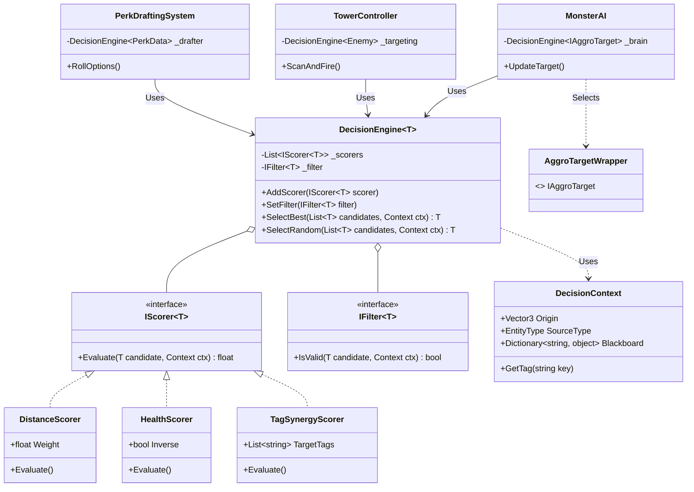
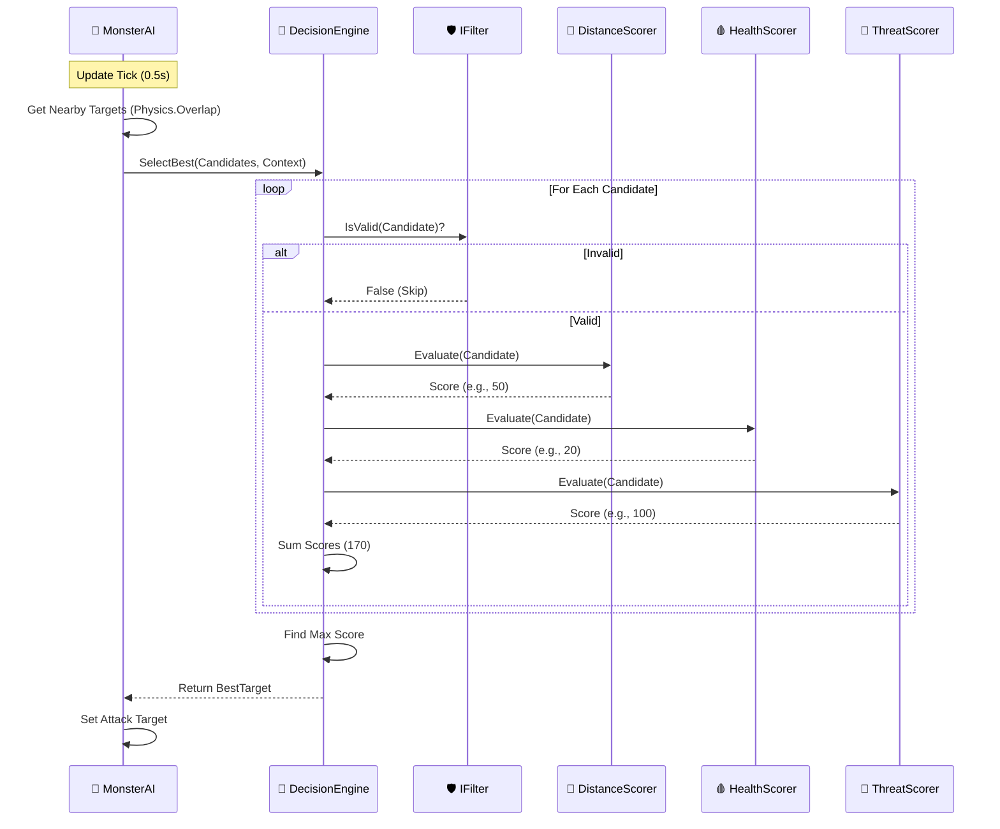
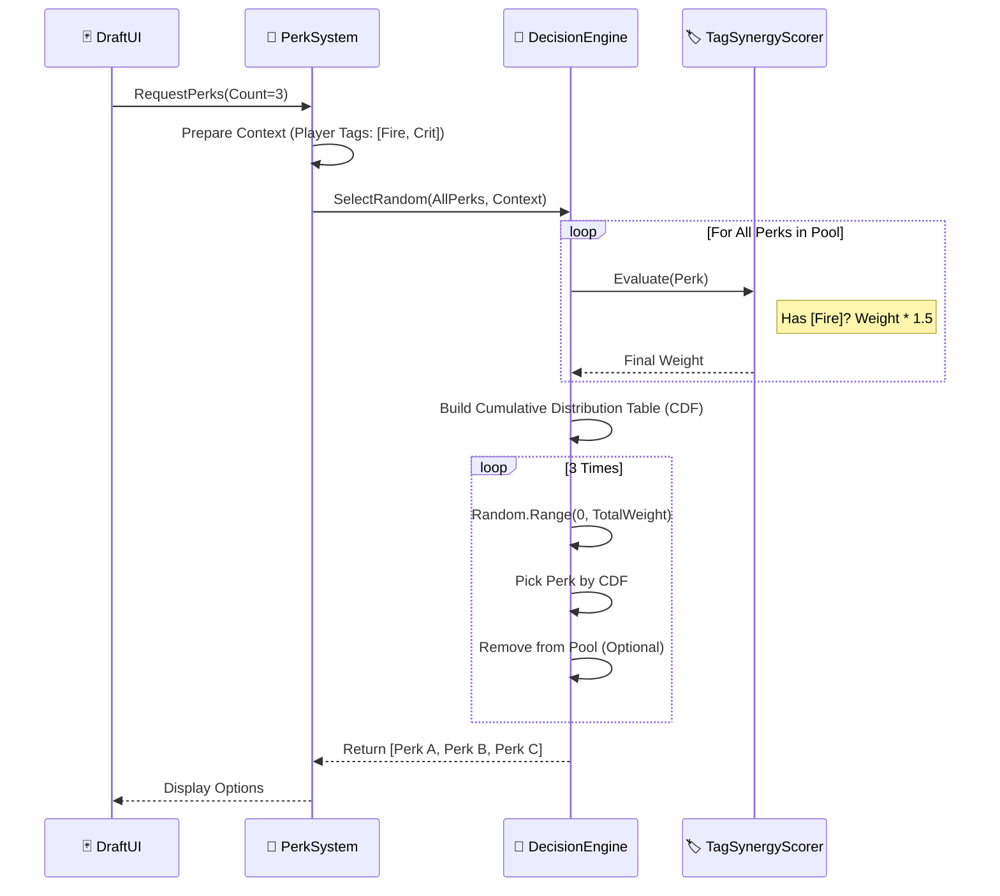

# 🏗️ 通用决策系统架构图 (Unified Decision System Architecture)

本文档作为系统的工程蓝图，详细定义了类结构、接口关系及运行时序。

## 1. 类图结构 (Class Diagram)

该图展示了核心泛型引擎与具体业务系统（仇恨、塔防、Perk）的继承与组合关系。

---

## 2. 运行时序图 (Sequence Diagram)

### 2.1 怪物索敌流程 (AI Select Best)

展示了怪物如何通过多重评分器选出最佳攻击目标。

### 2.2 Perk 抽取流程 (Weighted Random Draft)

展示了如何根据玩家流派权重抽取 Perk。

---

## 3. 数据流设计 (Data Flow Specs)

为了支持通用的 `Context`，我们需要一个灵活的黑板机制。

### 3.1 Context Blackboard 结构
`DecisionContext` 不仅仅是位置信息，它包含了一个 `Dictionary<string, object>` 或强类型的 `Blackboard` 结构，用于传递特定业务参数。

| Key (String) | Type | Description | Used By |
| :--- | :--- | :--- | :--- |
| `"AttackerPos"` | `Vector3` | 发起者的位置 | DistanceScorer |
| `"PlayerHP"` | `float` | 玩家当前血量百分比 | MercyScorer (低血量降低怪物攻击欲望) |
| `"PlayerTags"` | `List<string>` | 玩家拥有的流派标签 | SynergyScorer |
| `"PityCounter"` | `int` | 保底计数器 | RarityScorer |
| `"LastTarget"` | `Entity` | 上一次攻击的目标 | StickinessScorer (粘性评分，防止频繁切换) |

## 4. 优化策略 (Optimization Plan)

在架构层面预留性能优化接口。

1.  **`IJob` 兼容性:** 设计 `IScorer` 时尽量使用 `struct` 和 `NativeArray`，以便未来可以将计算繁重的评分逻辑放入 Unity Job System 并行处理。
2.  **预分配列表 (Pre-allocation):** `DecisionEngine` 内部维护静态或对象池化的 `List<float> scores`，避免在 `SelectBest` 中产生 GC Alloc。
