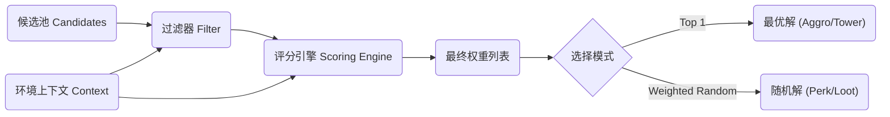

# 🧠 通用加权决策系统 (Unified Weighted Decision System)

本文档旨在抽象 Project Vampirefall 中多个核心系统的底层逻辑，构建一个**通用的、基于上下文的加权选择器 (Context-Aware Weighted Selector)**。

通过统一仇恨 (Aggro)、塔防索敌 (Tower Targeting) 和 肉鸽抽卡 (Perk Drafting) 的决策代码，我们可以减少重复逻辑，提高系统的可维护性和扩展性。

---

## 1. 系统概述 (Overview)

在游戏中，我们经常面临这样的问题：**“从一堆选项中，根据当前情况，选择最合适的一个（或几个）。”**

*   **仇恨系统:** 从一堆怪物中，选出威胁最大的攻击。
*   **塔防索敌:** 从射程内的敌人中，选出价值最高的击杀。
*   **Perk 抽取:** 从几百个强化词条中，选出最适合玩家当前流派的展示。

这三个看似无关的系统，本质上都遵循 **`Input -> Scoring -> Selection`** 的模式。

---

## 2. 核心架构 (Core Architecture)

### 2.1 流程图 (Flowchart)



### 2.2 核心组件 (Components)

1.  **候选人 (Candidate `T`):** 待选择的对象（Enemy, Tower, PerkData）。
2.  **上下文 (Context `C`):** 决策时的环境信息（距离、玩家HP、已拥有的Tags）。
3.  **评分器 (Scorer `IScorer<T, C>`):** 一个独立的逻辑单元，负责计算单项分数。
4.  **选择器 (Selector):** 负责运行所有评分器并汇总结果。

---

## 3. 评分器策略库 (Scorer Strategy Library)

通过组合不同的评分器，我们可以“拼装”出不同的 AI 行为，而无需重写代码。

### 3.1 基础评分器
| 评分器名称 | 逻辑描述 | 适用场景 |
| :--- | :--- | :--- |
| **DistanceScorer** | 距离越近，分数越高 (线性或指数衰减)。 | 仇恨(近战怪)、塔防(近程塔) |
| **HealthScorer** | 生命值越低，分数越高 (斩杀逻辑)。 | 刺客型怪物、收割型防御塔 |
| **TagSynergyScorer** | 拥有相同标签 (Tag) 数量越多，分数越高。 | Perk抽取、战利品生成 |
| **FixedPriorityScorer** | 基于硬编码的优先级 (Boss > Elite > Minion)。 | 塔防(优先打大怪) |
| **MemoryScorer** | 之前互动过 (造成伤害/被选中) 则加分。 | 仇恨(反击逻辑)、连击系统 |

### 3.2 评分公式
标准的归一化评分公式：

$$ FinalScore = \sum (RawScore_i \times Multiplier_i) + FlatBonus $$

*   **Multiplier (乘区):** 用于调整权重（例如：刺客怪的 `HealthScorer` 权重是 5.0，而 `DistanceScorer` 权重是 0.5）。
*   **FlatBonus (加算):** 用于强制覆盖（例如：嘲讽状态直接 +10000 分）。

---

## 4. 实战应用配置 (Configuration Examples)

### Case A: 怪物仇恨 (Aggro System)
*   **目标:** 选一个攻击目标。
*   **选择模式:** `Top 1` (确定性)。
*   **配置:**
    *   `DamageReceivedScorer`: 权重 1.0 (谁打我，我打谁)。
    *   `DistanceScorer`: 权重 2.0 (谁离我近，我打谁)。
    *   `TauntStatusScorer`: 权重 100.0 (嘲讽强制最高)。

### Case B: 狙击塔索敌 (Sniper Tower Targeting)
*   **目标:** 选一个敌人开火。
*   **选择模式:** `Top 1` (确定性)。
*   **配置:**
    *   `DistanceScorer`: 权重 **-1.0** (反向，优先打远的)。
    *   `HealthScorer`: 权重 2.0 (优先打残血，确保击杀)。
    *   `ArmorTypeScorer`: 若目标是重甲，权重 0.5 (打不动)；若轻甲，权重 1.5。

### Case C: 肉鸽 Perk 抽取 (Perk Drafting)
*   **目标:** 选 3 个 Perk 给玩家。
*   **选择模式:** `Weighted Random` (加权随机)。
*   **配置:**
    *   `RarityBaseScorer`: 传说(5) < 史诗(15) < 稀有(30) < 普通(50)。
    *   `TagSynergyScorer`: 玩家若有[Fire]，火系Perk权重 x 1.5。
    *   `BanListFilter`: 若玩家选了[NoMagic]，剔除所有法术Perk。
    *   `PityTimerScorer`: 若连续 10 次没出传说，传说权重 x 10。

---

## 5. 代码实现参考 (C# Implementation)

为了保证性能（避免每帧 GC），建议使用结构体或预分配内存。

```csharp
// 1. 定义评分上下文
public struct DecisionContext {
    public Vector3 Origin; // 决策者位置
    public EntityType SelfType; // 决策者类型
    public List<string> PlayerTags; // 玩家当前的流派标签
    // ... 其他共享数据
}

// 2. 评分器接口
public interface IScorer<T> {
    float Evaluate(T candidate, DecisionContext context);
}

// 3. 具体评分器实现：距离评分
public class DistanceScorer : IScorer<Enemy> {
    private float _weight;
    public DistanceScorer(float weight) { _weight = weight; }

    public float Evaluate(Enemy target, DecisionContext context) {
        float dist = Vector3.Distance(context.Origin, target.Position);
        // 距离越近分越高，使用 1/x 曲线
        return (1f / Mathf.Max(dist, 0.1f)) * _weight; 
    }
}

// 4. 决策引擎
public class DecisionEngine<T> {
    private List<IScorer<T>> _scorers = new List<IScorer<T>>();

    public void AddScorer(IScorer<T> scorer) { _scorers.Add(scorer); }

    // 模式 A: 选最好的 (用于 AI)
    public T SelectBest(List<T> candidates, DecisionContext context) {
        T bestCandidate = default;
        float bestScore = float.MinValue;

        foreach (var candidate in candidates) {
            float currentScore = 0f;
            foreach (var scorer in _scorers) {
                currentScore += scorer.Evaluate(candidate, context);
            }

            if (currentScore > bestScore) {
                bestScore = currentScore;
                bestCandidate = candidate;
            }
        }
        return bestCandidate;
    }
    
    // 模式 B: 加权随机 (用于抽卡)
    public T SelectRandom(List<T> candidates, DecisionContext context) {
        // 实现标准的加权随机算法 (Roulette Wheel Selection)
        // ...
        return default;
    }
}
```

## 6. 性能优化指南 (Optimization)

由于 AI 决策可能每一帧都在跑，必须注意开销。

1.  **分帧计算 (Time-Slicing):** 不要让所有怪物在同一帧跑决策逻辑。将怪物分组，每帧只更新一组。
# 🧠 通用加权决策系统 (Unified Weighted Decision System)

本文档旨在抽象 Project Vampirefall 中多个核心系统的底层逻辑，构建一个**通用的、基于上下文的加权选择器 (Context-Aware Weighted Selector)**。

通过统一仇恨 (Aggro)、塔防索敌 (Tower Targeting) 和 肉鸽抽卡 (Perk Drafting) 的决策代码，我们可以减少重复逻辑，提高系统的可维护性和扩展性。

---

## 1. 系统概述 (Overview)

在游戏中，我们经常面临这样的问题：**“从一堆选项中，根据当前情况，选择最合适的一个（或几个）。”**

*   **仇恨系统:** 从一堆怪物中，选出威胁最大的攻击。
*   **塔防索敌:** 从射程内的敌人中，选出价值最高的击杀。
*   **Perk 抽取:** 从几百个强化词条中，选出最适合玩家当前流派的展示。

这三个看似无关的系统，本质上都遵循 **`Input -> Scoring -> Selection`** 的模式。

---

## 2. 核心架构 (Core Architecture)

### 2.1 流程图 (Flowchart)


### 2.2 核心组件 (Components)

1.  **候选人 (Candidate `T`):** 待选择的对象（Enemy, Tower, PerkData）。
2.  **上下文 (Context `C`):** 决策时的环境信息（距离、玩家HP、已拥有的Tags）。
3.  **评分器 (Scorer `IScorer<T, C>`):** 一个独立的逻辑单元，负责计算单项分数。
4.  **选择器 (Selector):** 负责运行所有评分器并汇总结果。

---

## 3. 评分器策略库 (Scorer Strategy Library)

通过组合不同的评分器，我们可以“拼装”出不同的 AI 行为，而无需重写代码。

### 3.1 基础评分器
| 评分器名称 | 逻辑描述 | 适用场景 |
| :--- | :--- | :--- |
| **DistanceScorer** | 距离越近，分数越高 (线性或指数衰减)。 | 仇恨(近战怪)、塔防(近程塔) |
| **HealthScorer** | 生命值越低，分数越高 (斩杀逻辑)。 | 刺客型怪物、收割型防御塔 |
| **TagSynergyScorer** | 拥有相同标签 (Tag) 数量越多，分数越高。 | Perk抽取、战利品生成 |
| **FixedPriorityScorer** | 基于硬编码的优先级 (Boss > Elite > Minion)。 | 塔防(优先打大怪) |
| **MemoryScorer** | 之前互动过 (造成伤害/被选中) 则加分。 | 仇恨(反击逻辑)、连击系统 |

### 3.2 评分公式
标准的归一化评分公式：

$$ FinalScore = \sum (RawScore_i \times Multiplier_i) + FlatBonus $$

*   **Multiplier (乘区):** 用于调整权重（例如：刺客怪的 `HealthScorer` 权重是 5.0，而 `DistanceScorer` 权重是 0.5）。
*   **FlatBonus (加算):** 用于强制覆盖（例如：嘲讽状态直接 +10000 分）。

---

## 4. 实战应用配置 (Configuration Examples)

### Case A: 怪物仇恨 (Aggro System)
*   **目标:** 选一个攻击目标。
*   **选择模式:** `Top 1` (确定性)。
*   **配置:**
    *   `DamageReceivedScorer`: 权重 1.0 (谁打我，我打谁)。
    *   `DistanceScorer`: 权重 2.0 (谁离我近，我打谁)。
    *   `TauntStatusScorer`: 权重 100.0 (嘲讽强制最高)。

### Case B: 狙击塔索敌 (Sniper Tower Targeting)
*   **目标:** 选一个敌人开火。
*   **选择模式:** `Top 1` (确定性)。
*   **配置:**
    *   `DistanceScorer`: 权重 **-1.0** (反向，优先打远的)。
    *   `HealthScorer`: 权重 2.0 (优先打残血，确保击杀)。
    *   `ArmorTypeScorer`: 若目标是重甲，权重 0.5 (打不动)；若轻甲，权重 1.5。

### Case C: 肉鸽 Perk 抽取 (Perk Drafting)
*   **目标:** 选 3 个 Perk 给玩家。
*   **选择模式:** `Weighted Random` (加权随机)。
*   **配置:**
    *   `RarityBaseScorer`: 传说(5) < 史诗(15) < 稀有(30) < 普通(50)。
    *   `TagSynergyScorer`: 玩家若有[Fire]，火系Perk权重 x 1.5。
    *   `BanListFilter`: 若玩家选了[NoMagic]，剔除所有法术Perk。
    *   `PityTimerScorer`: 若连续 10 次没出传说，传说权重 x 10。

---

## 5. 代码实现参考 (C# Implementation)

为了保证性能（避免每帧 GC），建议使用结构体或预分配内存。

```csharp
// 1. 定义评分上下文
public struct DecisionContext {
    public Vector3 Origin; // 决策者位置
    public EntityType SelfType; // 决策者类型
    public List<string> PlayerTags; // 玩家当前的流派标签
    // ... 其他共享数据
}

// 2. 评分器接口
public interface IScorer<T> {
    float Evaluate(T candidate, DecisionContext context);
}

// 3. 具体评分器实现：距离评分
public class DistanceScorer : IScorer<Enemy> {
    private float _weight;
    public DistanceScorer(float weight) { _weight = weight; }

    public float Evaluate(Enemy target, DecisionContext context) {
        float dist = Vector3.Distance(context.Origin, target.Position);
        // 距离越近分越高，使用 1/x 曲线
        return (1f / Mathf.Max(dist, 0.1f)) * _weight; 
    }
}

// 4. 决策引擎
public class DecisionEngine<T> {
    private List<IScorer<T>> _scorers = new List<IScorer<T>>();

    public void AddScorer(IScorer<T> scorer) { _scorers.Add(scorer); }

    // 模式 A: 选最好的 (用于 AI)
    public T SelectBest(List<T> candidates, DecisionContext context) {
        T bestCandidate = default;
        float bestScore = float.MinValue;

        foreach (var candidate in candidates) {
            float currentScore = 0f;
            foreach (var scorer in _scorers) {
                currentScore += scorer.Evaluate(candidate, context);
            }

            if (currentScore > bestScore) {
                bestScore = currentScore;
                bestCandidate = candidate;
            }
        }
        return bestCandidate;
    }
    
    // 模式 B: 加权随机 (用于抽卡)
    public T SelectRandom(List<T> candidates, DecisionContext context) {
        // 实现标准的加权随机算法 (Roulette Wheel Selection)
        // ...
        return default;
    }
}
```

## 6. 性能优化指南 (Optimization)

由于 AI 决策可能每一帧都在跑，必须注意开销。

1.  **分帧计算 (Time-Slicing):** 不要让所有怪物在同一帧跑决策逻辑。将怪物分组，每帧只更新一组。
2.  **空间划分 (Spatial Partitioning):** 在运行 `DistanceScorer` 之前，先通过四叉树 (QuadTree) 或网格系统获取附近的候选人，避免遍历全图。
3.  **脏标记 (Dirty Flags):** 对于 Perk 系统，只有当玩家获得新 Perk 或进入新房间时才重新计算权重，而不是每帧计算。
4.  **提前退出 (Early Exit):** 在寻找 `SelectBest` 时，如果发现一个“绝对优先”的目标（如嘲讽），直接返回，跳过后续计算。

```

<script type="module">
  import mermaid from 'https://cdn.jsdelivr.net/npm/mermaid@10/dist/mermaid.esm.min.mjs';
  mermaid.initialize({ startOnLoad: false });
  await mermaid.run({
    querySelector: '.language-mermaid',
  });
</script>

<script type="text/javascript" id="MathJax-script" async
  src="https://cdn.jsdelivr.net/npm/mathjax@3/es5/tex-mml-chtml.js">
</script>
<script>
  MathJax = {
    tex: {
      inlineMath: [['$', '$'], ['\\(', '\\)']]
    }
  };
</script>