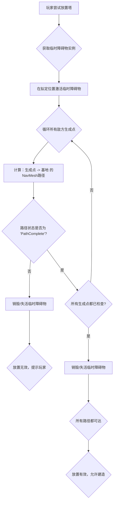

# 🚧 防御塔放置校验逻辑 (Tower Placement Validation Logic)

本文档详细描述了在塔防游戏中，如何利用 Unity 的 `NavMesh` 系统来校验玩家的防御塔放置，防止玩家通过放置塔来**完全堵死敌人路径** (Maze Blocking)。这是一个在设计塔防地图和平衡性时至关重要的机制。

---

## 1. 原理：路径可达性检查 (Path Reachability Check)

当玩家尝试放置一个防御塔时，我们必须验证该塔是否会阻碍所有敌人的生成点到基地的有效路径。如果放置后，有任何一条从生成点到基地的路径被完全切断，则该放置无效。

### 1.1 核心机制
*   **`NavMeshObstacle` 组件:** 塔防塔作为动态障碍物，需要挂载 `NavMeshObstacle` 组件，并启用 `Carve` 属性，让它能在运行时修改 `NavMesh`。
*   **`NavMesh.CalculatePath`:** 这是 Unity 提供的核心 API，用于计算给定起点和终点之间的路径，并返回路径状态 (`NavMeshPathStatus`)。

### 1.2 流程图



---

## 2. 代码实现示例 (Implementation Example)

以下示例展示了一个 `TowerPlacementValidator` 类，用于在玩家尝试放置塔时进行路径可达性检查。

```csharp
using UnityEngine;
using UnityEngine.AI;
using System.Collections.Generic;

namespace Vampirefall.Game
{
    /// <summary>
    /// 负责校验防御塔放置的有效性，防止堵路
    /// </summary>
    public class TowerPlacementValidator : MonoBehaviour
    {
        [Header("配置")]
        [SerializeField] private NavMeshObstacle _towerObstaclePrefab; // 需要预先配置一个带有NavMeshObstacle的预制体
        [SerializeField] private List<Transform> _enemySpawnPoints;    // 所有敌人的生成点
        [SerializeField] private Transform _nexusLocation;             // 玩家基地（敌人目标）
        [SerializeField] private float _navMeshUpdateDelay = 0.2f;     // NavMeshObstacle生效所需的延迟

        private NavMeshObstacle _tempObstacleInstance;
        private NavMeshPath _tempPath; // 重复利用NavMeshPath对象避免GC

        void Awake()
        {
            _tempPath = new NavMeshPath();
            // 实例化一个临时的NavMeshObstacle，并使其失活。
            // 这样可以在需要时激活它，而不是每次都Instantiate/Destroy。
            _tempObstacleInstance = Instantiate(_towerObstaclePrefab, Vector3.zero, Quaternion.identity);
            _tempObstacleInstance.enabled = false;
            _tempObstacleInstance.gameObject.SetActive(false);
        }

        /// <summary>
        /// 校验在指定位置放置塔是否会阻断敌人路径
        /// </summary>
        /// <param name="proposedPosition">玩家希望放置塔的位置</param>
        /// <returns>如果放置有效（不会堵路），则返回 true；否则返回 false。</returns>
        public bool ValidatePlacement(Vector3 proposedPosition)
        {
            if (_towerObstaclePrefab == null || _enemySpawnPoints == null || _enemySpawnPoints.Count == 0 || _nexusLocation == null)
            {
                Debug.LogError("TowerPlacementValidator 配置不完整。");
                return false;
            }

            // 1. 激活并移动临时障碍物到拟定位置
            _tempObstacleInstance.transform.position = proposedPosition;
            _tempObstacleInstance.gameObject.SetActive(true);
            _tempObstacleInstance.enabled = true; // 激活NavMeshObstacle组件

            // 2. 等待NavMesh更新
            // NavMeshObstacle的Carve操作并不是立即生效的，需要等待NavMesh完成异步更新
            // 在实际游戏中，这里可能需要等待一帧或更多时间，或者使用协程
            // 为了演示，我们假设这是一个同步操作（在编辑器中可能需要Manual Update）
            // 在运行时，通常需要一个协程或者延迟执行
            // yield return new WaitForSeconds(_navMeshUpdateDelay); // 实际游戏代码需要协程等待

            // 3. 检查所有生成点到基地的路径
            bool allPathsComplete = true;
            foreach (Transform spawnPoint in _enemySpawnPoints)
            {
                if (NavMesh.CalculatePath(spawnPoint.position, _nexusLocation.position, NavMesh.AllAreas, _tempPath))
                {
                    if (_tempPath.status != NavMeshPathStatus.PathComplete)
                    {
                        allPathsComplete = false;
                        Debug.LogWarning($"放置在此处会阻断从 {spawnPoint.name} 到 Nexus 的路径！");
                        break; // 发现一条阻断路径即可停止检查
                    }
                }
                else
                {
                    // CalculatePath 返回 false 通常表示起点或终点不在NavMesh上
                    Debug.LogError($"NavMesh.CalculatePath 失败：起点 {spawnPoint.position} 或终点 {_nexusLocation.position} 不在NavMesh上。");
                    allPathsComplete = false;
                    break;
                }
            }

            // 4. 禁用临时障碍物
            _tempObstacleInstance.enabled = false;
            _tempObstacleInstance.gameObject.SetActive(false);

            return allPathsComplete;
        }

        void OnDestroy()
        {
            if (_tempObstacleInstance != null)
            {
                Destroy(_tempObstacleInstance.gameObject);
            }
        }
    }
}
```

---

## 3. 集成到放置逻辑 (Integration with Placement Logic)

当玩家拖动一个塔的预览模型时，可以在 `Update()` 或 `LateUpdate()` 中实时调用 `ValidatePlacement`。

```csharp
using UnityEngine;

namespace Vampirefall.Game
{
    public class PlayerTowerPlacement : MonoBehaviour
    {
        [SerializeField] private TowerPlacementValidator _validator;
        [SerializeField] private GameObject _towerPreviewPrefab; // 塔的预览模型

        private GameObject _currentPreview;

        void Start()
        {
            _currentPreview = Instantiate(_towerPreviewPrefab);
            _currentPreview.SetActive(false); // 默认隐藏
        }

        void Update()
        {
            // 假设鼠标指向地面作为放置点
            Vector3 mouseWorldPos = GetMouseWorldPosition(); // 实际应 Raycast 到地面

            _currentPreview.transform.position = mouseWorldPos;
            _currentPreview.SetActive(true);

            // 实时校验放置有效性
            if (_validator.ValidatePlacement(mouseWorldPos))
            {
                // 放置有效：预览模型显示绿色或可放置状态
                _currentPreview.GetComponent<Renderer>().material.color = Color.green;
                if (Input.GetMouseButtonDown(0)) // 鼠标左键点击放置
                {
                    PlaceTower(mouseWorldPos);
                }
            }
            else
            {
                // 放置无效：预览模型显示红色或不可放置状态
                _currentPreview.GetComponent<Renderer>().material.color = Color.red;
            }

            if (Input.GetMouseButtonDown(1)) // 鼠标右键取消
            {
                _currentPreview.SetActive(false);
            }
        }

        private Vector3 GetMouseWorldPosition()
        {
            // 简化的鼠标位置获取，实际应 Raycast 到地面并处理高低差
            Ray ray = Camera.main.ScreenPointToRay(Input.mousePosition);
            if (Physics.Raycast(ray, out RaycastHit hit, 100f, LayerMask.GetMask("Ground")))
            {
                return hit.point;
            }
            return Vector3.zero; // Fallback
        }

        private void PlaceTower(Vector3 position)
        {
            Debug.Log($"Tower placed at: {position}");
            // 实际放置塔的逻辑
            Instantiate(_validator._towerObstaclePrefab, position, Quaternion.identity); // 使用预制体直接实例化
            _currentPreview.SetActive(false); // 隐藏预览
            // ... 其他建造逻辑 ...
        }
    }
}
```
