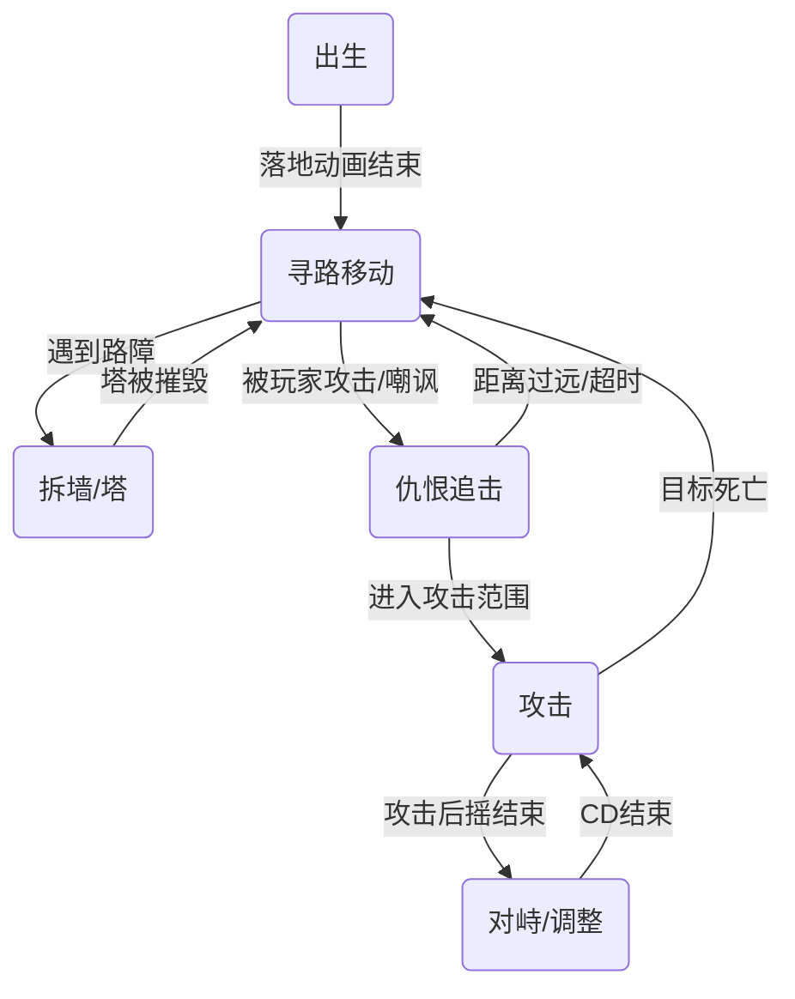
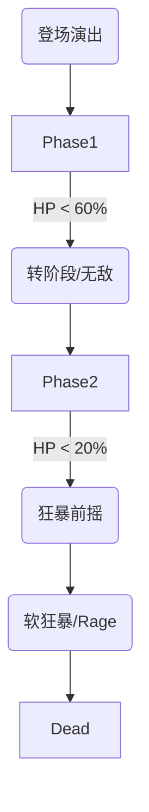
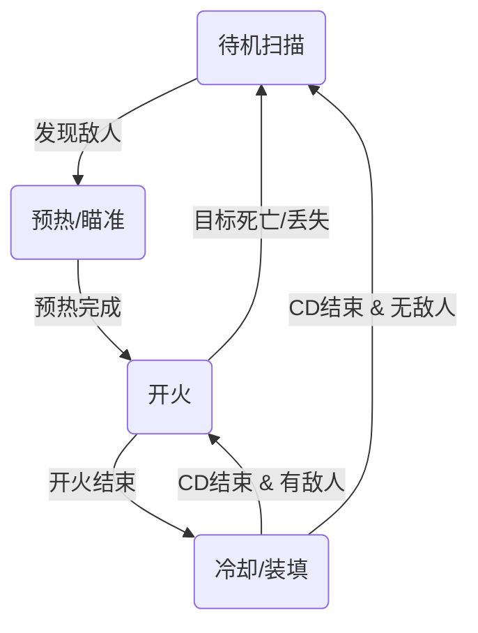

# 🤖 有限状态机 (FSM) 设计与实战指南

**文档目标：** 详解 Vampirefall 中 AI 行为的核心驱动逻辑。
**适用对象：** 怪物 AI、防御塔逻辑、Boss 阶段转换。

---

## 1. 🧠 FSM 核心概念 (The Basics)

有限状态机由三个要素组成：
1.  **状态 (State):** 角色当前在做什么？ (e.g., `Idle`, `Chase`, `Attack`)
2.  **转换 (Transition):** 什么条件下切换到另一个状态？ (e.g., `Distance < 5m` -> 切换到 `Attack`)
3.  **行为 (Action):** 进入/退出/保持该状态时做什么？ (e.g., `OnEnter`: 播放吼叫动画)

---

## 2. 👹 怪物 AI 状态机 (Monster FSM)

混合品类游戏的怪物 AI 比传统塔防更复杂，因为它需要处理“仇恨切换”。

### 2.1 状态流转图 (State Graph)



### 2.2 关键状态详解

#### A. `State_Move` (寻路移动)
*   **目标：** 沿着 FlowField (流场) 或 NavMesh 走向基地。
*   **特殊逻辑：** **无视玩家**。这是塔防怪物的特征，它们眼里只有基地。除非被“嘲讽”或受到高额伤害。
*   **代码逻辑：** 每 0.5秒 检测一次前方是否有 `Obstacle` (塔/墙)。如果有，切换到 `State_Breach`。

#### B. `State_Breach` (拆墙)
*   **场景：** 怪物被塔挡住了去路，或者这是个专门拆塔的“工兵怪”。
*   **逻辑：** 锁定面前的塔，播放攻击动画。
*   **退出条件：**
    1.  塔炸了 -> 切回 `Move`。
    2.  玩家过来打了它一下 -> 切到 `Aggro`。

#### C. `State_Aggro` (仇恨/追击)
*   **场景：** ARPG 元素的核心。
*   **逻辑：** 暂时放弃基地，追着玩家（或嘲讽图腾）打。
*   **Leash (狗链) 机制：** 为了防止玩家把怪风筝到地图边缘，必须设置一个 `MaxAggroDistance` (比如 15米) 或 `MaxAggroTime` (比如 5秒)。超过限制强制切回 `Move`，并且 3秒内免疫仇恨。

### 2.3 📁 普通怪物实战案例 (Minion Examples)

结合游戏特色，我们定义两种极端的怪物 AI 模板。

#### 案例 A: 骷髅工兵 (Skeleton Sapper) - *绝对攻城型*
*   **定位:** 玩家的噩梦，必须优先处理。
*   **FSM 特异点:**
    *   **无 Aggro 状态:** 它的状态机里**删除了** `Aggro` 状态。
    *   **逻辑:** 即使玩家拿刀砍它的头，它也绝对不回头，一心一意往基地走。
    *   **被动:** 当 `HP < 30%` 时，切换到 `Sprint` (冲刺) 状态，移速翻倍。

#### 案例 B: 幽灵刺客 (Ghost Assassin) - *风筝/切后排型*
*   **定位:** 骚扰玩家，迫使玩家走位。
*   **FSM 特异点:**
    *   **新增 `Flee` (逃离) 状态:**
        *   当 `DistanceToPlayer < 3m` (被近身) 时，触发逃离。
        *   逻辑: 向 `(SelfPos - PlayerPos)` 方向移动 2秒。
    *   **新增 `Stealth` (隐身) 状态:**
        *   逃离结束后，进入隐身（不可被塔锁定），尝试绕后。

---

## 3. 👑 Boss 战斗状态机 (Boss FSM)

Boss 不仅仅是血厚的怪，它是一个**带有剧本的流程**。我们需要引入 **"Phase System" (阶段系统)**。

### 3.1 阶段转换流转图

Boss 的 FSM 是分层的：上层管理阶段，下层管理具体行为。



### 3.2 实战案例：鲜血领主 (Vampire Lord)

#### **Phase 1: 优雅剑术 (100% - 60% HP)**
*   **行为模式:** 类似于强力精英怪。
*   **状态池:**
    *   `Slash`: 前方扇形斩击。
    *   `Thrust`: 针对仇恨目标的快速突刺。
    *   `SummonBats`: 召唤 2 只小蝙蝠骚扰。
*   **转换条件:** `HP < 60%` -> 触发 `State_Vanish` (消失)。

#### **Transition 1: 鲜血盛宴 (机制检测)**
*   **行为:**
    *   Boss 变为不可选中，瞬移到大厅中央悬空。
    *   场地四周生成 4 个 **[血茧]**。
    *   血茧会缓慢向 Boss 移动，如果碰到 Boss，每吃一个回血 10%。
*   **玩家目标:** 在血茧碰到 Boss 前打爆它们。
*   **结束:** 所有血茧被毁或被吃 -> 进入 Phase 2。

#### **Phase 2: 魔法轰炸 (60% - 20% HP)**
*   **行为模式:** 站桩法师，高频 AOE。
*   **状态池:**
    *   `BloodRain`: 地面随机生成红圈，2秒后爆炸。
    *   `LaserSweep`: 旋转激光扫射全场，玩家必须跟着转或用无敌帧穿过。
*   **转换条件:** `HP < 20%` -> 触发 `State_Enrage` (吼叫动画)。

#### **Phase 3: 困兽之斗 (20% - 0% HP)**
*   **行为模式:** 疯狗模式 (DPS Check)。
*   **状态:**
    *   移速 +100%，攻速 +50%。
    *   不再释放远程技能，单纯地追着玩家平 A。
    *   **软狂暴:** 每过 10秒，攻击力叠加 10%。强迫玩家尽快击杀。

---

## 4. 🗼 防御塔状态机 (Tower FSM)

塔的逻辑相对简单，重点在于“索敌效率”和“状态重置”。

### 3.1 状态流转图



### 3.2 关键状态详解

#### A. `State_Idle` (待机扫描)
*   **性能优化：** 不要每帧 `Update` 里都去 `Physics.OverlapSphere`。
*   **最佳实践：** 使用 **协程** 或 **Timer**，每 0.1秒 - 0.2秒 扫描一次。或者让怪物进入射程时主动触发塔的 Trigger。

#### B. `State_Warmup` (预热/瞄准)
*   **场景：** 激光塔需要蓄力，或者炮塔需要旋转炮口对准目标。
*   **逻辑：**
    *   `TurretHead.LookAt(Target)`。
    *   如果是激光塔，播放“嗡嗡嗡”的音效和光效。
    *   如果目标跑出了射程，切回 `Idle` (浪费了蓄力)。

#### C. `State_Fire` (开火)
*   **逻辑：**
    *   生成子弹 (从对象池)。
    *   播放后坐力动画。
    *   **瞬间切入** `State_Cooldown`。不要停留在 Fire 状态。

---

## 4. 💻 代码实战：轻量级 FSM 框架 (No-GC)

不要用复杂的类继承 (Class-based States) 来做成千上万的小怪，那样内存开销太大。
推荐使用 **Enum + Switch** (简单怪) 或 **Struct-based FSM** (复杂怪)。

### 4.1 方案 A: 极简版 (适合小怪/塔)

```csharp
public enum EState { Idle, Move, Attack, Dead }

public class SimpleMonster : MonoBehaviour {
    private EState _currentState;
    private float _stateTimer;

    void Update() {
        // 状态机驱动
        switch (_currentState) {
            case EState.Move: UpdateMove(); break;
            case EState.Attack: UpdateAttack(); break;
        }
    }

    void ChangeState(EState newState) {
        OnExit(_currentState);
        _currentState = newState;
        _stateTimer = 0;
        OnEnter(newState);
    }
    
    // ... 具体逻辑写在函数里
}
```

### 4.2 方案 B: 结构化版 (适合 Boss/玩家)

如果你嫌 Switch 太乱，可以用轻量级的类封装，但要避免每帧 `new`。

```csharp
// 1. 定义状态基类
public abstract class BaseState {
    protected BossController _boss;
    public BaseState(BossController boss) { _boss = boss; }
    public abstract void OnEnter();
    public abstract void OnUpdate();
    public abstract void OnExit();
}

// 2. 状态机控制器
public class StateMachine {
    private BaseState _current;
    
    public void ChangeState(BaseState newState) {
        _current?.OnExit();
        _current = newState;
        _current?.OnEnter();
    }
    
    public void Update() {
        _current?.OnUpdate();
    }
}

// 3. 具体状态实现
public class BossChaseState : BaseState {
    public override void OnUpdate() {
        if (_boss.DistanceToPlayer < 2.0f) {
            _boss.FSM.ChangeState(_boss.StateAttack); // 预先创建好的实例，不要 new!
        }
    }
}
```

---

## 5. 🎓 实用建议与坑

### 5.1 🚫 避免 "Ping-Pong" (状态乒乓)
*   **现象：** 怪物在 `Move` 和 `Attack` 之间疯狂切换，每帧切一次，导致动画鬼畜。
*   **原因：** 攻击距离判定太死。进入 5.0m 攻击，退出 5.0m 移动。
*   **解法：** **迟滞 (Hysteresis)**。
    *   进入攻击状态阈值：`Distance < 5.0m`
    *   退出攻击状态阈值：`Distance > 6.0m`
    *   留出 1.0m 的缓冲区。

### 5.2 🌍 全局状态 (Global State)
*   有些状态是凌驾于 FSM 之上的，比如 **CC (控制)**。
*   不要把 `Stunned` (眩晕) 做成一个普通状态。
*   **做法：** `Stunned` 是一个 **Bool 标记**。在 `Update()` 的最开头检查：
    ```csharp
    void Update() {
        if (isStunned) return; // 如果被晕，状态机完全停转
        FSM.Update();
    }
    ```

### 5.3 🎞️ 动画状态机 (Animator) vs 逻辑状态机 (Logic FSM)
*   **原则：** **Logic FSM 驱动 Animator，绝反之。**
*   **错误：** 在 Animator 的 `OnStateExit` 里写代码改逻辑变量。这会导致逻辑很难调试。
*   **正确：** 代码里 `ChangeState(Attack)` -> 调用 `animator.SetTrigger("Attack")`。
