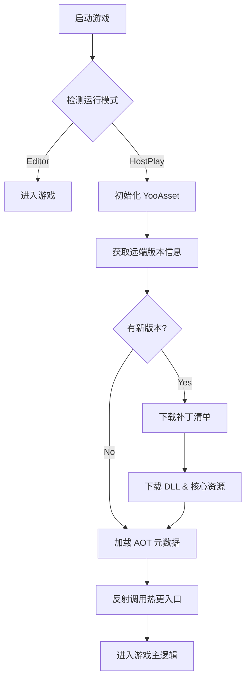

# 🔄 热更新与资源管理 (Hot Update & Resource Management)

> **技术栈**: **YooAsset** (资源管理) + **HybridCLR** (代码热更)
>
> 本文档详述了 Project Vampirefall 的热更新管线。我们采用这一组合以实现 Android/iOS 平台的 **全量热更能力**，绕过应用商店审核进行快速迭代。

## 1. 📦 资源管理: YooAsset

我们选择 YooAsset 替代 Addressables，因为它提供了更符合国内开发习惯的分包策略、加密机制和版本管理。

### 1.1 资源包规划 (Package Design)
我们将资源分为以下几个 Package，以优化下载和内存：

*   **DefaultPackage (核心包)**:
    *   **内容**: 启动场景、Loading 界面、通用 UI 图集、核心配置表 (Luban 二进制)、Shader 变体集。
    *   **加载方式**: `EBundleLoadingMode.LoadBundle`。
    *   **更新策略**: 必须下载完成后才能进入游戏。
*   **LevelPackage (关卡包)**:
    *   **内容**: 战斗场景、怪物模型、特效、音效。
    *   **标签**: 按章节打 Tag (e.g., `Chapter1`, `Chapter2`)。
    *   **更新策略**: **边玩边下 (Play-as-you-go)**。进入章节前检查并下载。
*   **RawFilePackage (原生文件包)**:
    *   **内容**: 视频 (MP4)、Wwise 音频库 (BNK/PCK)、HybridCLR 的 DLL 文件。
    *   **特点**: 不进行压缩和加密，直接以原始文件形式构建，方便流式读取。

### 1.2 构建管线 (Build Pipeline)
1.  **资源收集**: 通过 `AssetBundleCollector` 自动扫描 `Assets/Art` 和 `Assets/Res` 下的目录。
2.  **加密**: 对 `DefaultPackage` 中的敏感数据 (如配置表) 应用 `Offset` 偏移加密。
3.  **版本号**: 采用 `v1.0.build_timestamp` 格式。

### 1.3 运行模式
*   **EditorSimulateMode**: 编辑器下直接读取 Assets 目录，无需构建 AB，开发效率最高。
*   **OfflinePlayMode**: 单机模式，读取 StreamingAssets，用于包体测试。
*   **HostPlayMode**: 联机模式，对比 CDN 版本清单，下载差异文件。

## 2. 🔥 代码热更: HybridCLR (huatuo)

HybridCLR 使得 Unity 的 IL2CPP 后端也能加载动态 DLL，实现了 C# 的全热更。

### 2.1 架构划分
*   **AOT 程序集 (不可热更)**:
    *   `mscorlib`, `System`, `UnityEngine`, `YooAsset`, `UniTask`.
    *   这些库编译进主包 (APK/IPA)，变动需要重新发包。
*   **热更程序集 (HotUpdate DLLs)**:
    *   `Assembly-CSharp.dll` (游戏核心逻辑).
    *   `Game.Logic.dll`, `Game.UI.dll`.
    *   这些库编译成 DLL 后，作为 **RawFile** 放入 YooAsset 更新。

### 2.2 补充元数据 (Metadata)
为了让 AOT 代码能调用热更代码中的泛型函数，需要加载 AOT DLL 的元数据。
*   **配置**: 在 `HybridCLRSettings` 中列出所有用到的 AOT DLL。
*   **加载**: 游戏启动最早期 (Splash Screen 后)，先通过 YooAsset 下载最新的 AOT 元数据 DLL，调用 `HybridCLR.RuntimeApi.LoadMetadataForAOTAssembly`。

### 2.3 工作流 (Workflow)
1.  **Compile**: 菜单栏 `HybridCLR/CompileDll` (生成热更 DLL)。
2.  **Copy**: 自动脚本将生成的 DLL 复制到 YooAsset 的 `RawFile` 收集目录。
3.  **Build**: 运行 YooAsset 构建资源包。
4.  **Upload**: 将构建结果上传至 CDN。

## 3. 🚀 启动流程 (Boot Sequence)

## 4. ❓ 常见问题与对策

*   **泛型共享问题**: 如果热更代码中使用了 AOT 中未实例化的泛型，会报错。
    *   *解法*: 使用 `HybridCLR` 的补充元数据机制，或者在 AOT 代码中预留常用泛型实例。
*   **资源同步**: 代码更新了，但资源没更新 (或反之)。
    *   *解法*: CI/CD 流程强制绑定。每次构建 DLL 必须同时触发资源版本号递增，确保 `GameVersion` 一致。
*   **防裁剪**: Unity Strip Engine Code 可能把热更用到的引擎代码裁剪掉。
    *   *解法*: 在 `link.xml` 中保留必要的命名空间。

