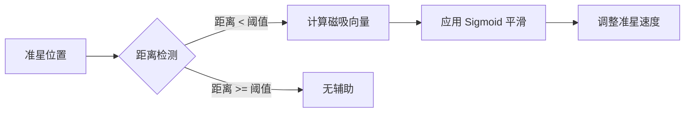
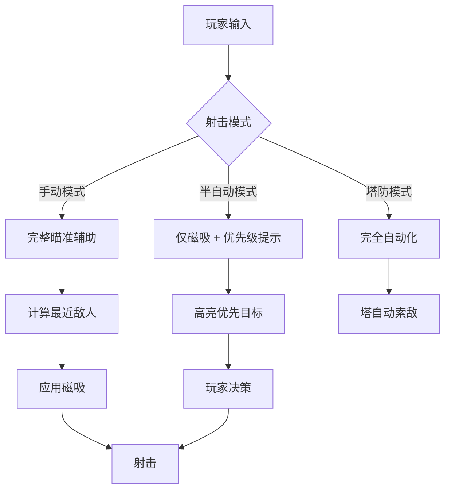

# 🎯 瞄准辅助系统 (Aim Assist System) 深度研究

> **研究归属**: Project Vampirefall - Tech/Mechanics  
> **创建日期**: 2025-12-04  
> **优先级**: ⭐⭐⭐⭐ (中高)

---

## 📑 目录

1.  [理论基础 (Theoretical Basis)](#-1-理论基础-theoretical-basis)
2.  [实践应用 (Practical Implementation)](#️-2-实践应用-practical-implementation)
3.  [业界优秀案例 (Industry Best Practices)](#-3-业界优秀案例-industry-best-practices)
4.  [参考资料 (References)](#-4-参考资料-references)

---

## 📚 1. 理论基础 (Theoretical Basis)

### 1.1 核心定义

**瞄准辅助系统 (Aim Assist)** 是一种游戏系统，用于在玩家瞄准时提供一定程度的自动化帮助，以降低操作难度、提升打击感和游戏体验。它在**主机游戏**和**移动游戏**中尤为重要，因为手柄和触屏的精度天然低于鼠标键盘。

核心功能包括：
- **磁吸 (Sticky Targeting)**: 准星在经过目标时"粘住"目标
- **自动旋转 (Auto-Rotation)**: 自动调整准星朝向目标
- **子弹磁吸 (Bullet Magnetism)**: 子弹飞行路径轻微弯曲以击中目标
- **锁定系统 (Target Locking)**: 完全锁定目标后自动跟踪

### 1.2 数学模型

#### 🎯 磁吸范围计算

```
MagnetismRadius = BaseRadius * (1 + RangeFactor * (1 - NormalizedDistance))

其中:
- BaseRadius: 基础磁吸半径（屏幕空间像素）
- RangeFactor: 距离衰减系数（0-1）
- NormalizedDistance: 归一化距离（0 = 近距离, 1 = 最大射程）
```

**示例**：
- 近距离（5米）: `Radius = 100 * (1 + 0.5 * (1 - 0.2)) = 140px`
- 远距离（50米）: `Radius = 100 * (1 + 0.5 * (1 - 1.0)) = 100px`

#### 🧲 磁吸强度曲线

使用 **Sigmoid 函数**平滑过渡：

```
AttractStrength = MaxStrength / (1 + e^(-k * (Distance - Threshold)))

参数说明:
- MaxStrength: 最大拉力系数（0-1）
- k: 曲线陡峭度（越大越陡）
- Distance: 准星与目标中心距离
- Threshold: 触发瞄准辅助的阈值
```



<script type="module">
  import mermaid from 'https://cdn.jsdelivr.net/npm/mermaid@10/dist/mermaid.esm.min.mjs';
  mermaid.initialize({ startOnLoad: false });
  await mermaid.run({
    querySelector: '.language-mermaid',
  });
</script>

### 1.3 设计心理学

#### 💡 "Fair Assist" 原则

瞄准辅助的设计必须平衡以下三要素：

1.  **Accessibility (可达性)**: 让新手也能体验"命中即爽快"
2.  **Skill Expression (技术表达)**: 不能完全剥夺玩家操作空间
3.  **Perception (感知)**: 玩家不应明显感觉到"被系统控制"

> [!IMPORTANT]
> 好的瞄准辅助应该让玩家觉得"自己打得很准"，而不是"系统在帮我瞄准"。这是一种**心理学欺骗 (Perceptual Deception)**。

#### 🎮 输入延迟与补偿

- **手柄输入延迟**: 通常为 50-100ms（摇杆模拟信号 + 系统处理）
- **触屏延迟**: 通常为 80-150ms（电容屏响应 + 手指面积）
- **鼠标延迟**: 通常为 10-30ms（光学传感器 + USB 轮询）

瞄准辅助可以通过**预测性补偿 (Predictive Compensation)** 缓解这一问题：

```csharp
// 预测目标未来位置
Vector3 predictedPos = target.position + target.velocity * inputLatency;
Vector3 aimDirection = (predictedPos - player.position).normalized;
```

---

## 🛠️ 2. 实践应用 (Practical Implementation)

### 2.1 Vampirefall 适配设计

#### 🎯 双层瞄准机制

Vampirefall 的特殊性在于**塔防自动索敌 + 玩家手动射击**的混合模式：



<script type="module">
  import mermaid from 'https://cdn.jsdelivr.net/npm/mermaid@10/dist/mermaid.esm.min.mjs';
  mermaid.initialize({ startOnLoad: false });
  await mermaid.run({
    querySelector: '.language-mermaid',
  });
</script>

#### 📊 难度分级辅助表

| 难度等级  | 磁吸半径 | 子弹磁吸 | 自动旋转 | 锁定持续时间 |
|-----------|----------|----------|----------|--------------|
| 简单      | 150px    | 强 (20°) | 弱 (10%) | 1.5s         |
| 普通      | 100px    | 中 (10°) | 无       | 1.0s         |
| 困难      | 60px     | 弱 (5°)  | 无       | 0.5s         |
| 专家      | 30px     | 无       | 无       | 0.2s         |

### 2.2 数据结构设计

```csharp
[System.Serializable]
public class AimAssistConfig
{
    [Header("磁吸参数")]
    [Tooltip("基础磁吸半径（屏幕空间）")]
    [Range(0, 200)]
    public float baseMagnetismRadius = 100f;
    
    [Tooltip("距离衰减系数")]
    [Range(0, 1)]
    public float rangeFalloff = 0.5f;
    
    [Header("强度控制")]
    [Tooltip("最大拉力系数")]
    [Range(0, 1)]
    public float maxAttractionStrength = 0.7f;
    
    [Tooltip("Sigmoid 曲线陡峭度")]
    [Range(1, 10)]
    public float sigmoidSteepness = 5f;
    
    [Header("输入补偿")]
    [Tooltip("预测延迟时间（秒）")]
    [Range(0, 0.2f)]
    public float predictionLatency = 0.08f;
    
    [Header("子弹磁吸")]
    [Tooltip("子弹偏转最大角度")]
    [Range(0, 30)]
    public float bulletMagnetismAngle = 10f;
    
    [Header("难度系数")]
    [Tooltip("当前难度等级 (1-4)")]
    [Range(1, 4)]
    public int difficultyLevel = 2;
}
```

### 2.3 核心算法实现

#### 🎯 磁吸目标选择

```csharp
public class AimAssistController : MonoBehaviour
{
    public AimAssistConfig config;
    private Camera mainCam;
    
    void Start()
    {
        mainCam = Camera.main;
    }
    
    /// <summary>
    /// 获取最佳磁吸目标
    /// </summary>
    public Transform GetBestTarget(Vector3 aimPoint, LayerMask targetLayer)
    {
        Collider[] targets = Physics.OverlapSphere(
            transform.position, 
            50f, // 最大检测距离
            targetLayer
        );
        
        Transform bestTarget = null;
        float minScore = float.MaxValue;
        
        foreach (var target in targets)
        {
            // 计算屏幕空间距离
            Vector2 screenPos = mainCam.WorldToScreenPoint(target.transform.position);
            Vector2 aimScreenPos = mainCam.WorldToScreenPoint(aimPoint);
            float screenDist = Vector2.Distance(screenPos, aimScreenPos);
            
            // 计算世界空间距离
            float worldDist = Vector3.Distance(transform.position, target.transform.position);
            
            // 动态磁吸半径（距离越远半径越小）
            float radius = CalculateMagnetismRadius(worldDist);
            
            // 不在磁吸范围内则跳过
            if (screenDist > radius) continue;
            
            // 评分：屏幕距离 + 优先级权重
            float priority = GetTargetPriority(target);
            float score = screenDist / radius + (1f - priority) * 100f;
            
            if (score < minScore)
            {
                minScore = score;
                bestTarget = target.transform;
            }
        }
        
        return bestTarget;
    }
    
    /// <summary>
    /// 计算动态磁吸半径
    /// </summary>
    float CalculateMagnetismRadius(float worldDistance)
    {
        float normalizedDist = Mathf.Clamp01(worldDistance / 50f); // 假设最大射程 50m
        return config.baseMagnetismRadius * (1 + config.rangeFalloff * (1 - normalizedDist));
    }
    
    /// <summary>
    /// 获取目标优先级（Boss > 精英 > 普通小怪）
    /// </summary>
    float GetTargetPriority(Collider target)
    {
        var enemy = target.GetComponent<EnemyController>();
        if (enemy == null) return 0.3f;
        
        return enemy.type switch
        {
            EnemyType.Boss => 1.0f,
            EnemyType.Elite => 0.7f,
            EnemyType.Normal => 0.5f,
            _ => 0.3f
        };
    }
}
```

#### 🧲 应用磁吸力

```csharp
/// <summary>
/// 应用磁吸到准星移动
/// </summary>
public Vector2 ApplyMagnetism(Vector2 rawInput, Transform target)
{
    if (target == null) return rawInput;
    
    // 计算目标在屏幕空间的方向
    Vector2 targetScreenPos = mainCam.WorldToScreenPoint(target.position);
    Vector2 currentCrosshair = new Vector2(Screen.width / 2, Screen.height / 2);
    Vector2 toTarget = (targetScreenPos - currentCrosshair).normalized;
    
    // 计算距离
    float distance = Vector2.Distance(targetScreenPos, currentCrosshair);
    
    // Sigmoid 强度计算
    float strength = CalculateSigmoidStrength(distance);
    
    // 混合原始输入和磁吸向量
    Vector2 assistedInput = Vector2.Lerp(rawInput, toTarget, strength * config.maxAttractionStrength);
    
    return assistedInput;
}

/// <summary>
/// Sigmoid 强度曲线
/// </summary>
float CalculateSigmoidStrength(float distance)
{
    float threshold = config.baseMagnetismRadius * 0.5f; // 磁吸半径的一半为中心点
    float x = config.sigmoidSteepness * (distance - threshold) / threshold;
    return 1f / (1f + Mathf.Exp(x)); // 距离越近，强度越大
}
```

#### 🎯 子弹磁吸系统

```csharp
public class BulletMagnetism : MonoBehaviour
{
    public float magnetismAngle = 10f; // 最大偏转角度
    public LayerMask targetLayer;
    
    void FixedUpdate()
    {
        // 检测前方锥形范围内的敌人
        Collider[] hits = Physics.OverlapSphere(transform.position, 5f, targetLayer);
        
        Transform closestTarget = null;
        float minAngle = magnetismAngle;
        
        foreach (var hit in hits)
        {
            Vector3 toTarget = (hit.transform.position - transform.position).normalized;
            float angle = Vector3.Angle(transform.forward, toTarget);
            
            if (angle < minAngle)
            {
                minAngle = angle;
                closestTarget = hit.transform;
            }
        }
        
        if (closestTarget != null)
        {
            // 平滑转向目标
            Vector3 newDirection = Vector3.RotateTowards(
                transform.forward,
                (closestTarget.position - transform.position).normalized,
                magnetismAngle * Mathf.Deg2Rad * Time.fixedDeltaTime,
                0f
            );
            
            transform.rotation = Quaternion.LookRotation(newDirection);
        }
    }
}
```

### 2.4 移动端特殊优化

#### 📱 触屏死区 (Dead Zone)

```csharp
public class TouchAimController : MonoBehaviour
{
    [Header("触屏死区")]
    public float deadZoneRadius = 30f; // 中心死区半径（像素）
    public AnimationCurve sensitivityCurve; // 灵敏度曲线
    
    Vector2 ProcessTouchInput(Vector2 touchDelta)
    {
        float magnitude = touchDelta.magnitude;
        
        // 死区内忽略输入
        if (magnitude < deadZoneRadius)
            return Vector2.zero;
        
        // 减去死区后重新归一化
        float adjustedMagnitude = (magnitude - deadZoneRadius) / (Screen.width * 0.5f - deadZoneRadius);
        
        // 应用灵敏度曲线
        float sensitivity = sensitivityCurve.Evaluate(adjustedMagnitude);
        
        return touchDelta.normalized * sensitivity;
    }
}
```

#### 🎮 陀螺仪辅助瞄准

```csharp
public class GyroscopeAim : MonoBehaviour
{
    public float gyroSensitivity = 2f;
    private Quaternion gyroInitialRotation;
    
    void Start()
    {
        Input.gyro.enabled = true;
        gyroInitialRotation = Input.gyro.attitude;
    }
    
    void Update()
    {
        if (!Input.gyro.enabled) return;
        
        // 获取陀螺仪相对旋转
        Quaternion gyroRotation = Quaternion.Inverse(gyroInitialRotation) * Input.gyro.attitude;
        
        // 转换为欧拉角（仅使用 Yaw 和 Pitch）
        Vector3 euler = gyroRotation.eulerAngles;
        
        // 应用到相机旋转（微调瞄准）
        transform.Rotate(new Vector3(-euler.x, euler.y, 0) * gyroSensitivity * Time.deltaTime);
    }
}
```

### 2.5 Unity ScriptableObject 配置

```csharp
[CreateAssetMenu(fileName = "AimAssistPreset", menuName = "Vampirefall/Aim Assist Preset")]
public class AimAssistPreset : ScriptableObject
{
    public string presetName = "Default";
    public AimAssistConfig config;
    
    [Header("难度适配表")]
    public AimAssistConfig easyConfig;
    public AimAssistConfig normalConfig;
    public AimAssistConfig hardConfig;
    public AimAssistConfig expertConfig;
    
    public AimAssistConfig GetConfigForDifficulty(int difficulty)
    {
        return difficulty switch
        {
            1 => easyConfig,
            2 => normalConfig,
            3 => hardConfig,
            4 => expertConfig,
            _ => normalConfig
        };
    }
}
```

---

## 🌟 3. 业界优秀案例 (Industry Best Practices)

### 3.1 Destiny 2 (Bungie)

#### ✅ 优点

1.  **分层辅助系统**
    - **Reticle Friction (准星摩擦)**: 准星在敌人身上时移动速度降低 30%
    - **Bullet Magnetism (子弹磁吸)**: 狙击枪在 5° 范围内自动偏转
    - **Target Acquisition (目标捕获)**: 武器开镜时自动轻微拉向最近敌人

2.  **武器差异化**
    - 手枪和自动步枪：强磁吸（易于瞄准移动目标）
    - 狙击枪：弱磁吸 + 强子弹磁吸（奖励精准瞄准）
    - 火箭筒：锁定系统（完全不同的机制）

3.  **PvE vs PvP 平衡**
    - PvE 模式：强辅助（30% 磁吸强度）
    - PvP 模式：弱辅助（15% 磁吸强度）+ 反作弊检测

#### ❌ 缺点

- **争议性**: 高技术玩家抱怨"手柄玩家在近战中有优势"
- **平台不平等**: PC 鼠标玩家在远距离占优，手柄玩家在近战占优

#### 🎯 借鉴点

- 针对**不同武器类型**设计不同辅助强度
- 在 Vampirefall 中：
  - **霰弹枪**: 强磁吸（散弹武器需要快速反应）
  - **狙击枪**: 仅子弹磁吸（奖励精准）
  - **自动步枪**: 中等磁吸 + 轨迹补偿

---

### 3.2 Fortnite (Epic Games)

#### ✅ 优点

1.  **自适应辅助强度**
    - 系统根据玩家近 10 局的**命中率**动态调整辅助
    - 新手玩家命中率 < 20%：强辅助
    - 熟练玩家命中率 > 40%：弱辅助

2.  **建造模式无辅助**
    - 射击模式：开启辅助
    - 建造模式：完全禁用（避免干扰建造操作）

3.  **移动端特殊优化**
    - **Fire Button Lock (射击锁定)**: 按住射击键时自动跟踪目标
    - **Tap to Fire (点击射击)**: 轻触自动瞄准最近敌人

#### ❌ 缺点

- **过度依赖**: 部分玩家完全依赖自动射击，丧失技术成长空间
- **作弊争议**: "Fire Button Lock" 被质疑为"合法外挂"

#### 🎯 借鉴点

- **自适应难度**非常适合 Vampirefall 的 Roguelike 性质
- 可以在死亡后根据玩家表现调整下一轮的辅助强度
- **建造模式切换**启发：塔防建造模式时禁用瞄准辅助

---

### 3.3 Overwatch 2 (Blizzard)

#### ✅ 优点

1.  **英雄差异化辅助**
    - **麦克雷 (Cassidy)**: 强磁吸（定位为"精准枪手"）
    - **源氏 (Genji)**: 无辅助（高技术上限英雄）
    - **士兵 76**: 中等辅助 + 自瞄大招（新手友好）

2.  **视觉反馈**
    - 准星在辅助生效时变红
    - 击杀回放中显示"瞄准辅助贡献度"

3.  **控制台专用优化**
    - **Dual-Zone (双区域)**: 摇杆推动小幅度时精细瞄准，推满时快速转向
    - **Exponential Ramp (指数加速)**: 摇杆推动越久，灵敏度越高

#### ❌ 缺点

- **角色平衡难度**: 部分英雄因辅助过强被削弱（如安娜的睡针）

#### 🎯 借鉴点

- **视觉反馈**非常重要！让玩家知道辅助在起效
- Vampirefall 可以在准星上显示"锁定指示器"
- 不同**角色/武器**的辅助差异化设计

---

### 3.4 补充案例：Halo Infinite

#### ✨ 独特机制：Red Reticle Range (红准星系统)

- 当敌人在**有效射程内**且**准星接近**时，准星变红
- 红准星触发时：
  - 子弹扩散减少 50%
  - 磁吸强度提升至 1.5 倍
  - 等同于给玩家一个"最佳射击时机"的提示

**启发**：
- 这是一种"教学型辅助"，帮助新手理解"何时射击最有效"
- Vampirefall 可以在**最佳射程区间**显示特殊 UI 提示

---

## 🔗 4. 参考资料 (References)

### 📄 学术论文

1.  **"Aim Assist in First-Person Shooters: A Study of Player Perception"**  
    - 作者: Chen et al., 2019  
    - 链接: [ACM Digital Library](https://dl.acm.org/doi/10.1145/3311350.3347191)  
    - 摘要: 研究发现 70% 的手柄玩家希望有"隐形辅助"，但不希望被明确告知

2.  **"Input Prediction and Compensation in Network Games"**  
    - 作者: Bernier, Y. (Valve Software)  
    - 链接: [Valve Developer Community](https://developer.valvesoftware.com/wiki/Latency_Compensating_Methods_in_Client/Server_In-game_Protocol_Design_and_Optimization)

### 📺 GDC 演讲

1.  **"Aiming for a Better Gaming Experience: The Science of Aim Assist"**  
    - 演讲者: Josh Hamrick (Bungie, Destiny 2)  
    - 链接: [GDC Vault - 需订阅](https://www.gdcvault.com/play/1024045/Aiming-for-a-Better-Gaming)  
    - 要点: 详细讲解 Destiny 的三层辅助系统（摩擦 + 磁吸 + 子弹弯曲）

2.  **"The Feel of Combat: Shooting and Melee in The Last of Us"**  
    - 演讲者: Richard Cambier (Naughty Dog)  
    - 链接: [YouTube - GDC](https://www.youtube.com/watch?v=wBuoexbVEFE)  
    - 要点: 讨论如何通过瞄准辅助让"紧张刺激的战斗"保持平衡

### 🌐 技术博客

1.  **"How Aim Assist Works in Call of Duty: Warzone"**  
    - 作者: TheXclusiveAce (YouTube 分析)  
    - 链接: [YouTube 视频](https://www.youtube.com/watch?v=5K6RaW8p0jQ)  
    - 数据实测: 不同武器的磁吸半径和强度

2.  **"Unity Aim Assist Tutorial"**  
    - 作者: Brackeys  
    - 链接: [GitHub Repo](https://github.com/Brackeys/Aim-Assist)  
    - 包含完整 Unity 示例项目

3.  **"Mobile FPS Controls: A Deep Dive"**  
    - 作者: Gamasutra (Indie Developers)  
    - 链接: [Gamasutra Article](https://www.gamasutra.com/blogs/JoshBycer/20180205/313866/Mobile_FPS_Controls_A_Deep_Dive.php)

### 🎮 开源项目

1.  **UE5 Lyra Shooter Sample**  
    - Epic Games 官方示例项目，包含高级瞄准辅助实现  
    - [GitHub - Lyra](https://github.com/EpicGames/UnrealEngine/tree/release/Samples/Games/Lyra)

2.  **Unity Standard Assets - Aim Controller**  
    - [Unity Asset Store](https://assetstore.unity.com/packages/essentials/tutorial-projects/standard-assets-for-unity-2018-4-32351)

---

## 📊 总结

### 🎯 Vampirefall 实施建议

1.  **优先级排序**
    - P0: 基础磁吸 + 难度分级配置
    - P1: 子弹磁吸系统
    - P2: 移动端触屏优化
    - P3: 自适应辅助强度

2.  **关键设计原则**
    - ✅ **透明但隐形**: 玩家能感觉到流畅，但不觉得"被操控"
    - ✅ **公平平衡**: PvE 强辅助，PvP（如果有）弱辅助
    - ✅ **设备适配**: 移动端 > 手柄 > 鼠标键盘（辅助强度递减）

3.  **测试指标**
    - 新手玩家前 3 局命中率应 > 30%
    - 熟练玩家命中率应在 50-70% 之间
    - 辅助系统不应显著改变武器平衡

---

**文档版本**: v1.0  
**最后更新**: 2025-12-04  
**维护者**: Vampirefall Tech Team
