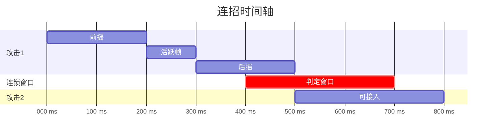

# 🧙‍♂️ 连招系统深度研究

## 📚 1. 理论基础 (Theoretical Basis)

### 🎯 核心定义

**连招（Combo）** 是指玩家通过一系列连续的操作，触发比单独攻击更强大效果的机制。优秀的连招系统能够：
1. **提升技能上限 (Skill Ceiling)** - 熟练玩家有展示空间
2. **增强爽感 (Game Feel)** - 流畅连击带来满足感
3. **丰富策略深度 (Strategic Depth)** - 不同连招应对不同情况

### 📐 连招系统分类

#### 1. 硬连锁 vs 软连锁

| 类型 | 定义 | 使用场景 | 代表作 |
|------|------|----------|--------|
| **硬连锁** | 敌人被连击时无法反击 | 格斗游戏 | Street Fighter |
| **软连锁** | 连击不保证命中，可以中断 | 动作游戏 | Devil May Cry |

**Vampirefall 推荐**: 软连锁（塔防+动作混合，需要保持灵活性）

#### 2. 按钮连招 vs 时机连招

```
按钮连招 (Button Chain):
轻击 → 轻击 → 重击
(固定按键序列)

时机连招 (Timing Chain):
轻击 → [0.3s 窗口] → 轻击 → [0.5s 窗口] → 重击
(需要精准时机)
```

**设计公式**:

```
连招流畅度 = f(窗口时间, 反馈清晰度)

过短窗口 (<0.1s): 只有高手能触发 → 挫败感
适中窗口 (0.2-0.4s): 平衡练习与奖励 → 推荐
过长窗口 (>0.6s): 无挑战性 → 失去意义
```

### 🔧 核心机制

#### 1. 输入缓冲系统 (Input Buffer)

**问题**: 玩家按键时机略早于窗口，导致输入丢失。

**解决方案**: 缓冲玩家输入，在窗口到来时自动执行。

```
无缓冲:
玩家按键 ────X────▶ 窗口开始 (输入丢失)
           0.05s 早

有缓冲:
玩家按键 ────✓────▶ 窗口开始 (缓冲 0.05s，自动执行)
         缓冲区
```

**缓冲时间推荐值**:

```
格斗游戏: 2-5 帧 (0.033-0.083s)
动作游戏: 5-10 帧 (0.083-0.166s)
休闲游戏: 10-20 帧 (0.166-0.333s)

Vampirefall 推荐: 8 帧 (0.133s)
```

**数学模型**:

```
实际执行时间 = max(玩家输入时间, 窗口开始时间)

if (玩家输入时间 + 缓冲时长 >= 窗口开始时间):
    执行连招
else:
    连招中断
```

#### 2. 连锁判定窗口 (Chain Window)

**定义**: 上一个攻击结束后，允许下一个攻击接入的时间段。



<script type="module">
  import mermaid from 'https://cdn.jsdelivr.net/npm/mermaid@10/dist/mermaid.esm.min.mjs';
  mermaid.initialize({ startOnLoad: false });
  await mermaid.run({
    querySelector: '.language-mermaid',
  });
</script>

**窗口设计原则**:

| 连招难度 | 窗口时长 | 玩家体验 |
|---------|---------|---------|
| 简单 | 0.4-0.6s | 新手友好 |
| 中等 | 0.25-0.4s | 平衡挑战 |
| 困难 | 0.1-0.25s | 高手专属 |

#### 3. 取消技系统 (Cancel System)

**定义**: 用特定动作打断当前动作的后摇，实现更快的连招。

**取消类型**:

```
1. 普通取消 (Normal Cancel):
   攻击 → [在后摇期间] → 冲刺/闪避
   用途: 安全撤退

2. 必杀取消 (Special Cancel):
   普通攻击 → [命中时] → 必杀技
   用途: 伤害最大化

3. 超级取消 (Super Cancel):
   必杀技 → [任意时刻] → 大招
   用途: 高级连招

4. 罗马取消 (Roman Cancel, 源自《罪恶装备》):
   任意招式 → [消耗资源] → 瞬间恢复行动
   用途: 自创连招
```

**Vampirefall 适配**:
- 普通攻击可以用冲刺取消（机动性）
- 技能命中后可以接其他技能（combo 链）
- 消耗能量可以取消后摇（高技术奖励）

---

## 🛠️ 2. 实践应用 (Practical Implementation)

### 🎮 Vampirefall 连招框架

#### 设计挑战

Vampirefall 的**塔防 + 动作**混合带来独特问题：

| 传统动作游戏 | Vampirefall 特殊性 |
|-------------|-------------------|
| 纯 1v1/1vN 战斗 | 需要分心建塔/管理资源 |
| 连续输入 | 可能被打断（建塔操作） |
| 单一目标锁定 | 多目标威胁（塔防特性） |

**解决方案**:
- 连招可以中途中断，不惩罚（允许紧急建塔）
- 短连招为主（3-4 招），不要求长串（5+ 招）
- 自动索敌辅助（连招过程中自动调整方向）

### 🗂️ 数据结构

#### ComboConfig.cs

```csharp
[CreateAssetMenu(fileName = "ComboConfig", menuName = "Combat/Combo Config")]
public class ComboConfig : ScriptableObject
{
    [Header("连招链定义")]
    public ComboChain[] comboChains;
    
    [Header("缓冲设置")]
    [Range(0f, 0.5f)]
    public float inputBufferDuration = 0.133f;  // 8 帧 @ 60fps
    
    [Header("取消规则")]
    public CancelRule[] cancelRules;
}

[System.Serializable]
public class ComboChain
{
    public string chainName = "基础三连击";
    public ComboNode[] nodes;
    
    [Header("连锁奖励")]
    public float damageMultiplierPerHit = 1.1f;  // 每击 +10% 伤害
    public int maxComboCount = 10;  // 最大连击数
}

[System.Serializable]
public class ComboNode
{
    [Header("触发条件")]
    public InputCondition inputCondition;
    
    [Header("时间窗口")]
    public float chainWindowStart = 0.3f;  // 窗口开始（相对上个节点）
    public float chainWindowEnd = 0.7f;    // 窗口结束
    
    [Header("执行动作")]
    public AnimationClip animation;
    public AttackData attackData;
    
    [Header("下一步")]
    public int[] nextNodeIndices;  // 可以接入的下个节点索引
}

[System.Serializable]
public class InputCondition
{
    public InputType inputType;  // LightAttack, HeavyAttack, Skill, etc.
    public bool requiresDirectionalInput = false;
    public Vector2 requiredDirection;  // 例如：向前 + 重击
}

[System.Serializable]
public class CancelRule
{
    public string fromActionName;
    public string toActionName;
    
    [Header("取消条件")]
    public CancelCondition condition;
    public float cancelWindowStart = 0.2f;
    public float cancelWindowEnd = 0.8f;
    
    [Header("消耗")]
    public bool requiresResource = false;
    public int resourceCost = 25;  // 消耗能量
}

public enum CancelCondition
{
    Always,           // 始终可取消
    OnHit,           // 命中时可取消
    OnBlock,         // 被格挡时可取消
    WithResource     // 消耗资源可取消
}
```

#### ComboManager.cs

```csharp
public class ComboManager : MonoBehaviour
{
    private ComboConfig config;
    private ComboState state;
    
    // 输入缓冲队列
    private Queue<BufferedInput> inputBuffer = new Queue<BufferedInput>();
    
    void Update()
    {
        // 1. 收集输入并加入缓冲
        CaptureInput();
        
        // 2. 处理缓冲的输入
        ProcessBufferedInputs();
        
        // 3. 检查连锁窗口是否过期
        UpdateChainWindow();
        
        // 4. 清理过期缓冲
        CleanupBuffer();
    }
    
    private void CaptureInput()
    {
        if (Input.GetButtonDown("LightAttack"))
        {
            BufferInput(new BufferedInput
            {
                inputType = InputType.LightAttack,
                timestamp = Time.time,
                direction = GetInputDirection()
            });
        }
        
        if (Input.GetButtonDown("HeavyAttack"))
        {
            BufferInput(new BufferedInput
            {
                inputType = InputType.HeavyAttack,
                timestamp = Time.time,
                direction = GetInputDirection()
            });
        }
    }
    
    private void BufferInput(BufferedInput input)
    {
        inputBuffer.Enqueue(input);
        Debug.Log($"[Combo] 缓冲输入: {input.inputType}");
    }
    
    private void ProcessBufferedInputs()
    {
        if (inputBuffer.Count == 0) return;
        
        var input = inputBuffer.Peek();
        
        // 检查是否在连锁窗口内
        if (IsInChainWindow() && CanChainToNext(input))
        {
            // 执行连招下一步
            ExecuteComboNode(input);
            inputBuffer.Dequeue();
        }
        else if (Time.time - input.timestamp > config.inputBufferDuration)
        {
            // 缓冲过期，尝试作为新连招起手
            if (TryStartNewCombo(input))
            {
                inputBuffer.Dequeue();
            }
            else
            {
                // 彻底过期，丢弃
                inputBuffer.Dequeue();
                Debug.Log("[Combo] 输入过期");
            }
        }
    }
    
    private bool CanChainToNext(BufferedInput input)
    {
        if (state.currentNode == null) return false;
        
        // 检查当前节点是否有匹配的下一步
        foreach (var nextIndex in state.currentNode.nextNodeIndices)
        {
            var nextNode = config.comboChains[state.currentChainIndex].nodes[nextIndex];
            
            if (InputMatches(input, nextNode.inputCondition))
            {
                state.nextNodeIndex = nextIndex;
                return true;
            }
        }
        
        return false;
    }
    
    private void ExecuteComboNode(BufferedInput input)
    {
        var chain = config.comboChains[state.currentChainIndex];
        var node = chain.nodes[state.nextNodeIndex];
        
        // 1. 播放动画
        animator.Play(node.animation.name);
        
        // 2. 增加连击计数
        state.comboCount++;
        state.comboCount = Mathf.Min(state.comboCount, chain.maxComboCount);
        
        // 3. 计算伤害加成
        float damageMultiplier = Mathf.Pow(chain.damageMultiplierPerHit, state.comboCount - 1);
        
        // 4. 执行攻击
        PerformAttack(node.attackData, damageMultiplier);
        
        // 5. 更新状态
        state.currentNode = node;
        state.currentNodeIndex = state.nextNodeIndex;
        state.chainWindowStartTime = Time.time + node.chainWindowStart;
        state.chainWindowEndTime = Time.time + node.chainWindowEnd;
        
        // 6. UI 反馈
        OnComboHit?.Invoke(state.comboCount, damageMultiplier);
        
        Debug.Log($"[Combo] 连击 {state.comboCount}: {node.animation.name} (伤害 x{damageMultiplier:F2})");
    }
    
    private bool IsInChainWindow()
    {
        float time = Time.time;
        return time >= state.chainWindowStartTime && time <= state.chainWindowEndTime;
    }
    
    public bool TryCancelInto(string actionName)
    {
        if (state.currentNode == null) return false;
        
        // 查找取消规则
        foreach (var rule in config.cancelRules)
        {
            if (rule.fromActionName == state.currentNode.animation.name &&
                rule.toActionName == actionName)
            {
                // 检查取消条件
                if (!CheckCancelCondition(rule.condition))
                    return false;
                
                // 检查是否在取消窗口内
                float actionProgress = GetCurrentActionProgress();
                if (actionProgress < rule.cancelWindowStart || actionProgress > rule.cancelWindowEnd)
                    return false;
                
                // 检查资源
                if (rule.requiresResource && !ConsumeResource(rule.resourceCost))
                    return false;
                
                // 执行取消
                PerformCancel(actionName);
                return true;
            }
        }
        
        return false;
    }
    
    private void ResetCombo(string reason)
    {
        if (state.comboCount > 0)
        {
            Debug.Log($"[Combo] 连招中断: {reason} (最高 {state.comboCount} 连击)");
            OnComboBreak?.Invoke(state.comboCount);
        }
        
        state.Reset();
        inputBuffer.Clear();
    }
    
    // 事件
    public System.Action<int, float> OnComboHit;  // (连击数, 伤害倍率)
    public System.Action<int> OnComboBreak;       // (最高连击数)
}

[System.Serializable]
public class ComboState
{
    public int currentChainIndex = 0;
    public int currentNodeIndex = -1;
    public int nextNodeIndex = -1;
    public ComboNode currentNode = null;
    
    public int comboCount = 0;
    public float chainWindowStartTime = 0f;
    public float chainWindowEndTime = 0f;
    
    public void Reset()
    {
        currentChainIndex = 0;
        currentNodeIndex = -1;
        nextNodeIndex = -1;
        currentNode = null;
        comboCount = 0;
        chainWindowStartTime = 0f;
        chainWindowEndTime = 0f;
    }
}

public struct BufferedInput
{
    public InputType inputType;
    public float timestamp;
    public Vector2 direction;
}
```

### 🎯 UI 反馈系统

```csharp
public class ComboUI : MonoBehaviour
{
    public Text comboCountText;
    public Text damageMultiplierText;
    public Image comboMeterFill;
    public ParticleSystem comboEffect;
    
    private Animator uiAnimator;
    private float lastHitTime;
    
    void Start()
    {
        // 订阅连招事件
        FindObjectOfType<ComboManager>().OnComboHit += OnComboHit;
        FindObjectOfType<ComboManager>().OnComboBreak += OnComboBreak;
    }
    
    private void OnComboHit(int comboCount, float damageMultiplier)
    {
        // 1. 更新连击数
        comboCountText.text = $"{comboCount} HIT!";
        
        // 2. 更新伤害倍率
        damageMultiplierText.text = $"x{damageMultiplier:F1}";
        
        // 3. 播放动画
        uiAnimator.SetTrigger("ComboHit");
        
        // 4. 粒子特效（里程碑连击数）
        if (comboCount % 5 == 0)
        {
            comboEffect.Play();
        }
        
        // 5. 震动反馈（移动端）
        if (comboCount >= 10)
        {
            Handheld.Vibrate();
        }
        
        lastHitTime = Time.time;
    }
    
    private void OnComboBreak(int maxCombo)
    {
        // 淡出 UI
        StartCoroutine(FadeOutComboUI());
        
        // 显示最高连击记录
        if (maxCombo >= 10)
        {
            ShowAchievement($"Max Combo: {maxCombo}!");
        }
    }
    
    void Update()
    {
        // 连击计时条（3 秒内需要续连）
        float timeSinceLastHit = Time.time - lastHitTime;
        float fillAmount = 1f - Mathf.Clamp01(timeSinceLastHit / 3f);
        comboMeterFill.fillAmount = fillAmount;
    }
}
```

---

## 🌟 3. 业界优秀案例 (Industry Best Practices)

### 🎮 案例 1: **Street Fighter - 格斗游戏连招标准**

#### 核心机制

Street Fighter 系列确立了格斗游戏连招的黄金标准。

**连招设计原则**:

```
1. 轻攻击可取消为重攻击
2. 重攻击可取消为必杀技
3. 必杀技可取消为超必杀

示例连招:
轻拳 → 轻拳 → 蹲重拳 → 升龙拳 → 超级升龙拳
```

**帧数据系统**:

| 攻击 | 启动帧 | 活跃帧 | 硬直帧 | 命中优势 |
|------|--------|--------|--------|----------|
| 轻拳 | 3f | 2f | 6f | +2f |
| 中拳 | 5f | 3f | 8f | +3f |
| 重拳 | 8f | 4f | 12f | +5f |

**设计哲学**:
> "连招应该奖励精准的输入，而非盲目的按键连打。"

**Vampirefall 借鉴**:
- 使用相似的取消层级（普攻 → 技能 → 大招）
- 轻攻击快速但伤害低，重攻击慢但高伤
- 建立明确的帧数据（即使不公开给玩家）

---

### 🎮 案例 2: **Devil May Cry - 自由连招的艺术**

#### 核心机制

DMC 系列以"花式连招"著称，鼓励玩家创造独特的连击。

**Style Rank 系统**:

```
连击评分 = f(连击数, 招式多样性, 零伤害时长)

D → C → B → A → S → SS → SSS

评分衰减:
- 重复使用同一招式: -10% 分数/次
- 被敌人击中: 立即降为 D
- 3 秒内无攻击: 评分缓慢下降
```

**武器切换系统**:

```
玩家可以在连招中瞬间切换武器:

剑斩 → [切换] → 枪击 → [切换] → 拳套 → [切换] → 剑斩
(保持连击计数)
```

**空中连招机制**:

```
地面启动 → 挑空 → 空中连击 → 击落 → 地面追击

关键技术:
- 敌人在空中无法反击（硬连锁）
- 玩家可以通过跳跃/二段跳保持空中
- 击落后有短暂硬直（继续连击）
```

**Vampirefall 借鉴**:
- Style Rank 改为"连击评级"（影响掉落质量）
- 鼓励招式多样性（不要无脑 AAA）
- 可以考虑简化版武器切换（2 套武器快速切换）

---

### 🎮 案例 3: **Hades - 肉鸽类连招设计**

#### 核心机制

Hades 在肉鸽框架下实现了流畅的连招系统。

**武器多样性**:

| 武器 | 连招特性 | 难度 |
|------|---------|------|
| **剑** | 传统 AAA 连击 | 简单 |
| **矛** | 蓄力投掷 + 回收 | 中等 |
| **盾** | 格挡反击 + 投掷 | 中等 |
| **弓** | 蓄力射击 + 特殊箭 | 困难 |
| **拳套** | 快速连打 + 冲刺取消 | 中等 |

**祝福联动**:

```
基础连招: A → A → A (三连击)

+ "雅典娜祝福": 第 3 击附加护盾
+ "阿瑞斯祝福": 连击叠加诅咒层数
+ "狄俄尼索斯祝福": 连击恢复生命

结果: 同样的 AAA 连招，但效果完全不同
```

**冲刺取消机制**:

```
任意攻击 → [冲刺] → 取消后摇 → 下一次攻击

用途:
- 提高攻击频率
- 安全走位
- 高手专属技巧（不强制）
```

**设计哲学**:
> "简单易学，难以精通。新手也能打出连招，高手能打出艺术品。"

**Vampirefall 借鉴**:
- 不同武器有不同连招风格
- 肉鸽词条改变连招效果（不改变操作）
- 冲刺取消作为高级技巧（不教学，让玩家发现）

---

### 🎮 案例 4: **God of War (2018) - 重型连招设计**

#### 核心机制

战神 2018 的连招系统平衡了"沉重感"和"流畅性"。

**轻重攻击组合**:

```
轻击 (R1): 快速，低伤害
重击 (R2): 缓慢，高伤害

无限组合:
R1 → R1 → R2 → R1 → R2 → R2
(任意组合都有独特动画)
```

**回调系统 (Recall)**:

```
投掷战斧 → 远程攻击 → 召回战斧 → 近战连击

关键设计:
- 召回途中击中敌人会造成伤害
- 召回本身可以嵌入连招中
- 高手可以"空中召回 → 接续连击"
```

**符文攻击**:

```
R1+L1: 符文攻击 (冷却 15 秒)

特点:
- 可以在连招中插入
- 重置部分动画状态
- 提供 I-Frame (无敌帧)
```

**Vampirefall 借鉴**:
- 轻重攻击自由组合（不是固定链）
- 远程攻击（弓/枪）可以和近战混合
- 技能作为连招的"逗号"（而非结束符）

---

## 🔗 4. 参考资料 (References)

### 📄 理论与设计

1. **Fighting Game Fundamentals**  
   *Core-A Gaming YouTube 系列*  
   [播放列表](https://www.youtube.com/playlist?list=PLj34EySs1IeZ8GpjufgsGK-68PBnJbGIe)

2. **The Design of Devil May Cry's Combat**  
   *Game Maker's Toolkit*  
   [YouTube 视频](https://www.youtube.com/watch?v=SyoW8OZh3_w)

3. **Combo Systems in Action Games**  
   *Gamasutra Deep Dive*  
   [文章链接](https://www.gamasutra.com/view/feature/combo_systems_action.php)

### 📺 GDC 演讲

1. **[GDC 2018] Building the Combat of God of War**  
   演讲者: Rob Meyer (Santa Monica Studio)  
   [GDC Vault](https://www.gdcvault.com/play/1025234/)

2. **[GDC 2019] Designing Hades**  
   演讲者: Greg Kasavin (Supergiant Games)  
   [YouTube 链接](https://www.youtube.com/watch?v=JzyE9hi912c)

3. **[GDC 2015] The Animation Pipeline of Devil May Cry 4**  
   演讲者: Hiroshi Yajima (Capcom)  
   [GDC Vault](https://www.gdcvault.com/play/1022115/)

### 🌐 技术博客

1. **Input Buffering in Fighting Games**  
   [How Fighting Games Use Input Buffering](https://www.reddit.com/r/Fighters/comments/input_buffering/)

2. **Cancel Systems Explained**  
   [Fighting Game Glossary - Cancels](https://glossary.infil.net/?t=Cancel)

3. **Combo System Implementation**  
   [Unity Forum - Combo System Thread](https://forum.unity.com/threads/combo-system.html)

### 📚 推荐书籍

1. **《格斗游戏设计》** (The Design of Fighting Games)  
   作者: Various  
   （合集，包含多个开发者访谈）

2. **《游戏动画设计》** (Game Animation Design)  
   作者: Jonathan Cooper

---

## 🎯 附录：Vampirefall 连招实施检查清单

### ✅ 阶段 1: 基础框架（必须）
- [ ] 实现输入缓冲系统（8 帧缓冲）
- [ ] 创建 ComboConfig ScriptableObject
- [ ] 设计基础三连击（AAA）
- [ ] 实现连锁判定窗口

### ✅ 阶段 2: 轻重攻击（推荐）
- [ ] 区分轻攻击（快速低伤）和重攻击（缓慢高伤）
- [ ] 实现轻重混合连招（AABAA 等）
- [ ] 添加动画过渡

### ✅ 阶段 3: 取消系统（推荐）
- [ ] 实现冲刺取消（普攻后摇可冲刺）
- [ ] 实现技能取消（普攻可接技能）
- [ ] 添加取消特效（视觉反馈）

### ✅ 阶段 4: UI 反馈（必须）
- [ ] 显示连击数 UI
- [ ] 显示伤害倍率
- [ ] 添加连击粒子特效
- [ ] 实现连击计时条

### ✅ 阶段 5: 高级特性（可选）
- [ ] Style Rank 系统（S/A/B/C 评级）
- [ ] 武器切换连招
- [ ] 空中连招
- [ ] 连击成就系统

### ✅ 阶段 6: 平衡调优（必须）
- [ ] 调整连锁窗口时长
- [ ] 平衡伤害倍率
- [ ] 测试不同武器连招手感
- [ ] 收集玩家反馈

---

**最后更新**: 2025-12-04  
**维护者**: Vampirefall 设计团队
