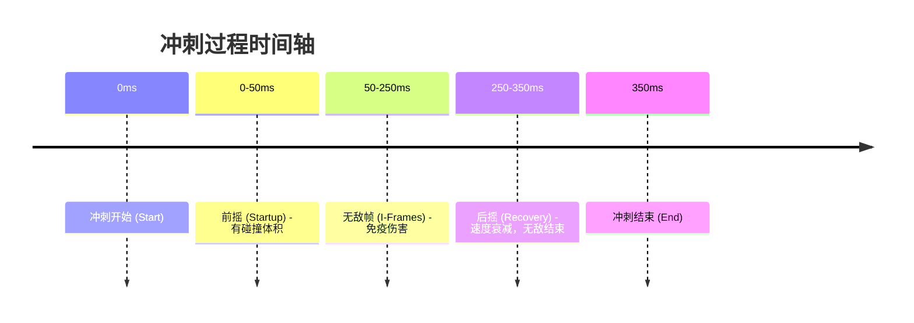

# 🏃 移动与冲刺系统 (Movement & Dash System) 深度研究

> **研究归属**: Project Vampirefall - Tech/Mechanics  
> **创建日期**: 2025-12-04  
> **优先级**: ⭐⭐⭐⭐ (中高)

---

## 📑 目录

1.  [理论基础 (Theoretical Basis)](#-1-理论基础-theoretical-basis)
2.  [实践应用 (Practical Implementation)](#️-2-实践应用-practical-implementation)
3.  [业界优秀案例 (Industry Best Practices)](#-3-业界优秀案例-industry-best-practices)
4.  [参考资料 (References)](#-4-参考资料-references)

---

## 📚 1. 理论基础 (Theoretical Basis)

### 1.1 核心定义

**移动与冲刺系统**是动作游戏中最基础的交互层。它不仅决定了玩家如何穿越空间，更是战斗节奏的核心调节器。在 Vampirefall 这种混合品类（塔防 + Roguelike）中，移动系统还承担着"在塔之间快速穿梭"的功能性需求。

关键概念：
- **I-Frame (Invincibility Frame)**: 无敌帧，冲刺期间的一段时间内免疫所有伤害。
- **Coyote Time (土狼时间)**: 允许玩家在离开平台边缘后的一小段时间内仍然可以起跳（虽然 Vampirefall 是俯视角，但此概念可用于"边缘防跌落"或"攻击判定宽容"）。
- **Input Buffering (输入缓冲)**: 在当前动作结束前预输入下一个动作，使连招流畅。
- **Dash Canceling (冲刺取消)**: 利用冲刺强制中断当前动作后摇。

### 1.2 数学模型

#### 🏃 冲刺速度曲线

冲刺不应是线性的位移，而应该具有爆发感。通常使用 **对数衰减** 或 **自定义贝塞尔曲线**。

```
Velocity(t) = DashSpeed * (1 - (t / DashDuration)^Power)

其中:
- DashSpeed: 初始爆发速度
- DashDuration: 冲刺总时长
- Power: 衰减指数 (通常 > 1，如 2 或 3，使速度快速下降)
```

#### 🛡️ 无敌帧窗口



### 1.3 设计心理学

#### 💡 "Kinesthetic Pleasure" (动觉快感)

移动本身应该是有趣的。
- **响应性**: 按下按钮的瞬间必须立即反馈（0延迟感）。
- **惯性与重量**: 角色不应像纸片一样飘，起步和停止需要微小的加速/减速过程（但不能太长，否则会感到"滑"）。
- **视觉扭曲**: 冲刺时拉伸角色模型或使用残影，增强速度感。

---

## 🛠️ 2. 实践应用 (Practical Implementation)

### 2.1 Vampirefall 适配设计

#### 🏰 塔防环境下的移动

Vampirefall 的地图充满了塔基和怪物。
- **穿透机制**: 冲刺**必须**能穿过怪物（避免被围死），但**不能**穿过塔基（保持建筑的实体感）。
- **相位移动 (Phase Shift)**: 我们的冲刺设定为"化身蝙蝠群"或"血雾瞬移"，视觉上符合吸血鬼题材。

#### 🔋 资源管理：体力 vs 充能

采用 **充能点数 (Charges)** 系统而非耐力条 (Stamina Bar)。
- **原因**: 塔防节奏快，耐力条恢复太慢会打断战斗节奏。
- **设计**: 默认 2 层充能，每 1.5 秒恢复 1 层。
- **击杀刷新**: 击杀精英怪或 Boss 阶段转换时立即恢复冲刺次数。

### 2.2 数据结构设计

```csharp
[System.Serializable]
public class MovementConfig
{
    [Header("基础移动")]
    public float moveSpeed = 8.0f;
    public float acceleration = 50.0f; // 起步加速度
    public float deceleration = 60.0f; // 停止摩擦力
    
    [Header("冲刺参数")]
    public float dashDistance = 6.0f;
    public float dashDuration = 0.3f;
    public AnimationCurve dashSpeedCurve; // 速度变化曲线
    
    [Header("冷却与资源")]
    public int maxDashCharges = 2;
    public float dashCooldown = 1.2f; // 充能恢复时间
    public float dashInternalCooldown = 0.15f; // 连续冲刺最小间隔
    
    [Header("高级机制")]
    public float iframeDuration = 0.2f; // 无敌时间
    public bool canDashThroughEnemies = true;
    public LayerMask obstacleLayer; // 阻挡层（墙壁、塔基）
}
```

### 2.3 核心逻辑实现 (Unity)

#### 🎮 状态机驱动的移动控制器

```csharp
public class PlayerMovement : MonoBehaviour
{
    public MovementConfig config;
    private CharacterController cc;
    private Vector3 velocity;
    private float currentDashTime;
    private Vector3 dashDirection;
    
    private enum State { Normal, Dashing, Stunned }
    private State currentState;
    
    void Update()
    {
        switch (currentState)
        {
            case State.Normal:
                HandleNormalMovement();
                HandleDashInput();
                break;
            case State.Dashing:
                HandleDashMovement();
                break;
        }
    }
    
    void HandleNormalMovement()
    {
        Vector3 input = GetInputVector();
        
        // 简单的加减速处理
        if (input.magnitude > 0.1f)
        {
            // 加速向目标速度
            Vector3 targetVel = input * config.moveSpeed;
            velocity = Vector3.MoveTowards(velocity, targetVel, config.acceleration * Time.deltaTime);
        }
        else
        {
            // 减速至静止
            velocity = Vector3.MoveTowards(velocity, Vector3.zero, config.deceleration * Time.deltaTime);
        }
        
        cc.Move(velocity * Time.deltaTime);
        
        // 朝向移动方向
        if (velocity.sqrMagnitude > 0.1f)
            transform.forward = velocity.normalized;
    }
    
    void StartDash()
    {
        if (dashCharges <= 0) return;
        
        dashCharges--;
        currentState = State.Dashing;
        currentDashTime = 0f;
        
        // 确定冲刺方向：如果有输入则按输入方向，否则按角色朝向
        Vector3 input = GetInputVector();
        dashDirection = input.magnitude > 0.1f ? input.normalized : transform.forward;
        
        // 开启无敌
        StartCoroutine(IFrameRoutine());
        
        // 播放特效和音效
        PlayDashEffects();
    }
    
    void HandleDashMovement()
    {
        currentDashTime += Time.deltaTime;
        float progress = currentDashTime / config.dashDuration;
        
        if (progress >= 1f)
        {
            EndDash();
            return;
        }
        
        // 采样速度曲线
        float speedMultiplier = config.dashSpeedCurve.Evaluate(progress);
        float currentSpeed = (config.dashDistance / config.dashDuration) * speedMultiplier;
        
        cc.Move(dashDirection * currentSpeed * Time.deltaTime);
    }
}
```

#### 🛡️ 碰撞处理与穿透

为了实现"穿过敌人但被墙挡住"，我们需要动态调整 Layer Collision Matrix 或 Collider 设置。

```csharp
IEnumerator IFrameRoutine()
{
    // 1. 开启无敌状态（免疫伤害逻辑在 Health 组件中检查此标志）
    isInvincible = true;
    
    // 2. 忽略与敌人的物理碰撞（防止被卡住）
    Physics.IgnoreLayerCollision(LayerMask.NameToLayer("Player"), LayerMask.NameToLayer("Enemy"), true);
    
    yield return new WaitForSeconds(config.iframeDuration);
    
    // 3. 恢复碰撞
    Physics.IgnoreLayerCollision(LayerMask.NameToLayer("Player"), LayerMask.NameToLayer("Enemy"), false);
    isInvincible = false;
}
```

> [!WARNING]
> **穿模风险**: 如果冲刺结束时玩家正好重叠在敌人体内，物理引擎可能会产生巨大的排斥力将玩家弹飞。
> **解决方案**: 
> 1. 保持软碰撞（Soft Collision），允许重叠但施加持续推力分离。
> 2. 或者在冲刺结束检测重叠，如果重叠则向最近的空地微推一段距离。

---

## 🌟 3. 业界优秀案例 (Industry Best Practices)

### 3.1 Hades (Supergiant Games)

#### ✅ 核心机制：Dash-Strike (冲刺攻击)

- **机制**: 冲刺过程中可以进行攻击，攻击动作会发生变化（通常范围更大、前摇更短）。
- **手感**: 极度流畅，冲刺取消了普通攻击的后摇，普通攻击又继承了冲刺的动量。
- **I-Frame**: 冲刺全程无敌，但攻击瞬间会短暂失去无敌（高风险高回报）。

#### 🎯 Vampirefall 借鉴点

- **冲刺建造**: 允许在冲刺过程中放下陷阱或塔基（瞬发建造）。
- **残影特效**: 冲刺时留下带有伤害判定的残影（配合吸血鬼题材，如血蝠群）。

### 3.2 Hollow Knight (Team Cherry)

#### ✅ 核心机制：空中机动与下劈 (Pogo)

- **机制**: 冲刺有明显的冷却间隔（暗影冲刺），强调节奏感而非滥用。
- **向下攻击**: 攻击敌人或尖刺可以重置冲刺和二段跳。

#### 🎯 Vampirefall 借鉴点

- 虽然是俯视角，但可以引入 **"完美闪避" (Perfect Dodge)** 机制：在被击中前一瞬间冲刺，触发子弹时间或对周围敌人造成恐惧效果。

### 3.3 Celeste (Maddy Thorson)

#### ✅ 核心机制：辅助手感 (Game Feel Assists)

- **Coyote Time**: 离开平台 0.1s 内仍可跳跃。
- **Jump Buffering**: 落地前 0.1s 按跳，落地瞬间自动跳。
- **Corner Correction**: 头顶撞到墙角时，自动把角色向外推，防止卡住。

#### 🎯 Vampirefall 借鉴点

- **转角修正 (Corner Sliding)**: 俯视角游戏中，当玩家冲刺撞到墙角（塔基边缘）时，不应直接停下，而应沿着墙壁滑过去。这对于在密集的塔防迷宫中移动至关重要。

```csharp
// 简单的转角修正逻辑示意
void HandleCornerSliding(Vector3 moveDir)
{
    if (Physics.Raycast(transform.position, moveDir, out RaycastHit hit, 1f, obstacleLayer))
    {
        // 如果撞墙角度很小（擦边），则修正移动方向沿墙面滑动
        Vector3 slideDir = Vector3.ProjectOnPlane(moveDir, hit.normal).normalized;
        cc.Move(slideDir * speed * Time.deltaTime);
    }
}
```

---

## 🔗 4. 参考资料 (References)

### 📄 必读文章

1.  **"The Art of the Dash"**  
    - 来源: Game Developer (Gamasutra)  
    - 重点: 分析了 Hyper Light Drifter 和 Furi 的冲刺设计差异。

2.  **"Celeste's Player Movement"**  
    - 作者: Maddy Thorson  
    - 链接: [Twitter Thread / GitHub Code](https://github.com/NoelFB/Celeste/tree/master/Source/Player)  
    - 重点: 公开了 Celeste 的移动代码，是手感调优的教科书。

### 📺 视频分析

1.  **"Game Feel: Why Your Death Animation Sucks"** (涉及移动手感)  
    - 频道: Game Maker's Toolkit  
    - 链接: [YouTube](https://www.youtube.com/watch?v=216_5nu4aVQ)

2.  **"How Hades Makes You Feel Like a God"**  
    - 频道: Adam Millard  
    - 重点: 分析 Hades 的 Dash-Strike 和取消机制。

### 🛠️ 工具与资源

1.  **Kinematic Character Controller (Unity Asset)**  
    - 专业的角色控制器插件，处理了所有物理边缘情况（虽然我们可能自己写简单的，但值得参考其文档）。

2.  **DOTween**  
    - 用于实现平滑的冲刺相机跟随和视野拉伸效果。

---

## 📊 总结

### 🎯 Vampirefall 实施建议

1.  **手感优先**: 必须实现**转角修正**，因为塔防地图障碍物极多，卡顿感是致命的。
2.  **视觉反馈**: 冲刺必须有**残影**和**音效**，明确传达无敌状态。
3.  **资源循环**: 采用**充能制**，并与杀敌挂钩，鼓励进攻性走位。
4.  **技能联动**: 冲刺不只是移动，更是触发器（如：冲刺路径留下毒雾、冲刺结束释放冲击波）。

---

**文档版本**: v1.0  
**最后更新**: 2025-12-04  
**维护者**: Vampirefall Tech Team
