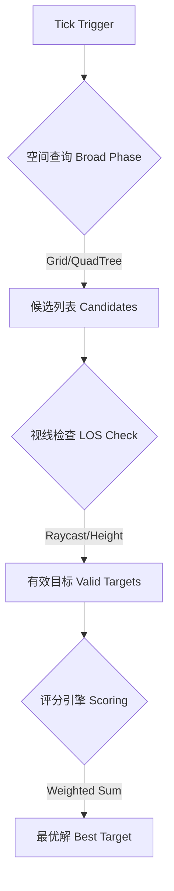

# 🎯 索敌管道详解 (Targeting Pipeline Deep Dive)

本文档深入剖析索敌流程的每个阶段，重点关注**性能优化**和**复杂地形处理**。

---

## 🔄 管道总览 (Pipeline Overview)

索敌不仅仅是 `Distance < Range` 那么简单。一个健壮的索敌管道需要处理几百个单位的高频查询。

---

## 1. 圈地 (Broad Phase): 高效的空间查询

这是第一步，也是对性能影响最大的一步。**绝对禁止**使用 `FindObjectsOfType` 或遍历全图 `List<Enemy>`。

### 1.1 2D 地图方案 (Grid System)
如果游戏地形平坦（标准塔防或俯视角 Roguelike），推荐使用 **均匀网格 (Uniform Grid)**。

*   **原理:** 将地图划分为 2x2 或 5x5 的格子。每个格子维护一个 `List<Unit>`。
*   **写入:** 单位移动时，更新自己所在的格子索引。
*   **查询:** 塔只需要查询自己射程圆圈覆盖的几个格子。
*   **优势:** 
    *   插入/删除极其快 O(1)。
    *   内存访问连续，缓存友好。
    *   比 QuadTree 更适合单位频繁移动的场景。

### 1.2 3D 地形/稀疏地图方案 (QuadTree / Octree)
如果地图非常大且空旷，或者有显著的垂直结构（如空中单位），网格法会浪费大量内存。

*   **QuadTree (四叉树):** 适合大多数地面 3D 游戏。
*   **Octree (八叉树):** 仅当你有大量飞行单位且需要区分上下层时使用。
*   **Unity 特有:** `Physics.OverlapSphereNonAlloc`。
    *   这是利用 Unity 底层 PhysX 引擎的加速结构。
    *   **技巧:** 使用 `NonAlloc` 版本避免 GC。
    *   **LayerMask:** 务必设置 LayerMask 仅检测 `EnemyLayer`，避免检测墙壁或地面。

### 1.3 优化技巧：分帧与缓存
*   **频率限制:** 索敌不需要每帧跑。每 0.2秒 (10-12帧) 跑一次足够。
*   **交错执行 (Interleaving):**
    *   Frame 1: 塔 A, B, C 索敌。
    *   Frame 2: 塔 D, E, F 索敌。
    *   通过 `Time.frameCount % TotalGroups == GroupIndex` 来实现。

---

## 2. 视线检查 (Line of Sight - LOS): 处理地形遮挡

在复杂的 3D 地图中，"在射程内" 不等于 "能打到"。墙壁、悬崖、障碍物都会阻挡攻击。

### 2.1 2D / 伪3D (Top-Down)
*   **Raycast:** 从塔中心向目标发射一条射线。
*   **Layer:** 射线只与 `Wall` / `Obstacle` 层碰撞。
*   **高度差模拟:** 即使是 2D，也可以给单位一个 `Height` 属性。
    *   规则: `Target.Height >= Wall.Height` 视为可见（例如飞行单位飞过城墙）。

### 2.2 真 3D 高低差 (Elevation)
这是最复杂的部分。

*   **视点修正 (Eye Position):** 射线起点不是 `Tower.position` (脚底)，而是 `Tower.MuzzlePoint` (炮口)。终点是 `Enemy.Center` (胸口)。
*   **俯仰角限制 (Pitch Limit):**
    *   坦克炮塔可能无法抬起超过 45度。
    *   检查: `Vector3.Angle(TowerForward, DirectionToEnemy) < MaxPitch`。
*   **死角 (Blind Spot):**
    *   位于高台上的塔，可能打不到脚底下的敌人（灯下黑）。
    *   逻辑: `HorizontalDistance > MinRange`。

---

## 3. 实例分析：高低差对战 (Case Study)

假设场景：玩家站在高台上，下方有一群僵尸。

### 3.1 玩家 (High Ground) -> 僵尸 (Low Ground)
1.  **Broad Phase:** `OverlapSphere` 扫到了僵尸。
2.  **LOS Check:** 射线从高台边缘射向僵尸，未被遮挡。通过。
3.  **Range Check:** 3D 距离 `sqrt(dx*dx + dy*dy + dz*dz)` 可能大于 2D 投影距离。
    *   *设计决策:* 你的射程是按“球体”算还是按“圆柱体”算？
    *   *建议:* 使用球体距离，才符合物理直觉。

### 3.2 僵尸 (Low Ground) -> 玩家 (High Ground)
1.  **Broad Phase:** 扫到了玩家。
2.  **LOS Check:** 射线被高台边缘挡住了（如果僵尸太靠近墙根）。
3.  **NavMesh:** 僵尸发现虽然直线距离近，但寻路距离 (Path Distance) 极远（需要绕路上楼）。
    *   *决策:* 仇恨系统应使用 **寻路距离** 还是 **直线距离**？
    *   *答案:* **混合权重**。如果直线距离很近但打不到，AI 应该倾向于寻找路径上楼，或者切换目标攻击墙壁。

---

## 4. 过滤与评分 (Filtering & Scoring)

### 4.1 硬过滤 (Hard Filters)
在评分之前，先用廉价的运算剔除 90% 的目标。

*   `IsAlive`: 必须。
*   `IsStealthed`: 隐身单位除非有反隐塔，否则直接剔除。
*   `AngleCheck`: 某些塔只能攻击前方 90 度扇形区域。

### 4.2 软评分 (Soft Scoring)
进入这里的通常只有 3-5 个目标。

*   **性能敏感:** 这里是数学密集区。
*   **避免:** 不要在 `Evaluate` 里做 `GetComponent` 或 `Find`。数据应预取到 `Context` 中。
*   **SIMD 优化:** 如果单位极多，可以将位置数据放入 `NativeArray<float3>`，用 Unity Job System 并行计算距离分数。

---

