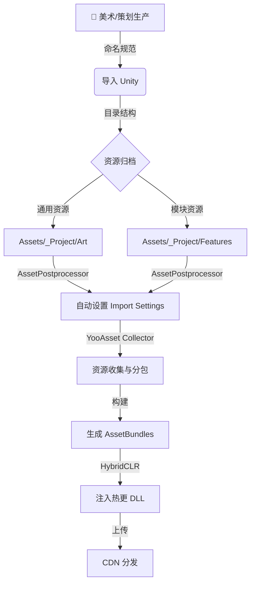

# 🏭 标准资源管理工业流程 (Standard Resource Workflow)

> **目标**: 将分散的命名规范、目录结构和热更技术串联成一条完整的**工业化生产管线**。
> **核心文档引用**:
> *   [命名规范](Asset_Naming.md)
> *   [目录结构](Folder_Structure.md)
> *   [热更新技术](Hot_Update_And_Resources.md)

## 1. 🗺️ 全景流程图 (The Pipeline)

## 2. 🏭 阶段一：生产与导入 (Production & Import)

### 2.1 命名作为第一道防线
*   **规则**: 所有进入项目的资源必须符合 `[前缀]_[模块]_[名称]_[变体]`。
*   **工具**: 启用 `AssetNamingValidator.cs`，任何不合规资源导入时会在 Console 报错。
*   **案例**:
    *   美术提交 `goblin_red.fbx` -> **打回**。
    *   美术提交 `SK_Goblin_Red.fbx` -> **通过**。

### 2.2 物理归档 (Physical Layout)
依据 [目录结构](Folder_Structure.md) 的“混合式架构”：
*   **通用库 (Shared)**: 地面贴图、通用 UI 框、音效 -> 放入 `_Project/Art/` 或 `_Project/Audio/`。
*   **专用库 (Dedicated)**: 哥布林的独有动作、特效、材质 -> 放入 `_Project/Features/Enemies/Goblin/`。

### 2.3 自动化导入设置 (Auto Import Settings)
不要依赖人工手动设置 Texture Type 或 Compression。利用命名规范自动处理：
*   检测到 `T_` 开头 -> 自动设为 `Default`, 开启 Mipmap, 压缩格式 ASTC_6x6。
*   检测到 `UI_` 开头 -> 自动设为 `Sprite`, 关闭 Mipmap, 压缩格式 ASTC_4x4。
*   检测到 `SFX_` 开头 -> 自动设为 `DecompressOnLoad`。
*   检测到 `BGM_` 开头 -> 自动设为 `Streaming`。

## 3. 📦 阶段二：分包与构建 (Packaging)

### 3.1 YooAsset 收集策略 (Collector Strategy)
我们将目录结构直接映射到 YooAsset 的收集器规则中，实现**零配置**分包。

| 目录路径 | 收集规则 (Collector) | 打包方式 (Addressable) | 对应 Package |
| :--- | :--- | :--- | :--- |
| `_Project/Art/UI/Common` | `PackDirectory` | `PackTogether` (打成一个大包) | `DefaultPackage` |
| `_Project/Scenes/Boot.unity` | `PackFile` | - | `DefaultPackage` |
| `_Project/Features/Chapter1` | `PackDirectory` | `PackSeparately` (每个文件单独打) | `LevelPackage` |
| `_Project/Features/Chapter2` | `PackDirectory` | `PackSeparately` | `LevelPackage` |

*   **Tag 自动化**:
    *   `Features/Chapter1` 下的所有资源，自动打上 `Tag = "Chapter1"`。
    *   游戏运行时，进入第一章前调用 `package.DownloadAsync("Chapter1")` 即可一键下载该目录下所有内容。

### 3.2 依赖管理 (Dependency Management)
*   **原则**: `DefaultPackage` (启动包) **严禁** 引用 `LevelPackage` (关卡包) 中的资源。
*   **检测**: 构建时运行依赖分析脚本，如果发现 `UI_MainMenu` (Default) 引用了 `T_BossTexture` (Level)，立即报错。

## 4. 🚀 阶段三：热更与发布 (Hot Update)

### 4.1 代码与资源的同步
*   **问题**: 修改了 C# 代码 (例如增加了新怪物逻辑)，同时增加了新怪物的 Prefab。
*   **同步流**:
    1.  运行 `HybridCLR/CompileDll` 生成 `Assembly-CSharp.dll`。
    2.  脚本自动将 DLL 复制到 `_Project/StreamingAssets/RawFiles/` (归属 `RawFilePackage`)。
    3.  运行 YooAsset 构建，生成资源版本 `v1.0.100`。
    4.  **原子性发布**: 客户端检测到版本 `v1.0.100` 时，会同时下载新的 DLL 和新的 AssetBundle，确保逻辑与资源匹配。

### 4.2 兜底策略 (Fallback)
*   **资源损坏**: YooAsset 自带 CRC 校验，下载后校验失败会自动重试。
*   **代码崩溃**: 如果热更 DLL 导致启动崩溃，客户端应有“安全模式” (Safe Mode)，允许用户在启动页清除本地缓存，强制重新下载最新版本。

## 5. 🔍 案例分析：复杂 UI 面板 (Case Study)

> **场景**: 一个 "背包面板" (InventoryPanel)，包含：
> 1.  **1个独特的背景图**: `UI_Inventory_Bg.png` (仅此面板使用)。
> 2.  **2个通用底板**: `UI_Common_Frame.png`, `UI_Common_Button.png` (全游戏通用)。
> 3.  **100个道具图标**: `UI_Icon_Sword.png`... (全游戏通用)。

### 5.1 物理存放 (按维护性优先)
我们坚持 **"维护性 > 性能"** 的原则进行物理存放，性能问题交给构建管线解决。

*   `Assets/_Project/Features/Inventory/Art/UI_Inventory_Bg.png`
    *   *理由*: 这是模块独有的，删了背包模块，这个图也该消失。
*   `Assets/_Project/Art/UI/Common/UI_Common_Frame.png`
    *   *理由*: 这是通用的，属于核心资产。
*   `Assets/_Project/Art/UI/Icons/Items/UI_Icon_Sword.png`
    *   *理由*: 图标库通常极其庞大，且被多个模块（商城、背包、战斗）引用，必须独立存放。

### 5.2 图集打包 (Sprite Atlas 策略)
在构建阶段，我们通过 `SpriteAtlas` 来解决 DrawCall 问题，而不是通过移动文件。

1.  **Common Atlas**: 包含 `_Project/Art/UI/Common` 下的所有小图。
    *   *结果*: 背包面板加载时，常驻内存。
2.  **Icon Atlas**: 包含 `_Project/Art/UI/Icons` 下的所有图标。
    *   *策略*: 如果图标太多 (1000+)，按功能拆分 (e.g., `Icon_Weapon_Atlas`, `Icon_Potion_Atlas`)。
    *   *结果*: 打开背包时加载。
3.  **Unique BG**: **不打入图集**。
    *   *理由*: 全屏背景图通常很大 (1024x1024+)，打入图集会造成巨大的内存浪费（因为你很难填满剩余空间）。直接作为 `Sprite (Single)` 加载即可。

### 5.3 运行时 DrawCall 估算
1.  **BG (Unique)**: 1 DrawCall (独立纹理)。
2.  **Frame/Buttons (Common)**: 1 DrawCall (Common Atlas)。
3.  **Icons (Item)**: 1 DrawCall (Icon Atlas)。
4.  **Text**: 1 DrawCall (Font Texture)。
*   **总计**: 约 4-5 DrawCalls。这是非常健康的。

**结论**: **物理上按功能分，逻辑上按图集聚。** 不要为了减少 1 个 DrawCall 而破坏项目结构的清晰度。

## 6. ✅ 开发者日常自查清单 (Daily Checklist)

1.  [ ] **命名**: 新建文件是否符合 `Prefix_Name` 规范？
2.  [ ] **位置**: 它是通用资源还是模块独享资源？放对文件夹了吗？
3.  [ ] **引用**: 核心 UI 是否错误引用了关卡内的大贴图？
4.  [ ] **测试**: 提交前是否在 `EditorSimulateMode` 下运行测试过？
