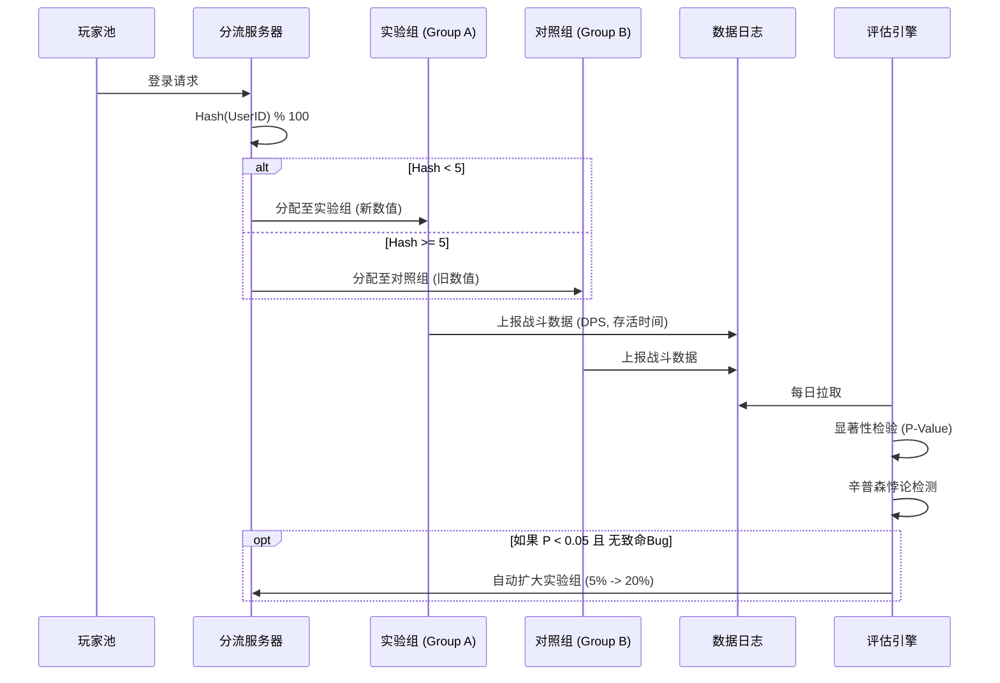

---
sidebarTitle: "数据驱动平衡 (DDNO)"
description: "警惕辛普森悖论与幸存者偏差，构建基于多维分层的数值健康监控体系"
icon: "material/chart-line"
---

# 📊 玩家行为数据驱动的动态数值调整

> **摘要**：数据不会撒谎，但解读数据的人会。本文将揭示“平均胜率 50%”背后的陷阱，引入辛普森悖论与幸存者偏差的修正模型，并提供一套完整的数值健康度（Numeric Health）评分体系。

---

## 📉 数据陷阱：为什么“平均数”是最大的谎言？

### 1. 辛普森悖论 (Simpson's Paradox)

这是数值策划最容易踩的坑：**在分组比较中都占优势的一方，在总评中反而处于劣势**。

#### 案例推演
假设我们监控英雄 A 的胜率，全服平均胜率是完美的 **50%**。看起来很平衡？
**拆分段位一看：**
*   **青铜段位** (占80%人口)：胜率 **70%** (无脑强，新手杀手)
*   **王者段位** (占20%人口)：胜率 **30%** (机制笨重，高端局被秀)

**结论**：英雄 A 其实**严重设计失误**。它在低端局是毒瘤，在高端局是废柴。单纯看平均值 50% 会让你错过这次重大事故。

### 2. 幸存者偏差 (Survivorship Bias)

**现象**：某把武器的使用者胜率高达 60%。
**直觉**：这把武器太强了，要削弱 (Nerf)。
**真相**：
*   这把武器价格极贵（或获取极难）。
*   只有**资深高玩**才买得起/刷得到。
*   胜率高是因为**使用者强**，而不是武器强。
*   **修正算法**：引入 Elo 分数加权。计算 $\Delta \text{WinRate} = \text{实际胜率} - \text{玩家平均Elo对应期望胜率}$。

---

## 🧬 数值健康度模型 (Numeric Health Score)

不要只看胜率，建立一个 5 维雷达图来评估一个单位/物品的健康度。

$$ 
\text{Health Score} = w_1 \cdot \text{WR} + w_2 \cdot \text{PR} + w_3 \cdot \text{BR} + w_4 \cdot \text{CV} + w_5 \cdot \text{SD} 
$$ 

1.  **WR (Win Rate 偏差)**：$|50\% - \text{胜率}|$。越小越好。
2.  **PR (Pick Rate 选择率)**：是否过热或过冷？理想值应在 $1/N$ 附近。
3.  **BR (Ban Rate 禁用率)**：玩家有多讨厌它？这是**挫败感**的直接指标。
4.  **CV (Coefficient of Variation 方差)**：表现是否稳定？(方差大意味着要么超神要么超鬼，体验极差)。
5.  **SD (Skill Dependence 技巧依赖度)**：高分段胜率 - 低分段胜率。

---

## 🔬 A/B 测试的实战架构

不要全服一起调整。

---

## 📝 总结

数据驱动的核心不是“看报表”，而是“**分层**”与“**去噪**”。
*   如果不分层，辛普森悖论会骗你。
*   如果不去噪，幸存者偏差会骗你。
*   **记住**：数值策划的直觉决定了**下限**，而数据分析决定了**上限**。
