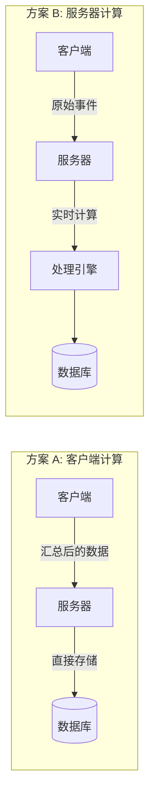
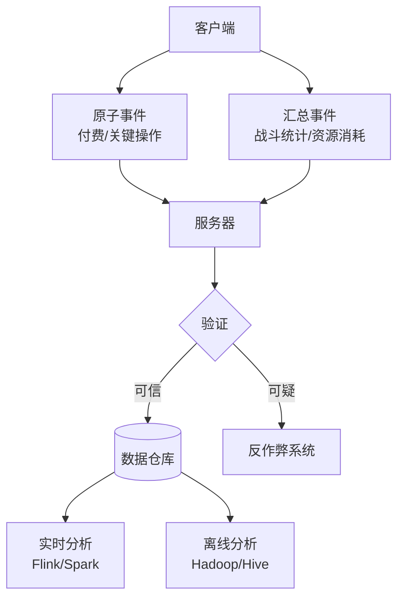
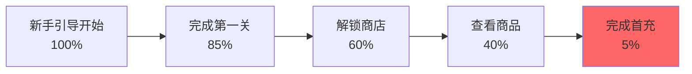

## 🎯 埋点设计核心原则

埋点（Event Tracking）是游戏数据分析的基础设施，好的埋点设计能够：

- **精准定位问题**：快速发现玩家流失点、卡点
- **验证设计假设**：用数据证明或否定设计决策
- **优化商业化**：提升付费转化和 ARPU
- **指导迭代方向**：基于玩家行为做产品迭代

> [!IMPORTANT]
> 埋点设计应当遵循 **"先问题后方案"** 的原则：明确要分析什么问题，再决定埋什么点。避免"什么都埋"导致的数据噪音和存储成本失控。

### 设计三原则

<Steps>
  <Step title="最小充分性">
    埋点数据应当刚好够用，不多不少。过度埋点会增加网络开销、存储成本，过少则无法回答关键问题。
  </Step>
  <Step title="可扩展性">
    事件结构应支持新增字段而不破坏历史数据分析，使用版本号管理事件定义变更。
  </Step>
  <Step title="隐私合规">
    遵守 GDPR、COPPA 等隐私法规，不采集敏感个人信息，提供用户数据删除机制。
  </Step>
</Steps>

---

## 📊 埋点分类体系

### 1. 按业务类型分类

| 类型             | 用途                       | 示例事件                                           | 发送频率 |
| ---------------- | -------------------------- | -------------------------------------------------- | -------- |
| **用户生命周期** | 跟踪新增、留存、流失       | `user_register`, `user_login`, `user_churn`        | 低频     |
| **功能使用**     | 分析功能点击率、使用深度   | `feature_click`, `tutorial_step`, `ui_open`        | 中频     |
| **经济系统**     | 监控货币流转、资源产出消耗 | `currency_gain`, `item_consume`, `shop_purchase`   | 高频     |
| **战斗行为**     | 分析关卡难度、技能使用     | `battle_start`, `battle_end`, `skill_cast`         | 高频     |
| **社交互动**     | 公会、好友、聊天行为       | `guild_join`, `friend_add`, `chat_message`         | 中频     |
| **付费转化**     | 商业化漏斗分析             | `store_view`, `item_add_cart`, `purchase_complete` | 低频     |
| **性能监控**     | 崩溃、卡顿、加载时间       | `crash_report`, `fps_drop`, `scene_load_time`      | 按需     |

### 2. 按数据粒度分类

#### 汇总型事件（Aggregated Events）

**特点**：客户端预先计算，减少网络传输

```json
{
  "event": "session_summary",
  "properties": {
    "session_id": "abc123",
    "duration_seconds": 1800,
    "battles_played": 5,
    "gold_earned": 1200,
    "gold_spent": 800,
    "levels_gained": 2
  }
}
```

**优点**：

- 网络流量少（一次会话只发送 1 条）
- 服务器计算压力小

**缺点**：

- 无法回溯详细行为序列
- 客户端逻辑复杂，容易出 Bug

#### 原子型事件（Atomic Events）

**特点**：每个行为独立发送

```json
// 事件 1
{"event": "battle_start", "properties": {"level_id": 101}}
// 事件 2
{"event": "skill_cast", "properties": {"skill_id": 5001}}
// 事件 3
{"event": "enemy_kill", "properties": {"enemy_id": 2001}}
```

**优点**：

- 数据完整，支持任意维度分析
- 客户端逻辑简单，不易出错

**缺点**：

- 网络流量大
- 服务器存储和计算成本高

> [!TIP] > **推荐方案**：混合模式 - 高频低价值事件用汇总型（如每秒伤害统计），低频高价值事件用原子型（如付费购买）。

---

## ⏰ 何时发送埋点？

### 发送时机设计原则

#### 1. 实时发送（Immediate）

**适用场景**：

- 付费事件（`purchase_complete`）
- 崩溃报告（`app_crash`）
- 作弊检测（`cheat_detected`）

**实现**：

```csharp
public void TrackPurchase(string productId, float amount) {
    var eventData = new EventData {
        EventName = "purchase_complete",
        Properties = new Dictionary<string, object> {
            {"product_id", productId},
            {"amount", amount},
            {"currency", "USD"}
        }
    };

    // 立即发送，不缓存
    AnalyticsManager.Instance.SendImmediate(eventData);
}
```

#### 2. 批量发送（Batched）

**适用场景**：

- 功能点击（`button_click`）
- 道具获得（`item_gain`）
- 关卡完成（`level_complete`）

**实现策略**：

- **按条数触发**：队列累积 50 条事件后发送
- **按时间触发**：每 30 秒发送一次
- **按场景触发**：退出战斗、切换到后台时发送

```csharp
public class EventBatcher {
    private List<EventData> _queue = new List<EventData>();
    private const int MAX_BATCH_SIZE = 50;
    private const float FLUSH_INTERVAL = 30f;
    private float _lastFlushTime;

    public void Track(EventData eventData) {
        _queue.Add(eventData);

        // 条件 1: 队列满
        if (_queue.Count >= MAX_BATCH_SIZE) {
            Flush();
        }
        // 条件 2: 超过时间间隔
        else if (Time.time - _lastFlushTime > FLUSH_INTERVAL) {
            Flush();
        }
    }

    private void Flush() {
        if (_queue.Count == 0) return;

        AnalyticsAPI.SendBatch(_queue);
        _queue.Clear();
        _lastFlushTime = Time.time;
    }

    // 应用暂停/退出时强制发送
    void OnApplicationPause(bool pauseStatus) {
        if (pauseStatus) Flush();
    }
}
```

#### 3. 延迟发送（Deferred）

**适用场景**：

- 会话总结（`session_end`）
- 每日汇总（`daily_summary`）
- 非关键性能数据

**实现**：

- 本地持久化存储
- 下次启动或 WiFi 环境下发送

```csharp
public void TrackDeferred(EventData eventData) {
    // 保存到本地数据库
    LocalDB.Insert("pending_events", eventData);

    // 检查发送条件
    if (IsWiFiConnected() && !IsBatteryLow()) {
        SendPendingEvents();
    }
}
```

### 关键时机点

<CardGroup cols={2}>
  <Card title="应用生命周期" icon="mobile">
    - `app_install`（首次启动） - `app_launch`（每次启动） -
    `app_background`（切换后台） - `app_foreground`（恢复前台） -
    `app_crash`（崩溃）
  </Card>

  <Card title="玩家生命周期" icon="user">
    - `tutorial_start`（新手引导开始） - `tutorial_complete`（完成引导） -
    `level_up`（等级提升） - `first_purchase`（首次付费） -
    `session_end`（会话结束）
  </Card>

  <Card title="功能漏斗" icon="filter">
    - `feature_exposed`（功能曝光） - `feature_click`（点击进入） -
    `feature_complete`（完成操作） - `feature_exit`（退出）
  </Card>

  <Card title="经济系统" icon="coins">
    - `currency_gain`（货币获得） - `currency_spend`（货币消耗） -
    `item_craft`（物品合成） - `gacha_pull`（抽卡）
  </Card>
</CardGroup>

---

## 🔄 发送频率控制

### 高频事件的优化策略

#### 问题：位置更新（每秒 60 次）

```csharp
// ❌ 错误做法：每帧发送
void Update() {
    TrackEvent("player_position", new {x, y, z}); // 60 FPS = 每秒 60 条
}
```

#### 解决方案 1：采样（Sampling）

```csharp
// ✅ 每秒采样 1 次
private float _lastSampleTime;
void Update() {
    if (Time.time - _lastSampleTime >= 1f) {
        TrackEvent("player_position", new {x, y, z});
        _lastSampleTime = Time.time;
    }
}
```

#### 解决方案 2：变化检测（Delta Compression）

```csharp
// ✅ 只在位置显著变化时发送
private Vector3 _lastPosition;
void Update() {
    if (Vector3.Distance(transform.position, _lastPosition) > 5f) {
        TrackEvent("player_position", new {x, y, z});
        _lastPosition = transform.position;
    }
}
```

#### 解决方案 3：本地汇总（Local Aggregation）

```csharp
// ✅ 客户端计算统计值，定期上报
public class MovementTracker {
    private float _totalDistance;
    private Vector3 _lastPos;

    void Update() {
        _totalDistance += Vector3.Distance(transform.position, _lastPos);
        _lastPos = transform.position;
    }

    // 每分钟发送一次汇总
    IEnumerator ReportRoutine() {
        while (true) {
            yield return new WaitForSeconds(60f);
            TrackEvent("movement_summary", new {
                total_distance = _totalDistance,
                duration = 60
            });
            _totalDistance = 0;
        }
    }
}
```

### 频率控制表

| 事件类型 | 原始频率 | 优化后频率 | 优化方法        |
| -------- | -------- | ---------- | --------------- |
| 玩家位置 | 60/秒    | 1/秒       | 采样 + 变化检测 |
| 战斗伤害 | 10/秒    | 1/战斗     | 本地汇总        |
| UI 点击  | 不定     | 批量发送   | 30 秒批量       |
| 付费事件 | \\<1/天   | 实时       | 无需优化        |

---

## 🏗️ 数据架构设计

### 客户端 vs 服务器：职责划分

#### 架构对比



#### 方案 A：客户端计算（推荐：休闲游戏）

**适用场景**：

- 单机为主的休闲游戏
- 网络条件差的地区
- 服务器资源有限

**实现示例**：

```csharp
// 客户端计算会话统计
public class SessionAnalytics {
    private SessionData _session = new SessionData();

    void OnBattleEnd(BattleResult result) {
        _session.BattlesPlayed++;
        _session.TotalGoldEarned += result.GoldReward;
        _session.TotalExpGained += result.ExpReward;
    }

    void OnSessionEnd() {
        // 发送汇总数据
        TrackEvent("session_summary", new {
            duration = _session.Duration,
            battles_played = _session.BattlesPlayed,
            gold_earned = _session.TotalGoldEarned,
            exp_gained = _session.TotalExpGained
        });
    }
}
```

**优点**：

- ✅ 服务器压力小
- ✅ 离线也能工作（本地缓存）
- ✅ 网络流量低

**缺点**：

- ❌ 客户端可能作弊（数据不可信）
- ❌ 无法灵活调整分析维度
- ❌ 客户端逻辑复杂

---

#### 方案 B：服务器计算（推荐：竞技游戏）

**适用场景**：

- 强联网的 PvP/MMO 游戏
- 需要防作弊
- 分析需求频繁变化

**实现示例**：

```csharp
// 客户端只发送原始事件
public void OnSkillCast(int skillId, int targetId) {
    TrackEvent("skill_cast", new {
        skill_id = skillId,
        target_id = targetId,
        timestamp = Time.time
    });
}

public void OnEnemyKill(int enemyId, int damage) {
    TrackEvent("enemy_kill", new {
        enemy_id = enemyId,
        damage = damage,
        timestamp = Time.time
    });
}
```

```python
# 服务器端处理（Python 示例）
from datetime import datetime

class EventProcessor:
    def process_battle_events(self, user_id, events):
        """实时计算战斗统计"""
        stats = {
            'total_damage': 0,
            'skills_used': 0,
            'enemies_killed': 0
        }

        for event in events:
            if event['event'] == 'skill_cast':
                stats['skills_used'] += 1
            elif event['event'] == 'enemy_kill':
                stats['enemies_killed'] += 1
                stats['total_damage'] += event['properties']['damage']

        # 存储计算结果
        self.db.save_battle_stats(user_id, stats)

        # 触发实时分析
        self.check_anomalies(user_id, stats)
```

**优点**：

- ✅ 数据可信（服务器验证）
- ✅ 灵活分析（原始数据完整）
- ✅ 客户端逻辑简单

**缺点**：

- ❌ 服务器压力大
- ❌ 网络流量高
- ❌ 需要强联网

---

### 混合架构（最佳实践）



**分层策略**：

| 数据层级     | 处理方式                | 示例                      |
| ------------ | ----------------------- | ------------------------- |
| **关键业务** | 服务器计算 + 验证       | 付费、排行榜、成就解锁    |
| **核心指标** | 客户端汇总 + 服务器验证 | 战斗 DPS、资源产出消耗    |
| **辅助数据** | 客户端计算              | UI 点击热力图、操作流畅度 |

---

## 📈 如何设计可分析的事件？

### 事件结构规范

#### 标准事件模板

```json
{
  "event": "battle_complete",
  "timestamp": 1704816000,
  "user_id": "user_123456",
  "session_id": "session_abc",
  "platform": "iOS",
  "app_version": "1.2.3",
  "properties": {
    "level_id": 101,
    "difficulty": "hard",
    "result": "victory",
    "duration_seconds": 180,
    "damage_dealt": 15000,
    "damage_taken": 5000,
    "gold_earned": 500,
    "exp_gained": 1200
  },
  "user_properties": {
    "player_level": 25,
    "vip_level": 3,
    "days_since_install": 15,
    "total_spent_usd": 49.99
  }
}
```

#### 关键字段说明

<Accordion title="通用字段（Common Fields）">
**必须字段**：
- `event`：事件名称（使用 snake_case）
- `timestamp`：Unix 时间戳（毫秒级）
- `user_id`：用户唯一标识（匿名 ID 或账号 ID）

**推荐字段**：

- `session_id`：会话 ID（用于漏斗分析）
- `platform`：平台（iOS/Android/PC）
- `app_version`：应用版本号
- `ab_test_group`：A/B 测试分组

</Accordion>

<Accordion title="事件属性（Event Properties）">
  描述"这次事件"的具体信息： - `level_id`：关卡 ID - `difficulty`：难度等级 -
  `result`：结果（victory/defeat/quit） - `duration`：持续时间
</Accordion>

<Accordion title="用户属性（User Properties）">
  描述"这个用户"的状态（快照）： - `player_level`：玩家等级 - `vip_level`：VIP
  等级 - `days_since_install`：安装后天数 - `total_spent`：累计付费金额
</Accordion>

### 命名规范

#### 事件命名（Event Naming）

```
<对象>_<动作>_<状态（可选）>
```

**优秀示例**：

- `battle_start`
- `shop_purchase_complete`
- `tutorial_step_skip`
- `gacha_pull_10x`

**糟糕示例**：

- ❌ `BattleStart`（使用 PascalCase）
- ❌ `click_button_123`（缺乏语义）
- ❌ `user_action`（过于宽泛）

#### 属性命名（Property Naming）

- 使用 `snake_case`
- 布尔值用 `is_` 前缀：`is_first_time`
- 数量用明确单位：`duration_seconds`, `price_usd`

---

## 🔍 分析方法论

### 核心分析模型

#### 1. 漏斗分析（Funnel Analysis）

**目标**：找到转化流失点



**实现**：

```sql
-- 计算新手引导转化率
WITH funnel AS (
  SELECT
    user_id,
    MAX(CASE WHEN event = 'tutorial_start' THEN 1 ELSE 0 END) AS step1,
    MAX(CASE WHEN event = 'tutorial_complete' THEN 1 ELSE 0 END) AS step2,
    MAX(CASE WHEN event = 'first_battle_win' THEN 1 ELSE 0 END) AS step3,
    MAX(CASE WHEN event = 'first_purchase' THEN 1 ELSE 0 END) AS step4
  FROM events
  WHERE timestamp >= '2026-01-01'
  GROUP BY user_id
)
SELECT
  SUM(step1) AS started,
  SUM(step2) AS completed_tutorial,
  SUM(step3) AS won_battle,
  SUM(step4) AS made_purchase,
  ROUND(100.0 * SUM(step2) / SUM(step1), 2) AS tutorial_completion_rate,
  ROUND(100.0 * SUM(step4) / SUM(step1), 2) AS purchase_conversion_rate
FROM funnel;
```

#### 2. 留存分析（Retention Analysis）

**Vampirefall 示例**：

```sql
-- N 日留存计算
SELECT
  install_date,
  COUNT(DISTINCT user_id) AS new_users,
  COUNT(DISTINCT CASE WHEN day_diff = 1 THEN user_id END) AS d1_retained,
  COUNT(DISTINCT CASE WHEN day_diff = 7 THEN user_id END) AS d7_retained,
  ROUND(100.0 * COUNT(DISTINCT CASE WHEN day_diff = 1 THEN user_id END) / COUNT(DISTINCT user_id), 2) AS d1_retention_rate
FROM (
  SELECT
    user_id,
    DATE(MIN(timestamp)) AS install_date,
    DATE(timestamp) AS login_date,
    DATEDIFF(DATE(timestamp), DATE(MIN(timestamp))) AS day_diff
  FROM events
  WHERE event = 'user_login'
  GROUP BY user_id, DATE(timestamp)
)
GROUP BY install_date
ORDER BY install_date DESC;
```

#### 3. 用户分群（Cohort Segmentation）

**按付费行为分群**：

- **鲸鱼（Whales）**：累计付费 > $100
- **海豚（Dolphins）**：累计付费 $10-$100
- **小鱼（Minnows）**：累计付费 $1-$10
- **免费玩家（Free Users）**：累计付费 = $0

```sql
-- 分群会话时长对比
SELECT
  CASE
    WHEN total_spent >= 100 THEN 'Whale'
    WHEN total_spent >= 10 THEN 'Dolphin'
    WHEN total_spent >= 1 THEN 'Minnow'
    ELSE 'Free'
  END AS user_segment,
  AVG(session_duration_seconds) AS avg_session_duration,
  AVG(daily_active_days) AS avg_dau
FROM user_metrics
GROUP BY user_segment;
```

#### 4. A/B 测试（A/B Testing）

**示例：测试新手礼包价格**

```csharp
// 客户端分组
string testGroup = ABTestManager.GetGroup("starter_pack_price_test");
// 返回 "control" 或 "variant_a" 或 "variant_b"

float price = testGroup switch {
    "control" => 0.99f,    // 原价
    "variant_a" => 1.99f,  // 测试价 A
    "variant_b" => 2.99f,  // 测试价 B
    _ => 0.99f
};

// 埋点记录
TrackEvent("starter_pack_view", new {
    ab_test_group = testGroup,
    price = price
});
```

```sql
-- 分析转化率差异
SELECT
  ab_test_group,
  COUNT(DISTINCT user_id) AS users,
  SUM(CASE WHEN event = 'purchase_complete' THEN 1 ELSE 0 END) AS purchases,
  ROUND(100.0 * SUM(CASE WHEN event = 'purchase_complete' THEN 1 ELSE 0 END) / COUNT(DISTINCT user_id), 2) AS conversion_rate
FROM events
WHERE event IN ('starter_pack_view', 'purchase_complete')
GROUP BY ab_test_group;
```

---

## 🛠️ 技术实现最佳实践

### Unity 客户端示例

```csharp
using System.Collections.Generic;
using UnityEngine;

public class AnalyticsManager : MonoBehaviour {
    private static AnalyticsManager _instance;
    public static AnalyticsManager Instance => _instance;

    private EventBatcher _batcher;
    private string _sessionId;
    private float _sessionStartTime;

    void Awake() {
        _instance = this;
        _sessionId = System.Guid.NewGuid().ToString();
        _sessionStartTime = Time.realtimeSinceStartup;
        _batcher = new EventBatcher();
    }

    /// <summary>
    /// 通用埋点方法
    /// </summary>
    public void Track(string eventName, Dictionary<string, object> properties = null) {
        var eventData = new EventData {
            Event = eventName,
            Timestamp = GetUnixTimestamp(),
            UserId = GetUserId(),
            SessionId = _sessionId,
            Platform = Application.platform.ToString(),
            AppVersion = Application.version,
            Properties = properties ?? new Dictionary<string, object>(),
            UserProperties = GetUserProperties()
        };

        _batcher.Track(eventData);
    }

    /// <summary>
    /// 获取用户属性快照
    /// </summary>
    private Dictionary<string, object> GetUserProperties() {
        return new Dictionary<string, object> {
            {"player_level", PlayerData.Instance.Level},
            {"vip_level", PlayerData.Instance.VipLevel},
            {"total_spent_usd", PlayerData.Instance.TotalSpent},
            {"days_since_install", GetDaysSinceInstall()}
        };
    }

    void OnApplicationPause(bool pauseStatus) {
        if (pauseStatus) {
            // 应用切到后台，发送会话总结
            TrackSessionEnd();
            _batcher.Flush();
        } else {
            // 恢复前台，开始新会话
            _sessionId = System.Guid.NewGuid().ToString();
            _sessionStartTime = Time.realtimeSinceStartup;
        }
    }

    private void TrackSessionEnd() {
        Track("session_end", new Dictionary<string, object> {
            {"duration_seconds", Time.realtimeSinceStartup - _sessionStartTime}
        });
    }
}
```

### 服务器端示例（Node.js）

```javascript
// 事件接收 API
app.post("/api/analytics/events", async (req, res) => {
  const events = req.body; // 批量事件数组

  // 1. 数据验证
  const validatedEvents = events.map((event) => validateEvent(event));

  // 2. 反作弊检测
  const cleanEvents = await antiCheatFilter(validatedEvents);

  // 3. 数据增强（添加服务器端属性）
  const enrichedEvents = cleanEvents.map((event) => ({
    ...event,
    server_timestamp: Date.now(),
    ip_country: geoip.lookup(req.ip).country,
  }));

  // 4. 写入消息队列（Kafka/RabbitMQ）
  await eventQueue.publish("game_events", enrichedEvents);

  res.json({ success: true, received: enrichedEvents.length });
});

// 实时流处理（Apache Flink 伪代码）
eventStream
  .filter((event) => event.event === "purchase_complete")
  .keyBy("user_id")
  .window(TumblingEventTimeWindows.of(Time.days(1)))
  .aggregate(new PurchaseAggregator())
  .addSink(new DatabaseSink());
```

---

## ⚠️ 常见陷阱与解决方案

### 陷阱 1：盲目追求全量埋点

**问题**：

```csharp
// ❌ 每个 UI 点击都埋点
void OnAnyButtonClick(string buttonName) {
    Track("ui_click", new {button = buttonName});
}
```

**后果**：

- 数据量爆炸（1 天产生 10 亿条无用数据）
- 存储成本高昂
- 分析噪音大

**解决**：

```csharp
// ✅ 只埋关键转化点
void OnImportantButtonClick(string feature) {
    if (IsKeyFeature(feature)) {
        Track($"{feature}_click", new {source_page = currentPage});
    }
}
```

---

### 陷阱 2：客户端时间戳不可信

**问题**：

```csharp
// ❌ 使用客户端本地时间
Track("event", new {timestamp = DateTime.Now});
// 用户可以修改系统时间作弊
```

**解决**：

```csharp
// ✅ 服务器校准时间
public class TimeSync {
    private long _serverTimeOffset = 0;

    public async void SyncWithServer() {
        long clientTime = GetUnixTimestamp();
        long serverTime = await API.GetServerTime();
        _serverTimeOffset = serverTime - clientTime;
    }

    public long GetSyncedTimestamp() {
        return GetUnixTimestamp() + _serverTimeOffset;
    }
}
```

---

### 陷阱 3：缺乏事件版本管理

**问题**：事件结构变更后，历史数据无法解析

**解决**：

```json
{
  "event": "battle_complete",
  "event_version": "2.0", // 添加版本号
  "properties": {
    "level_id": 101,
    "new_field": "value" // 新增字段
  }
}
```

```python
# 服务器端兼容处理
def parse_battle_event(event):
    version = event.get('event_version', '1.0')

    if version == '1.0':
        return parse_v1(event)
    elif version == '2.0':
        return parse_v2(event)
```

---

## 📚 Vampirefall 埋点方案示例

### 核心事件清单

#### 用户生命周期

```json
{"event": "user_install", "properties": {"channel": "AppStore"}}
{"event": "user_register", "properties": {"method": "email"}}
{"event": "tutorial_complete", "properties": {"duration_seconds": 300}}
```

#### 塔防系统

```json
{
  "event": "tower_build",
  "properties": {
    "tower_type": "ArcherTower",
    "position_x": 10,
    "position_y": 5,
    "upgrade_level": 1
  }
}
```

#### Roguelike 升级

```json
{
  "event": "perk_select",
  "properties": {
    "perk_id": 5001,
    "perk_tier": "epic",
    "alternatives": [5002, 5003], // 未选中的选项
    "player_level": 12
  }
}
```

#### 经济系统

```json
{
  "event": "currency_flow",
  "properties": {
    "currency_type": "gold",
    "amount": -500, // 负数表示消耗
    "source": "tower_upgrade",
    "balance_after": 2500
  }
}
```

---

## 🎯 总结与检查清单

<Accordion title="✅ 埋点设计检查清单">
**规划阶段**：
- [ ] 明确分析目标（留存？付费？卡关？）
- [ ] 绘制关键用户路径（漏斗图）
- [ ] 确定事件优先级（P0/P1/P2）

**实现阶段**：

- [ ] 事件命名符合规范（snake_case）
- [ ] 包含必要字段（user_id, timestamp, session_id）
- [ ] 添加版本号（event_version）
- [ ] 敏感信息已脱敏

**验证阶段**：

- [ ] 测试环境数据正常上报
- [ ] 数据类型一致（不要混用 string/int）
- [ ] 服务器端数据验证通过
- [ ] 文档已更新（事件字典）

**优化阶段**：

- [ ] 监控数据量和成本
- [ ] 定期清理无用事件
- [ ] 根据分析需求调整粒度
      </Accordion>

---

## 📖 延伸阅读

- [游戏数值设计](../Numerical/Numerical_Framework_Methodology.md)
- [经济系统设计](../Systems/Itemization.md)
- [A/B 测试指南](#) （待补充）
- [数据隐私合规](#) （待补充）

> [!NOTE]
> 本文档持续更新中，如有问题或建议请联系数值策划团队。
