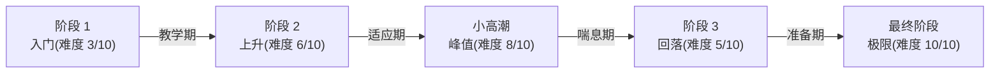
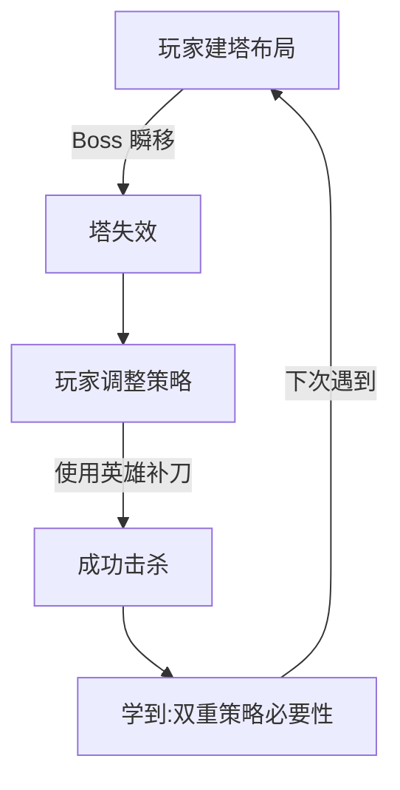

---
sidebarTitle: "Boss 战设计哲学"
title: "🧙‍♂️ Boss 战设计哲学"
---


# 🧙‍♂️ Boss 战设计哲学

## 📚 1. 理论基础 (Theoretical Basis)

### 🎯 核心定义

**Boss（首领/头目）** 是游戏中设计用来测试玩家技能掌握度的特殊敌人，通常具有以下特征：

- 高于普通敌人的生命值和攻击力
- 独特的机制和攻击模式
- 明确的阶段划分
- 专属的战斗场地和音乐

**Boss 战的核心目的**：

1. **技能检验点 (Skill Gate)** - 确保玩家掌握了核心机制
2. **高潮节点 (Climax)** - 提供情绪上的爆发点

3. **奖励发放点 (Reward Node)** - 给予重要战利品和成就感

### 📐 设计理论

#### 1. 柱阶段系统 (Pillar Phase Design)

经典 Boss 战通常采用 **3-4 阶段** 设计，每个阶段称为一个"柱"：

```
生命值      阶段特性
100% ─┐     第一柱：教学阶段（攻击模式简单）
      │
75%  ─┼─    第二柱：提速阶段（攻击速度 +30%）
      │
50%  ─┼─    第三柱：混合阶段（组合技出现）
      │
25%  ─┼─    第四柱：绝命阶段（大招频繁 + 狂暴）
      │
0%   ─┘     胜利
```

**阶段设计公式**:

```
Phase_Difficulty = Base_Difficulty × (1 + Phase_Index × Scaling_Factor)

推荐参数:
- Phase_Index: 0, 1, 2, 3 (阶段索引)
- Scaling_Factor: 0.2 ~ 0.4 (每阶段难度增幅)
```

#### 2. 电报系统 (Telegraph System)

Boss 的攻击必须有**可读懂的前摇 (Tell)**，遵循"电报原则"：

```
威力越大 → 前摇越长 → 惩罚越重

示例:
┌──────────────────────────────────────┐
│ 攻击类型     │ 前摇时间 │ 伤害  │ 惩罚  │
├──────────────────────────────────────┤
│ 普通斩击     │  0.3s   │ 10%  │ 无   │
│ 重击         │  0.8s   │ 30%  │ 击晕  │
│ 终结技       │  2.0s   │ 80%  │ 秒杀  │
└──────────────────────────────────────┘
```

**电报设计三要素**:

1. **视觉提示**: 蓄力特效、发光、颜色变化
2. **听觉提示**: 音效提前 0.2 秒播放

3. **位置提示**: 攻击范围指示器（红圈、扇形区域）

#### 3. 学习曲线模型 (Learning Curve)

优秀的 Boss 战遵循 **"公平但困难"** 原则：


**平均击败次数理论值**:

- **新手友好**: 3-5 次尝试
- **正常难度**: 5-10 次尝试
- **硬核难度**: 10-50 次尝试
- **超难关卡**: 50+ 次尝试（如魂系列）

#### 4. Boss 战心理学

##### 爽点设计公式

```
成就感 = (难度挑战 × 克服过程) + (视觉反馈 + 听觉反馈)

关键要素:
- 难度挑战: 适度挫败（不能太简单）
- 克服过程: 可感知的进步
- 视觉反馈: 血条突破、阶段转换特效
- 听觉反馈: 音乐变化、台词触发
```

##### 挫败感控制

| 糟糕设计                | 优秀设计                    |
| ----------------------- | --------------------------- |
| ❌ 一击秒杀（无法学习） | ✅ 留活命机会（1-2 次容错） |
| ❌ 随机不可预测攻击     | ✅ 有规律可循的循环         |
| ❌ 过长的无敌时间       | ✅ 伤害窗口明确             |
| ❌ 战斗后无存档点       | ✅ Boss 门前自动存档        |

---

## 🛠️ 2. 实践应用 (Practical Implementation)

### 🎮 Vampirefall Boss 设计框架

#### 混合品类的挑战与机遇

Vampirefall 的**塔防 + 肉鸽 + Looter** 架构为 Boss 战带来独特可能性：

| 维度       | 传统 Boss 设计 | Vampirefall 创新点         |
| ---------- | -------------- | -------------------------- |
| **空间**   | 固定竞技场     | **塔防地图上的移动 Boss**  |
| **资源**   | 玩家技能为主   | **塔 + 角色联动输出**      |
| **奖励**   | 固定掉落       | **智能掉落 + 词条强化**    |
| **重玩性** | 记忆攻击模式   | **随机词条改变 Boss 属性** |

#### 三层 Boss 设计系统

```
┌─────────────────────────────────────────┐
│ 1. 静态基线 (Boss 原型)                 │
│    - 基础血量、伤害、移动速度          │
│    - 核心攻击模式（3-4 种）            │
├─────────────────────────────────────────┤
│ 2. 阶段变异 (Phase Modifiers)          │
│    - 每 25% 血量触发新阶段             │
│    - 召唤小怪 / 改变移动模式           │
├─────────────────────────────────────────┤
│ 3. 词条增幅 (Affix Layer)              │
│    - 地图词条影响 Boss                 │
│    - 例: "火焰灌注" → Boss 攻击附带燃烧 │
└─────────────────────────────────────────┘
```

### 🧩 设计深度分析

#### 1. Boss 复杂度分层理论

Boss 设计需要在**可学习性**与**挑战性**之间找到平衡点,我们采用三层复杂度模型:

**Layer 1: 基础模式层 (Pattern Foundation)**

- **目的**: 让玩家快速理解 Boss 的核心行为
- **特征**: 单一攻击模式循环,前摇明显,惩罚轻微
- **设计要点**:
  - 前 3 次攻击应该完全相同(建立肌肉记忆)
  - 攻击间隔 2-3 秒(给予充足反应时间)
  - 失误惩罚: 10-15% 生命值(允许 6-7 次犯错)

**Layer 2: 变化引入层 (Variation Introduction)**

- **目的**: 在熟悉基础后引入不确定性
- **特征**: 2-3 种攻击模式随机组合,需要即时判断
- **设计要点**:
  - 不同攻击的识别特征必须差异化(避免混淆)
  - 保留"安全窗口"(攻击后 1-2 秒的输出时间)
  - 失误惩罚: 20-25% 生命值(允许 4-5 次犯错)

**Layer 3: 极限考验层 (Mastery Challenge)**

- **目的**: 测试玩家对所有机制的综合掌握
- **特征**: 多重攻击叠加,环境危险,时间压力
- **设计要点**:
  - 组合攻击有明确的"解法"(不是纯反应力测试)
  - 保留 1 个稳定的容错机制(如可破坏的弹幕)
  - 失误惩罚: 30-40% 生命值(允许 2-3 次犯错)

#### 2. 节奏设计的呼吸理论

优秀的 Boss 战遵循**"紧张-放松"循环**,类似音乐的节拍:

```
状态曲线:
压力值
  ↑
100%┤     ╱╲         ╱╲         ╱╲
    │    ╱  ╲   ╱╲  ╱  ╲       ╱  ╲
 50%┤   ╱    ╲ ╱  ╲╱    ╲     ╱    ╲
    │  ╱      ╲╱          ╲   ╱      ╲
  0%└─────────────────────────────────→ 时间
     攻   恢  攻  恢   攻    恢  攻    恢
     击   复  击  复   击    复  击    复
```

**设计法则**:

- **攻击相位 (20-30 秒)**: 高密度攻击,限制走位空间
- **恢复相位 (5-10 秒)**: Boss 进入易伤状态或召唤小怪
- **节奏比例**: 攻击:恢复 ≈ 3:1 (70% 压力 + 30% 喘息)
- **阶段转换**: 强制 2-3 秒无敌时间(重置玩家心态)

**反面案例**: 持续高压 Boss(如某些糟糕的弹幕游戏 Boss)会导致:

- 玩家疲劳度快速累积
- 无法感知进度(缺少成就节点)
- 重试意愿降低(挫败感大于成就感)

#### 3. 难度曲线的峰谷设计

Boss 战的难度不应该是线性增长,而是**波浪形上升**:



**设计理念**:

- 第 1-2 阶段: 逐步升温,建立信心
- 中期峰值: 制造"小 boss 战"感觉(如召唤大量小怪)
- 刻意回落: 给予成就感(玩家觉得"我变强了")
- 最终爆发: 前面所有机制的综合考验

#### 4. Vampirefall 特有:混合品类设计方法论

**挑战: 如何平衡"塔防静态策略"与"Boss 战动态对抗"?**

**解决方案: 双重决策层设计**

**决策层 1: 预战布局 (塔防思维)**

- **时间段**: Boss 出现前 30-60 秒
- **玩家行为**: 根据 Boss 类型选择塔的位置和种类
- **设计要点**:
  - Boss 的路径应该可预测(允许提前布防)
  - 不同 Boss 有"克星塔"(鼓励多样化建造)
  - 预留"调整窗口"(Boss 出现后可短时间重建)

**决策层 2: 战中应变 (动作思维)**

- **时间段**: Boss 战斗中
- **玩家行为**: 操控角色躲避攻击并输出伤害
- **设计要点**:
  - 塔只承担 40-50% 伤害(不能纯挂机)
  - Boss 的某些攻击**必须由玩家移动躲避**
  - 塔可以"牵制" Boss(减缓移动,打断技能)

**冲突点设计**: Boss 应该有"反塔机制"迫使玩家参与:

| Boss 类型  | 反塔机制                | 玩家应对             |
| ---------- | ----------------------- | -------------------- |
| **重装型** | 无视塔的前 50% 伤害     | 玩家必须近战输出     |
| **疾行型** | 移动速度过快,塔难以锁定 | 玩家用技能减速       |
| **摧毁型** | 主动攻击并摧毁塔        | 玩家引开 Boss 注意力 |
| **反射型** | 反弹塔的远程攻击        | 关闭部分塔,改用近战  |

#### 5. 肉鸽兼容性:重玩性设计

**问题**: 玩家可能需要击败同一个 Boss 50+ 次,如何避免重复疲劳?

**解决方案: 固定框架 + 随机变量**

**固定框架** (保证公平性):

- Boss 的核心攻击模式不变(3-4 种)
- 阶段触发血量阈值固定
- 伤害窗口位置固定

**随机变量** (保证新鲜感):

- **词条系统变异** (每次随机 1-3 个):

  - "极速再生": 每秒回复 2% 生命值 → 必须高爆发击杀
  - "荆棘反伤": 受伤时反弹 20% 伤害 → 需要回血装备
  - "分身幻影": 第二阶段召唤 1 个分身 → 优先处理目标变化
  - "元素灌注": 所有攻击附带随机元素 → 需要对应抗性
  - "狂暴": 低血量时攻速 +50% → 需要控制技能

- **环境随机性**:

  - 场地陷阱位置随机生成
  - 可利用的掩体数量变化
  - 天气效果影响(雨天视野降低,雷电增伤等)

- **掉落动态调整**:
  - 基于当前 Build 的智能掉落
  - 首次击败有保底珍稀奖励
  - 速通 / 无伤有额外奖励

#### 6. 视听语言的心理暗示

Boss 战的**非数值体验**往往比数值更重要:

**音乐设计三段论**:

1. **前奏 (Boss 登场)**: 低沉缓慢,营造压迫感
2. **主旋律 (战斗主相位)**: 激昂旋律,同步攻击节奏
3. **终章 (最后阶段)**: 加速版主旋律 + 合唱,制造高潮

**特效的信息传递**:

| 特效类型     | 传递信息     | 设计要点                   |
| ------------ | ------------ | -------------------------- |
| **蓄力光环** | "危险将至"   | 颜色从蓝 → 黄 → 红渐变     |
| **阶段转换** | "新挑战开始" | 全屏闪光 + 震屏 + 慢动作   |
| **破甲特效** | "弱点暴露"   | Boss 身体出现裂纹,发光部位 |
| **狂暴状态** | "时间紧迫"   | Boss 全身红光,粒子密度增加 |

**台词系统的情感连接**:

- **第 1 次遇到**: 完整的威胁台词("你将后悔踏入此地!")
- **第 2-10 次**: 简化版本("又是你...")
- **第 10+ 次**: 彩蛋台词("你还要来多少次?")
- **特殊条件**: 无伤击败("不可能..."),速通("这...怎么可能!")

---

### 🎯 Vampirefall Boss 类型设计指南

#### MiniBoss (小 Boss) - 每 3-5 关

**设计目标**: 强化版精英怪,测试单一机制掌握度

**特征**:

- 战斗时长: 60-90 秒
- 核心机制: 1-2 种特殊攻击
- 阶段数: 2 个(50% 血量触发)
- 难度定位: 正常玩家 1-2 次通过

**设计模板**:

- 第一阶段: 普通攻击 + 1 种特殊技能
- 第二阶段: 攻击速度 +30%,添加召唤小怪
- 奖励: 保底精良装备 + 金币

**示例**: "狂战士小队长"

- 核心机制: 蓄力冲锋(可用障碍物阻挡)
- 阶段 2 变化: 召唤 3 个小兵,冲锋冷却减半
- 教学目的: 让玩家学会"环境利用"

#### ChapterBoss (章节 Boss) - 每 10 关

**设计目标**: 里程碑挑战,综合测试玩家成长

**特征**:

- 战斗时长: 3-5 分钟
- 核心机制: 3-4 种特殊攻击
- 阶段数: 3-4 个
- 难度定位: 正常玩家 3-5 次通过

**设计模板**:

- 第一阶段 (100%-75%): 单一模式循环,教学性质
- 第二阶段 (75%-50%): 引入第二种攻击,形成组合
- 第三阶段 (50%-25%): 召唤小怪 + 环境危险
- 第四阶段 (25%-0%): 狂暴,所有技能混合使用

**示例**: "暗影巨龙"

- 阶段 1: 扫尾攻击 + 火球吐息
- 阶段 2: 添加飞行俯冲(留下火焰地带)
- 阶段 3: 召唤小龙,场地出现岩浆池
- 阶段 4: 所有技能冷却减半,满场岩浆

#### WorldBoss (世界 Boss) - 赛季特殊事件

**设计目标**: 社区挑战,炫耀性内容

**特征**:

- 战斗时长: 5-10 分钟
- 核心机制: 5+ 种特殊攻击机制
- 阶段数: 4-5 个,每阶段差异巨大
- 难度定位: 需要特定 Build 或多次尝试

**特殊设计**:

- **排行榜**: 最快击败时间,最高伤害等
- **限时挑战**: 仅在特定日期 / 时段出现
- **独特奖励**: 赛季限定装备外观

#### SecretBoss (隐藏 Boss) - 彩蛋

**设计目标**: 给硬核玩家的额外奖励

**特征**:

- 触发条件: 隐藏房间,特殊操作,收集品等
- 难度: 远超同等级普通 Boss
- 奖励: 特殊成就 + 稀有装备

**示例**: "时间守护者"

- 触发条件: 在同一关卡中击败 Boss 3 次(每次 Boss 会更强)
- 特殊机制: 可以"倒带"战斗,回复生命值
- 奖励: 传说装备"时间沙漏"

---

## 🌟 3. 业界优秀案例 (Industry Best Practices)

### 🎮 案例 1: **Kingdom Rush - 塔防类 Boss**

#### 核心机制分析

Kingdom Rush 的 Boss 设计巧妙平衡了**塔防的静态部署**和 **Boss 战的动态对抗**。

**经典案例: Vez'nan(最终 Boss) 深度解析**

```
阶段 1 (100% → 66%): 建立基础认知
━━━━━━━━━━━━━━━━━━━━━━━━━━
- 缓慢移动,血量厚实(给予观察时间)
- 定期召唤骷髅小兵(干扰塔的输出)
- 教学阶段:让玩家理解"控制小兵 + 集火 Boss"

设计意图:
→ 测试玩家的资源分配能力(塔是清小怪还是打 Boss?)
→ 节奏缓慢,允许犯错和调整

阶段 2 (66% → 33%): 引入复杂度
━━━━━━━━━━━━━━━━━━━━━━━━━━
- 瞬移机制(跳过塔的火力网) → 打破塔防安全感
- 范围魔法攻击(必须用英雄躲避) → 强制玩家参与
- 混合挑战:塔防思维 + 动作反应

设计意图:
→ 破坏玩家建立的"舒适区"(纯塔防策略)
→ 引入手动操作要求,提升参与感
→ 测试玩家的多任务处理能力

阶段 3 (33% → 0%): 极限压力测试
━━━━━━━━━━━━━━━━━━━━━━━━━━
- 狂暴:攻击速度翻倍,行动更激进
- 终极技:陨石雨(全屏AOE,必须精确走位)
- 小兵 + 瞬移 + 魔法同时在场

设计意图:
→ 制造"背水一战"的紧张感
→ 考验玩家对所有机制的综合掌握
→ 高潮期的情绪爆发点
```

**设计哲学深度剖析**:

**1. 渐进式复杂度 (Progressive Complexity)**

- 阶段 1: 单一挑战维度(资源管理)
- 阶段 2: 双重挑战(管理 + 操作)
- 阶段 3: 多重挑战叠加(管理 + 操作 + 时间压力)

这种设计遵循**心理学中的"小步快跑"原则**,避免认知负荷突然爆炸。

**2. 强制参与机制 (Mandatory Engagement)**

瞬移和范围魔法的设计目的是**打破"塔防挂机"的幻想**:

- 如果 Boss 只是血厚的普通敌人 → 玩家建塔后可以离开
- 引入瞬移 → 塔的位置需要动态调整
- 引入范围魔法 → 必须手动控制英雄躲避

**心理效果**: 玩家从"旁观者"变为"参与者",成就感显著提升。

**3. 反馈循环设计 (Feedback Loop)**



Kingdom Rush 的 Boss 设计确保**每次失败都能提供明确的学习点**。

**Vampirefall 深度借鉴**:

**核心设计原则**:

1.  **塔防 Boss 的"三不原则"**:

    - ❌ 不能被塔完全克制(必须有反塔机制)
    - ❌ 不能无视塔(塔应该有 40-50% 贡献)
    - ❌ 不能让玩家纯观战(必须有手动操作要求)

2.  **阶段转换的"仪式感"设计**:

    - 🎬 **视觉**: 全屏特效 + Boss 形态变化
    - 🎵 **听觉**: 音乐转调 + Boss 台词
    - ⏸️ **节奏**: 2-3 秒无敌时间(让玩家重置心态)

3.  **塔与角色的协同设计**:
    - 塔:持续稳定伤害(40-50%)
    - 角色:爆发伤害 + 控制(50-60%)
    - Boss 机制应该**同时挑战两者**,而非只针对其一）

---

### 🎮 案例 2: **Hades - 肉鸽类 Boss**

#### 核心机制:重玩性的艺术

Hades 的 Boss 设计是**肉鸽类的教科书**,解决了最核心的矛盾:

> "如何让玩家在 50+ 次 Run 中反复击败同一 Boss 而不感到厌烦?"

**设计三要素**:

1.  **固定的核心模式**(可学习,保证公平)
2.  **随机的词条变异**(重玩性,制造新鲜感)
3.  **对话与剧情整合**(情感联结,增加记忆点)

**经典案例: 九头蛇 Lernie 深度解析**

```
━━━━━━━━━━━━━━━━━━━━━━━━━━━━━━━━━━
核心模式(固定): 可预测的公平性
━━━━━━━━━━━━━━━━━━━━━━━━━━━━━━━━━━
基础结构:
- 3 个头,每个头有独立血条
- 击败其中一个头后会再生 2 个小头("九头蛇"特性)

攻击模式:
- 左头:横扫攻击(近战范围,可闪避)
- 中头:远程吐息(弹道可预判)
- 右头:冲锋撞击(蓄力明显,高伤害)

弱点设计:
- 主头击败后有 3 秒易伤窗口
- 小头血量较低,可快速清理

→ 学习曲线:第 1-3 次 Run 掌握基础模式

━━━━━━━━━━━━━━━━━━━━━━━━━━━━━━━━━━
词条变异(随机): 战术多样性
━━━━━━━━━━━━━━━━━━━━━━━━━━━━━━━━━━
Run 1: "强化装甲"
→ 伤害减免 +30%
→ 玩家应对:切换高穿透武器或百分比伤害

Run 2: "极速再生"
→ 每秒回复 2% 生命值
→ 玩家应对:必须高爆发,速战速决

Run 3: "召唤增援"
→ 每 15 秒刷 5 个小怪
→ 玩家应对:优先清怪 vs 集火 Boss 的决策

Run 4: "元素灌注 - 岩浆"
→ 所有攻击附带燃烧 DoT
→ 玩家应对:需要火抗装备或回血机制

→ 每次 Run 的最优策略都不同,需要动态调整

━━━━━━━━━━━━━━━━━━━━━━━━━━━━━━━━━━
剧情整合: 情感粘性
━━━━━━━━━━━━━━━━━━━━━━━━━━━━━━━━━━
第 1 次击败:
扎格雷乌斯:"一只九头蛇而已,小菜一碟。"
→ 建立主角自信的人设

第 10 次击败:
扎格雷乌斯:"又是你,老朋友..."
→ 暗示重复的宿命感(契合肉鸽主题)

第 50 次击败:
扎格雷乌斯:"我都数不清这是第几次了..."
九头蛇:(低吼)似乎也认出了你
→ 彩蛋对话,奖励硬核玩家

特殊条件(无伤击败):
扎格雷乌斯:"完美!父亲都做不到这么干净利落。"
→ 成就感强化
```

**设计哲学深度剖析**:

**1. 固定框架的心理安全感**

肉鸽游戏的核心痛点:**过度随机性导致挫败感**

- ❌ 糟糕设计:Boss 每次都完全不同 → 无法学习,感觉不公平
- ✅ Hades 方案:核心模式固定 → 玩家可以**通过练习变强**

**心理学原理**: **掌控感 (Sense of Control)** 是玩家持续游玩的关键动力。

**2. 词条系统的策略深度**

Hades 的词条不是简单的"Boss 血量 +50%",而是**改变最优玩法**:

| 词条类型 | 传统设计(无聊) | Hades 设计(有趣)               |
| -------- | -------------- | ------------------------------ |
| 增强防御 | Boss 血量 +50% | 伤害减免 +30%,穿透武器价值提升 |
| 增强攻击 | Boss 伤害 +30% | 攻速 +50%,闪避时机更苛刻       |
| 特殊词条 | 无             | 反伤机制,需要改变输出节奏      |

**设计原则**: 词条应该**改变玩法**,而非单纯改变数值。

**3. 剧情整合的情感价值**

Hades 的 Boss 不是"无名怪物",而是**有记忆的角色**:


这种设计让**重复不再是负担,而是一种陪伴**。

**Vampirefall 深度借鉴**:

**1. 词条系统设计原则**:

基础词条池(5-10 个,每次随机 1-3 个):

| 词条名称 | 机制改变                | 玩家应对策略        |
| -------- | ----------------------- | ------------------- |
| **铁壁** | 物理伤害减免 50%        | 切换元素伤害塔/装备 |
| **疾风** | 移动速度 +80%           | 使用减速塔/技能     |
| **吸血** | 每次攻击回复 3% 生命    | 高爆发秒杀/致死伤害 |
| **分裂** | 死亡时分裂成 2 个子体   | 需要 AOE 清理能力   |
| **狂怒** | 低于 30% 血时攻速 +100% | 预留保命技能        |

**设计要点**:

- 词条应该**互相冲突**(铁壁 + 疾风 = 又硬又快,极难)
- 玩家的 Build 应该有**天然克制**某些词条
- 某些词条组合应该是**彩蛋**(如"铁壁+吸血+分裂" = 超难挑战)

**2. 重玩性的数学模型**:

```
重玩价值 = (核心乐趣 × 学习曲线) + (随机性 × 策略多样性)

Hades 配方:
核心乐趣: 8/10 (战斗手感优秀)
学习曲线: 7/10 (可通过练习掌握)
随机性: 6/10 (词条 + Build 组合)
策略多样性: 9/10 (每次都有最优解)

→ 总分: (8 × 7) + (6 × 9) = 110
```

**3. 对话系统的"记忆感"设计**:

Vampirefall 可实现简化版:

- **首次击败**: 完整过场动画 + 奖励特写
- **第 2-9 次**: 简短台词("又见面了...")
- **第 10 次**: 特殊彩蛋对话 + 额外奖励
- **第 50 次**: Boss 识别玩家,改变行为模式(例如直接开狂暴)
- **特殊条件**: 无伤/速通/特定 Build 击败 → 专属成就

**技术实现**: 记录玩家击败特定 Boss 的次数和条件,触发动态对话。）

---

### 🎮 案例 3: **Dark Souls - 动作类 Boss**

#### 核心机制:"困难但公平"的哲学

魂系列 Boss 遵循**"困难但公平" (Difficult but Fair)** 的铁律,这是游戏设计中最难实现的平衡点。

**核心设计原则的深层逻辑**:

**原则 1: 所有攻击都可躲避 (No Unavoidable Damage)**

```
公平性方程:
玩家死亡 = 玩家失误,而非系统不公

糟糕设计:
❌ 无前兆的秒杀技能
❌ 不可预测的随机攻击
❌ 过快的攻击链(反应时间 < 人类极限)

魂系列设计:
✅ 每个攻击都有明确的"Tell"(前摇)
✅ 攻击模式遵循内在逻辑(不是纯随机)
✅ 玩家总有"出路"(翻滚无敌帧/格挡/走位)

→ 心理效果:玩家觉得"我还可以做得更好",而非"游戏太不公平"
```

**原则 2: 每次死亡都是学习机会 (Death as Tutorial)**

魂系列独特之处:**将死亡变成教学工具**

```
学习循环:
尝试 1 → 观察 Boss 攻击模式
尝试 2 → 理解躲避时机
尝试 3 → 识别反击窗口
尝试 4 → 掌握阶段转换
尝试 5+ → 优化操作,追求完美

关键设计:
1. Boss 攻击模式固定且有规律(可记忆)
2. 死亡惩罚适中(失去魂但可回收,不倒退太多)
3. 复活点靠近 Boss 房间(减少重试成本)

→ 对比传统游戏:死亡 = 挫败感 vs 魂系列:死亡 = 进步的证明
```

**原则 3: 成就感设计 (Earned Victory)**

```
成就感公式:
满足度 = (挑战难度 × 尝试次数) × (胜利瞬间的视听冲击)

魂系列特色:
- 挑战难度: 8-10/10 (远高于主流游戏)
- 平均尝试次数: 10-50 次(建立"征服感")
- 胜利瞬间:
  → 视觉:"Victory Achieved" 特写 + 慢动作
  → 听觉:胜利音效峰值
  → 触觉:手柄震动
  → 奖励:大量魂 + Boss 武器/装备

→ 心理学原理:付出越多,价值感越高(沉没成本效应的正向利用)
```

**经典案例: Ornstein & Smough 深度解析**

这是游戏史上最经典的双 Boss 战设计之一,体现了多重设计层次:

```
━━━━━━━━━━━━━━━━━━━━━━━━━━━━━━━━━━
第一阶段:双重压力测试
━━━━━━━━━━━━━━━━━━━━━━━━━━━━━━━━━━
角色设定:
- Ornstein(快):高速刺击,跳跃攻击,灵活走位
- Smough(慢):重型战锤,缓慢但伤害爆炸,范围控制

设计意图:
→ 快慢搭配迫使玩家**分割注意力**
→ 玩家无法"专心对付一个",必须同时应对两者
→ 场地管理:利用柱子分隔两 Boss,创造 1v1 窗口

核心挑战:
1. 注意力分配(70% 进攻目标 + 30% 另一个 Boss)
2. 场地利用(柱子阻挡 Smough,同时对抗 Ornstein)
3. 资源管理(回血药水有限,何时使用是关键决策)

━━━━━━━━━━━━━━━━━━━━━━━━━━━━━━━━━━
第二阶段:分支结局设计
━━━━━━━━━━━━━━━━━━━━━━━━━━━━━━━━━━
路径 A:先击杀 Ornstein
→ Smough 吸收力量,变成巨型形态
→ 伤害翻倍,攻击范围扩大,新增雷电属性
→ 速度仍然慢,但一击可秒杀
→ 玩家策略:极致走位,耐心等待攻击后的硬直

路径 B:先击杀 Smough
→ Ornstein 获得巨型化 + 闪电能力
→ 保留高速特性,攻击附带雷电 AOE
→ 更难对抗(速度 + 范围 + 伤害)
→ 玩家策略:必须完美翻滚,利用无敌帧

设计天才之处:
→ 同一个 Boss 战,两种完全不同的体验
→ 增加重玩价值(尝试两种路径)
→ 玩家可以根据自己的 Build 选择路径(力量型 vs 敏捷型)
```

**电报系统大师课:**

魂系列的电报设计是业界标杆,每个攻击遵循**"危险度 = 前摇时间 + 后摇硬直"**的平衡:

| 攻击类型       | 前摇时间 | 视觉提示            | 听觉提示            | 伤害       | 后摇硬直 | 玩家反击窗口     |
| -------------- | -------- | ------------------- | ------------------- | ---------- | -------- | ---------------- |
| **普通刺击**   | 0.4s     | 举枪蓄力            | 轻微破风声          | 低(15%)    | 0.8s     | ✅ 可反击 1-2 下 |
| **跳跃猛击**   | 1.2s     | 高高跃起            | 大吼                | 中高(35%)  | 1.5s     | ✅ 可反击 3-4 下 |
| **闪电冲锋**   | 2.0s     | 全身发光 + 电流缠绕 | 电流爆鸣 + 音乐渐强 | 极高(60%)  | 2.0s     | ✅✅ 大反击窗口  |
| **双人联合技** | 3.0s     | 两 Boss 同时蓄力    | 特殊音效            | 秒杀(100%) | 3.0s     | ✅✅✅ 巨大破绽  |

**设计黄金法则**:

> **"前摇时间 = 反应窗口" + "伤害威力 = 反击奖励"**

```
平衡公式:
反击价值 = (攻击伤害 ÷ 10) × 后摇硬直时间

示例:
闪电冲锋 → 60% 伤害,2 秒硬直 → 反击价值 = 6 × 2 = 12
普通刺击 → 15% 伤害,0.8 秒硬直 → 反击价值 = 1.5 × 0.8 = 1.2

→ 高风险攻击必须给予高回报反击窗口
→ 玩家学会"等待大招"而非贪刀
```

**心理学深度:为何"困难但公平"如此吸引人?**

**1. 自我效能感 (Self-Efficacy)**

心理学研究表明,人类最满足的成就来自:**可量化的进步感**

```
魂系列的天才设计:
第 1 次:Boss 秒杀我 → 感觉不可战胜
第 5 次:我能打掉 30% 血 → 有进步!
第 10 次:打到第二阶段 → 我在变强!
第 20 次:击败! → 我征服了"不可能"

vs 糟糕设计:
每次都被随机秒杀 → 感觉无力,无法量化进步
```

**2. 心流状态 (Flow State)**

魂系列 Boss 战完美契合心理学家 Mihaly Csikszentmihalyi 的"心流理论":

```
心流触发条件:
1. 明确的目标(击败 Boss)
2. 即时反馈(每次攻击的伤害数字,Boss 的反应)
3. 挑战与技能平衡(难但可学习)

魂系列实现:
- 目标:✅ 击败 Boss,进入下一区域
- 反馈:✅ 每次攻击都有明确的视听反馈
- 平衡:✅ 初期很难,但通过练习可掌握

→ 玩家进入"忘我"状态,几个小时感觉像几分钟
```

**Vampirefall 深度借鉴**:

**1. 双/多 Boss 机制的设计法则**:

```
单 Boss vs 双 Boss 设计差异:

单 Boss:
- 注意力:100% 集中在一个目标
- 学习曲线:线性(掌握一套模式)
- 容错率:中等

双 Boss:
- 注意力:分散(70-30 或 50-50)
- 学习曲线:指数级(两个模式 + 互动)
- 容错率:低(失误惩罚大)

Vampirefall 实现建议:
- 章节 Boss:单体为主
- 挑战 Boss / 隐藏 Boss:双 / 多 Boss
- 双 Boss 必须"性格互补"(快慢,近远,物魔等)
```

**2. 电报系统的精确设计**:

Vampirefall 应建立**"电报设计数据库"**:

| Boss 类型    | 低危攻击 | 中危攻击 | 高危攻击 | 秒杀技   |
| ------------ | -------- | -------- | -------- | -------- |
| **前摇时间** | 0.3-0.5s | 0.8-1.2s | 1.5-2.5s | 3.0s+    |
| **伤害比例** | 10-15%   | 25-35%   | 50-70%   | 90-100%  |
| **视觉提示** | 轻微动作 | 明显蓄力 | 全身特效 | 全屏警告 |
| **听觉提示** | 无/轻微  | 音效明显 | 音效峰值 | 音乐变化 |
| **后摇硬直** | 0.5s     | 1.0s     | 2.0s     | 3.0s     |

**3. 失败成本优化**:

魂系列的"Boss 门前篝火"设计值得学习:

```
Vampirefall 应用:
- Boss 战前自动存档点
- 死亡后可立即重试(无需重新走地图)
- 保留玩家的 Buff 状态(减少准备时间)
- 显示"尝试次数"统计(让玩家感知进步)

心理效果:
降低重试成本 → 玩家更愿意尝试 → 学习效率提升 → 成就感更强
```

---

### 🎮 案例 4: **Cuphead - 横版多阶段 Boss**

#### 核心机制:视觉节奏与密集阶段设计

Cuphead 的 Boss 设计是**纯粹的模式记忆 + 反应力测试** + **视觉艺术的极致表达**。

**设计特色深度剖析**:

**1. 短平快的战斗节奏 (High-Intensity Short Battles)**

与传统 Boss 战不同,Cuphead 采用**"高密度体验"**策略:

```
传统 Boss 战 vs Cuphead Boss 战:

传统设计(如魂系列):
- 战斗时长: 5-10 分钟
- 阶段数: 3-4 个
- 阶段间隔: 较长(每阶段 2-3 分钟)
- 学习曲线: 渐进式
→ 适合耐心型玩家

Cuphead 设计:
- 战斗时长: 2-4 分钟
- 阶段数: 4-6 个(甚至更多)
- 阶段间隔: 极短(每阶段 30-60 秒)
- 学习曲线: 陡峭
→ 适合高强度刺激爱好者

设计理念:
"Boss 战就像过山车,短暂但极其刺激"
```

**2. 阶段密集切换的心理设计**

Cuphead 的 Boss 平均 **每 30-40 秒切换一次阶段**,这是精心设计的:

```
心理学分析:

人类注意力集中峰值: 约 30-45 秒(短期注意力)

Cuphead 利用这一特性:
阶段 1 (0-40s)    → 玩家全神贯注,学习模式
阶段切换 (40s)    → 视觉冲击重置注意力
阶段 2 (40-80s)   → 新鲜感延续专注度
阶段切换 (80s)    → 再次重置
...

vs 传统长阶段设计:
阶段 1 (0-180s)   → 0-60s 专注,60-180s 开始疲劳
→ 中后期注意力涣散,易失误

Cuphead 设计目标:
通过频繁的视觉刺激保持玩家**持续肾上腺素峰值**
```

**3. 视觉狂欢的设计哲学 (Visual Spectacle)**

Cuphead 的每个阶段都有**完全不同的美术和动画**,这不是纯粹的炫耀,而是有深层设计目的:

```
视觉多样性 = 记忆锚点 (Memory Anchors)

人类记忆机制:
- 相似画面容易混淆
- 视觉差异巨大的场景更容易记忆
- 情绪波动大的时刻记忆最深刻

Cuphead 应用:
阶段 1:美人鱼在水面
→ 记忆锚点:"蓝色水面 + 泡泡"

阶段 2:石化光线
→ 记忆锚点:"黄色眼睛发光 + 掩体"

阶段 3:美杜莎形态
→ 记忆锚点:"头发变蛇 + 紫色背景"

→ 玩家可以快速识别"我现在在哪个阶段,应该做什么"
```

**经典案例: Cala Maria(美人鱼 Boss) 深度解析**

```
━━━━━━━━━━━━━━━━━━━━━━━━━━━━━━━━━━
阶段 1: 水面战斗 (0-30s)
━━━━━━━━━━━━━━━━━━━━━━━━━━━━━━━━━━
核心机制:
- 吐泡泡弹幕(可射击破坏)
- 召唤飞鱼(次要威胁)

设计意图:
→ 教学阶段:让玩家熟悉"躲避 + 输出"的基本节奏
→ 难度: 3/10

视觉特征:
- 明亮的蓝色水面
- 轻松的音乐前奏
→ 给玩家"我能行"的错觉

━━━━━━━━━━━━━━━━━━━━━━━━━━━━━━━━━━
阶段 2: 石化光线 (30-60s)
━━━━━━━━━━━━━━━━━━━━━━━━━━━━━━━━━━
核心机制:
- 眼睛发射石化射线(必须躲在掩体后)
- 电鳗攻击(从水下冒出)

设计意图:
→ 引入新机制:掩体利用(改变玩法)
→ 难度: 6/10

视觉特征:
- 黄色光线特效
- 音乐开始加速
→ 升温,制造紧张感

━━━━━━━━━━━━━━━━━━━━━━━━━━━━━━━━━━
阶段 3: 美杜莎形态 (60-90s)
━━━━━━━━━━━━━━━━━━━━━━━━━━━━━━━━━━
核心机制:
- 头发变成蛇(独立攻击单位,必须先清理)
- 全屏弹幕地狱
- 可利用空间大幅缩小

设计意图:
→ 高潮期:测试玩家对前两阶段机制的融合掌握
→ 难度: 9/10

视觉特征:
- 紫色背景 + 蛇的绿色
- 音乐高潮爆发,加入合唱
→ 情绪峰值

━━━━━━━━━━━━━━━━━━━━━━━━━━━━━━━━━━
阶段 4: 棺材形态 (90-120s)
━━━━━━━━━━━━━━━━━━━━━━━━━━━━━━━━━━
核心机制:
- 最后的绝命攻势
- 所有前期攻击的混合快速循环
- 血量很少,但躲避难度极高

设计意图:
→ "假死复活"惊吓 → "背水一战"紧张感
→ 难度: 10/10 (短时间内)

视觉特征:
- 暗红色棺材 + 骷髅装饰
- 音乐进入疯狂节奏
→ 绝望感 + 最后冲刺感
```

**设计哲学:"每个阶段 = 一个迷你 Boss"**

Cuphead 的天才之处在于:**没有把 Boss 战当作一个整体,而是 4-6 个独立的小挑战**

```
传统 Boss 设计思路:
"这是一个 Boss,有 3 个阶段"
→ 阶段只是血量门槛

Cuphead 设计思路:
"这是 5 个连续的 MiniBoss 战"
→ 每个阶段完全独立,可以单独设计

优势:
1. 玩家感觉"战胜了 5 次",成就感 × 5
2. 每个阶段可以有完全不同的玩法
3. 视觉疲劳低(每 30 秒画面大变)

劣势:
1. 制作成本极高(每阶段需要新美术)
2. 平衡难度大(每个阶段都要测试)
```

**节奏设计的数学模型**:

```
Cuphead Boss 战节奏公式:

总战斗时间 T = ∑(阶段时长 × 阶段数)
推荐:T = 120-180 秒 = 2-3 分钟

单个阶段时长:
- 太短(< 20s):玩家来不及学习模式
- 太长(> 60s):视觉疲劳,失去新鲜感
- 最优区间: 30-45 秒

阶段数量:
- 太少(< 3):缺乏层次感
- 太多(> 6):记忆负担过重
- 最优区间: 4-5 个阶段

总体难度曲线:
阶段 1: 30% 难度(建立信心)
阶段 2: 50% 难度(适应期)
阶段 3: 70% 难度(小高潮)
阶段 4: 60% 难度(喘息期,假死前)
阶段 5: 100% 难度("真·最终形态")
```

**动机心理学:"短期目标 vs 长期目标"**

Cuphead 巧妙地将**一个长期目标(击败 Boss)** 分解为 **多个短期目标(通过每个阶段)**:

```
心理学原理:
人类更容易被**短期可达成的目标**激励,而非遥远的终点。

传统 Boss 战:
目标:"击败这个 Boss"
→ 感觉遥远,中途容易放弃

Cuphead Boss 战:
目标 1:"撑过前 30 秒" ✅
目标 2:"学会躲石化光线" ✅
目标 3:"清理头发蛇" ✅
目标 4:"击败棺材形态" ✅
→ 最终成就:"击败 Cala Maria"

每个 ✅ 都是一次多巴胺分泌:
→ 玩家感觉"我在持续进步"
→ 重试意愿显著提升
```

**Vampirefall 深度借鉴**:

**1. 阶段设计的"独立性"原则**:

Vampirefall 可以借鉴 Cuphead 的**"阶段 = 迷你 Boss"** 思路:

```
章节 Boss 设计建议:

传统模式(可选):
- 3 个阶段,每阶段 60-90 秒
- 适合需要"沉浸感"的剧情 Boss

Cuphead 模式(推荐):
- 5 个阶段,每阶段 30-40 秒
- 适合需要"高强度刺激"的挑战 Boss

混合模式(平衡):
- 4 个阶段
- 阶段 1-2: 各 40 秒(较长,建立基础)
- 阶段 3: 60 秒(高潮,允许展示复杂机制)
- 阶段 4: 30 秒(最终冲刺,高密度)
```

**2. 视觉差异化的实现**:

即使预算有限,也可以通过**低成本方式**实现视觉差异:

| 阶段          | 视觉变化方法            | 成本 | 效果 |
| ------------- | ----------------------- | ---- | ---- |
| **颜色滤镜**  | Boss 变红,背景变暗      | 极低 | 中等 |
| **粒子特效**  | 加入火焰/冰霜粒子环绕   | 低   | 中高 |
| **环境改变**  | 地面裂开,岩浆涌出       | 中   | 高   |
| **Boss 形态** | Boss 换装/变大/召唤翅膀 | 中高 | 极高 |
| **UI 强化**   | 屏幕边缘特效,色差扭曲   | 低   | 中   |

**3. 音乐的动态分层**:

Cuphead 的音乐随阶段变化,Vampirefall 可以实现**分层音乐系统**:

```
技术实现(基于 Unity):

基础音轨(始终播放):
- Drums(鼓点,节奏)
- Bass(低音,氛围)

阶段 1: 只有 Drums + Bass
阶段 2: 添加 Melody(旋律)
阶段 3: 添加 Strings(弦乐,紧张感)
阶段 4: 全部 + Choir(合唱,高潮)

优势:
- 音乐平滑过渡(没有突兀的切换)
- 自动同步阶段节奏
- 成本较低(一套音乐多次利用)
```

**4. "假死复活"机制的心理冲击**:

Cuphead 的很多 Boss 都有**"假死复活"**设计,这是高级的心理操控:

```
心理效果分析:

玩家心理曲线:
阶段 3 结束 → Boss 血条清空
↓
玩家大脑:"赢了!" → 多巴胺分泌 → 放松警惕
↓
Boss 突然复活 → 新形态出现
↓
玩家反应:
- 惊讶(肾上腺素飙升)
- 背叛感("还没完?")
- 挑战欲("我都到这了,不能放弃!")
↓
最终击败 → 成就感 × 2(战胜了两次"终局")

Vampirefall 实现建议:
- 仅用于特殊 Boss(章节 Boss / 隐藏 Boss)
- 必须有明确的视觉提示(Boss "尸体"开始发光)
- 复活后的形态应该更强但血量少(不能太绝望)
- 奖励应该翻倍(补偿玩家的惊吓)
```

---

## 🔗 4. 参考资料 (References)

### 📄 学术与理论

1. **Boss Fight Design and Structure**  
   _Mark Brown - Game Maker's Toolkit_  
   [YouTube 视频](https://www.youtube.com/watch?v=8LhoIQ1h-yQ)

2. **The Art of Boss Battles**  
   _Extra Credits_  
   [YouTube 播放列表](https://www.youtube.com/watch?v=K1xgMrMvN8I)

### 📺 GDC 演讲

1. **[GDC 2018] Designing Cuphead's Bosses**  
   演讲者: Jared Moldenhauer (Studio MDHR)  
   [GDC Vault](https://www.gdcvault.com/play/1024998/)

2. **[GDC 2019] The Boss Design of 'Furi'**  
   演讲者: Emeric Thoa (The Game Bakers)  
   [YouTube 链接](https://www.youtube.com/watch?v=wJY2puGPcP8)

3. **[GDC 2015] Dark Souls: Difficulty Done Right**  
   演讲者: Hidetaka Miyazaki (FromSoftware)  
   [GDC Vault](https://www.gdcvault.com/play/1022054/)

### 🌐 技术博客

1. **Boss Design 101 - Gamasutra**  
   [文章链接](https://www.gamasutra.com/view/feature/134503/boss_design_101.php)

2. **The Psychology of Boss Fights**  
   [Medium 深度分析](https://medium.com/@gamedesignthoughts/psychology-of-boss-fights)

3. **Telegraph System in Action Games**  
   [AI and Games 频道](https://www.youtube.com/@AIandGames)

### 📚 推荐书籍

1. **《游戏关卡设计》** (Level Up! The Guide to Great Video Game Design)  
   作者: Scott Rogers  
   第 12 章: "Boss Fights and Big Baddies"

2. **《游戏设计梦工厂》** (Challenges for Game Designers)  
   作者: Brenda Romero, Ian Schreiber  
   第 8 章: "Combat and Challenge Design"

---

## 🎯 附录：Vampirefall Boss 设计检查清单

### ✅ 阶段 1: Boss 原型设计

- [ ] 确定 Boss 类型（小 Boss / 章节 Boss / 隐藏 Boss）
- [ ] 设计 3-4 个核心攻击模式
- [ ] 规划阶段划分（推荐 3 阶段：75% / 50% / 25%）
- [ ] 设计专属技能（大招）

### ✅ 阶段 2: 电报系统实现

- [ ] 为每个攻击设计前摇时间（0.3s ~ 2.0s）
- [ ] 创建攻击范围指示器 Prefab
- [ ] 添加音效提示（提前 0.2s 播放）
- [ ] 测试玩家反应窗口（确保公平）

### ✅ 阶段 3: 塔防互动

- [ ] 设计反塔机制（瞬移 / 摧塔 / 范围免疫）
- [ ] 实现 Boss 移动路径（A\* 或 NavMesh）
- [ ] 添加召唤小怪逻辑（分散玩家注意力）
- [ ] 测试塔 + 玩家联动输出平衡

### ✅ 阶段 4: 肉鸽词条联动

- [ ] 实现地图词条影响 Boss
- [ ] 设计 Boss 专属词条池（5-10 个）
- [ ] 测试词条组合平衡性
- [ ] 确保没有"必死组合"

### ✅ 阶段 5: 视听打磨

- [ ] 创建 Boss 专属音乐轨道
- [ ] 设计阶段转换特效（震屏 + 粒子）
- [ ] 添加台词系统（可选）
- [ ] 制作战败 / 胜利过场动画

### ✅ 阶段 6: 奖励与反馈

- [ ] 配置 Boss 掉落表（智能掉落）
- [ ] 设计首次击败奖励
- [ ] 添加成就系统（速通 / 无伤 / 特殊条件）
- [ ] 实现战斗数据统计（用于平衡性调整）

---

**最后更新**: 2025-12-04  
**维护者**: Vampirefall 设计团队
