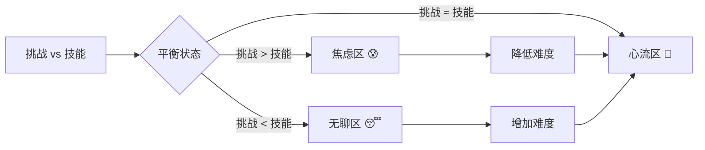
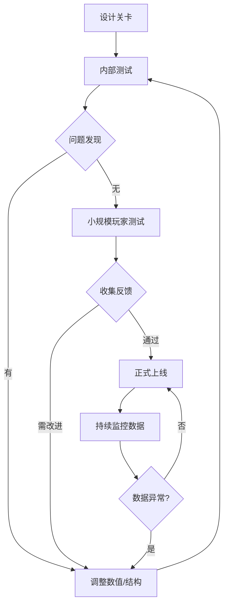

# 🗺️ 关卡设计理论：节奏、空间与引导

> **核心理念**: 优秀的关卡设计是**无形**的。它在玩家不知不觉中教会他们规则，引导他们去往正确的地方，并在他们即将厌倦时提供新的刺激。

## 1. 🏯 空间结构理论 (Spatial Structure)

在塔防与动作混合的游戏中，空间决定了策略。

### 1.1 路径类型 (Path Typology)

- **单线型 (The Corridor)**: 怪物只有一条路。最简单，适合教学关。玩家只需把火力集中在一点。
- **分岔型 (The Fork)**: 怪物分两路，最后汇合。强迫玩家分散火力或寻找交汇点（Kill Zone）。
- **多入口型 (Multi-Spawn)**: 怪物从东南西北涌入，保护中心。这是 _Vampire Survivors_ 的典型结构，考验玩家的 AOE 能力和走位。
- **循环型 (The Loop)**: 怪物会绕圈（如围绕核心），给玩家更多的输出时间，但一旦漏怪就很难追回。

### 1.2 扼守点与杀戮区 (Choke Points & Kill Zones)

- **定义**: 地图中地形狭窄，强迫怪物聚集成一团的区域。
- **设计原则**:
  - **黄金位**: 扼守点旁边必须有 1-2 个“高价值”造塔位。
  - **陷阱**: 扼守点是放置减速塔、地雷的最佳位置。
  - **玩家引导**: 通过地形（石头、树木）自然地将怪物“挤”到扼守点，而不是用空气墙。

### 1.3 视线与遮挡 (Line of Sight / LoS)

- **应用**: 在 3D 塔防中，视线遮挡是高级策略。
- **掩体**: 在路径中间放置一块巨石。
  - **塔**: 直射塔（机枪）打不到石头后面的怪。
  - **怪**: 远程怪会躲在石头后面攻击塔。
  - **对策**: 玩家必须建造抛射塔（迫击炮）或亲自绕后解决。

## 2. 📈 节奏控制理论 (Pacing & Flow)

关卡不是静态的，它是**时间**的艺术。

### 2.1 起承转合 (Kishōtenketsu) - 任天堂关卡法

- **起 (Introduction)**: 安全环境下引入新机制。
  - _例子_: 出现一种带护盾的怪，单独一只，慢慢走，玩家发现普攻打不动，直到造了激光塔。
- **承 (Development)**: 稍微增加难度。
  - _例子_: 护盾怪成群出现，混杂在普通怪里。
- **转 (Twist)**: 机制反转或结合。
  - _例子_: 护盾怪学会了冲锋，或者配合加血怪一起出现。
- **合 (Conclusion)**: 终极考验 (Mastery)。
  - _例子_: BOSS 战，BOSS 自带巨型护盾，还会召唤小护盾怪。

### 2.2 强度曲线 (Intensity Curve)

- **锯齿状上升**: 永远不要让难度呈直线增加。
  - Wave 1: 简单 (热身)
  - Wave 2: 中等
  - Wave 3: **困难 (压力测试)**
  - Wave 4: 简单 (休息/奖励/整顿) -> **关键的低谷**，给玩家喘息和花钱的时间。
  - Wave 5: 极难 (BOSS)

## 3. 🧭 引导与教学 (Guidance & Tutorial)

### 3.1 视觉引导 (Visual Language)

- **光照**: 把光打在重要的路口或目标点上。人眼本能趋光。
- **路标**: 地面上的车辙印、血迹、散落的金币，都能暗示“怪物从哪来”或“该往哪走”。
- **地标 (Landmarks)**: 远处的巨大雕像或高塔，帮助玩家定位方向（在开放地图中尤为重要）。

### 3.2 既然是塔防... (TD Specifics)

- **预警线**: 在波次开始前，用红线画出怪物即将行走的路径。
  - _重要性_: 既然策略重于反应，就必须给玩家**完全的信息**。隐藏路径不仅不难，反而令人沮丧。
- **建筑网格**: 在玩家进入建造模式时，清晰地显示网格和不可建造区域 (红/绿格)。

## 4. 🛠️ 关卡设计检查清单 (Checklist)

1.  **策略多样性**: 这张图是否只有一种最优解？如果是，重做。
2.  **防守点**: 是否有明显的“最佳防守位”？是否有给远程英雄发挥的高台？

3.  **防卡死**: 所有的出生点到终点是否保证连通？（防止玩家用塔堵死路）。

4.  **时长**: 一局是否控制在 15-20 分钟？（移动端黄金时长）。

## 5. 案例分析：Dust 2 (CS:GO) vs Kingdom Rush

- **Dust 2**: 经典的“田”字型结构。中门 (Mid) 是核心争夺点，连接 A/B 两点。塔防也可以借鉴这种**多线互通**结构，让玩家在两条路之间疲于奔命，必须用传送门或高机动英雄救场。
- **Kingdom Rush**: 每一关都引入一个新塔或新怪。利用地形（如从河里突然钻出的怪）打破玩家的既定防线，强迫重建。

## 6. 🌊 心流理论在关卡设计中的应用 (Flow Theory)

### 6.1 心流通道 (Flow Channel)

**心流 (Flow)** 是心理学家 Mihaly Csikszentmihalyi 提出的概念，指人在完全沉浸于某项活动时的最佳体验状态。



**在关卡设计中的应用**:

- **玩家技能曲线**: 随着游戏进程，玩家会掌握新塔、新技能。
- **挑战曲线**: 关卡难度必须**同步增长**，保持在心流通道中。
- **动态调整**: 如果玩家明显在某一关卡重复失败，说明已进入"焦虑区"，需要降低难度或提供更多提示。

### 6.2 挑战类型的多样性

**单一类型的挑战会快速消耗心流**。必须混合：

- **反应挑战**: 快速的刷怪波次，测试 APM (Actions Per Minute)。
- **策略挑战**: 资源有限，需要规划塔的位置和升级顺序。
- **知识挑战**: 某种怪只能被特定塔克制，玩家必须"读图鉴"。
- **适应挑战**: 地图事件突然改变规则（如"所有塔攻击力减半"），玩家需要临场应变。

---

## 7. 🧠 认知负荷理论 (Cognitive Load Theory)

### 7.1 三种认知负荷

**认知负荷理论 (CLT)** 由 John Sweller 提出，区分了三种类型的负荷：

| 类型                      | 定义                         | 示例 (塔防)                      | 设计原则                               |
| ------------------------- | ---------------------------- | -------------------------------- | -------------------------------------- |
| **内在负荷** (Intrinsic)  | 任务本身的复杂度             | "这个塔打物理伤害还是魔法伤害？" | **不可避免**，但可以通过教程分阶段引入 |
| **外在负荷** (Extraneous) | 糟糕的界面设计造成的额外负担 | "我不知道怎么旋转塔的朝向"       | **必须消除**！清晰的 UI 和反馈         |
| **相关负荷** (Germane)    | 用于构建技能和理解的有效思考 | "我发现这个塔放在拐角效果更好"   | **应该鼓励**！通过引导式谜题培养       |

### 7.2 减少外在负荷的实战技巧

> [!TIP] > **信息分层显示**
>
> - 默认只显示关键信息（如塔的攻击力、射程）。
> - 高级信息（如暴击率、穿甲值）放在"详细面板"中，点击才显示。

> [!TIP] > **色彩编码**
>
> - 物理伤害 = 橙色 🟠
> - 魔法伤害 = 蓝色 🔵
> - 真实伤害 = 紫色 🟣
> - 玩家在战斗中一眼就能识别塔的类型。

> [!TIP] > **预览系统**
>
> - 在放置塔之前，显示**射程圈**和**模拟 DPS**（对当前波次的怪）。
> - 让玩家做出**有信息支撑**的决策，而不是盲猜。

---

## 8. 🎮 业界案例深度解析 (Case Studies)

### 8.1 案例 1: Dark Souls - 惩罚与学习的艺术

**核心设计哲学**: "Death is the Teacher"

**关卡结构分析**:

- **捷径机制**: 每个区域都有隐藏的捷径，连接篝火（存档点）和 BOSS 房。
  - **第一次**: 玩家会走很长的路，遭遇大量敌人。
  - **第二次**: 解锁捷径后，可以直接冲向 BOSS，减少消耗和沮丧感。
  - **设计启示**: 尊重玩家的时间。失败惩罚应该是"失去进度"，而非"重复无意义的内容"。

**在塔防中的应用**:

- **波次快进**: 如果玩家在第 15 波失败，重新开始时可以选择"从第 10 波开始，但资源减半"。
- **失败奖励**: 即使失败，也给予少量货币或经验，让玩家感觉"没有白玩"。

### 8.2 案例 2: Hades - Roguelike 的渐进式揭示

**核心设计哲学**: "Every Run Matters"

**元进度系统**:

- 玩家每次失败后，可以用收集的资源**永久强化**角色。
- 随着死亡次数增加，**新对话、新剧情、新技能**逐渐解锁。
- **关键**: 失败不是终点，而是体验剧情和成长的必经之路。

**在塔防中的应用**:

- **遗物系统**: 玩家在一局中获得的遗物（如"火塔伤害 +10%"），即使失败也能兑换成永久升级点。
- **解锁式教学**: 故意在前几局中**限制**玩家可建造的塔种类，强迫他们熟悉基础机制，再逐步开放高级塔。

### 8.3 案例 3: Slay the Spire - 卡牌与数值的平衡

**关卡设计启示**:

- **分支路径**: 玩家可以选择"安全路径"（小怪多，奖励稳定）或"危险路径"（精英怪，奖励丰厚）。
- **在塔防中**: 地图编辑器允许设计**双线路径**，玩家可以选择防守哪一条：
  - **路径 A**: 怪物数量多但弱，资源掉落少。
  - **路径 B**: 精英怪少但强，资源掉落丰厚。

---

## 9. 🧪 关卡测试方法论 (Playtesting \u0026 Iteration)

### 9.1 数据驱动的测试 (Data-Driven Testing)

**记录关键指标**:

- **死亡热点图 (Death Heatmap)**: 玩家在哪一波、哪个位置最容易失败？
- **塔的使用率**: 如果某种塔从不被建造，说明它太弱或太贵。
- **平均通关时长**: 如果 90% 玩家在 5 分钟内通关，说明太简单。

**工具推荐**:

```csharp
// Unity Analytics 示例
Analytics.CustomEvent("WaveFailed", new Dictionary<string, object>
{
    { "wave_number", currentWave },
    { "player_gold", playerGold },
    { "towers_built", towerCount }
});
```

### 9.2 定性测试 (Qualitative Testing)

**观察新手玩家** (最重要！):

- 不要给任何提示，只是观察。
- 记录他们在哪里**卡住**、在哪里**困惑**。
- **如果新手不理解，那就是设计问题，不是玩家问题。**

**访谈问题**:

1. "你觉得哪一波最难？为什么？"
2. "有没有某个塔让你觉得'完全没用'？"
3. "如果可以改一个东西，你会改什么？"

### 9.3 迭代循环 (Iteration Loop)



> [!IMPORTANT] > **关卡设计的黄金法则**: 一个关卡必须经过**至少 3 轮**内部测试和**至少 10 名**外部玩家的试玩，才能视为"完成"。

---

## 📚 扩展阅读与灵感来源 (References)

### 🏯 关卡设计圣经

- **[Level Up! The Guide to Great Video Game Design](https://www.amazon.com/Level-Guide-Great-Video-Design/dp/1118877160)** (Scott Rogers)
  - 通俗易懂的关卡设计入门书，特别是关于“引导玩家视线”的部分。
- **[Super Mario 3D World's 4-Step Level Design](https://www.youtube.com/watch?v=dBmIkEvEBtA)** (Game Maker's Toolkit)
  - Mark Brown 详细拆解了任天堂的 **起承转合 (Kishōtenketsu)** 设计法，这是本篇文档的核心理论依据。

### 🛠️ 塔防特化

- **[Designing Tower Defense Games](https://www.gamasutra.com/view/feature/132666/designing_tower_defense_games.php)** (Gamasutra)
  - 深入讨论了“路径设计”对游戏难度的数学影响。
- **[The Art of Choke Points](https://www.youtube.com/watch?v=rDjrOaoMz9c)** (Level Design Lobby)
  - 视频分析了 FPS 地图中的扼守点设计，其原理完全通用于塔防游戏。

### 🧘 心流理论

- **[Flow: The Psychology of Optimal Experience](https://www.amazon.com/Flow-Psychology-Experience-Perennial-Classics/dp/0061339202)** (Mihaly Csikszentmihalyi)
  - 心流理论的原著。理解"挑战"与"技能"的动态平衡。

### 🎓 认知科学

- **[Cognitive Load Theory](https://www.instructionaldesign.org/theories/cognitive-load/)** (John Sweller)
  - 详细解释内在/外在/相关负荷的区别及其在教学设计中的应用。
- **[Don't Make Me Think](https://www.amazon.com/Dont-Make-Think-Revisited-Usability/dp/0321965515)** (Steve Krug)
  - 虽然是 UI/UX 书籍，但其"**减少认知负荷**"的原则完全适用于关卡设计。

---

## 🔗 相关文档 (Related Documents)

本文档侧重于**理论与原则**。如需了解**具体实现**，请参阅：

> [!NOTE] > **实战指南**
>
> 查看 [🗺️ 关卡与波次设计指南](/docs/Design/Content/Level_Design_Guide) 了解：
>
> - 地图生成逻辑实现
> - 波次 JSON 配置
> - 动态难度调整系统
> - 地图事件触发机制

**其他相关文档**:

- [⚔️ 战斗系统](/docs/Design/Mechanics/Combat_System) - 伤害计算和敌人属性
- [🏰 塔防系统](/docs/Design/Mechanics/Tower_Defense_System) - 塔的类型和建造规则
- [💀 敌人图鉴](/docs/Design/Content/Enemy_Bestiary) - 所有敌人的详细数据
- [🎮 游戏心理学深度探究](/docs/Design/Game_Psychology_DeepDive) - 玩家动机和成瘾机制
