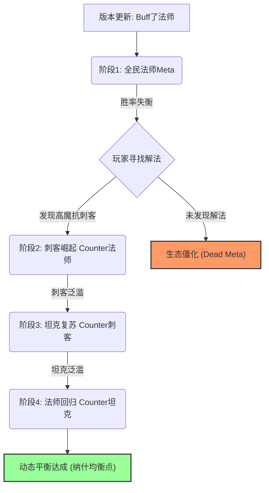

---
sidebarTitle: "博弈论与PVP平衡"
title: "博弈论在PVP数值平衡中的应用"
description: "超越简单的石头剪刀布，利用纳什均衡漂移与非对称博弈模型构建动态的竞技生态"
icon: "chess"
---

# ♟️ 博弈论在PVP数值平衡中的应用

> **摘要**：PVP 平衡不是追求“所有角色胜率 50%”，而是追求“策略空间的动态最大化”。本文将引入收益矩阵、纳什均衡漂移及非对称博弈模型，揭示 Meta（元游戏）演化的数学本质。

---

## 🎲 基础模型：超越石头-剪刀-布 (RPS)

最基础的平衡是 RPS 循环克制，但它很无聊。进阶的设计需要构建**加权非传递性关系**。

### 收益矩阵 (Payoff Matrix)

假设我们有三种流派 A, B, C。这是一个典型的非零和博弈矩阵（数值代表玩家 1 的收益）：

| 玩家1 \ 玩家2 | 流派 A (快攻) | 流派 B (控制) | 流派 C (后期) |
| :--- | :---: | :---: | :---: |
| **流派 A** | 0 | -5 | +8 |
| **流派 B** | +8 | 0 | -5 |
| **流派 C** | -5 | +8 | 0 |

*   **分析**：这里 $A$ 克 $C$ (收益+8)，$C$ 克 $B$ (收益+8)，$B$ 克 $A$ (收益+8)。
*   **不完美克制**：注意克制收益是 $+8$，而被克制损失是 $-5$。这意味着**技巧可以弥补劣势**。如果 $A$ 玩得足够好，即使面对 $B$ 也能赢（只要技巧加成超过 5）。这就是电子竞技的魅力。

---

## 📈 进阶理论：Meta 的纳什均衡漂移

游戏生态永远不会静止，它像一个混沌系统在不断寻找纳什均衡点。

### Meta 演化周期图谱

### 平衡师的职责：管理“漂移速度”
*   **太快**：玩家刚练好一个英雄就废了，挫败感强。
*   **太慢**：半年都是同一套阵容，无聊导致流失。
*   **黄金法则**：通过微调数值（小补丁），让 Meta 的演化周期保持在 **2-4 周** 一次小循环。

---

## ⚖️ 核心挑战：非对称博弈 (Asymmetric Balance)

当游戏是 1 vs N（如《黎明杀机》或 Boss 战模式）时，传统的对称平衡失效。

### 兰彻斯特平方律的修正

$$
\text{Power}_{\text{Boss}} = K \times (\text{Power}_{\text{Player}} \times N)^2
$$

*   这不是简单的 $1 \text{ vs } N$，而是 $1 \text{ vs } N^2$。
*   **设计陷阱**：如果 4 个玩家完美配合，战斗力是 $4^2=16$ 倍；如果 4 个路人各自为战，战斗力只有 $1+1+1+1=4$ 倍。
*   **平衡难题**：你按照“完美配合”平衡，路人局 Boss 就无敌；你按照“路人局”平衡，车队就秒杀 Boss。

### 解决方案：动态协作补偿
引入一个**协作系数 ($\\alpha$)**：
1.  **检测协作**：如果玩家在短时间内连续触发连携攻击。
2.  **动态增强**：Boss 获得临时韧性或减伤。
3.  **分割战场**：Boss 的技能必须包含强制位移，打断 $N$ 的指数级叠加，将其还原为 $1+1+1+1$ 的线性博弈。

---

## 🤖 算法辅助：虚拟遗憾最小化 (CFR)

在现代 AI 平衡测试中，我们使用 **Counterfactual Regret Minimization (CFR)** 算法。

### 原理简述
AI 自我博弈百万局。每次它输了，它会计算：“如果我刚才换成策略 B，我会少输多少？”（这就是“遗憾值”）。
下一局，AI 会倾向于选择“遗憾值”最大的策略（即理论上更优的策略）。

### 应用场景
*   **上线前预测**：让 CFR AI 跑一晚上，如果最终 AI 100% 选择了某个英雄，说明这个英雄数值**绝对超模**（Tier 0）。
*   **Ban/Pick 模拟**：预测 BP 环节的最优解，防止出现无解阵容（Exodia）。

---

## 📝 总结

数值策划不应试图通过 Excel 计算出“绝对的 50% 胜率”。
真正的平衡是：
1.  **没有废卡**：每一张卡在特定情境下都是纳什均衡点的一部分。
2.  **没有无敌卡**：每一张卡都有至少一个硬克制（Hard Counter）和一个软克制（Soft Counter）。
3.  **动态演化**：Meta 像流体一样流动，而不是像水泥一样凝固。
