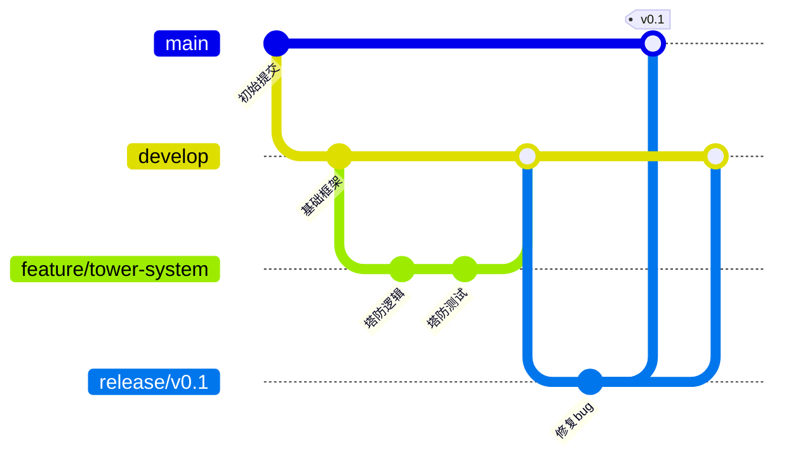
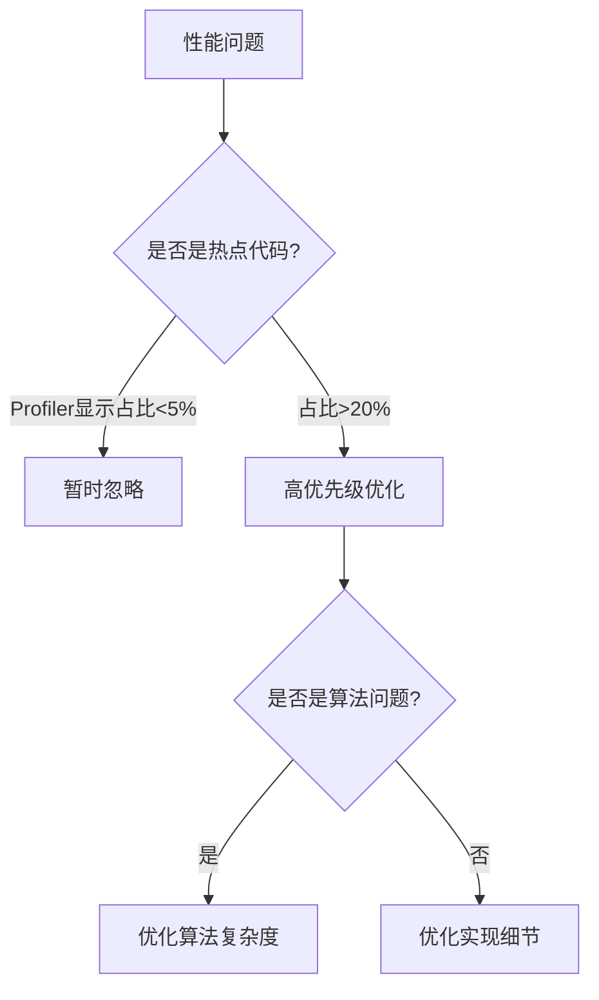
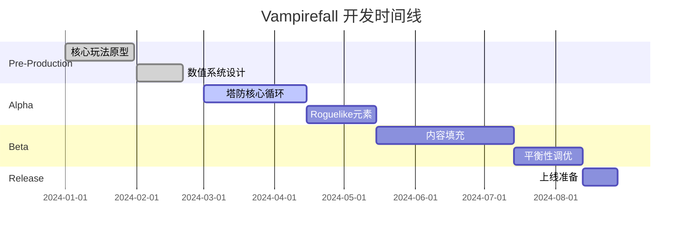
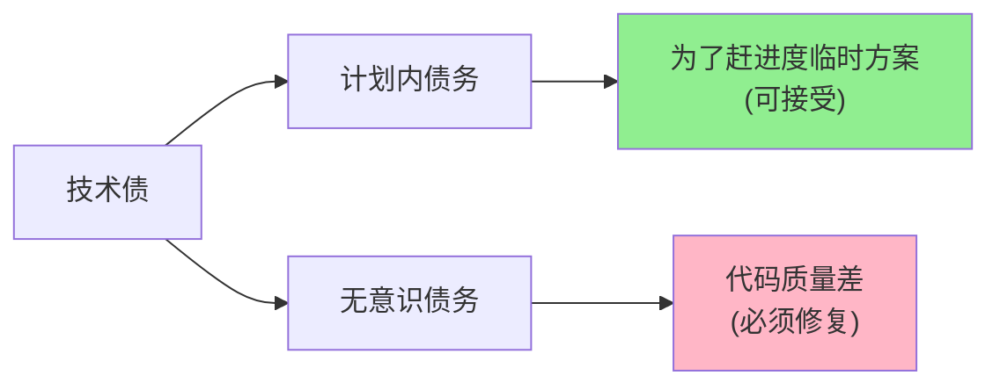

# 🚀 高效游戏开发指南：拒绝返工与项目规划

## 📚 1. 理论基础 (Theoretical Basis)

### 1.1 核心定义：0-1 与 1-100 的本质区别

- **0 到 1 (原型与验证期)**:
  - **目标**: 寻找核心乐趣 (Find the Fun)。验证核心玩法循环是否成立。
  - **关键词**: 快速迭代、抛弃式代码、灵活性。
  - **最大陷阱**: 过早优化、过度设计、在不好玩的核心上堆砌内容。
- **1 到 100 (量产与运营期)**:
  - **目标**: 内容填充 (Content Pipeline)、稳定性、扩展性。
  - **关键词**: 工业化管线、工具链、代码规范、自动化。
  - **最大陷阱**: 缺乏工具支持导致人力堆砌、技术债爆发导致修改困难。

### 1.2 拒绝返工的心理学与管理学

- **沉没成本谬误 (Sunk Cost Fallacy)**: 不愿舍弃已经做好的（但错误或不好玩的）功能，导致后续为了修补它而产生更多返工。
- **敏捷开发的误区**: 敏捷不是"没有文档"或"随意修改"，而是"小步快跑，快速验证"。**想清楚再动手**永远是最高效的。

## 🛠️ 2. 实践应用 (Practical Implementation) - Vampirefall 适配

### 2.1 设计层面 (Design): 避免"策划一句话，程序跑断腿"

- **纸面原型 (Paper Prototyping)**:
  - 在写一行代码前，先用纸笔、Excel 或桌游模拟塔防的数值循环和肉鸽的构建过程。
  - **Vampirefall 应用**: 用 Excel 模拟一局战斗的伤害成长曲线，确保数值模型在理论上是闭环的。
- **模块化设计文档 (Modular GDD)**:
  - 不要写几百页的 Word。使用 Wiki 或 Markdown (如本项目)，按系统拆分。
  - **关键**: 每个系统文档必须包含"边界情况" (Edge Cases) 的定义。例如：当攻速超过帧率上限时怎么处理？
- **"MVP" (Minimum Viable Product) 思维**:
  - 不要一开始就设计 100 种塔。先做 3 种：单体高伤、群体低伤、控制。验证这三种的组合策略是否有趣。

### 2.2 程序架构层面 (Architecture): 拥抱变化

- **数据驱动 (Data-Driven)**:
  - **核心原则**: 策划能改的东西，绝不写死在代码里。
  - **Unity 实现**: 广泛使用 `ScriptableObject`。
    - `EnemyData`: 包含血量、速度、掉落表引用、AI 行为树引用。
    - `TowerData`: 包含攻击范围、射速、弹道预制体、升级路线。
  - **好处**: 调整数值、替换资源不需要重新编译，甚至不需要重启游戏（配合热重载工具）。
- **事件驱动 (Event-Driven) 解耦**:
  - **问题**: 塔的代码直接调用怪物扣血，怪物死亡直接调用 UI 加金币。导致代码像面条一样纠缠。
  - **解决**: 使用全局或局部的事件总线 (Event Bus)。
    - 塔发布 `OnEnemyHit(damageInfo)`。
    - 怪物监听受击，UI 监听死亡，成就系统监听击杀数。
    - 各模块互不依赖，删除一个模块不会报错。
- **组合优于继承 (Composition over Inheritance)**:
  - 不要写 `class IceTower : Tower`。
  - 使用组件式设计 (ECS 或 Unity Component): `Tower` 实体挂载 `SlowEffect` 组件。这样可以轻松创造出"带减速的火焰塔"，而不需要多重继承。

### 2.3 工具链层面 (Toolchain): 磨刀不误砍柴工

- **自动化测试与验证**:
  - **AssetNamingValidator**: (已存在) 确保资源命名规范，避免加载错误。
  - **配置检查工具**: 编写编辑器脚本，一键检查所有 `ScriptableObject` 是否有空引用，数值是否在合理范围。
- **可视化调试工具 (Visual Debuggers)**:
  - **Vampirefall 需求**:
    - **刷怪控制器**: 在运行时一键生成指定波次、指定怪物，测试塔的压力。
    - **数值监视器**: 实时显示当前 DPS、怪物平均存活时间，辅助平衡性调整。
- **一键构建与部署 (CI/CD)**:
  - 不要让程序员手动打包。使用 Jenkins 或 GitHub Actions。确保每次提交都能打出一个可玩的包，尽早发现集成错误。

## 🌟 3. 业界优秀案例 (Industry Best Practices)

### 3.1 Supercell: "Kill it early"

- **案例**: Supercell 砍掉的游戏比发布的要多得多。
- **借鉴**: 在 **0-1** 阶段，如果核心玩法验证失败（不好玩、留存差），果断放弃或重构，不要试图用美术或外围系统来"救"它。

### 3.2 《Hades》: 抢先体验 (Early Access) 的胜利

- **案例**: Supergiant Games 利用 Early Access 收集玩家反馈，逐步打磨 Roguelike 的平衡性。
- **借鉴**: 建立完善的**埋点系统**。了解玩家死在哪里，哪个塔从来没人造。用数据指导 **1-100** 阶段的开发，而不是拍脑门。

### 3.3 《Factorio》: 自动化测试的极致

- **案例**: 异星工厂拥有极其庞大的自动化测试库，甚至用无头模式 (Headless) 跑游戏来验证逻辑。
- **借鉴**: 对于复杂的塔防逻辑（如路径计算、仇恨优先级），编写单元测试 (Unit Tests) 至关重要。

## 🤝 4. 团队协作与沟通 (Team Collaboration)

### 4.1 文档驱动开发 (Document-Driven Development)

> [!IMPORTANT]
> "口头约定"是项目杀手。所有关键决策必须有文档记录。

#### 文档分层体系

| 文档类型     | 受众         | 更新频率 | 示例                           |
| ------------ | ------------ | -------- | ------------------------------ |
| **愿景文档** | 全体、投资方 | 很少     | 游戏核心玩法、目标玩家、差异化 |
| **系统设计** | 策划+程序    | 每个迭代 | 战斗系统、经济系统             |
| **接口文档** | 程序         | 频繁     | API 规范、数据结构             |
| **任务追踪** | 全体         | 每日     | Jira/Trello/task.md            |

#### Vampirefall 文档规范

```markdown
# 系统名称

## 1. 目标 (Goal)

这个系统要解决什么问题？

## 2. 非目标 (Non-Goals)

明确这个系统**不做**什么，防止需求蔓延。

## 3. 设计方案 (Design)

### 3.1 数据结构

### 3.2 关键流程

### 3.3 边界情况处理

## 4. 待定问题 (Open Questions)

列出需要后续确认的点。
```

### 4.2 站会与异步沟通 (Stand-ups & Async Communication)

#### 每日站会模板（15 分钟）

1. **昨天完成了什么？**（1-2 句话）
2. **今天计划做什么？**（具体任务）
3. **有什么阻碍？**（需要帮助的地方）

> [!TIP]
> 站会不是汇报会，而是同步会。详细讨论移到会后。

#### 异步沟通最佳实践

- **代码注释要说"为什么"，而不是"是什么"**

  ```csharp
  // ❌ 不好的注释
  int maxHealth = 100; // 设置最大血量为100

  // ✅ 好的注释
  int maxHealth = 100; // 100血是经过战斗测试的平衡值，
                       // 过高会导致前三波无压力
  ```

- **Git Commit Message 规范**

  ```
  [类型] 简短描述（50字以内）

  详细说明（可选）：
  - 为什么需要这个改动
  - 影响了哪些系统
  - 相关的 Issue 编号

  类型：feat/fix/refactor/docs/test/chore
  ```

### 4.3 跨职能协作 (Cross-Functional Collaboration)

#### 策划-程序沟通清单

策划提需求时必须明确：

- [ ] **触发条件**：什么时候发生？
- [ ] **执行逻辑**：具体做什么？
- [ ] **边界情况**：如果玩家同时...会怎样？
- [ ] **UI 反馈**：玩家如何知道这个事件发生了？
- [ ] **优先级**：P0（必须有）/P1（重要）/P2（锦上添花）

#### 美术-程序对接规范

```yaml
# AssetSpec.yaml - 资源规格文档
UI图标:
  尺寸: 256x256px
  格式: PNG with Alpha
  命名: icon_{类型}_{名称}.png

角色模型:
  面数上限: 5000 tris (移动端)
  骨骼数: 最多30根
  贴图: 单张 2048x2048 的合并贴图

特效:
  粒子数上限: 50 (同屏)
  持续时间: 不超过 3 秒
```

---

## 🔀 5. 版本控制最佳实践 (Version Control)

### 5.1 Git 分支策略

#### Git Flow 模型（适用于 Vampirefall）



| 分支类型  | 命名                    | 用途                         | 生命周期 |
| --------- | ----------------------- | ---------------------------- | -------- |
| `main`    | `main`                  | 生产版本，只包含已发布的代码 | 永久     |
| `develop` | `develop`               | 开发主线，最新的稳定代码     | 永久     |
| `feature` | `feature/tower-defense` | 新功能开发                   | 临时     |
| `release` | `release/v1.0`          | 发布准备                     | 临时     |
| `hotfix`  | `hotfix/critical-crash` | 紧急修复                     | 临时     |

### 5.2 Unity 项目的 .gitignore

```gitignore
# Unity 生成文件
[Ll]ibrary/
[Tt]emp/
[Oo]bj/
[Bb]uild/
[Bb]uilds/
[Ll]ogs/
[Uu]ser[Ss]ettings/

# 永远不要提交的配置
*.csproj
*.unityproj
*.sln
*.suo
*.user
*.userprefs
*.pidb
*.booproj
*.svd
*.pdb
*.mdb
*.opendb
*.VC.db

# 大型资源通过 Git LFS 管理
*.psd
*.ai
*.fbx
*.obj
*.wav
*.mp3
*.ogg
*.mp4
```

### 5.3 Git LFS 配置（大文件管理）

```bash
# 安装 Git LFS
git lfs install

# 追踪大文件类型
git lfs track "*.psd"
git lfs track "*.fbx"
git lfs track "*.wav"
git lfs track "*.mp4"

# 提交 .gitattributes
git add .gitattributes
git commit -m "chore: 配置 Git LFS"
```

---

## 🔍 6. 代码审查流程 (Code Review)

### 6.1 为什么需要 Code Review？

| 不做 CR 的后果     | 做 CR 的好处     |
| ------------------ | ---------------- |
| 技术债快速积累     | 提前发现潜在 bug |
| 代码风格混乱       | 团队知识共享     |
| 只有作者懂这段代码 | 提升整体代码质量 |

### 6.2 Code Review Checklist

#### 功能性 (Functionality)

- [ ] 代码实现了需求中的所有功能点吗？
- [ ] 边界情况处理了吗？（空值、零、负数、极大值）
- [ ] 错误处理是否完善？

#### 可读性 (Readability)

- [ ] 变量命名是否清晰？（避免 `tmp`, `data`, `manager`）
- [ ] 函数是否过长？（超过 50 行建议拆分）
- [ ] 是否有必要的注释？

#### 性能 (Performance)

- [ ] 是否有频繁的 GC Alloc？（Unity Profiler 检查）
- [ ] 循环内是否有不必要的计算？
- [ ] 是否缓存了需要频繁访问的组件？

```csharp
// ❌ 不好的写法 - 每帧都 GetComponent
void Update() {
    GetComponent<Rigidbody>().velocity = Vector3.zero;
}

// ✅ 好的写法 - 缓存引用
Rigidbody _rb;
void Awake() {
    _rb = GetComponent<Rigidbody>();
}
void Update() {
    _rb.velocity = Vector3.zero;
}
```

### 6.3 Pull Request 模板

```markdown
## 改动说明

简要描述这次改动做了什么。

## 相关 Issue

关联 #123

## 测试情况

- [ ] 单元测试通过
- [ ] 手动测试通过
- [ ] 性能测试无明显下降

## 截图/录屏（如有 UI 改动）

[可选] 附上改动前后的对比

## Reviewer 注意事项

这个改动可能影响到 XX 系统，请重点关注 YY 部分。
```

---

## ⚡ 7. 性能优化策略 (Performance Optimization)

### 7.1 "过早优化是万恶之源"的正确理解

> [!WARNING]
> Donald Knuth 的名言被误解太多次了。

**正确的理解**：

- ✅ **战略层面**要提前设计（如选择合适的数据结构）
- ❌ **战术层面**不要过度优化（如手动展开循环）

### 7.2 性能优化的优先级



### 7.3 Unity 常见性能陷阱与解决方案

#### 陷阱 1: 频繁的字符串拼接

```csharp
// ❌ 每次拼接都会产生新的 string 对象
void Update() {
    string text = "Score: " + score.ToString();
    scoreText.text = text; // GC Alloc!
}

// ✅ 使用 StringBuilder 或缓存
using System.Text;
StringBuilder _sb = new StringBuilder(32);

void Update() {
    _sb.Clear();
    _sb.Append("Score: ");
    _sb.Append(score);
    scoreText.text = _sb.ToString();
}
```

#### 陷阱 2: Find/GetComponent 在热路径

```csharp
// ❌ 不要在 Update 中查找
void Update() {
    GameObject player = GameObject.Find("Player");
    player.transform.position += Vector3.forward;
}

// ✅ 在初始化时查找并缓存
Transform _playerTransform;
void Start() {
    _playerTransform = GameObject.Find("Player").transform;
}
void Update() {
    _playerTransform.position += Vector3.forward;
}
```

#### 陷阱 3: 装箱 (Boxing)

```csharp
// ❌ 将值类型转换为 object 会装箱
Dictionary<string, object> data = new();
data["health"] = 100; // Boxing!

// ✅ 使用泛型或专用数据结构
Dictionary<string, int> intData = new();
intData["health"] = 100; // No boxing
```

### 7.4 塔防游戏特定优化

#### 对象池 (Object Pool)

```csharp
public class BulletPool : MonoBehaviour {
    [SerializeField] GameObject _bulletPrefab;
    Queue<GameObject> _pool = new(50);

    void Start() {
        // 预热：创建初始数量的子弹
        for (int i = 0; i < 50; i++) {
            GameObject bullet = Instantiate(_bulletPrefab);
            bullet.SetActive(false);
            _pool.Enqueue(bullet);
        }
    }

    public GameObject Get() {
        if (_pool.Count > 0) {
            GameObject bullet = _pool.Dequeue();
            bullet.SetActive(true);
            return bullet;
        }
        return Instantiate(_bulletPrefab); // 池子空了才实例化
    }

    public void Return(GameObject bullet) {
        bullet.SetActive(false);
        _pool.Enqueue(bullet);
    }
}
```

#### 空间分割 (Spatial Partitioning)

```csharp
// 不要用暴力遍历查找范围内的敌人
// ❌ O(n) - 每个塔都遍历所有敌人
foreach (var tower in towers) {
    foreach (var enemy in enemies) {
        if (Vector3.Distance(tower.pos, enemy.pos) < tower.range) {
            tower.Attack(enemy);
        }
    }
}

// ✅ 使用网格 (Grid) 或四叉树 (Quadtree)
GridSystem grid;
foreach (var tower in towers) {
    List<Enemy> nearbyEnemies = grid.GetEnemiesInRange(
        tower.position, tower.range
    );
    // 现在只遍历附近的敌人
}
```

---

## 🐞 8. 调试技巧与工具 (Debugging Tools)

### 8.1 Unity 内置调试工具

#### Gizmos - 可视化调试

```csharp
public class Tower : MonoBehaviour {
    [SerializeField] float attackRange = 5f;

    // 在 Scene 视图中绘制攻击范围
    void OnDrawGizmos() {
        Gizmos.color = Color.yellow;
        Gizmos.DrawWireSphere(transform.position, attackRange);
    }

    // 只在选中时绘制（减少干扰）
    void OnDrawGizmosSelected() {
        Gizmos.color = Color.red;
        Gizmos.DrawSphere(transform.position, 0.5f);
    }
}
```

#### Debug.DrawLine/Ray

```csharp
void Update() {
    // 绘制射线，持续 1 秒
    Debug.DrawRay(
        transform.position,
        transform.forward * 10f,
        Color.green,
        1f
    );
}
```

### 8.2 条件编译 - 调试代码不要打包

```csharp
public class DebugManager : MonoBehaviour {
    void Update() {
#if UNITY_EDITOR || DEVELOPMENT_BUILD
        // 这段代码只在编辑器或开发版本中运行
        if (Input.GetKeyDown(KeyCode.F1)) {
            SpawnTestEnemy();
        }
        if (Input.GetKeyDown(KeyCode.F2)) {
            AddGold(1000);
        }
#endif
    }
}
```

### 8.3 自定义调试窗口

```csharp
#if UNITY_EDITOR
using UnityEditor;

public class GameDebugger : EditorWindow {
    [MenuItem("Vampirefall/Game Debugger")]
    static void ShowWindow() {
        GetWindow<GameDebugger>("游戏调试器");
    }

    void OnGUI() {
        GUILayout.Label("快速测试", EditorStyles.boldLabel);

        if (GUILayout.Button("生成测试波次")) {
            // 触发测试逻辑
            FindObjectOfType<WaveManager>()?.SpawnTestWave();
        }

        if (GUILayout.Button("清空所有敌人")) {
            var enemies = FindObjectsOfType<Enemy>();
            foreach (var enemy in enemies) {
                Destroy(enemy.gameObject);
            }
        }

        if (GUILayout.Button("金币 +1000")) {
            PlayerController.Instance.AddGold(1000);
        }
    }
}
#endif
```

### 8.4 日志分级管理

```csharp
public enum LogLevel {
    Debug,   // 详细调试信息
    Info,    // 一般信息
    Warning, // 警告
    Error    // 错误
}

public static class GameLogger {
    static LogLevel _minLevel = LogLevel.Info;

    public static void Log(string message, LogLevel level = LogLevel.Info) {
        if (level < _minLevel) return;

        switch (level) {
            case LogLevel.Debug:
                Debug.Log($"[DEBUG] {message}");
                break;
            case LogLevel.Info:
                Debug.Log($"[INFO] {message}");
                break;
            case LogLevel.Warning:
                Debug.LogWarning($"[WARN] {message}");
                break;
            case LogLevel.Error:
                Debug.LogError($"[ERROR] {message}");
                break;
        }
    }
}
```

---

## 📅 9. 项目里程碑管理 (Milestone Management)

### 9.1 Vampirefall 开发路线图



### 9.2 里程碑验收标准

#### Alpha 阶段（核心玩法可玩）

- [ ] 可以建造至少 3 种塔
- [ ] 可以防守至少 5 波敌人
- [ ] 胜利/失败条件明确
- [ ] 核心数值循环验证通过（Excel 模拟）
- [ ] 5 个人试玩后，至少 3 个人愿意继续玩

#### Beta 阶段（内容完整）

- [ ] 10+ 种塔
- [ ] 20+ 波敌人
- [ ] 完整的升级系统
- [ ] UI/音效完整
- [ ] 无 S 级 bug（游戏崩溃、无法继续）

#### RC 阶段（随时可以上线）

- [ ] 所有已知 bug 修复或标记为"已知问题"
- [ ] 性能达标（60fps on 中端手机）
- [ ] 通过苹果/谷歌审核
- [ ] 服务器压测完成

### 9.3 每日构建 (Daily Build) 的重要性

> "If it doesn't build, it doesn't ship."

```bash
# Jenkins/GitHub Actions 自动构建脚本
name: Daily Build

on:
  schedule:
    - cron: '0 2 * * *'  # 每天凌晨 2 点

jobs:
  build:
    runs-on: windows-latest
    steps:
      - uses: actions/checkout@v2
      - name: Build Unity Project
        run: |
          unity-build --project . --platform Android
      - name: Run Tests
        run: unity-test --project .
      - name: Upload APK
        if: success()
        uses: actions/upload-artifact@v2
        with:
          name: vampirefall-daily.apk
          path: build/vampirefall.apk
```

---

## ⚠️ 10. 风险管理与应急预案 (Risk Management)

### 10.1 技术风险识别

| 风险                         | 概率 | 影响 | 缓解措施                       |
| ---------------------------- | ---- | ---- | ------------------------------ |
| Unity 版本升级导致兼容性问题 | 中   | 高   | 锁定 Unity LTS 版本            |
| 数值爆炸（伤害溢出）         | 高   | 中   | 使用 `BigInteger` 或科学计数法 |
| 网络同步延迟                 | 中   | 高   | 提前技术预研，准备降级方案     |
| 第三方插件停止维护           | 低   | 高   | 核心功能不依赖第三方           |

### 10.2 应急预案模板

#### 示例：上线后发现严重 Bug

```markdown
## 严重 Bug 处理流程

### 1. 快速评估（15 分钟内）

- 影响范围：多少玩家？
- 能否通过服务器配置绕过？
- 是否需要强制更新？

### 2. 临时措施（1 小时内）

- 关闭受影响的功能模块（feature flag）
- 公告通知玩家
- 准备补偿方案

### 3. 修复与验证（4 小时内）

- 紧急修复 bug
- 回归测试
- 准备热更新包

### 4. 上线与监控

- 分批灰度更新
- 监控错误率
- 24 小时值班
```

### 10.3 变更控制 (Change Control)

**临近发布时的铁律**：

| 距离发布    | 允许的改动             |
| ----------- | ---------------------- |
| 4 周+       | 任何改动               |
| 2-4 周      | 仅新功能和重要优化     |
| 1-2 周      | 仅 bug 修复            |
| 1 周内      | 仅 S 级 bug 修复       |
| 发布前 3 天 | **代码冻结**，只改配置 |

---

## 💳 11. 技术债务管理 (Technical Debt)

### 11.1 什么是技术债？

技术债就像信用卡债务：

- **利息**：每次改代码都要绕过这个坑
- **本金**：重构需要的时间
- **破产**：无法维护，只能重写

### 11.2 技术债分类



### 11.3 偿还策略

#### 童子军规则 (Boy Scout Rule)

> "让营地比你来时更干净。"

```csharp
// 修改旧代码时，顺手改善一点点
void OldFunction() {
    // 原本的屎山代码
    var data = GetData();
    // ... 一堆难懂的逻辑

    // 这次修改时，加一行注释
    // TODO: 这段逻辑应该拆分成独立函数（下次重构时处理）
}
```

#### 定期重构时间

- **每周五下午**：技术债偿还时间
- 团队投票选择本周最痛苦的代码
- 集中 2 小时改善它

### 11.4 技术债务清单

```markdown
# 技术债务登记表

## 高优先级（影响开发效率）

- [ ] EnemyController 超过 500 行，需要拆分
- [ ] 配置表加载逻辑耦合在 GameManager 中

## 中优先级（代码质量问题）

- [ ] Tower 系统缺少单元测试
- [ ] UI 代码有大量重复逻辑

## 低优先级（优化项）

- [ ] 部分变量命名不规范
- [ ] 缺少部分注释
```

---

## 📊 12. 数据驱动开发实践 (Data-Driven Development)

### 12.1 配置表设计原则

#### 好的配置表示例

```csharp
// TowerConfig.asset (ScriptableObject)
[CreateAssetMenu(fileName = "Tower", menuName = "Game/TowerConfig")]
public class TowerConfig : ScriptableObject {
    [Header("基础属性")]
    public string displayName;
    public Sprite icon;
    public int buildCost;

    [Header("战斗属性")]
    public float attackRange;
    public float attackInterval;
    public int baseDamage;

    [Header("升级路线")]
    public TowerConfig[] upgradeOptions;

    [Header("特殊效果")]
    public StatusEffectConfig[] onHitEffects;

    // 编辑器验证
    void OnValidate() {
        if (attackInterval <= 0) {
            Debug.LogError($"{name}: 攻击间隔必须大于0!");
        }
        if (buildCost < 0) {
            Debug.LogError($"{name}: 建造成本不能为负!");
        }
    }
}
```

### 12.2 热重载 (Hot Reload)

```csharp
#if UNITY_EDITOR
public class ConfigReloader : MonoBehaviour {
    void Update() {
        if (Input.GetKeyDown(KeyCode.F5)) {
            ReloadAllConfigs();
            Debug.Log("配置已重新加载！");
        }
    }

    void ReloadAllConfigs() {
        // 重新加载所有 ScriptableObject
        var configs = Resources.FindObjectsOfTypeAll<TowerConfig>();
        foreach (var config in configs) {
            EditorUtility.SetDirty(config);
        }
        AssetDatabase.SaveAssets();
        AssetDatabase.Refresh();
    }
}
#endif
```

### 12.3 配置验证工具

```csharp
#if UNITY_EDITOR
[MenuItem("Vampirefall/验证所有配置")]
static void ValidateAllConfigs() {
    int errorCount = 0;

    var towers = AssetDatabase.FindAssets("t:TowerConfig");
    foreach (var guid in towers) {
        string path = AssetDatabase.GUIDToAssetPath(guid);
        var config = AssetDatabase.LoadAssetAtPath<TowerConfig>(path);

        // 检查空引用
        if (config.icon == null) {
            Debug.LogError($"{config.name}: 缺少图标!");
            errorCount++;
        }

        // 检查数值合理性
        if (config.attackRange > 20f) {
            Debug.LogWarning($"{config.name}: 攻击范围过大 ({config.attackRange})");
        }
    }

    if (errorCount == 0) {
        Debug.Log("✅ 所有配置验证通过!");
    } else {
        Debug.LogError($"❌ 发现 {errorCount} 个错误!");
    }
}
#endif
```

---

## 🎓 13. 持续学习与技能提升 (Continuous Learning)

### 13.1 推荐学习路径

#### 初级开发者（0-2 年）

1. **掌握 C# 基础**

   - 《C# 8.0 in a Nutshell》
   - LeetCode 刷基础算法题

2. **熟悉 Unity API**

   - Unity 官方教程
   - 复刻经典小游戏（Flappy Bird、2048）

3. **理解基础设计模式**
   - 单例、工厂、观察者

#### 中级开发者（2-5 年）

1. **深入架构设计**

   - 《Game Programming Patterns》
   - ECS 架构理解

2. **性能优化**

   - Unity Profiler 使用
   - 移动端优化实践

3. **工具开发**
   - 编写 Editor 扩展
   - 自动化流程

#### 高级开发者（5 年+）

1. **系统设计**

   - 技术选型决策
   - 技术债务管理

2. **团队协作**

   - Code Review
   - 技术分享

3. **前沿技术**
   - DOTS (Data-Oriented Tech Stack)
   - 机器学习在游戏中的应用

### 13.2 知识分享机制

#### 每周技术分享（30 分钟）

- **格式**：一人主讲 + 讨论
- **主题示例**：
  - "我这周踩的坑：Unity 协程的陷阱"
  - "推荐工具：Odin Inspector 使用心得"
  - "源码阅读：Unity 的对象池是如何实现的"

#### 技术文档库

```
/docs
  /tech
    /architecture     # 架构设计
    /patterns        # 设计模式实践
    /tools           # 工具使用
    /postmortems     # 项目复盘
```

---

## 🔗 14. 参考资料 (References)
