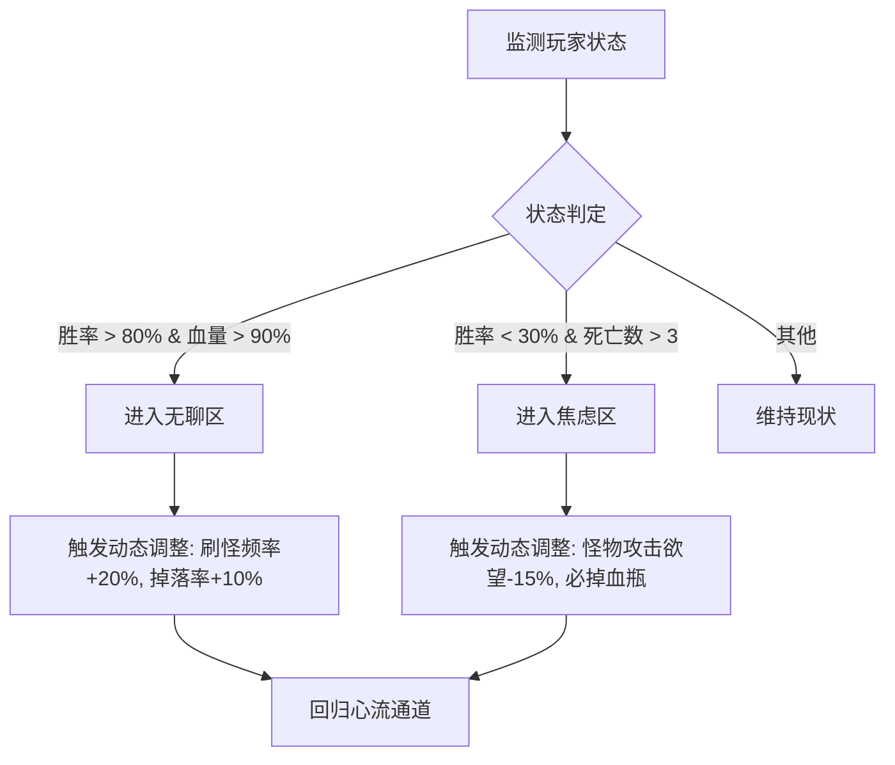

---
sidebarTitle: "成长心理学"
title: "心理学在玩家成长曲线中的应用"
description: "深度解析游戏成瘾背后的心理学机制，利用韦伯定律、心流理论与斯金纳箱构建沉浸式数值体验"
icon: "brain"
---


# 🧠 心理学在玩家成长曲线中的应用

> **摘要**：游戏数值策划的终极形态是“体验设计师”。本文不讨论单纯的加减乘除，而是探讨如何利用神经科学与心理学原理（自我决定理论、韦伯定律、斯金纳箱），通过数值模型精确操控玩家的多巴胺分泌与心流状态。

---

## 📐 第一性原理：数值感知的韦伯-费希纳定律

许多策划常犯的错误是认为“数值提升是线性的”。但心理物理学告诉我们：**人对数值变化的感知是指数级的**。

### 韦伯-费希纳定律 (Weber-Fechner Law)

$$
S = k \cdot \ln(I)
$$

*   $S$：心理感知强度 (Sensation)
*   $I$：物理刺激强度 (Intensity，即游戏数值)
*   $k$：常数

#### 🎮 游戏设计启示

1.  **伤害数字的膨胀必然性**：
    为了维持相同的“爽感提升”($\Delta S$ 恒定)，数值($I$)必须呈指数级增长。
    *   100 $\rightarrow$ 110 (提升10点，感觉明显)
    *   1000 $\rightarrow$ 1010 (提升10点，毫无感觉)
    *   **结论**：后期游戏的装备数值膨胀不是失控，而是**心理学必需**。

2.  **货币感知的钝化**：
    玩家拥有 100 金币时，奖励 10 金币很开心；拥有 100 万金币时，奖励 1000 金币都懒得捡。
    *   **解决方案**：引入**新货币**（如从金币 $\rightarrow$ 钻石 $\rightarrow$ 飞升令牌），强制重置 $I$ 值，让玩家重新获得高 $k$ 值的敏感度。

---

## 🌊 心流通道 (Flow Channel) 的数值化构建

米哈里·契克森米哈赖的心流理论众所周知，但在数值上如何实现？

### 心流的数学表达

心流状态位于“焦虑”与“无聊”之间。我们可以定义一个动态区间：

$$
\text{Skill}(t) - \delta < \text{Difficulty}(t) < \text{Skill}(t) + \delta
$$

其中 $\delta$ 是玩家的容错阈值。

### 动态难度调整 (DDA) 算法模型

为了保持玩家在通道内，我们需要一个闭环控制系统：



> [!TIP]
> **隐形之手**
> DDA 必须是**不可见**的。如果玩家发现自己死多了系统就故意放水，成就感会瞬间崩塌（自我决定理论中的“胜任感”受损）。

---

## 🎰 斯金纳箱：变动比率强化 (Variable Ratio Schedule)

这是 Roguelike 让人“再来一局”的核心机制。

### 四种奖励模式对比

| 模式 | 定义 | 行为特征 | 消失抵抗力 | 游戏案例 |
| :--- | :--- | :--- | :--- | :--- |
| **固定比率 (FR)** | 每打10只怪掉1金币 | 只有打怪时才行动，打完休息 | 低 | 任务系统、战斗通行证等级 |
| **固定时隔 (FI)** | 每10分钟刷个BOSS | 时间临近时活跃度激增 | 中 | 每日签到、体力恢复 |
| **变动时隔 (VI)** | 平均10分钟刷个BOSS | 稳定但缓慢的行动 | 高 | 挂机游戏的资源产出 |
| **变动比率 (VR)** | **平均打10只怪掉1金币** | **极高频率的尝试，停不下来** | **极高** | **抽卡、暴击、随机词条** |

### 🎲 深度应用：双重随机判定 (The Double RNG Roll)

为了最大化 VR 模式的成瘾性，现代 ARPG（如《暗黑破坏神》）设计了多层嵌套的随机：

1.  **判定一（掉落权）**：怪死了，是否掉装备？（20%）
2.  **判定二（稀有度）**：是传奇装备吗？（5%） $\rightarrow$ **多巴胺预备释放**
3.  **判定三（词条类型）**：是核心词条吗？（10%）
4.  **判定四（词条数值）**：是满数值吗？（1%） $\rightarrow$ **多巴胺爆发**

这种“差点就赢了”（Near Miss）的心理效应，比直接失败更能刺激多巴胺分泌。

---

## 🧠 自我决定理论 (SDT) 的数值映射

Ryan 和 Deci 的 SDT 理论认为人类有三大核心心理诉求。优秀的数值系统必须回应这三点：

### 1. 胜任感 (Competence) $\rightarrow$ 验证数值
玩家需要感觉到自己变强了。
*   **反例**：怪物等级随玩家动态同步（如《最终幻想8》或《暗黑4》初期），玩家升了级却打怪更慢，胜任感崩塌。
*   **正解**：设计**数值碾压区**。让玩家回到新手村，一个技能秒杀全屏，直观确认数值成长。

### 2. 自主感 (Autonomy) $\rightarrow$ 构建数值 (Build)
玩家需要感觉到是“我”设计了这个角色，而不是策划教我玩的。
*   **数值策略**：提供**Trade-off（权衡）**机制。
    *   *例如：攻击力+50%，但生命上限-30%。*
    *   这迫使玩家思考和选择，而不仅仅是点击“一键穿戴”。

### 3. 归属感 (Relatedness) $\rightarrow$ 社交数值
即使是单机游戏，也需要归属感（如NPC的认可）。
*   **数值策略**：**声望系统**与**阵营加成**。当玩家致力于某个阵营，该阵营必须给予独特的数值反馈（如独占的附魔配方），建立情感连接。

---

## 📉 损失厌恶 (Loss Aversion) 与 沉没成本

心理学表明，**失去 100 元的痛苦是获得 100 元快乐的 2.5 倍**。

### 😈 黑暗模式设计：反向利用

1.  **限时奖励 (FOMO)**：
    *   “限时特惠还有 59:59 结束” $\rightarrow$ 利用损失厌恶强迫决策。
2.  **战斗通行证 (Battle Pass)**：
    *   先让玩家免费打到 50 级，积累了海量“未解锁奖励”。
    *   此时购买通行证的动力极大，因为不买就等于“损失”了已经打出来的奖励（沉没成本）。
3.  **死亡惩罚与保底**：
    *   Roguelike 的死亡掉落极其痛苦。
    *   **优化**：引入“局外成长”（Meta-progression）。虽然你死了（损失），但你带回了 50 个灵魂碎片（收益），刚才的时间没有白费（缓解沉没成本焦虑）。

---

## 🛠️ 实战工具：爽点密度计算器

我们不能只靠感觉设计。这是量化“爽感”的评估模型：

```python
def calculate_joy_density(game_session_log):
    """
    计算一局游戏的爽点密度
    """
    duration_min = game_session_log.duration / 60
    
    # 权重定义 (根据韦伯定律调整)
    weights = {
        "critical_hit": 0.1,      # 暴击 (高频低权)
        "kill_elite": 2.0,        # 击杀精英
        "level_up": 10.0,         # 升级 (低频高权)
        "legendary_drop": 50.0,   # 传奇掉落 (极低频超高权)
        "full_screen_clear": 5.0  # 全屏清场
    }
    
    total_joy_score = 0
    for event in game_session_log.events:
        score = weights.get(event.type, 0)
        # 连续触发有加成 (Combo Bonus)
        if event.is_combo:
            score *= 1.5
        total_joy_score += score
        
    density = total_joy_score / duration_min
    
    # 标准：< 20 无聊, 20-50 舒适, > 80 极爽(但也易疲劳)
    return density
```

## 📝 总结

数值不仅仅是 Excel 表格中的公式，它是**直通玩家大脑边缘系统的电信号**。
*   利用**韦伯定律**管理膨胀。
*   利用**斯金纳箱**制造期待。
*   利用**DDA**维持心流。
*   利用**SDT**赋予意义。

最伟大的数值策划，本质上是能够用数学公式编写情感乐章的心理大师。
