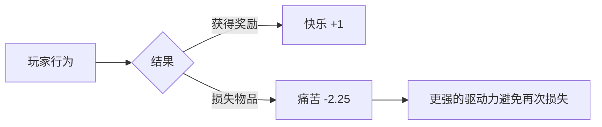
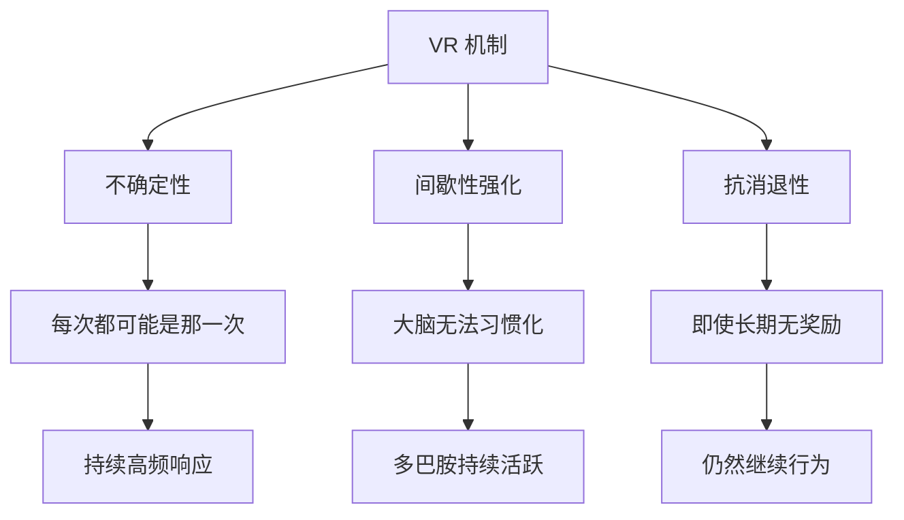

> **摘要**：本文聚焦「斯金纳箱与成瘾设计」，梳理核心概念、关键方法与落地实践。

---

> [!NOTE] > **核心理论**: 行为是由其后果塑造的。通过特定的**强化程序 (Reinforcement Schedules)**，我们可以让玩家（就像箱子里的老鼠）不停地按下按钮（肝游戏/充值）。

## 1. 什么是斯金纳箱？(The Concept)

B.F. Skinner 是行为主义心理学大师。他做了一个箱子，里面有杠杆和食物槽。

- **正强化**: 老鼠按杠杆 -> 掉落食物 -> 老鼠学会了按杠杆。
- **游戏映射**: 玩家通关副本 (按杠杆) -> 掉落装备 (食物) -> 玩家学会了刷副本。

## 2. 四种强化程序 (The 4 Schedules)

这四种机制决定了玩家有多“肝”。

### 2.1 固定比率 (Fixed Ratio - FR)

- **规则**: 每按 **N** 次杠杆，给 1 个食物。
- **游戏**: "每升 10 级送一个礼包"、"杀 100 只怪完成任务"。
- **效果**: 玩家会**快速**地执行任务，但在获得奖励后会有**短暂的休息期** (Post-Reinforcement Pause)。
- **评价**: 适合新手引导，建立确定性。

### 2.2 固定间隔 (Fixed Interval - FI)

- **规则**: 每隔 **T** 分钟，按杠杆才给食物。
- **游戏**: "体力值每 5 分钟恢复 1 点"、"每日签到"、"收菜"。
- **效果**: 玩家在时间快到时才会上线，平时不活跃 (**扇贝效应**)。
- **评价**: 适合留存系统 (Retention)，培养上线习惯。

### 2.3 可变比率 (Variable Ratio - VR) - **最强成瘾机制**

- **规则**: 平均每 N 次给一个，但具体哪次给**不知道**。可能是第 1 次，也可能是第 50 次。
- **游戏**: **抽卡 (Gacha)**、**刷极品词条**、**暴击**。
- **效果**: **极高的响应率**，且**极难消退**。因为玩家总觉得 "下一次一定出"。
- **评价**: **这是赌博的核心**。Vampirefall 的刷宝体验必须基于此。

### 2.4 可变间隔 (Variable Interval - VI)

- **规则**: 平均每 T 分钟出现一次，但不知道具体何时。
- **游戏**: "随机刷新的神秘商人"、"野外随机遭遇的稀有怪"。
- **效果**: 玩家为了不错过，会长时间在线蹲守。
- **评价**: 适合增加在线时长 (DAU Duration)。

## 3. 🧠 神经科学基础：多巴胺循环 (The Dopamine Loop)

为什么 VR (Variable Ratio) 如此强大？因为大脑的奖励系统并不是在“得到奖励”时最活跃，而是在**预期奖励**时。

### 3.1 奖赏预测误差 (Reward Prediction Error - RPE)

- **公式**: `RPE = 实际获得的奖励 - 预期的奖励`
- **机制**:
  - 如果你预期得到 100，实际得到 100 -> RPE = 0 (大脑无感)。
  - 如果你预期得到 0，实际得到 100 -> RPE > 0 (多巴胺爆发)。
- **应用**: 宝箱必须有“空”的可能（或全是垃圾），这样当“金光”出现时，RPE 才会最大化。

### 3.2 想要 vs 喜欢 (Wanting vs Liking)

- **Wanting (多巴胺)**: 驱动你去做的动力。“我一定要再抽一次！”
- **Liking (阿片类物质)**: 得到后的快乐。“抽到了，好开心。”
- **成瘾的悲剧**: 后期成瘾者，Wanting 极高（停不下来），但 Liking 很低（抽到了也就那样）。
- **设计警示**: 不要只利用 Wanting 把玩家榨干，要确保他们真的 Liking 你的游戏内容。

## 4. 📉 行为沉沦 (Behavioral Sink)

如果斯金纳箱设计得太甚至完美，会发生什么？

### 4.1 老鼠乌托邦 (Mouse Utopia)

John Calhoun 的实验：给老鼠无限的食物和完美的舒适环境。结果老鼠停止了社交、繁衍，最终种群灭绝。

### 4.2 游戏中的沉沦

- **现象**: 当资源获取变得完全自动化、毫无挑战且无限供给时，玩家会感到**意义的丧失**。
- **Vampirefall 警告**:
  - 不要让“挂机流”变得过于高效，以至于玩家完全不需要操作。
  - 必须引入“混乱因子”或“由于自身失误导致的失败”，保持环境的压力。

## 5. 在 Vampirefall 中的实战应用

### 5.1 混合强化 (Hybrid Schedules)

不要只用一种。最好的设计是组合拳。

- **战斗内 (In-Game)**: **VR (可变比率)**

  - 每一只怪都有 1% 概率掉落金币。
  - 每一只精英怪都有 0.1% 概率掉落暗金。
  - _效果_: 玩家疯狂杀怪，停不下来。

- **战斗结算 (Victory)**: **FR (固定比率)**

  - 通关必得 100 经验 + 1 个宝箱。
  - _效果_: 保证保底收益，防止非酋流失。

- **局外系统 (Meta)**: **FI (固定间隔)**
  - 基地里的“金矿”每小时产出 100 金币。
  - _效果_: 强迫玩家每几小时上线收一次菜。
  - **代码实现**:
  ```csharp
  // 简单的 FI 检查逻辑
  public bool CanCollectGold() {
      return (DateTime.Now - lastCollectionTime).TotalMinutes >= 60;
  }
  ```

### 5.2 消失性爆发 (Extinction Burst)

- **原理**: 当长期按杠杆有食物，突然不给了，老鼠不会立刻停止，反而会**更疯狂地按**，甚至产生攻击行为。
- **应用**:
  - **连败保护**: 如果玩家在 Roguelike 中连续死了 3 次（没得到食物），必须立刻触发“系统怜悯”（送一个强力 buff 或降低难度），防止玩家进入“习得性无助”而流失。

## 6. 🎰 高级设计模式 (Advanced Patterns)

### 6.1 近失效应 (Near Miss Effect)

> [!IMPORTANT] > **近失效应**是赌博中最强大的心理陷阱之一，也是抽卡/开箱设计的核心。

- **原理**: 当结果"差一点就成功"时，大脑会释放**几乎等同于成功**的多巴胺。
- **赌博机设计**: 老虎机故意让转盘在大奖符号附近停下，让你觉得"差一点就中了"。
- **游戏应用**:
  - 抽卡时显示 SSR 图标"擦肩而过"。
  - Boss 被打到 1% 血量时团灭。
  - 锻造 +15 失败，显示"+14.9"。

```csharp
// Near Miss 实现示例
public void ShowGachaResult(Item result) {
    if (result.Rarity < SSR) {
        // 30% 概率展示 "差一点就是 SSR"
        if (Random.value < 0.3f) {
            ShowNearMissAnimation(GetRandomSSR());
        }
    }
    ShowActualResult(result);
}
```

### 6.2 沉没成本谬误 (Sunk Cost Fallacy)

- **原理**: 人们倾向于继续投入，只因为已经投入了很多。
- **游戏应用**:
  - "你已经充值了 998 元，再充 2 元就能获得 VIP10 专属礼包！"
  - "这把武器你已经强化到 +14 了，放弃的话之前的材料全白费！"
- **Vampirefall 设计**:
  - 显示角色养成进度："已投入 1000 小时，战力 Top 5%。"
  - 赛季结束前提醒："距离专属皮肤还差 200 积分！"

### 6.3 损失厌恶 (Loss Aversion)

- **原理**: 失去 100 元的痛苦 > 获得 100 元的快乐（约 2-2.5 倍）。
- **公式**: `负效用 = -λ × 损失值`，其中 λ ≈ 2.25
- **游戏应用**:
  - **限时活动**: "仅剩 2 小时！错过再等一年！"
  - **负面强化**: "不每日签到会损失连续签到奖励！"
  - **死亡惩罚**: 死亡掉落背包中的装备（Roguelike 核心恐惧）。



### 6.4 禀赋效应 (Endowment Effect)

- **原理**: 人们对自己拥有的东西估值过高。
- **游戏应用**:
  - 让玩家"试用" 7 天的 VIP 特权，到期后他们会觉得"被拿走了"。
  - 给新手一个"限时"的强力武器，到期后玩家会想办法"留住它"。

### 6.5 承诺与一致性 (Commitment & Consistency)

- **原理**: 人们一旦做了某个决定，会努力让后续行为与之保持一致。
- **游戏应用**:
  - 选择阵营/职业后，给予专属奖励，强化"我是 XX 阵营的人"的身份认同。
  - 公开承诺："你选择了加入公会挑战，全工会都在等你！"

---

## 7. 📊 数值模型与公式 (Quantitative Models)

### 7.1 期望价值 (Expected Value - EV)

- **公式**: $EV = \sum (P_i \times V_i)$
- **应用**: 设计抽卡池时，确保玩家的主观 EV 略高于实际成本。

| 稀有度   | 概率 $P$ | 价值 $V$ (主观) | 贡献 $P \times V$ |
| -------- | -------- | --------------- | ----------------- |
| N        | 70%      | 1               | 0.70              |
| R        | 20%      | 5               | 1.00              |
| SR       | 8%       | 25              | 2.00              |
| SSR      | 2%       | 200             | 4.00              |
| **总计** | 100%     |                 | **7.70**          |

> 主观期望 7.7，实际成本 5 → 玩家觉得"赚了"（即使数学上是亏的）。

### 7.2 成瘾性指数 (Addictiveness Index)

一个用于评估机制成瘾性的自创指标：

$$
AI = \frac{VR_{weight} \times 0.5 + NM_{freq} \times 0.3 + LA_{intensity} \times 0.2}{1 + TF_{cost}}
$$

| 参数             | 含义                  | 范围               |
| ---------------- | --------------------- | ------------------ |
| $VR_{weight}$    | 可变比率机制的占比    | 0-1                |
| $NM_{freq}$      | 近失效应的触发频率    | 0-1                |
| $LA_{intensity}$ | 损失厌恶的强度        | 0-1                |
| $TF_{cost}$      | 时间/金钱成本的透明度 | 0-1 (越高越不成瘾) |

> [!CAUTION]
> AI > 0.7 的机制设计需要额外的道德审查。

### 7.3 保底机制数学 (Pity System Math)

- **软保底 (Soft Pity)**: 从第 N 次开始，概率逐渐提升。
- **硬保底 (Hard Pity)**: 第 M 次必定获得。

```python
## 模拟抽卡期望次数
def expected_pulls(base_rate, soft_pity_start, hard_pity, rate_increase):
    """
    计算获得目标物品的期望抽数
    """
    total = 0
    cumulative_probability = 0
    for i in range(1, hard_pity + 1):
        if i < soft_pity_start:
            p = base_rate
        else:
            p = base_rate + rate_increase * (i - soft_pity_start + 1)
            p = min(p, 1.0)

        probability_at_this_pull = p * (1 - cumulative_probability)
        total += i * probability_at_this_pull
        cumulative_probability += probability_at_this_pull

    return total

## 原神 UP 池参数模拟
## 基础概率 0.6%, 软保底从第 74 抽开始, 硬保底 90 抽, 每抽提升 6%
expected = expected_pulls(0.006, 74, 90, 0.06)
print(f"期望抽数: {expected:.2f}")  # 约 62.5 抽
```

---

## 8. 🎮 行业案例分析 (Case Studies)

### 8.1 《原神》(Genshin Impact) - VR 的极致应用

| 机制       | 类型 | 分析                                             |
| ---------- | ---- | ------------------------------------------------ |
| 抽卡系统   | VR   | 0.6% 基础率 + 软硬保底，完美平衡"希望"与"确定性" |
| 每日委托   | FI   | 每天 4 个，完成得树脂，培养上线习惯              |
| 深境螺旋   | FR   | 每层固定原石奖励，提供目标感                     |
| 圣遗物刷取 | VR   | 主词条+副词条的双层随机，核心肝点                |

**设计亮点**:

- 抽卡动画的"星光坠落"特效完美利用了**近失效应**。
- 丢弃 50:50 后，下个 UP 必得，利用了**损失厌恶**（你已经"亏了"一次）。

### 8.2 《暗黑破坏神》系列 - 刷宝鼻祖

- **核心循环**: 杀怪 → VR 掉落 → 更强装备 → 杀更强的怪。
- **"叮"的艺术**: 当传奇装备掉落时，特殊的音效和光柱触发多巴胺峰值。
- **智能掉落 (D3)**: 根据你的职业调整掉落表，增加有效掉落率，延长"获得升级"的快感周期。

### 8.3 《糖果传奇》(Candy Crush) - 手游 FI 之王

- **体力系统**: 典型的 FI。你不能无限玩，必须等待或付费。
- **地图解锁**: FR。每通过 N 关解锁新区域。
- **关卡设计**: VR。有些关卡看起来"差一点就过了"（近失效应），驱动你再试一次。

---

## 9. 🛡️ 反成瘾设计策略 (Anti-Addiction Design)

> [!TIP]
> 好的游戏设计是让玩家**主动选择**离开，而不是**被控制**着留下。

### 9.1 健康的留存 vs 不健康的留存

| 维度     | 健康留存               | 不健康留存                 |
| -------- | ---------------------- | -------------------------- |
| 驱动力   | 内在动机（乐趣、成就） | 外在动机（FOMO、损失厌恶） |
| 离开感受 | "今天玩够了，明天再来" | "不想玩了，但不登录会亏"   |
| 长期效果 | 玩家成为粉丝，自发推广 | 玩家疲劳，负面口碑         |

### 9.2 Vampirefall 的"干净"设计原则

1. **透明概率**: 所有随机机制必须公示概率。
2. **有意义的毕业**: 每个系统都有"满级"状态。
3. **尊重时间**: 不设计"惩罚离线"的机制。
4. **自然停点**: 每日任务完成后有明确提示："今日目标已达成！"
5. **防沉迷系统**: 超过 X 小时后显示健康提醒。

```csharp
// 健康游戏提醒示例
public class HealthReminder : MonoBehaviour {
    private float _sessionTime = 0f;

    void Update() {
        _sessionTime += Time.deltaTime;

        if (_sessionTime > 7200f) { // 2 小时
            ShowReminder("您已游戏 2 小时，建议休息一下！");
            _sessionTime = 0f; // 重置计时器
        }
    }
}
```

### 9.3 "有节制的赌博"

- **每日抽卡上限**: 可以抽，但有每日次数限制，防止一时冲动。
- **冷静期**: 大额消费前强制等待 15 分钟。
- **消费报告**: 每月发送消费统计，让玩家清醒认识自己的投入。

---

## 10. 🔬 VR 机制深度解析 (Deep Dive: Variable Ratio)

### 10.1 为什么 VR 最强？



### 10.2 VR 的变体与组合

| 变体             | 描述                | 游戏应用                              |
| ---------------- | ------------------- | ------------------------------------- |
| **带保底的 VR**  | 在 N 次内必出       | 抽卡硬保底                            |
| **递增概率 VR**  | 每次失败后概率增加  | 软保底、暴击积累                      |
| **分层 VR**      | 多个独立的随机层    | 圣遗物主词条+副词条                   |
| **VR + FR 混合** | 随机奖励 + 固定奖励 | 通关掉宝箱(FR) + 宝箱开出随机物品(VR) |

### 10.3 心理阶段分析

玩家在 VR 循环中会经历以下心理阶段：

1. **探索期**: "这个系统怎么玩？"
2. **蜜月期**: "哇，抽到好东西了！" (早期 RPE 最高)
3. **追逐期**: "再抽一发！下一发一定出！"
4. **疲劳期**: "怎么一直不出..." (Wanting 高，Liking 低)
5. **放弃/毕业**: "算了/我满了"

> 设计目标：延长**蜜月期**和**追逐期**，在**疲劳期**之前提供出口。

---

## 11. 道德与红线 (Ethics)

> [!WARNING]
> 不要成为多巴胺贩子。

### 11.1 暗黑模式识别

- **虚假紧迫性**: "限时优惠"但其实永远有。
- **隐藏成本**: 不展示抽卡所需的真实金钱。
- **社交压力**: "你的好友都在玩/充钱。"
- **付费墙**: 不付费根本无法体验核心内容。

### 11.2 Vampirefall 的底线

- **诚实**: 公示概率，不做虚假宣传。
- **尊重**: 允许玩家"毕业"。不要设计永远填不满的坑。
- **有边界**: 斯金纳箱应该是为了**增加乐趣**，而不是为了**奴役时间**。
- **保护弱势群体**: 对未成年人和有成瘾史的玩家有额外保护。

### 11.3 行业自律建议

1. 明确标注抽卡概率
2. 提供消费上限设置
3. 不向未成年人推送付费内容
4. 建立退款机制

---

## 12. 总结

要想让 _Vampirefall_ 好玩：

1.  **核心循环**必须是 **VR (随机掉落)** —— 也就是 Roguelike 和 刷宝 的本质。
2.  **长期留存**必须是 **FI (收菜/签到)** —— 培养习惯。
3.  **新手引导**必须是 **FR (固定奖励)** —— 建立信任。

---

## 📚 扩展阅读与参考文献 (References)

### 🏛️ 经典理论

- **[The Art of Game Design: A Book of Lenses](https://schellgames.com/art-of-game-design/)** (Jesse Schell)
  - _必读章节_: "The Lens of the Skinner Box". 它是游戏设计心理学的入门圣经。
- **[Hooked: How to Build Habit-Forming Products](https://www.nirandfar.com/hooked/)** (Nir Eyal)
  - _核心_: 详细拆解了 "Trigger -> Action -> Variable Reward -> Investment" 模型。

### 📺 GDC 演讲 (必须看)

- **[GDC 2010: The Psychology of Game Design](https://www.gdcvault.com/play/1012186/The-Psychology-of-Game)** (Sid Meier)
  - _文明之父_ Sid Meier 讲解如何利用心理学让玩家产生 "One More Turn" 的冲动。
- **[GDC 2017: Loot Box Design 2.0](https://www.youtube.com/watch?v=VzY2e5tvjcs)**
  - 深入剖析了开箱动画、音效与多巴胺分泌的关系。

### 📝 深度文章

- **[Behavioral Game Design](https://www.gamasutra.com/view/feature/131494/behavioral_game_design.php)** (Gamasutra)
  - 这篇 2001 年的文章首次将 B.F. Skinner 的理论系统性地引入游戏设计界。
