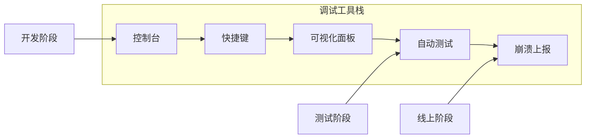

---
sidebarTitle: "🛠️ 调试控制台与作弊指令"
title: "调试指令与GM工具"
description: "游戏开发中的调试工具、控制台指令、快速调试技巧与自动化测试方案"
icon: "bug"
---


# 🛠️ 调试指令与 GM 工具

> **重要性**: Roguelike 游戏的随机性是测试的噩梦。如果没有一套强大的上帝工具，QA 根本无法验证"第 50 层刷出的神器是否会导致闪退"。

## 1. 核心指令集 (Command List)

建议接入开源库（如 **SRDebugger** 或 **IngameDebugConsole**），实现以下指令：

### 1.1 资源控制

| 指令              | 参数                 | 说明                                 |
| ----------------- | -------------------- | ------------------------------------ |
| `/add_gold`       | `[amount]`           | 加金币                               |
| `/add_exp`        | `[amount]`           | 加主角经验                           |
| `/add_res`        | `[resType] [amount]` | 加任意资源                           |
| `/level_up`       | `[count=1]`          | 直接升级并触发 Perk 选择界面         |
| `/max_level`      | -                    | 直接升至满级                         |
| `/reset_progress` | -                    | 重置所有进度（危险操作，需二次确认） |

### 1.2 流程控制

| 指令              | 参数           | 说明                           |
| ----------------- | -------------- | ------------------------------ |
| `/skip_wave`      | -              | 直接跳过当前波次（杀死所有怪） |
| `/goto_wave`      | `[waveNum]`    | 跳到指定波次                   |
| `/spawn_mob`      | `[id] [count]` | 在鼠标位置生成指定怪物         |
| `/spawn_boss`     | `[bossId?]`    | 直接召唤当前关卡或指定 BOSS    |
| `/time_scale`     | `[float]`      | 游戏变速: 0=暂停, 10=十倍速    |
| `/pause`          | -              | 暂停游戏逻辑（不暂停 UI）      |
| `/complete_stage` | -              | 直接通关当前关卡               |

### 1.3 装备与掉落

| 指令           | 参数               | 说明                         |
| -------------- | ------------------ | ---------------------------- |
| `/give_item`   | `[id]`             | 以此 ID 获取装备             |
| `/give_random` | `[rarity] [count]` | 获取随机装备                 |
| `/force_drop`  | `[rarity]`         | 下一次击杀必掉指定稀有度物品 |
| `/clear_bag`   | -                  | 清空背包                     |
| `/unlock_all`  | -                  | 解锁全部物品图鉴             |

### 1.4 无敌与状态

| 指令           | 参数       | 说明                |
| -------------- | ---------- | ------------------- |
| `/god_mode`    | `[on/off]` | 主角无敌 + 秒杀敌人 |
| `/no_cd`       | `[on/off]` | 技能无冷却          |
| `/no_cost`     | `[on/off]` | 技能无消耗          |
| `/invisible`   | `[on/off]` | 敌人忽略玩家        |
| `/show_fps`    | -          | 显示帧率和内存占用  |
| `/show_hitbox` | -          | 显示碰撞体积        |

---

## 2. 快速调试技巧

### 2.1 编辑器快捷键绑定

在 Unity 编辑器中设置自定义快捷键，大幅提升调试效率：

```csharp
#if UNITY_EDITOR
public class DebugShortcuts
{
    // Alt + G: 开关上帝模式
    [MenuItem("Debug/God Mode _&g")]
    static void ToggleGodMode() => GameDebug.GodMode = !GameDebug.GodMode;

    // Alt + K: 击杀所有敌人
    [MenuItem("Debug/Kill All Enemies _&k")]
    static void KillAllEnemies() => EnemyManager.Instance.KillAll();

    // Alt + L: 升一级
    [MenuItem("Debug/Level Up _&l")]
    static void QuickLevelUp() => PlayerStats.Instance.AddExp(999999);

    // F5: 保存快照 / F9: 加载快照
    [MenuItem("Debug/Save Snapshot _F5")]
    static void SaveSnapshot() => DebugSnapshot.Save();

    [MenuItem("Debug/Load Snapshot _F9")]
    static void LoadSnapshot() => DebugSnapshot.Load();
}
#endif
```

### 2.2 游戏状态快照 (Snapshot)

实现游戏状态的快速保存/恢复，用于反复测试同一场景：

```csharp
public static class DebugSnapshot
{
    private static GameStateData _snapshot;

    public static void Save()
    {
        _snapshot = new GameStateData
        {
            PlayerPosition = Player.Position,
            PlayerHP = Player.HP,
            PlayerLevel = Player.Level,
            WaveNumber = WaveManager.CurrentWave,
            Inventory = Player.Inventory.Clone(),
            EnemyStates = EnemyManager.SerializeAll(),
            RandomSeed = GameRandom.CurrentSeed
        };
        Debug.Log($"[Snapshot] Saved at Wave {_snapshot.WaveNumber}");
    }

    public static void Load()
    {
        if (_snapshot == null) return;

        // 恢复随机种子（关键！）
        GameRandom.SetSeed(_snapshot.RandomSeed);

        Player.Position = _snapshot.PlayerPosition;
        Player.HP = _snapshot.PlayerHP;
        // ... 恢复其他状态

        Debug.Log("[Snapshot] Loaded successfully");
    }
}
```

> [!TIP] > **随机种子是关键**：恢复快照时必须同时恢复随机种子，否则后续的随机事件会完全不同。

### 2.3 条件断点与日志过滤

```csharp
public static class DebugLog
{
    // 分类日志，可在运行时开关
    [Flags]
    public enum LogCategory
    {
        None = 0,
        Combat = 1 << 0,    // 伤害计算
        AI = 1 << 1,        // AI 决策
        Loot = 1 << 2,      // 掉落生成
        Wave = 1 << 3,      // 波次逻辑
        Network = 1 << 4,   // 网络同步
        All = ~0
    }

    public static LogCategory EnabledCategories = LogCategory.All;

    [Conditional("UNITY_EDITOR"), Conditional("DEBUG_BUILD")]
    public static void Log(LogCategory cat, string msg)
    {
        if ((EnabledCategories & cat) != 0)
            Debug.Log($"[{cat}] {msg}");
    }
}

// 使用示例
DebugLog.Log(DebugLog.LogCategory.Combat, $"Damage: {damage}, Target HP: {target.HP}");
```

### 2.4 可视化调试 (Gizmos)

```csharp
public class DebugVisualization : MonoBehaviour
{
    [Header("开关")]
    public bool showEnemyHP = true;
    public bool showPathfinding = false;
    public bool showAttackRange = true;
    public bool showSpawnAreas = true;

    void OnDrawGizmos()
    {
        if (showEnemyHP)
            DrawEnemyHealthBars();

        if (showPathfinding)
            DrawNavPaths();

        if (showAttackRange)
            DrawPlayerAttackRange();
    }

    void DrawEnemyHealthBars()
    {
        foreach (var enemy in EnemyManager.Instance.AllEnemies)
        {
            var hpRatio = enemy.HP / enemy.MaxHP;

            // 血量颜色：绿 -> 黄 -> 红
            Gizmos.color = Color.Lerp(Color.red, Color.green, hpRatio);

            Vector3 pos = enemy.transform.position + Vector3.up * 2;
            Gizmos.DrawCube(pos, new Vector3(hpRatio, 0.1f, 0.1f));
        }
    }
}
```

---

## 3. 实时变量调节 (Runtime Tweaking)

### 3.1 ScriptableObject 热重载

```csharp
[CreateAssetMenu]
public class EnemyConfig : ScriptableObject
{
    [Header("基础属性")]
    public float moveSpeed = 3f;
    public float attackRange = 2f;
    public int damage = 10;

    // 编辑器中修改后自动应用
#if UNITY_EDITOR
    void OnValidate()
    {
        // 通知所有使用此配置的敌人更新
        EnemyManager.Instance?.RefreshAllConfigs();
    }
#endif
}
```

### 3.2 调试面板 (SROptions 风格)

```csharp
#if UNITY_EDITOR || DEBUG_BUILD
public partial class SROptions
{
    // 数值调节
    [Category("Combat")]
    public float PlayerDamageMultiplier { get; set; } = 1f;

    [Category("Combat")]
    public float EnemySpeedMultiplier { get; set; } = 1f;

    // 开关选项
    [Category("Cheats")]
    public bool InfiniteHP { get; set; }

    [Category("Cheats")]
    public bool OneHitKill { get; set; }

    // 操作按钮
    [Category("Actions")]
    public void SpawnTestBoss() => BossManager.SpawnBoss("TestBoss");

    [Category("Actions")]
    public void CompleteCurrentWave() => WaveManager.ForceComplete();
}
#endif
```

### 3.3 命令行参数

支持启动时通过命令行设置调试参数：

```csharp
public static class LaunchArgs
{
    public static bool GodMode { get; private set; }
    public static int StartWave { get; private set; } = 1;
    public static bool SkipTutorial { get; private set; }

    [RuntimeInitializeOnLoadMethod(RuntimeInitializeLoadType.BeforeSceneLoad)]
    static void ParseArgs()
    {
        var args = Environment.GetCommandLineArgs();

        GodMode = args.Contains("-godmode");
        SkipTutorial = args.Contains("-skiptutorial");

        var waveArg = args.FirstOrDefault(a => a.StartsWith("-wave="));
        if (waveArg != null)
            StartWave = int.Parse(waveArg.Split('=')[1]);
    }
}
```

启动参数示例：

```bash
Game.exe -godmode -wave=10 -skiptutorial
```

---

## 4. 自动化测试脚本 (Auto-Play Bots)

为了测试服务器压力或数值崩坏，需要简单的 AI 脚本：

### 4.1 基础挂机机器人

```csharp
public class AFKBot : MonoBehaviour
{
    // 主角站在原地不动，自动普攻最近敌人
    // 用于测试"挂机一晚上会不会内存溢出"

    void Update()
    {
        var nearest = EnemyManager.FindNearest(transform.position);
        if (nearest != null && IsInRange(nearest))
            Player.Instance.Attack(nearest);
    }
}
```

### 4.2 随机操作机器人

```csharp
public class RandomBot : MonoBehaviour
{
    // 随机移动，有技能就放
    // 用于测试"乱按会不会报错"

    private float _nextMoveTime;
    private Vector2 _moveDir;

    void Update()
    {
        // 随机移动
        if (Time.time > _nextMoveTime)
        {
            _moveDir = Random.insideUnitCircle.normalized;
            _nextMoveTime = Time.time + Random.Range(0.5f, 2f);
        }
        Player.Instance.Move(_moveDir);

        // 随机使用技能
        foreach (var skill in Player.Instance.Skills)
        {
            if (skill.IsReady && Random.value \< 0.3f)
                skill.Use();
        }
    }
}
```

### 4.3 压力测试机器人

```csharp
public class StressTestBot : MonoBehaviour
{
    [Header("测试配置")]
    public int targetWaveCount = 100;
    public bool logMemoryPerWave = true;

    private int _completedWaves;
    private List<MemorySnapshot> _memoryLog = new();

    void OnWaveComplete()
    {
        _completedWaves++;

        if (logMemoryPerWave)
        {
            _memoryLog.Add(new MemorySnapshot
            {
                Wave = _completedWaves,
                TotalMemory = GC.GetTotalMemory(false) / 1024f / 1024f,
                TextureMemory = Profiler.GetAllocatedMemoryForGraphicsDriver() / 1024f / 1024f
            });
        }

        if (_completedWaves >= targetWaveCount)
        {
            ExportReport();
            Debug.Log($"[StressTest] Completed {targetWaveCount} waves!");
        }
    }

    void ExportReport()
    {
        var csv = "Wave,TotalMB,TextureMB\n";
        foreach (var snap in _memoryLog)
            csv += $"{snap.Wave},{snap.TotalMemory:F2},{snap.TextureMemory:F2}\n";

        File.WriteAllText("stress_test_report.csv", csv);
    }
}
```

---

## 5. 性能监控面板

### 5.1 实时 FPS 与内存

```csharp
public class PerformanceHUD : MonoBehaviour
{
    private float _fps;
    private float _frameTime;
    private int _totalMemoryMB;

    void Update()
    {
        _fps = 1f / Time.unscaledDeltaTime;
        _frameTime = Time.unscaledDeltaTime * 1000f;
        _totalMemoryMB = (int)(GC.GetTotalMemory(false) / 1024 / 1024);
    }

    void OnGUI()
    {
        var style = new GUIStyle { fontSize = 24, normal = { textColor = Color.white } };

        GUILayout.BeginArea(new Rect(10, 10, 300, 200));

        // FPS 颜色：绿(60+) / 黄(30-60) / 红(\<30)
        var fpsColor = _fps >= 60 ? "green" : _fps >= 30 ? "yellow" : "red";
        GUILayout.Label($"<color={fpsColor}>FPS: {_fps:F1}</color>", style);
        GUILayout.Label($"Frame: {_frameTime:F2}ms", style);
        GUILayout.Label($"Memory: {_totalMemoryMB} MB", style);
        GUILayout.Label($"Enemies: {EnemyManager.Instance.Count}", style);

        GUILayout.EndArea();
    }
}
```

### 5.2 关键系统监控

```csharp
public class SystemMonitor
{
    // 追踪各系统的更新耗时
    private static Dictionary<string, float> _systemTimes = new();

    public static void BeginSample(string systemName)
        => Profiler.BeginSample(systemName);

    public static void EndSample(string systemName)
    {
        Profiler.EndSample();
        // 记录自定义时间追踪...
    }

    // 使用示例
    public void UpdateAI()
    {
        SystemMonitor.BeginSample("AI System");
        // ... AI 逻辑
        SystemMonitor.EndSample("AI System");
    }
}
```

---

## 6. 错误追踪与上报

### 6.1 异常捕获

```csharp
public class CrashReporter : MonoBehaviour
{
    void OnEnable()
    {
        Application.logMessageReceived += OnLogReceived;
    }

    void OnLogReceived(string condition, string stackTrace, LogType type)
    {
        if (type == LogType.Exception || type == LogType.Error)
        {
            var report = new CrashReport
            {
                Message = condition,
                StackTrace = stackTrace,
                GameState = CaptureGameState(),
                Timestamp = DateTime.UtcNow,
                DeviceInfo = SystemInfo.deviceModel
            };

            // 本地保存
            SaveLocalReport(report);

            // 上报服务器（注意：不要在每次 Error 时都上报，做节流）
            if (ShouldUpload(report))
                UploadReport(report);
        }
    }

    GameStateSnapshot CaptureGameState() => new()
    {
        Wave = WaveManager.CurrentWave,
        PlayerLevel = Player.Level,
        EnemyCount = EnemyManager.Count,
        FrameCount = Time.frameCount
    };
}
```

### 6.2 游戏回放录制

```csharp
public class ReplayRecorder : MonoBehaviour
{
    private List<InputFrame> _inputLog = new();
    private int _startSeed;

    public void StartRecording()
    {
        _startSeed = GameRandom.CurrentSeed;
        _inputLog.Clear();
    }

    void Update()
    {
        if (!_isRecording) return;

        _inputLog.Add(new InputFrame
        {
            Frame = Time.frameCount,
            MoveInput = InputManager.MoveVector,
            Buttons = InputManager.GetPressedButtons()
        });
    }

    public void SaveReplay(string filename)
    {
        var replay = new ReplayData
        {
            Seed = _startSeed,
            Inputs = _inputLog.ToArray()
        };

        var json = JsonUtility.ToJson(replay);
        File.WriteAllText($"Replays/{filename}.json", json);
    }
}
```

> [!IMPORTANT] > **确定性回放**需要游戏逻辑完全确定性：相同输入 + 相同随机种子 = 相同结果。这对于多人游戏同步和 Bug 复现极其重要。

---

## 7. 安全与权限 (Security)

### 7.1 编译条件

```csharp
// 开发宏：确保这些作弊代码绝对不会打包进 Release 版本
#if UNITY_EDITOR || DEVELOPMENT_BUILD
    DebugConsole.RegisterCommand("godmode", ToggleGodMode);
    DebugConsole.RegisterCommand("killall", KillAllEnemies);
#endif
```

### 7.2 后门锁设计

如果必须在 Release 版保留（为了线上救火），必须加密码锁或设备 ID 白名单：

```csharp
public class DebugUnlocker : MonoBehaviour
{
    private int _tapCount;
    private float _lastTapTime;
    private const string PASSWORD = "vampire2025";

    // 连续点击屏幕左上角 10 次
    void Update()
    {
        if (Input.GetMouseButtonDown(0) && IsInCorner())
        {
            if (Time.time - _lastTapTime > 1f)
                _tapCount = 0;

            _tapCount++;
            _lastTapTime = Time.time;

            if (_tapCount >= 10)
                ShowPasswordDialog();
        }
    }

    bool IsInCorner()
        => Input.mousePosition.x \< 100 && Input.mousePosition.y > Screen.height - 100;
}
```

### 7.3 白名单机制

```csharp
public static class DebugWhitelist
{
    private static HashSet<string> _allowedDevices = new()
    {
        "DeviceId_Developer1",
        "DeviceId_QA_Lead",
        // ...
    };

    public static bool IsAllowed =>
        _allowedDevices.Contains(SystemInfo.deviceUniqueIdentifier);
}
```

---

## 8. 推荐插件与工具

### 商业/开源插件

| 插件名                   | 类型       | 特点                                | 链接        |
| ------------------------ | ---------- | ----------------------------------- | ----------- |
| **Quantum Console**      | 控制台     | 极其强大的 C# 控制台，支持自动补全  | Asset Store |
| **SRDebugger**           | 调试面板   | 手机端非常好用，支持各种 Tweak 选项 | Asset Store |
| **Ingame Debug Console** | 控制台     | 开源免费，轻量级                    | GitHub      |
| **Console Pro**          | 编辑器增强 | 增强 Unity Console，支持过滤和折叠  | Asset Store |
| **Graphy**               | 性能监控   | 免费的 FPS/内存/音频监控            | GitHub      |

### 自研工具建议



---

## 9. 调试清单 (Checklist)

### 发布前必查

- [ ] 所有 `#if UNITY_EDITOR` 宏正确使用
- [ ] 调试快捷键不会打包进 Release
- [ ] 控制台密码已更新
- [ ] 白名单设备 ID 已配置
- [ ] 崩溃上报服务已启用
- [ ] 日志级别已设置为 `Error` 或更高

### 常见调试场景

| 场景         | 推荐工具/方法                    |
| ------------ | -------------------------------- |
| 复现随机 Bug | 保存随机种子 + 回放系统          |
| 内存泄漏     | Memory Profiler + 长时间挂机测试 |
| 性能瓶颈     | Frame Debugger + 自定义 Profiler |
| 数值失衡     | 变速 + 快速升级 + 日志分析       |
| 网络同步问题 | 本地双开 + 网络日志              |
