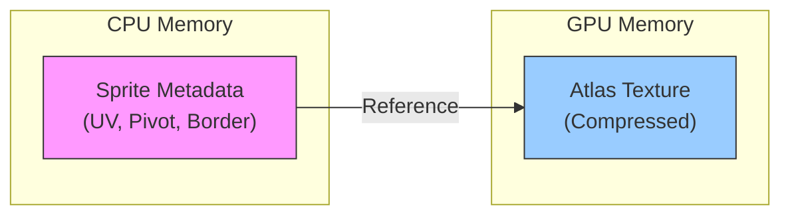
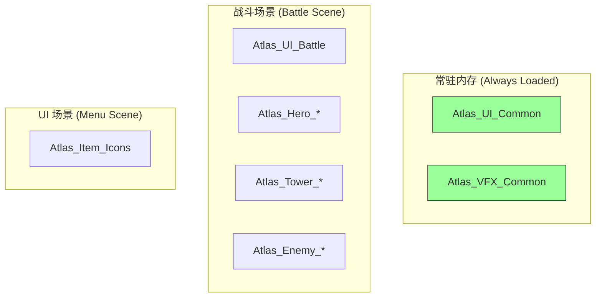

# 🎨 Unity SpriteAtlas 优化与实践深度研究

> **SpriteAtlas 是 Unity 中优化 2D 渲染性能的核心工具。** 通过合理的图集规划，可以大幅减少 Draw Call、降低内存占用，同时支持多分辨率资源的动态切换。

---

## 📚 1. 理论基础 (Theoretical Basis)

### 🎯 1.1 核心定义

**SpriteAtlas (精灵图集)** 是将多个小纹理合并成一张大纹理的技术。这种技术在游戏开发中也被称为：

|       术语                      |       说明                         |
|       -------------------       |       ----------------------       |
|       **Texture Atlas**         |       通用术语，强调纹理合并       |
|       **Sprite Sheet**          |       强调帧动画序列               |
|       **Texture Packing**       |       强调打包过程                 |

**为什么需要图集？**

```
┌──────────────────────────────────────────────────────────────┐
│  单独纹理渲染                    图集渲染                      │
│                                                                │
│   [Sprite A] → Draw Call 1       ┌─────────────┐              │
│   [Sprite B] → Draw Call 2       │  A │ B │ C  │              │
│   [Sprite C] → Draw Call 3  →    │────┼───┼────│ → Draw Call 1│
│   [Sprite D] → Draw Call 4       │  D │ E │ F  │              │
│   [Sprite E] → Draw Call 5       └─────────────┘              │
│   [Sprite F] → Draw Call 6                                    │
│                                                                │
│   6 Draw Calls                   1 Draw Call                  │
└──────────────────────────────────────────────────────────────┘
```

### 📐 1.2 打包算法原理

Unity 使用 **矩形装箱 (Rectangle Bin Packing)** 算法来排列 Sprite。常见算法包括：

|       算法                 |       特点             |       使用场景                |
|       --------------       |       ----------       |       -----------------       |
|       **MaxRects**         |       高效、灵活       |       Unity 默认使用          |
|       **Guillotine**       |       简单、快速       |       规则形状 Sprite         |
|       **Skyline**          |       垂直优先         |       高度一致的 Sprite       |

**打包效率公式：**
$$\text{利用率} = \frac{\sum \text{Sprite面积}}{\text{Atlas宽度} \times \text{Atlas高度}} \times 100\%$$

> [!TIP]
> 理想的图集利用率应 **> 75%**。低于此值说明布局不合理或 Sprite 尺寸差异过大。

### 🧠 1.3 内存模型

SpriteAtlas 在内存中的存储方式：



**内存计算公式 (未压缩 RGBA32)：**
$$\text{内存 (MB)} = \frac{\text{Width} \times \text{Height} \times 4}{1024 \times 1024}$$

|       分辨率          |       RGBA32 (未压缩)       |       ETC2 (压缩)       |       ASTC 4x4       |
|       ---------       |       ---------------       |       -----------       |       --------       |
|       1024×1024       |       4 MB                  |       1 MB              |       1 MB           |
|       2048×2048       |       16 MB                 |       4 MB              |       4 MB           |
|       4096×4096       |       64 MB                 |       16 MB             |       16 MB          |

> [!WARNING] > **移动端红线**：单张图集不应超过 **2048×2048**，总图集内存建议控制在 **100MB** 以内。

### 🎮 1.4 设计心理学：批次优化的体验价值

Draw Call 减少带来的不仅是技术指标提升，更是 **游戏体验的核心保障**：

|       性能指标              |       玩家感知                 |
|       ---------------       |       ------------------       |
|       **稳定 60 FPS**       |       操作流畅、响应即时       |
|       **无卡顿**            |       心流状态不被打断         |
|       **低发热**            |       长时间游戏无不适         |
|       **省电**              |       移动端续航友好           |

---

## 🛠️ 2. 实践应用 (Practical Implementation)

### 🧩 2.1 Vampirefall 项目适配

针对 **塔防 + 肉鸽 + Looter** 的混合品类，推荐以下图集分类策略：

|       图集名称                    |       包含内容                       |       加载策略             |
|       ---------------------       |       ------------------------       |       --------------       |
|       `Atlas_UI_Common`           |       通用 UI、按钮、图标            |       常驻内存             |
|       `Atlas_UI_Battle`           |       战斗 HUD、血条、伤害数字       |       进入战斗时加载       |
|       `Atlas_Hero_{ID}`           |       单个英雄的所有动画帧           |       按需加载             |
|       `Atlas_Tower_{Type}`        |       塔防建筑动画                   |       关卡加载时           |
|       `Atlas_Enemy_{Biome}`       |       按区域分组的怪物               |       关卡加载时           |
|       `Atlas_VFX_Common`          |       通用特效粒子                   |       常驻内存             |
|       `Atlas_Item_Icons`          |       装备/道具图标                  |       背包打开时           |



### ⚙️ 2.2 SpriteAtlas 配置详解

#### 📝 Inspector 关键设置

|       设置项                       |       推荐值         |       说明                               |
|       ----------------------       |       --------       |       ----------------------------       |
|       **Type**                     |       Master         |       主图集；Variant 用于多分辨率       |
|       **Include in Build**         |       ✅ 或 ❌       |       是否自动打包进 Build               |
|       **Allow Rotation**           |       ❌             |       旋转可能影响某些动画               |
|       **Tight Packing**            |       ✅             |       按 Alpha 轮廓裁剪，节省空间        |
|       **Padding**                  |       2-4 px         |       防止纹理采样出血                   |
|       **Read/Write Enabled**       |       ❌             |       关闭可节省 50% 内存                |
|       **Max Texture Size**         |       2048           |       移动端上限                         |
|       **Compression**              |       ASTC 6x6       |       iOS/Android 通用最优               |

> [!IMPORTANT] > **必须启用 2D Sprite 包**：确保 `Window > Package Manager` 中已安装 `2D Sprite` 和 `2D SpriteShape`。

### 💾 2.3 数据结构设计

```csharp
/// <summary>
/// 图集管理配置 - 用于 Luban 配置表
/// {"atlasName":"Atlas_Hero_001","loadPolicy":"OnDemand","priority":2,"maxSize":2048}
/// </summary>
[Serializable]
public class SpriteAtlasConfig
{
    /// <summary>
    /// 图集资源名称 (不含路径和后缀)
    /// 示例: "Atlas_UI_Common"
    /// </summary>
    public string atlasName;

    /// <summary>
    /// 加载策略
    /// Preload: 游戏启动时加载
    /// OnDemand: 首次使用时加载
    /// SceneBound: 随场景加载/卸载
    /// </summary>
    public AtlasLoadPolicy loadPolicy;

    /// <summary>
    /// 加载优先级，数值越大越优先
    /// 默认值: 0
    /// </summary>
    public int priority;

    /// <summary>
    /// 图集最大尺寸限制
    /// 默认值: 2048
    /// </summary>
    public int maxSize;
}

public enum AtlasLoadPolicy
{
    Preload,    // 预加载
    OnDemand,   // 按需加载
    SceneBound  // 场景绑定
}
```

### 📜 2.4 Late Binding 脚本实现

**Late Binding (延迟绑定)** 是 Addressables/AssetBundle 场景下的核心技术：

```csharp
using UnityEngine;
using UnityEngine.U2D;

/// <summary>
/// SpriteAtlas 延迟绑定管理器
/// 处理 Addressables 或 AssetBundle 中的图集加载
/// </summary>
public class SpriteAtlasLateBindingManager : MonoBehaviour
{
    private void OnEnable()
    {
        // 注册回调：当 Unity 请求一个未加载的 SpriteAtlas 时触发
        SpriteAtlasManager.atlasRequested += OnAtlasRequested;
    }

    private void OnDisable()
    {
        SpriteAtlasManager.atlasRequested -= OnAtlasRequested;
    }

    /// <summary>
    /// 图集请求回调
    /// </summary>
    /// <param name="atlasTag">被请求的图集名称 (不含路径)</param>
    /// <param name="callback">加载完成后的回调</param>
    private void OnAtlasRequested(string atlasTag, System.Action<SpriteAtlas> callback)
    {
        // 示例：从 Addressables 加载
        // var handle = Addressables.LoadAssetAsync<SpriteAtlas>(atlasTag);
        // handle.Completed += op => callback(op.Result);

        // 示例：从 Resources 加载 (仅用于测试)
        var atlas = Resources.Load<SpriteAtlas>($"Atlas/{atlasTag}");
        callback?.Invoke(atlas);
    }
}
```

### 🔄 2.5 Variant 图集的多分辨率策略

Variant 图集用于支持不同分辨率的设备：

```csharp
/// <summary>
/// 根据设备分辨率选择图集 Variant
/// </summary>
public static class SpriteAtlasVariantSelector
{
    public enum QualityLevel
    {
        Low,    // 0.5x 缩放
        Medium, // 0.75x 缩放
        High    // 1.0x 原图
    }

    /// <summary>
    /// 根据屏幕高度自动选择质量等级
    /// </summary>
    public static QualityLevel GetRecommendedQuality()
    {
        int screenHeight = Screen.height;

        if (screenHeight < 720)  return QualityLevel.Low;
        if (screenHeight < 1080) return QualityLevel.Medium;
        return QualityLevel.High;
    }

    /// <summary>
    /// 获取 Variant 图集后缀
    /// </summary>
    public static string GetVariantSuffix(QualityLevel level)
    {
        return level switch
        {
            QualityLevel.Low    => "_LD",  // Low Definition
            QualityLevel.Medium => "_SD",  // Standard Definition
            QualityLevel.High   => "_HD",  // High Definition
            _ => "_SD"
        };
    }
}
```

**Variant 配置步骤：**

1. 创建 Master Atlas：`Atlas_Hero_001.spriteatlas`
2. 创建 Variant Atlas：`Atlas_Hero_001_LD.spriteatlas`
3. 设置 Variant 的 `Master Atlas` 引用
4. 设置 `Scale` 为 0.5
5. **Master**: `Include in Build` = ❌
6. **Variant**: `Include in Build` = ✅ (根据目标平台选择)

### ⚡ 2.6 性能优化清单

|       优化项                    |       具体操作                   |       预期收益             |
|       -------------------       |       --------------------       |       --------------       |
|       **关闭 Read/Write**       |       Inspector 中取消勾选       |       内存减半             |
|       **使用 ASTC 压缩**        |       Android/iOS 统一格式       |       内存 1/4             |
|       **图集尺寸限制**          |       Max Size ≤ 2048            |       兼容性保障           |
|       **合理分组**              |       同屏 Sprite 放一起         |       最大化批次合并       |
|       **禁用 MipMap**           |       UI 图集关闭 MipMap         |       节省 33% 内存        |
|       **使用 Crunch**           |       高压缩比                   |       包体缩小             |

> [!CAUTION] > **Crunch 压缩的陷阱**：虽然包体小，但运行时需要解压，首次加载会有 CPU 开销。适合菜单/UI，不适合频繁加载的战斗资源。

---

## 🌟 3. 业界优秀案例 (Industry Best Practices)

### 🎮 3.1 《吸血鬼幸存者》(Vampire Survivors)

**背景**：屏幕上可能同时存在 **数千个敌人和弹幕**，对 Draw Call 优化要求极高。

**图集策略分析：**

|       策略                   |       实现方式                                |
|       ----------------       |       ---------------------------------       |
|       **敌人共享图集**       |       所有敌人类型打入 1-2 张图集             |
|       **弹幕图集**           |       所有投射物使用同一图集                  |
|       **帧动画优化**         |       动画帧数少 (3-4 帧)，降低图集大小       |
|       **全屏效果**           |       使用 Shader 而非 Sprite 实现            |

**Vampirefall 借鉴点：**

- ✅ 将同类敌人 (如森林区怪物) 打入同一图集
- ✅ 所有弹道特效使用共享图集
- ⚠️ 我们的英雄动画更复杂，需要单独图集

### 🏰 3.2 《Kingdom Rush》系列

**背景**：经典塔防游戏，需要管理 **大量塔防建筑和敌人波次**。

**图集策略分析：**

|       策略                 |       实现方式                         |
|       --------------       |       --------------------------       |
|       **按关卡分组**       |       每个关卡的敌人独立图集           |
|       **塔类型图集**       |       同类升级共享图集                 |
|       **UI 分离**          |       HUD 和游戏元素分开               |
|       **预加载**           |       关卡加载界面时完成图集加载       |

**Vampirefall 借鉴点：**

- ✅ 采用 Biome (生态区) 分组策略
- ✅ 塔防建筑按类型而非等级分组
- ✅ 利用关卡加载界面预热资源

### 🔥 3.3 《Dead Cells》

**背景**：高帧率动作 Roguelike，需要大量流畅的角色动画。

**图集策略分析：**

|       策略                   |       实现方式                              |
|       ----------------       |       -------------------------------       |
|       **动画分图集**         |       Idle、Attack、Run 独立图集            |
|       **Variant 机制**       |       为 PC/主机/移动端准备不同分辨率       |
|       **延迟加载**           |       进入新区域时加载对应敌人图集          |
|       **卸载策略**           |       离开区域后主动卸载                    |

**Vampirefall 借鉴点：**

- ✅ Hero 动画量大，可考虑按 State 分图集
- ✅ 实现 Variant 机制适配低端机
- ⚠️ 我们是塔防，不需要如此精细的加载/卸载

### 📊 3.4 案例对比总结

|       游戏               |       核心挑战           |       图集策略         |       适用场景             |
|       ------------       |       ------------       |       ----------       |       --------------       |
|       吸血鬼幸存者       |       海量同屏对象       |       极致合并         |       类幸存者玩法         |
|       Kingdom Rush       |       多波次敌人         |       按关卡分组       |       传统塔防             |
|       Dead Cells         |       流畅动画           |       按动作分组       |       动作 Roguelike       |

**Vampirefall 最佳实践：**

```
┌─────────────────────────────────────────────────────────┐
│                  Vampirefall 图集架构                    │
├─────────────────────────────────────────────────────────┤
│                                                          │
│  [常驻层] ────────────────────────────────────────────  │
│     └── Atlas_UI_Common, Atlas_VFX_Common                │
│                                                          │
│  [场景层] ────────────────────────────────────────────  │
│     └── Atlas_Biome_{Forest/Desert/Ice...}               │
│     └── Atlas_Tower_{Archer/Mage/Barracks...}            │
│                                                          │
│  [动态层] ────────────────────────────────────────────  │
│     └── Atlas_Hero_{ID}  (按需加载/卸载)                 │
│     └── Atlas_Boss_{ID}  (Boss 战加载)                   │
│                                                          │
└─────────────────────────────────────────────────────────┘
```

---

## 🔗 4. 参考资料 (References)

### 📄 官方文档

- 🌐 [Unity Manual: Sprite Atlas](https://docs.unity3d.com/Manual/SpriteAtlasWorkflow.html)
- 🌐 [Unity Manual: Sprite Atlas V2](https://docs.unity3d.com/Manual/SpriteAtlasV2.html)
- 🌐 [Unity Scripting API: SpriteAtlas](https://docs.unity3d.com/ScriptReference/U2D.SpriteAtlas.html)
- 🌐 [Unity Scripting API: SpriteAtlasManager](https://docs.unity3d.com/ScriptReference/U2D.SpriteAtlasManager.html)

### 📺 技术演讲

- 📺 [Unite 2017: 2D Best Practices in Unity](https://www.youtube.com/watch?v=HM17mAmLd7k)
- 📺 [Unity Learn: Sprite Atlas Optimization](https://learn.unity.com/tutorial/sprite-atlas)

### 🌐 技术博客

- 🌐 [Unity Best Practices: Textures (官方)](https://unity.com/how-to/essential-2d-game-optimization-techniques)
- 🌐 [Mobile Game Optimization Guide](https://blog.unity.com/games/optimize-your-mobile-game-performance)

### 📊 工具推荐

- 🛠️ **Sprite Atlas Analyzer** (Unity 6.3+): 内置图集分析工具
- 🛠️ **Frame Debugger**: 分析 Draw Call 批次合并情况
- 🛠️ **Memory Profiler**: 检测图集内存占用

---

