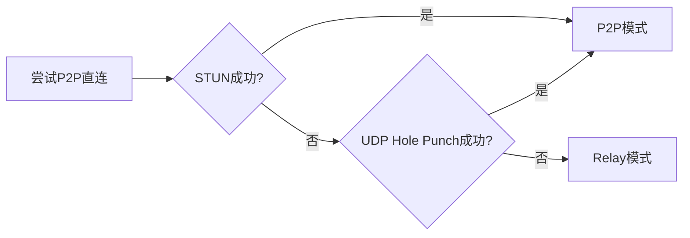
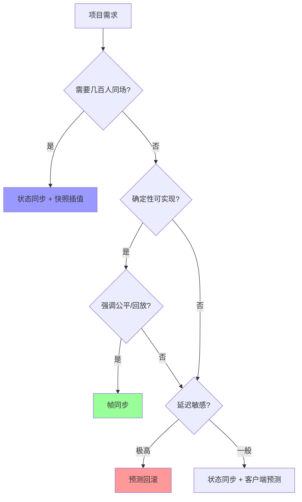
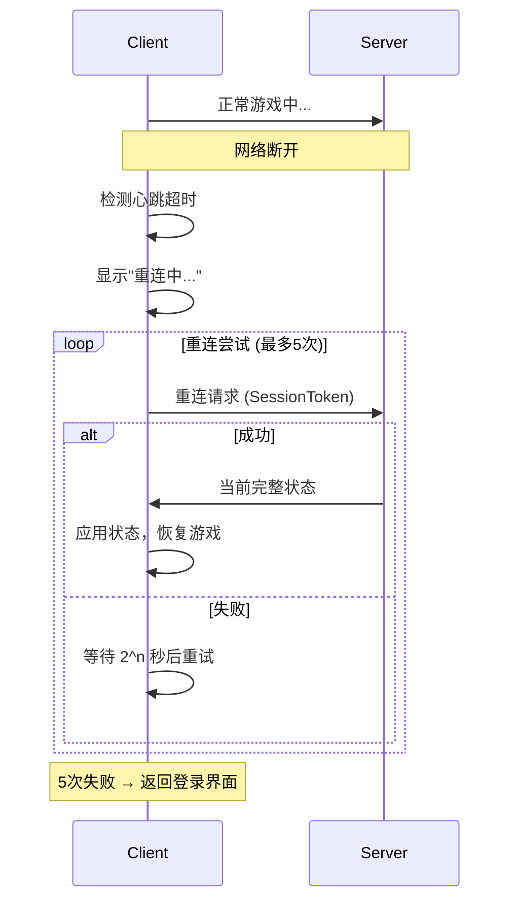
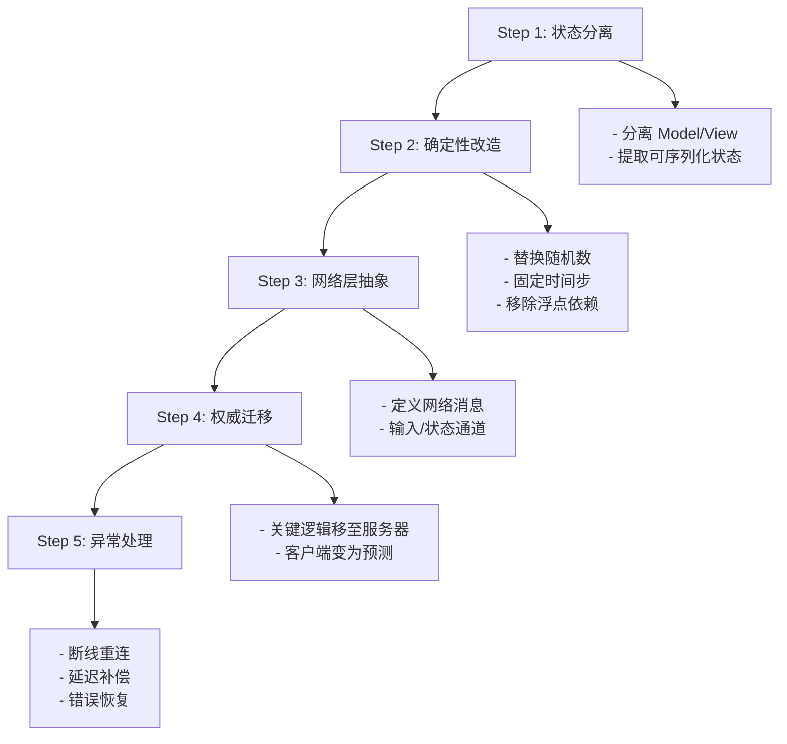

---
sidebarTitle: "网络架构与协议"
---

# 🌐 网络架构与协议

> **核心理念**: 采用 **双通道架构**。非实时业务 (大厅/养成) 走 HTTP 短连接，实时业务 (战斗/组队) 走 TCP/KCP 长连接。

## 1. 📡 通信架构 (Communication Channels)

### 1.1 HTTP 通道 (Lobby & Meta)

- **适用场景**: 登录、商城购买、邮件领取、装备强化、天赋升级。
- **特点**: 无状态、请求-响应模式、易于扩展 (Load Balancer)。
- **格式**: `POST /api/v1/{service}/{method}`
  - Body: Protobuf 序列化后的二进制流 (为了省流量和防抓包，不直接用 JSON)。

### 1.2 Socket 通道 (Battle & Social)

- **适用场景**: 实时 PVP、组队副本、聊天、公会战。
- **协议**:
  - **TCP**: 聊天、状态同步 (对顺序要求高)。
  - **KCP (UDP)**: 战斗位置同步、技能释放 (对延迟敏感，允许少量丢包)。
- **心跳 (Heartbeat)**: 每 5 秒 一次，3 次超时断开。

## 2. 📝 协议设计 (Protocol Design)

我们统一使用 **Google Protobuf (v3)** 作为序列化标准。

### 2.1 消息包结构 (Packet Structure)

所有 Socket 消息包遵循以下头部格式：

```cpp
struct PacketHeader {
    uint16_t length;    // 包体长度
    uint16_t msg_id;    // 消息ID (映射到具体 Proto)
    uint32_t seq;       // 序列号 (防重放/乱序)
    uint32_t checksum;  // 校验和 (CRC32)
    // Body follows...
};
```

### 2.2 Protobuf 定义示例

```protobuf
syntax = "proto3";
package Game.Protocol;

// 登录请求 (MsgID: 1001)
message C2S_Login {
    string account = 1;
    string token = 2;
    string device_id = 3;
    int32 client_version = 4;
}

// 登录响应 (MsgID: 1002)
message S2C_Login {
    int32 error_code = 1; // 0 = Success
    int64 server_time = 2;
    UserProfile profile = 3;
}
```

## 3. 🔌 API 接口规范 (API Standards)

### 3.1 幂等性 (Idempotency)

- 对于扣除资源的操作 (如抽卡、购买)，必须支持幂等。
- **实现**: 客户端生成一个 `request_uuid`，服务器缓存该 ID 的处理结果 5-10 秒。如果收到重复请求，直接返回缓存结果，不重复扣费。

### 3.2 错误处理

- 所有回包包含 `error_code`。
- **通用错误**:
  - `1001`: Token 过期 (需重新登录)。
  - `1002`: 服务器维护中。
  - `2001`: 资源不足。

## 4. 🛡️ 安全性 (Security)

### 4.1 认证 (Authentication)

- 登录后获取 `SessionToken`。
- 后续所有 HTTP 请求 Header 必须携带 `Authorization: Bearer {token}`。
- Socket 连接建立后的第一个包必须是 `AuthPacket`。

### 4.2 防重放 (Anti-Replay)

- 利用包头中的 `seq` (序列号)。服务器记录该连接处理过的最大 `seq`，小于等于该值的包直接丢弃。

### 4.3 数据加密

- 虽然 Protobuf 本身不可读，但为了防止逆向，关键业务 (登录/支付) 的 Body 层可再加一层 AES-128 加密。密钥在登录握手时通过 RSA 交换。

---

## 5. 🔗 网络连接类型 (Network Connection Types)

游戏中不同场景对网络的需求差异巨大，理解各连接类型的特点是架构设计的基础。

### 5.1 连接类型概览

| 类型             | 延迟     | 典型场景          | NAT 穿透      | 安全风险     |
| ---------------- | -------- | ----------------- | ------------- | ------------ |
| **Localhost**    | \<1ms    | 本地测试/单机存档 | ❌ 不需要     | 极低         |
| **LAN**          | 1-5ms    | 局域网联机/面对面 | ❌ 不需要     | 低           |
| **WAN (C/S)**    | 20-200ms | 标准联网游戏      | ✅ 服务器处理 | 中 (需加密)  |
| **P2P Direct**   | 20-100ms | 小规模实时对战    | ⚠️ 复杂       | 高 (IP 暴露) |
| **Relay Server** | 40-150ms | 跨 NAT 联机       | ✅ 中转解决   | 低           |

### 5.2 Localhost (本地回环)

```
┌─────────────────────────────────────┐
│           同一台设备                  │
│  ┌─────────┐    127.0.0.1    ┌─────────┐
│  │ Client  │ ◄────────────► │ Server  │
│  └─────────┘                └─────────┘
└─────────────────────────────────────┘
```

- **地址**: `127.0.0.1` (IPv4) 或 `::1` (IPv6)
- **特点**:
  - 数据不经过物理网卡，在操作系统内核层面完成。
  - 延迟极低 (\<1ms)，带宽无限制。
- **应用场景**:
  - **本地开发测试**: 程序员单机同时跑 Client 和 Server。
  - **单机游戏存档同步**: 使用网络协议作为进程间通信方式。
  - **Bot 模拟**: 在本地生成大量伪客户端进行压力测试。
- **注意**: 仅用于开发，生产环境禁止暴露 localhost 服务到外网。

### 5.3 LAN (局域网)

```
        同一个路由器/交换机内
┌────────┐      ┌────────┐      ┌────────┐
│ Client │ ──┬──│ Server │──┬── │ Client │
│192.168.│   │  │192.168.│  │   │192.168.│
│  1.10  │   │  │  1.1   │  │   │  1.20  │
└────────┘   │  └────────┘  │   └────────┘
      ▼──────┴──────────────┴──────▼
            LAN Switch/Router
```

- **地址范围** (私有地址):
  - `10.0.0.0/8`
  - `172.16.0.0/12`
  - `192.168.0.0/16`
- **特点**:
  - 低延迟 (1-5ms)，高带宽。
  - 无 NAT 障碍，设备间可直接互访。
- **应用场景**:
  - **网吧/电竞馆**: 局域网对战。
  - **局域网派对**: 临时组局，无需外网。
  - **开发联调**: 多人同时测试联机功能。
- **发现机制**:
  - **广播 (Broadcast)**: 发送 UDP 包到 `x.x.x.255`。
  - **组播 (Multicast)**: 更高效，如 `224.0.0.1`。

### 5.4 WAN (广域网 / Client-Server 模式)

```
          互联网
      ☁️☁️☁️☁️☁️☁️☁️
      ▲   ▲   ▲
┌─────┴─┐ │ ┌─┴─────┐
│Client │ │ │Client │    Public IP: 203.0.113.10
│NAT后  │ │ │NAT后  │    ───────────────────────────
└───────┘ │ └───────┘                ▼
          │                   ┌──────────────┐
          │                   │ Game Server  │ (有公网IP)
          └──────────────────►│ AWS/阿里云   │
                              └──────────────┘
```

- **特点**:
  - **服务器需公网 IP**: 客户端主动连接。
  - 客户端通常在 NAT 后面，无法被直接访问。
  - 延迟 20-200ms (取决于物理距离和网络质量)。
- **优点**:
  - ✅ 架构简单，客户端只需知道服务器地址。
  - ✅ 服务器权威，作弊难度高。
  - ✅ 天然解决 NAT 穿透问题。
- **缺点**:
  - ❌ 服务器带宽成本高 (所有流量经过)。
  - ❌ 服务器宕机 = 全局不可用。
- **应用场景**: 绝大多数商业网游的默认模式 (MMO、手游)。

### 5.5 P2P (点对点直连)

```
            ┌────────┐
            │ Punch  │ (仅用于NAT穿透协调)
            │ Server │
            └───┬────┘
       协调信令▼    ▲协调信令
┌─────────┐  ╲    ╱  ┌─────────┐
│ Player A│───╲──╱───│ Player B│
│         │─ UDP直连─│         │
└─────────┘          └─────────┘
                     (数据直传)
```

- **原理**: 客户端之间直接建立连接，数据不经过中央服务器。
- **NAT 穿透技术**:

  | 技术                  | 原理                             | 成功率          |
  | --------------------- | -------------------------------- | --------------- |
  | **STUN**              | 获取自己公网 IP/端口，告知对方   | ~70%            |
  | **TURN**              | 如 STUN 失败，通过中继服务器转发 | 100% (退化模式) |
  | **ICE**               | STUN + TURN 综合框架             | 最高            |
  | **UDP Hole Punching** | 双方同时向对方发包打洞           | ~65%            |

- **优点**:
  - ✅ 延迟最低 (直连)。
  - ✅ 节省服务器带宽。
- **缺点**:
  - ❌ NAT 穿透复杂，部分环境无法直连。
  - ❌ IP 暴露，存在 DDoS 攻击风险。
  - ❌ 反作弊困难 (无权威服务器)。
- **应用场景**: 格斗游戏、小规模 RTS (如《星际争霸》重制版)。

### 5.6 Relay Server (中继服务器)

```
┌─────────┐        ┌─────────────┐        ┌─────────┐
│ Player A│◄──────►│ Relay Server│◄──────►│ Player B│
│(NAT后)  │  TCP   │ (有公网IP)  │  TCP   │(NAT后)  │
└─────────┘        └─────────────┘        └─────────┘
          数据路径: A ───► Relay ───► B
```

- **原理**: 所有数据经过一个公网服务器中转。
- **优点**:
  - ✅ 100% 连通率 (无视 NAT 类型)。
  - ✅ 可隐藏玩家真实 IP。
  - ✅ 可在服务器层做数据校验/反作弊。
- **缺点**:
  - ❌ 延迟增加 (A→Server→B)。
  - ❌ 服务器带宽成本高。
- **应用场景**:
  - 《Unity Relay Service》、《Photon》等商业方案的后备模式。
  - 隐私敏感场景 (隐藏玩家 IP)。

### 5.7 混合模式 (推荐)

**生产实践**: 优先尝试 P2P 直连，失败后自动降级到 Relay。



---

## 6. 🔄 同步方式原理与应用 (Synchronization Methods)

网络同步是多人游戏的核心挑战，不同方式各有利弊。

### 6.1 同步方式对比总览

| 方式         | 带宽消耗 | 延迟敏感度 | 复杂度 | 典型游戏        |
| ------------ | -------- | ---------- | ------ | --------------- |
| **帧同步**   | 极低     | ⚠️ 高      | 高     | RTS、格斗、MOBA |
| **状态同步** | 高       | 低         | 中     | MMO、FPS        |
| **快照插值** | 中       | 中         | 中     | 多人 FPS        |
| **预测回滚** | 低       | 极低       | 极高   | 格斗、动作游戏  |

---

### 6.2 帧同步 (Lockstep / Deterministic Simulation)

#### 6.2.1 核心原理

```
    帧 0      帧 1      帧 2      帧 3
     │         │         │         │
     ▼         ▼         ▼         ▼
╔═════════════════════════════════════════╗
║  所有客户端拥有完全相同的初始状态         ║
║  +                                       ║
║  每帧收集所有玩家输入                    ║
║  +                                       ║
║  使用完全相同的逻辑执行                  ║
║  =                                       ║
║  🎯 结果必然完全一致                     ║
╚═════════════════════════════════════════╝
```

- **传输内容**: 仅传输玩家**输入指令** (如: 移动方向、技能 ID)，而非游戏状态。
- **关键要求**: **确定性 (Determinism)** — 相同输入 + 相同随机种子 = 相同输出。

#### 6.2.2 确定性挑战

| 问题             | 解决方案                           |
| ---------------- | ---------------------------------- |
| 浮点运算误差     | 使用**定点数** (Fixed-Point Math)  |
| 随机数不同步     | 使用**确定性随机数** (种子同步)    |
| 物理引擎非确定性 | 使用确定性物理库 (如 Box2D) 或自研 |
| 遍历顺序不确定   | 避免 `HashSet`，使用有序集合       |
| 多线程竞争       | 逻辑层必须**单线程**               |

#### 6.2.3 时序模型

```
        ┌─────────────────────────────────────────┐
 Server │  收集帧N所有输入 ──► 广播给所有客户端  │
        └────────────────────────────────────────-┘
                          │
        ┌─────────────────▼─────────────────┐
 Client │ 收到帧N输入 ──► 执行帧N逻辑 ──► 等待帧N+1 输入 │
        └───────────────────────────────────┘
        (每帧都必须等待"所有输入到齐"才能推进)
```

- **问题**: 任何一人卡顿 = 所有人等待。
- **优化**:
  - **乐观帧 (Optimistic Frame)**: 先用预测输入执行，错了再回滚。
  - **断线续玩**: 超时玩家输入视为"无操作"。

#### 6.2.4 适用场景

- ✅ RTS (《星际争霸》、《魔兽争霸》)
- ✅ MOBA (《王者荣耀》)
- ✅ 格斗游戏 (《街霸》、《GGPO》)
- ❌ MMO (玩家数量过多，输入同步成本爆炸)

---

### 6.3 状态同步 (State Synchronization)

#### 6.3.1 核心原理

```
          ┌─────────────────────────────────────┐
  Server  │ 权威世界状态 (所有实体位置/HP/...)   │
          └──────────────────┬──────────────────┘
                             │ 周期性广播
          ┌──────────────────▼──────────────────┐
  Client  │ 接收并覆盖本地状态 (无计算权威)      │
          └─────────────────────────────────────┘
```

- **传输内容**: 服务器定期发送**完整/增量游戏状态** (位置、血量、状态等)。
- **客户端职责**: 渲染 + 预测 (可选)，**不做权威判定**。

#### 6.3.2 优化策略

| 策略                             | 描述                       |
| -------------------------------- | -------------------------- |
| **增量更新 (Delta Compression)** | 仅发送变化的字段           |
| **兴趣管理 (AOI)**               | 仅发送玩家视野内实体       |
| **分级更新频率**                 | 近处实体 20Hz，远处 5Hz    |
| **量化压缩**                     | 位置用 uint16 而非 float32 |

#### 6.3.3 优缺点

| 优点                    | 缺点                       |
| ----------------------- | -------------------------- |
| ✅ 实现简单，无需确定性 | ❌ 带宽消耗大              |
| ✅ 服务器权威，反作弊强 | ❌ 延迟感明显 (无预测时)   |
| ✅ 支持任意数量玩家     | ❌ 需配合插值/预测才能平滑 |

#### 6.3.4 适用场景

- ✅ MMO (《魔兽世界》)
- ✅ 大型多人 FPS (需配合预测)
- ✅ 实时策略 (非竞技)

---

### 6.4 快照插值 (Snapshot Interpolation)

#### 6.4.1 核心原理

```
Time:   T=0      T=50ms    T=100ms   T=150ms
         │         │         │         │
Server: [S0]    [S1]     [S2]      [S3]  ◄─ 服务器快照
         │         │         │         │
         └─────────┴────┬────┴─────────┘
                        │
Client:              插值渲染
                   (总是落后 1-2 个快照)
                        │
                        ▼
            在 S1 和 S2 之间平滑插值
            Display Time = Server Time - Buffer
```

- **核心思想**: 客户端故意**延后渲染** 1-2 个快照，始终在**两个已知状态之间插值**。
- **Buffer Size**: 通常 100-200ms (根据网络抖动调整)。

#### 6.4.2 插值计算

$$
Position_{render} = Position_{S1} + (Position_{S2} - Position_{S1}) \times \frac{t - t_{S1}}{t_{S2} - t_{S1}}
$$

- 当 $t$ 落在 $[t_{S1}, t_{S2}]$ 之间时进行线性插值。
- 高级：使用 Hermite 插值保持速度连续。

#### 6.4.3 优缺点

| 优点              | 缺点                           |
| ----------------- | ------------------------------ |
| ✅ 平滑无抖动     | ❌ 固有延迟 (Buffer Size)      |
| ✅ 实现相对简单   | ❌ 快速变向时可能穿模          |
| ✅ 对丢包有容忍度 | ❌ 不适合本地玩家 (需配合预测) |

---

### 6.5 客户端预测与服务器回滚 (Client-Side Prediction + Rollback)

#### 6.5.1 核心原理

```
     Input      ┌────────────┐    Authoritative
     ──────────►│   Client   │    State
                │  本地预测   │◄─────────────────
                └─────┬──────┘   服务器确认
                      │▲
            输入上报   ││ 状态校正
                      ▼│
                ┌─────┴──────┐
                │   Server   │
                │ 权威计算    │
                └────────────┘
```

1.  **客户端预测**: 玩家输入后**立即在本地执行**，不等服务器。
2.  **输入上报**: 同时把输入发给服务器。
3.  **服务器确认**: 服务器计算权威结果，返回给客户端。
4.  **校正/回滚**: 客户端对比预测结果与权威结果，若有误差则**回滚并重新模拟**。

#### 6.5.2 回滚机制 (Rollback Netcode)

```
                     T=100   T=110   T=120   T=130  ◄─ 客户端时间线
                      │       │       │       │
Client Prediction:   [C100] [C110] [C120] [C130]
                                         │
Server Confirm:    ─────────────────────[S100] (收到T=100的服务器结果)
                                         │
                                         ▼
                   检测到 C100 ≠ S100 → 回滚到 T=100
                                         │
                   使用 S100 + 输入 重新模拟 T=110, T=120, T=130
```

- **关键**: 必须保存**历史输入**和**历史状态快照**。

#### 6.5.3 技术要点

| 要点               | 说明                         |
| ------------------ | ---------------------------- |
| **Input Buffer**   | 保存最近 N 帧的本地输入      |
| **State Snapshot** | 定期保存可回滚的游戏状态     |
| **RTT 估算**       | 用于决定预测领先服务器多少帧 |
| **平滑校正**       | 避免瞬间拉回，使用插值过渡   |

#### 6.5.4 适用场景

- ✅ 格斗游戏 (GGPO 架构)
- ✅ 高竞技 FPS (《CS2》、《Valorant》)
- ✅ 动作游戏 (需要即时反馈)

---

### 6.6 选型决策树



### 6.7 实践建议

> [!TIP] > **我们的方案**
> **Project Vampirefall 采用**:

    - **大厅/养成**: HTTP 状态同步 (简单可靠)
    - **PVE 战斗**: 状态同步 + 快照插值 (容忍延迟，服务器权威)
    - **PVP 竞技**: 帧同步 + 客户端预测 (低延迟，可回放)

> [!WARNING] > **常见陷阱**

---

## 7. 🎮 单机游戏 vs 联网游戏：关键差异与注意事项

> **本章目的**: 为**首次接触联网游戏的程序员**提供完整的思维转变指南，也为**立项联网游戏**提供技术评估清单。

### 7.1 核心思维差异

| 维度         | 单机游戏       | 联网游戏                     |
| ------------ | -------------- | ---------------------------- |
| **信任模型** | 客户端完全可信 | 客户端**永远不可信**         |
| **时间概念** | 本地时间唯一   | 多个时钟，需**时间同步**     |
| **状态位置** | 全在本地内存   | 分布在多个节点               |
| **确定性**   | 不重要         | 可能**生死攸关**             |
| **容错需求** | 崩溃重启即可   | 需**优雅降级**和**断线重连** |

---

### 7.2 🎲 随机数系统

#### 7.2.1 问题本质

```
单机:
    Random.Range(0, 100) → 42  ✅ 只有一个结果

联网 (无同步):
    ClientA: Random.Range(0, 100) → 42
    ClientB: Random.Range(0, 100) → 73  ❌ 结果不同 = 游戏状态分叉!
```

#### 7.2.2 解决方案

| 方案            | 原理                                   | 适用场景 |
| --------------- | -------------------------------------- | -------- |
| **种子同步**    | 所有客户端使用相同种子初始化 PRNG      | 帧同步   |
| **服务器下发**  | 服务器计算随机结果，广播给所有客户端   | 状态同步 |
| **确定性 PRNG** | 使用跨平台一致的随机算法 (如 Xorshift) | 所有模式 |

#### 7.2.3 代码示例

```csharp
// ❌ 错误：使用系统随机数
int damage = UnityEngine.Random.Range(10, 20);

// ✅ 正确：使用确定性随机数生成器
public class DeterministicRandom
{
    private uint seed;

    public DeterministicRandom(uint seed) => this.seed = seed;

    // Xorshift32 算法 (跨平台一致)
    public uint Next()
    {
        seed ^= seed << 13;
        seed ^= seed >> 17;
        seed ^= seed << 5;
        return seed;
    }

    public int Range(int min, int max)
    {
        return min + (int)(Next() % (uint)(max - min));
    }
}

// 使用：每局游戏开始时，服务器下发种子
var battleRandom = new DeterministicRandom(serverSeed);
int damage = battleRandom.Range(10, 20); // 所有客户端结果相同
```

#### 7.2.4 常见陷阱

> [!WARNING] > **随机数陷阱**

---

### 7.3 ⏱️ 时间与帧率

#### 7.3.1 问题本质

```
单机:
    Time.deltaTime = 0.016s (60fps设备)
    Time.deltaTime = 0.033s (30fps设备)
    → 物理/移动速度不同

联网:
    ClientA (60fps): 角色移动了 X 距离
    ClientB (30fps): 角色移动了 2X 距离  ❌ 位置不同!
```

#### 7.3.2 解决方案

| 方案                            | 原理                                    | 代价              |
| ------------------------------- | --------------------------------------- | ----------------- |
| **固定时间步 (Fixed Timestep)** | 逻辑层固定 16.67ms 一步，与渲染帧率解耦 | 需要分离逻辑/渲染 |
| **服务器时间权威**              | 服务器决定当前是第几帧/第几秒           | 增加延迟          |
| **逻辑帧 + 渲染插值**           | 逻辑固定帧率，渲染在逻辑帧之间插值      | 实现复杂          |

#### 7.3.3 代码示例

```csharp
// ❌ 错误：直接使用 deltaTime
transform.position += velocity * Time.deltaTime;

// ✅ 正确：固定逻辑步长
public class FixedLogicLoop : MonoBehaviour
{
    private const float LOGIC_TIMESTEP = 1f / 60f; // 逻辑固定60Hz
    private float accumulator = 0f;

    void Update()
    {
        accumulator += Time.deltaTime;

        while (accumulator >= LOGIC_TIMESTEP)
        {
            LogicUpdate(LOGIC_TIMESTEP); // 逻辑固定步长
            accumulator -= LOGIC_TIMESTEP;
        }

        float alpha = accumulator / LOGIC_TIMESTEP;
        RenderInterpolate(alpha); // 渲染插值
    }

    void LogicUpdate(float fixedDt)
    {
        // 这里所有逻辑使用 fixedDt，而非 Time.deltaTime
        position += velocity * fixedDt;
    }
}
```

---

### 7.4 🖥️ 浮点数精度

#### 7.4.1 问题本质

浮点运算在不同 CPU/编译器/优化级别下可能产生**微小差异**：

```
// 同样的表达式，不同平台可能得到：
float result = 0.1f + 0.2f;

x86 (MSVC):   0.30000001192092896
ARM (GCC):    0.30000001192092900
WebGL:        0.30000001192092890  ← 差异在第15位有效数字
```

**问题**: 微小差异会**累积**，最终导致状态分叉。

#### 7.4.2 解决方案

| 方案                     | 原理                             | 代价               |
| ------------------------ | -------------------------------- | ------------------ |
| **定点数 (Fixed-Point)** | 用整数模拟小数 (如 Q16.16)       | 精度有限，需要封装 |
| **服务器权威**           | 忽略客户端计算结果，以服务器为准 | 延迟感             |
| **软浮点 (SoftFloat)**   | 用软件模拟 IEEE 754              | 性能损失约 10-50x  |
| **误差容忍**             | 状态同步时允许小范围差异         | 仅适用于非关键数据 |

#### 7.4.3 定点数示例

```csharp
/// <summary>
/// Q16.16 定点数：高16位整数，低16位小数
/// 范围: -32768.0 ~ 32767.99998
/// 精度: 1/65536 ≈ 0.000015
/// </summary>
public struct FixedPoint
{
    public const int FRACTIONAL_BITS = 16;
    public const int ONE = 1 << FRACTIONAL_BITS; // 65536

    public int RawValue;

    public static FixedPoint FromFloat(float f)
        => new FixedPoint { RawValue = (int)(f * ONE) };

    public float ToFloat()
        => RawValue / (float)ONE;

    public static FixedPoint operator +(FixedPoint a, FixedPoint b)
        => new FixedPoint { RawValue = a.RawValue + b.RawValue };

    public static FixedPoint operator *(FixedPoint a, FixedPoint b)
        => new FixedPoint { RawValue = (int)(((long)a.RawValue * b.RawValue) >> FRACTIONAL_BITS) };
}

// 使用
FixedPoint speed = FixedPoint.FromFloat(5.5f);
FixedPoint dt = FixedPoint.FromFloat(0.016f);
FixedPoint distance = speed * dt; // 确定性计算
```

---

### 7.5 🔒 状态管理与权威

#### 7.5.1 单机 vs 联网状态模型

```
单机游戏:
┌─────────────────────────────────────┐
│          Client (唯一)              │
│  ┌───────────────────────────┐      │
│  │ Game State (完全可信)     │      │
│  │ - 玩家血量: 100           │      │
│  │ - 金币: 9999              │      │
│  │ - 伤害: 999999            │      │
│  └───────────────────────────┘      │
│  (用户可以用 CE 随意修改)            │
└─────────────────────────────────────┘

联网游戏:
┌──────────────┐              ┌──────────────┐
│   Client A   │              │   Client B   │
│ (视图/预测)  │              │ (视图/预测)  │
└──────┬───────┘              └───────┬──────┘
       │                              │
       │         ┌────────────┐       │
       └────────►│   Server   │◄──────┘
                 │ (权威状态) │
                 │ HP/金币/伤害│
                 │ = 唯一真相 │
                 └────────────┘
```

#### 7.5.2 状态分类

| 状态类型     | 权威在哪               | 示例              |
| ------------ | ---------------------- | ----------------- |
| **关键状态** | 服务器                 | HP、金币、装备    |
| **同步状态** | 服务器                 | 位置、动画状态    |
| **预测状态** | 客户端预测，服务器校正 | 本地玩家位置      |
| **本地状态** | 客户端独占             | UI 状态、粒子特效 |

#### 7.5.3 设计原则

> [!NOTE] > **黄金法则**
> **涉及经济/公平性的数据，必须服务器权威。**

    - ✅ 伤害计算在服务器执行
    - ✅ 掉落结果由服务器决定
    - ✅ 技能 CD 由服务器校验
    - ❌ 不要相信客户端上报的"我打死了 BOSS"

---

### 7.6 🛡️ 安全与反作弊

#### 7.6.1 威胁模型差异

| 威胁              | 单机游戏   | 联网游戏     |
| ----------------- | ---------- | ------------ |
| **内存修改 (CE)** | 只影响自己 | 影响其他玩家 |
| **加速器**        | 无所谓     | 破坏公平性   |
| **封包篡改**      | N/A        | 核心威胁     |
| **外挂/脚本**     | 个人选择   | 必须打击     |

#### 7.6.2 常见攻击与防御

| 攻击手段          | 防御策略              |
| ----------------- | --------------------- |
| **修改血量/伤害** | 服务器权威计算        |
| **加速移动**      | 服务器校验位移合理性  |
| **无限资源**      | 资源增减由服务器处理  |
| **重放攻击**      | 请求带时间戳 + 序列号 |
| **封包嗅探**      | TLS 加密 / 自定义加密 |
| **协议逆向**      | 混淆 + 频繁更新协议   |

#### 7.6.3 校验示例

```csharp
// 服务器端位移校验
public bool ValidateMovement(Player player, Vector3 newPos, float deltaTime)
{
    float maxSpeed = player.GetMaxMoveSpeed();
    float maxDistance = maxSpeed * deltaTime * 1.1f; // 10% 容差

    float actualDistance = Vector3.Distance(player.Position, newPos);

    if (actualDistance > maxDistance)
    {
        // 可能作弊，拒绝并拉回
        Log.Warning($"[Cheat?] {player.Id} moved {actualDistance} in {deltaTime}s");
        return false;
    }

    return true;
}
```

---

### 7.7 💾 存档与持久化

#### 7.7.1 差异对比

| 方面         | 单机游戏            | 联网游戏           |
| ------------ | ------------------- | ------------------ |
| **存档位置** | 本地文件            | 服务器数据库       |
| **存档时机** | 玩家手动/自动存档点 | 实时或定期持久化   |
| **数据格式** | 私有格式/JSON       | 数据库表结构       |
| **多设备**   | 各自独立            | 账号绑定，云端同步 |
| **回档风险** | 玩家自己负责        | 需要事务保证       |

#### 7.7.2 联网游戏存档策略

```
实时写入 (危险操作):           批量写入 (常规操作):
  └─ 支付完成                   └─ 每 5 分钟 或 战斗结算时
  └─ 装备交易                   └─ 经验、等级
  └─ 抽卡结果                   └─ 任务进度

数据库选型:
  └─ 关系型 (MySQL/PostgreSQL): 交易、订单
  └─ NoSQL (Redis): 在线状态、排行榜缓存
  └─ 文档型 (MongoDB): 玩家背包、复杂嵌套
```

---

### 7.8 📶 网络异常处理

#### 7.8.1 单机 vs 联网的容错需求

| 场景         | 单机游戏       | 联网游戏                 |
| ------------ | -------------- | ------------------------ |
| **程序崩溃** | 读取最近存档   | 需要断线重连 + 状态恢复  |
| **卡顿**     | 暂停即可       | 其他玩家在移动，不能暂停 |
| **断电**     | 丢失进度可接受 | 需要事务保护关键操作     |

#### 7.8.2 必须处理的网络事件

| 事件           | 处理策略                 |
| -------------- | ------------------------ |
| **延迟飙升**   | 显示延迟指示器，预测继续 |
| **丢包**       | 重传 (TCP) 或 容忍 (UDP) |
| **断线**       | 尝试重连，恢复到最近状态 |
| **重连成功**   | 全量/增量同步当前状态    |
| **服务器维护** | 提前通知，优雅踢下线     |

#### 7.8.3 断线重连流程



---

### 7.9 🔄 游戏循环架构

#### 7.9.1 单机 vs 联网游戏循环

```
单机游戏循环 (简单):
┌───────────────────────────────────┐
│  while (running) {                │
│    ProcessInput();                │
│    UpdateLogic(deltaTime);        │
│    Render();                      │
│  }                                │
└───────────────────────────────────┘

联网游戏循环 (复杂):
┌───────────────────────────────────────────────────────────┐
│  while (running) {                                        │
│    ReceiveNetworkMessages();      // 收取服务器消息        │
│    ProcessServerState();          // 应用权威状态          │
│    ProcessLocalInput();           // 本地输入              │
│    SendInputToServer();           // 上报输入              │
│    PredictLocalState();           // 客户端预测            │
│    ReconcileWithServer();         // 用服务器结果校正       │
│    InterpolateRemoteEntities();   // 插值其他玩家          │
│    UpdateLogic(fixedTimestep);    // 固定步长逻辑          │
│    Render(interpolationAlpha);    // 插值渲染              │
│  }                                                        │
└───────────────────────────────────────────────────────────┘
```

---

### 7.10 📋 联网游戏立项检查清单

在立项阶段，用此清单评估技术可行性和工作量：

#### 7.10.1 基础设施

- [ ] **服务器部署方案**: 云服务商选型 (AWS/阿里云/腾讯云)
- [ ] **CDN 与静态资源**: 热更新资源分发方案
- [ ] **数据库选型**: 关系型 + 缓存层架构
- [ ] **运维监控**: 日志收集、报警、性能监控

#### 7.10.2 网络层

- [ ] **协议选择**: HTTP/TCP/UDP/KCP
- [ ] **序列化方案**: Protobuf/FlatBuffers/MessagePack
- [ ] **加密方案**: TLS/自定义加密层
- [ ] **NAT 穿透**: 是否需要 P2P，备用 Relay

#### 7.10.3 同步方案

- [ ] **同步模式选择**: 帧同步/状态同步/混合
- [ ] **确定性需求**: 是否需要定点数、确定性物理
- [ ] **延迟补偿**: 预测/回滚/插值策略

#### 7.10.4 游戏逻辑

- [ ] **随机数统一**: 确定性 PRNG 方案
- [ ] **时间系统**: 固定逻辑步长 vs 可变
- [ ] **物理引擎**: 是否需要确定性物理

#### 7.10.5 安全与反作弊

- [ ] **权威计算**: 关键逻辑放服务器
- [ ] **校验机制**: 位移、伤害、资源校验
- [ ] **反外挂策略**: 第三方反作弊 SDK?

#### 7.10.6 用户体验

- [ ] **断线重连**: 自动重连 + 状态恢复
- [ ] **延迟显示**: UI 中展示当前延迟
- [ ] **匹配系统**: 地理位置匹配、ELO 等
- [ ] **跨区/跨服**: 是否需要支持

---

### 7.11 💡 从单机到联网的重构要点

如果你正在将**现有单机游戏**改造为联网游戏，重点关注以下步骤：



#### 7.11.1 常见重构陷阱

> [!NOTE] > **血泪教训**

---

### 7.12 📚 延伸阅读

| 主题               | 推荐资源                                                                                                       |
| ------------------ | -------------------------------------------------------------------------------------------------------------- |
| **帧同步深度解析** | [GDC: Overwatch Gameplay Architecture](https://www.youtube.com/watch?v=W3aieHjyNvw)                            |
| **预测回滚**       | [GGPO 官方文档](https://www.ggpo.net/)                                                                         |
| **状态同步优化**   | [Valve: Source Multiplayer Networking](https://developer.valvesoftware.com/wiki/Source_Multiplayer_Networking) |
| **定点数实现**     | [Fix64 开源库](https://github.com/asik/FixedMath.Net)                                                          |
| **反作弊设计**     | [GDC: I Shot You First](https://www.gdcvault.com/play/1014345/)                                                |
