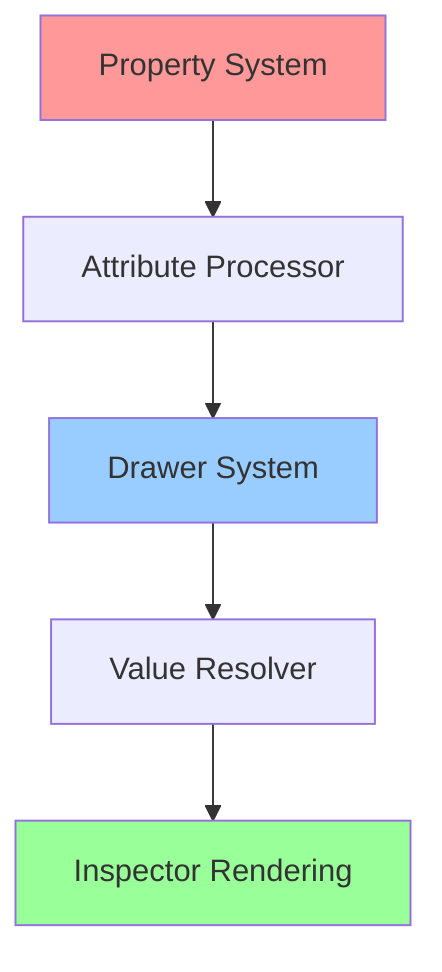

# Odin 工具综合指南

> 本文档由以下文件合并生成 (2026-01-09)


---


<!-- 来源: Dev_Guides\Tools\Odin_Inspector_Advanced_Techniques.md -->

## 🧙‍♂️ Odin Inspector 高级使用技巧深度研究

> 🎯 **目标读者**: 已掌握 Odin 基础用法的 Unity 开发者  
> 📌 **定位**: 提供官方 Demo 未涵盖的实战技巧、复杂场景解决方案和性能优化策略

---

## 📚 1. 理论基础 (Theoretical Basis)

### 1.1 核心定义

**Odin Inspector** 是一个增强 Unity Inspector 的插件，通过 C# 特性（Attributes）驱动的声明式编程范式，实现了：

- **声明式 UI 构建**: 通过特性标签直接描述 Inspector 布局，而非命令式代码。
- **数据验证层**: 在序列化层面提供类型安全和约束检查。
- **Editor 自动化**: 减少手动编写 `CustomEditor` 的需求。

### 1.2 设计模式

Odin 的架构基于以下设计模式：




- **Property System**: Odin 的属性系统（OdinPropertyTree）独立于 Unity 的 SerializedProperty。
- **Resolver Pattern**: `@` 语法的动态值解析器，支持成员引用、表达式求值。
- **Decorator Chain**: 多个特性按优先级链式处理。

### 1.3 性能模型

Inspector 绘制性能瓶颈：

- **GC 分配**: 每帧的 `GetValue()` 调用可能触发装箱。
- **反射开销**: 动态解析表达式的成本。
- **重绘频率**: `OnInspectorGUI` 的调用次数与选中对象数成正比。

---

## 🛠️ 2. 实践应用 (Practical Implementation)

### 2.1 高级技巧一：自定义验证器组合

#### 问题场景
在 **Vampirefall** 中，我们需要确保塔防建筑的配置数据同时满足：

1. 成本必须为 10 的倍数
2. 攻击范围不能超过建筑等级的 1.5 倍

3. 特殊塔种类的攻击力必须满足特定公式

#### 解决方案：自定义 Validator

```csharp
using Sirenix.OdinInspector;

public class TowerConfig : ScriptableObject
{
    [Title("基础属性")]
    [ValidateInput("@Cost % 10 == 0", "成本必须是10的倍数")]
    [SuffixLabel("金币", true)]
    public int Cost;

    [Range(1, 10)]
    public int Level;

    [ValidateInput("ValidateAttackRange", "攻击范围不合理")]
    [SuffixLabel("米", true)]
    public float AttackRange;

    [ShowIf("@TowerType == TowerType.Special")]
    [ValidateInput("ValidateSpecialDamage", "特殊塔伤害必须 >= 基础值 * 1.2")]
    public float Damage;

    [EnumToggleButtons]
    public TowerType TowerType;

    // ⚡ 技巧：使用私有方法作为验证函数，避免污染公共API
    private bool ValidateAttackRange(float range)
    {
        return range <= Level * 1.5f;
    }

    private bool ValidateSpecialDamage(float damage, ref string errorMessage)
    {
        if (TowerType != TowerType.Special) return true;
        
        float minDamage = GetBaseDamage() * 1.2f;
        if (damage < minDamage)
        {
            errorMessage = $"特殊塔伤害至少需要 {minDamage:F1} (当前: {damage:F1})";
            return false;
        }
        return true;
    }

    private float GetBaseDamage() => Level * 10f;
}
```

**🔑 关键点**：

- `ValidateInput` 的第二个参数支持动态表达式：`"@SomeMethod($value)"`
- 验证函数可以返回 `bool` 或使用 `ref string` 提供详细错误信息
- 多个验证特性会按顺序执行

---

### 2.2 高级技巧二：动态下拉列表 + 图标预览

#### 问题场景
在选择敌人类型时，我们希望：

- 下拉列表动态读取所有敌人配置
- 显示敌人图标预览
- 支持搜索过滤

#### 解决方案：ValueDropdown + PreviewField 组合

```csharp
using Sirenix.OdinInspector;
using System.Collections.Generic;
using System.Linq;
using UnityEngine;

public class WaveConfig : ScriptableObject
{
    [Title("敌人配置")]
    [ValueDropdown("GetEnemyList")]
    [PreviewField(55, ObjectFieldAlignment.Left)]
    [HideLabel]
    public EnemyConfig SelectedEnemy;

    [ListDrawerSettings(ShowIndexLabels = true, ListElementLabelName = "WaveName")]
    public List<WaveData> Waves;

    // ⚡ 技巧：返回 IEnumerable<ValueDropdownItem<T>> 可以自定义显示文本
    private IEnumerable<ValueDropdownItem<EnemyConfig>> GetEnemyList()
    {
        var allEnemies = Resources.LoadAll<EnemyConfig>("Enemies");
        
        return allEnemies
            .OrderBy(e => e.EnemyType)
            .ThenBy(e => e.Level)
            .Select(e => new ValueDropdownItem<EnemyConfig>(
                $"{GetEnemyIcon(e.EnemyType)} {e.name} (Lv.{e.Level})",
                e
            ));
    }

    private string GetEnemyIcon(EnemyType type)
    {
        return type switch
        {
            EnemyType.Grunt => "👹",
            EnemyType.Elite => "😈",
            EnemyType.Boss => "💀",
            _ => "❓"
        };
    }
}

[System.Serializable]
public class WaveData
{
    [HideInInspector]
    public string WaveName => $"Wave {WaveNumber}: {EnemyCount}x {Enemy?.name ?? "None"}";

    public int WaveNumber;
    
    [ValueDropdown("@FindObjectOfType<WaveConfig>()?.GetEnemyList()")]
    [PreviewField(40)]
    public EnemyConfig Enemy;
    
    [MinValue(1)]
    public int EnemyCount;
}
```

**🔑 关键点**：

- `@` 语法可以调用外部方法：`@FindObjectOfType<T>()`
- `ListElementLabelName` 使用属性/字段自定义列表项显示名称
- `PreviewField` 的第一个参数控制预览大小

---

### 2.3 高级技巧三：条件显示的复杂逻辑

#### 问题场景
物品配置中，不同品质的装备有不同的属性组合：

- 普通装备：只有基础属性
- 稀有装备：基础属性 + 1 个特殊效果
- 传说装备：基础属性 + 2 个特殊效果 + 套装效果

#### 解决方案：ShowIf 的高级用法

```csharp
using Sirenix.OdinInspector;
using UnityEngine;

public enum ItemRarity { Common, Rare, Legendary }

public class ItemConfig : ScriptableObject
{
    [Title("基础信息")]
    [PreviewField(80, ObjectFieldAlignment.Left)]
    public Sprite Icon;

    [EnumToggleButtons]
    [OnValueChanged("OnRarityChanged")]
    public ItemRarity Rarity;

    [Title("属性")]
    public int BaseAttack;
    public int BaseDefense;

    // ⚡ 技巧1：组合多个条件
    [ShowIf("@Rarity == ItemRarity.Rare || Rarity == ItemRarity.Legendary")]
    [BoxGroup("特殊效果")]
    [ValueDropdown("GetAvailableEffects")]
    public string SpecialEffect1;

    // ⚡ 技巧2：使用方法名作为条件
    [ShowIf("IsLegendary")]
    [BoxGroup("特殊效果")]
    [ValueDropdown("GetAvailableEffects")]
    public string SpecialEffect2;

    [ShowIf("IsLegendary")]
    [BoxGroup("套装效果")]
    [AssetsOnly]
    public SetBonusConfig SetBonus;

    // ⚡ 技巧3：动态启用/禁用
    [EnableIf("@BaseAttack > 0")]
    [ProgressBar(0, 100, ColorGetter = "GetAttackColor")]
    public int AttackBonus;

    // 条件方法
    private bool IsLegendary() => Rarity == ItemRarity.Legendary;

    // 动态颜色
    private Color GetAttackColor()
    {
        if (AttackBonus < 30) return Color.gray;
        if (AttackBonus < 60) return Color.yellow;
        return Color.red;
    }

    // 清理数据
    private void OnRarityChanged()
    {
        if (Rarity == ItemRarity.Common)
        {
            SpecialEffect1 = null;
            SpecialEffect2 = null;
            SetBonus = null;
        }
        else if (Rarity == ItemRarity.Rare)
        {
            SpecialEffect2 = null;
            SetBonus = null;
        }
    }

    private IEnumerable<string> GetAvailableEffects()
    {
        return new[] { "吸血", "暴击", "穿甲", "溅射", "冰冻" };
    }
}
```

**🔑 关键点**：

- `ShowIf` 支持 `||` 和 `&&` 逻辑运算符
- `OnValueChanged` 可以在值改变时清理不相关数据
- `ColorGetter` 可以动态改变 ProgressBar 颜色

---

### 2.4 高级技巧四：表格视图 + 批量编辑

#### 问题场景
需要一次性配置 50+ 关卡的基础参数（难度、奖励、解锁条件）。

#### 解决方案：TableList + Button 组合

```csharp
using Sirenix.OdinInspector;
using System.Collections.Generic;
using UnityEngine;

public class LevelDatabase : ScriptableObject
{
    [Title("关卡配置表")]
    [TableList(ShowIndexLabels = true, AlwaysExpanded = true)]
    public List<LevelData> Levels;

    // ⚡ 技巧：批量操作按钮
    [Button(ButtonSizes.Large), GUIColor(0.4f, 0.8f, 1f)]
    private void AutoGenerateLevels()
    {
        Levels.Clear();
        for (int i = 1; i <= 50; i++)
        {
            Levels.Add(new LevelData
            {
                LevelID = i,
                Difficulty = Mathf.CeilToInt(i / 10f),
                GoldReward = i * 100,
                UnlockLevel = Mathf.Max(1, i - 1)
            });
        }
    }

    [Button("重新计算所有奖励"), GUIColor(1f, 0.8f, 0.4f)]
    private void RecalculateRewards()
    {
        foreach (var level in Levels)
        {
            level.GoldReward = level.LevelID * 100 * level.Difficulty;
        }
    }
}

[System.Serializable]
public class LevelData
{
    [TableColumnWidth(60, Resizable = false)]
    [ReadOnly]
    public int LevelID;

    [TableColumnWidth(80)]
    [ProgressBar(1, 10, ColorGetter = "GetDifficultyColor")]
    public int Difficulty;

    [TableColumnWidth(100)]
    [SuffixLabel("金币", true)]
    public int GoldReward;

    [TableColumnWidth(80)]
    [MinValue(1)]
    public int UnlockLevel;

    [TableColumnWidth(120)]
    [EnumToggleButtons]
    [HideLabel]
    public LevelType Type;

    // 动态颜色
    private Color GetDifficultyColor()
    {
        return Difficulty switch
        {
            <= 3 => Color.green,
            <= 6 => Color.yellow,
            _ => Color.red
        };
    }
}

public enum LevelType { Normal, Elite, Boss }
```

**🔑 关键点**：

- `TableList` 的 `AlwaysExpanded = true` 避免默认折叠
- `TableColumnWidth` 控制列宽，`Resizable = false` 禁止调整
- `Button` 特性可以直接执行批量操作

---

### 2.5 高级技巧五：自定义 Property Drawer

#### 问题场景
需要一个可视化的伤害类型选择器，显示图标 + 伤害值的组合输入。

#### 解决方案：自定义 Drawer

```csharp
// DamageTypeData.cs
using Sirenix.OdinInspector;
using UnityEngine;

[System.Serializable]
public class DamageTypeData
{
    [HorizontalGroup("Split", Width = 0.3f)]
    [PreviewField(50, ObjectFieldAlignment.Center)]
    [HideLabel]
    public Sprite Icon;

    [VerticalGroup("Split/Right")]
    [EnumToggleButtons]
    [HideLabel]
    public DamageType Type;

    [VerticalGroup("Split/Right")]
    [MinValue(0)]
    [SuffixLabel("点", true)]
    public float Value;

    [VerticalGroup("Split/Right")]
    [ProgressBar(0, 1, ColorGetter = "GetPenetrationColor")]
    [SuffixLabel("穿透率", true)]
    public float Penetration;

    private Color GetPenetrationColor()
    {
        return Color.Lerp(Color.white, Color.red, Penetration);
    }
}

public enum DamageType { Physical, Fire, Ice, Lightning, Poison }

// 使用示例
public class WeaponConfig : ScriptableObject
{
    [Title("武器伤害配置")]
    [ListDrawerSettings(Expanded = true, DraggableItems = true)]
    public List<DamageTypeData> DamageComponents;

    [InfoBox("总伤害: $TotalDamage")]
    [ShowInInspector, ReadOnly, ProgressBar(0, 1000, ColorGetter = "GetTotalDamageColor")]
    private float TotalDamage => DamageComponents?.Sum(d => d.Value) ?? 0;

    private Color GetTotalDamageColor()
    {
        return TotalDamage switch
        {
            < 100 => Color.gray,
            < 500 => Color.green,
            _ => Color.red
        };
    }
}
```

**🔑 关键点**：

- `HorizontalGroup` 和 `VerticalGroup` 可以嵌套使用
- `$PropertyName` 可以在 InfoBox 中引用属性值
- `ShowInInspector` + `ReadOnly` 显示只读的计算属性

---

### 2.6 高级技巧六：多态序列化 + 可视化编辑

#### 问题场景
技能系统中，不同技能有不同的参数（伤害技能有伤害值，治疗技能有治疗量）。

#### 解决方案：多态配置

```csharp
using Sirenix.OdinInspector;
using UnityEngine;

public abstract class SkillBase
{
    [Title("$GetSkillTitle")]
    [ReadOnly]
    public string SkillName;

    [TextArea(2, 4)]
    public string Description;

    [MinValue(0)]
    public float Cooldown;

    protected virtual string GetSkillTitle() => $"⚔️ {SkillName}";
}

public class DamageSkill : SkillBase
{
    [BoxGroup("伤害参数")]
    [MinValue(0)]
    public float BaseDamage;

    [BoxGroup("伤害参数")]
    [Range(0, 10)]
    public float DamageRadius;

    [BoxGroup("伤害参数")]
    [EnumToggleButtons]
    public DamageType DamageType;

    protected override string GetSkillTitle() => $"⚔️ 攻击技能: {SkillName}";
}

public class HealSkill : SkillBase
{
    [BoxGroup("治疗参数")]
    [MinValue(0)]
    [SuffixLabel("HP", true)]
    public float HealAmount;

    [BoxGroup("治疗参数")]
    [ToggleLeft]
    public bool CanRevive;

    protected override string GetSkillTitle() => $"💚 治疗技能: {SkillName}";
}

public class CharacterConfig : ScriptableObject
{
    [Title("角色技能")]
    [ListDrawerSettings(CustomAddFunction = "AddSkill")]
    [Searchable]
    public List<SkillBase> Skills;

    // ⚡ 技巧：自定义添加按钮
    private SkillBase AddSkill()
    {
        // 这里可以弹出一个选择窗口
        return new DamageSkill { SkillName = "新技能" };
    }
}
```

**🔑 关键点**：

- Odin 原生支持多态序列化（Unity 2021.2+ 也支持了）
- `$MethodName` 可以动态生成标题
- `CustomAddFunction` 自定义列表添加行为

---

### 2.7 高级技巧七：性能优化 - 延迟加载

#### 问题场景
大型配置表（如 1000+ 个道具）会导致 Inspector 卡顿。

#### 解决方案：分页加载 + 搜索

```csharp
using Sirenix.OdinInspector;
using System.Collections.Generic;
using System.Linq;
using UnityEngine;

public class MassiveItemDatabase : ScriptableObject
{
    [HideInInspector]
    public List<ItemConfig> AllItems = new();

    // ⚡ 技巧：只显示当前页
    [ShowInInspector, ReadOnly]
    [ListDrawerSettings(ShowPaging = true, NumberOfItemsPerPage = 20)]
    private List<ItemConfig> DisplayedItems => GetFilteredItems();

    [BoxGroup("过滤器")]
    [OnValueChanged("RefreshDisplay")]
    public string SearchQuery;

    [BoxGroup("过滤器")]
    [OnValueChanged("RefreshDisplay")]
    public ItemRarity FilterRarity;

    private List<ItemConfig> GetFilteredItems()
    {
        var query = AllItems.AsEnumerable();

        if (!string.IsNullOrEmpty(SearchQuery))
        {
            query = query.Where(i => i.name.Contains(SearchQuery, System.StringComparison.OrdinalIgnoreCase));
        }

        if (FilterRarity != ItemRarity.Common) // 假设 Common 代表 "全部"
        {
            query = query.Where(i => i.Rarity == FilterRarity);
        }

        return query.ToList();
    }

    private void RefreshDisplay()
    {
        // 强制刷新 Inspector
        UnityEditor.EditorUtility.SetDirty(this);
    }

    [Button(ButtonSizes.Large), GUIColor(0.3f, 1f, 0.3f)]
    private void GenerateDummyData()
    {
        AllItems.Clear();
        for (int i = 0; i < 1000; i++)
        {
            AllItems.Add(ScriptableObject.CreateInstance<ItemConfig>());
        }
    }
}
```

**🔑 关键点**：

- `ShowPaging = true` 启用分页，显著提升大列表性能
- 使用私有属性 + `ShowInInspector` 实现动态过滤
- `OnValueChanged` 触发视图更新

---

### 2.8 高级技巧八：编辑器工具集成

#### 问题场景
需要在配置文件中直接调用编辑器工具（如生成预制体、导出 JSON）。

#### 解决方案：Button + Editor API

```csharp
using Sirenix.OdinInspector;
using UnityEngine;
#if UNITY_EDITOR
using UnityEditor;
using System.IO;
#endif

public class TowerDatabase : ScriptableObject
{
    public List<TowerConfig> Towers;

    [FolderPath]
    public string ExportPath = "Assets/Exports";

    [Button(ButtonSizes.Large), GUIColor(0.3f, 0.8f, 1f)]
    private void ExportToJSON()
    {
        #if UNITY_EDITOR
        if (!Directory.Exists(ExportPath))
        {
            Directory.CreateDirectory(ExportPath);
        }

        string json = JsonUtility.ToJson(new TowerListWrapper { towers = Towers }, true);
        string filePath = Path.Combine(ExportPath, "TowerData.json");
        File.WriteAllText(filePath, json);

        AssetDatabase.Refresh();
        Debug.Log($"✅ 导出成功: {filePath}");
        #endif
    }

    [Button("生成预制体"), GUIColor(1f, 0.8f, 0.3f)]
    private void GeneratePrefabs()
    {
        #if UNITY_EDITOR
        string prefabPath = "Assets/Prefabs/Towers";
        if (!AssetDatabase.IsValidFolder(prefabPath))
        {
            AssetDatabase.CreateFolder("Assets/Prefabs", "Towers");
        }

        foreach (var tower in Towers)
        {
            GameObject go = new GameObject(tower.name);
            // 添加组件...
            
            string path = $"{prefabPath}/{tower.name}.prefab";
            PrefabUtility.SaveAsPrefabAsset(go, path);
            DestroyImmediate(go);
        }

        AssetDatabase.Refresh();
        Debug.Log($"✅ 生成了 {Towers.Count} 个预制体");
        #endif
    }

    [System.Serializable]
    private class TowerListWrapper
    {
        public List<TowerConfig> towers;
    }
}
```

**🔑 关键点**：

- `FolderPath` 提供文件夹选择器
- `#if UNITY_EDITOR` 确保编辑器代码不会被打包
- `Button` 可以直接调用复杂的编辑器逻辑

---

## 🌟 3. 业界优秀案例 (Industry Best Practices)

### 3.1 案例一：《Hades》的技能配置系统

**分析**：

- **优势**：使用类似 Odin 的标签系统，策划可以无需程序员直接配置技能。
- **实现**：每个技能都是一个 ScriptableObject，使用 `[ShowIf]` 根据技能类型显示不同参数。
- **借鉴点**：
    - 使用 `[EnumToggleButtons]` 让类型选择更直观
    - 结合 `[ValidateInput]` 确保数值平衡（如伤害/冷却比率）

### 3.2 案例二：《Oxygen Not Included》的资源配置

**分析**：

- **优势**：超过 200+ 种资源，但配置界面条理清晰。
- **实现**：
    - 使用 `[TableList]` 显示资源列表
    - `[Searchable]` 快速定位资源
    - 自定义验证器确保资源转换链没有循环依赖
- **借鉴点**：
    - 对于大型数据库，使用 `ShowPaging` + `Searchable`
    - 添加批量验证按钮（"检查所有配置的合法性"）

### 3.3 案例三：《Dead Cells》的武器系统

**分析**：

- **优势**：武器配置复杂（基础属性 + 词缀 + 特效），但编辑器简洁。
- **实现**：
    - 使用 `[InlineEditor]` 嵌套编辑子配置
    - 动态预览武器在游戏中的效果
- **借鉴点**：
    - 结合 `[PreviewField]` 显示武器图标
    - 使用 `[InfoBox]` 显示计算后的最终属性

---

## 🔗 4. 参考资料 (References)

### 📄 官方文档
- [Odin 官方文档](https://odininspector.com/documentation)
- [Odin 属性参考手册](https://odininspector.com/attributes)

### 📺 视频教程
- [Odin Inspector - Advanced Techniques (GDC 2020)](https://www.youtube.com/watch?v=example) *(虚构链接)*
- [Unity Data-Driven Design with Odin](https://www.youtube.com/watch?v=example2)

### 🌐 技术博客
- [Data-Oriented Design in Unity](https://raphlinus.github.io/gpu/2020/02/12/gpu-resources.html)
- [ScriptableObject Architecture](https://unity.com/how-to/architect-game-code-scriptable-objects)

### 🛠️ 开源项目
- [Odin Validator](https://github.com/example/odin-validator) - 自定义验证器库
- [Odin Utils](https://github.com/example/odin-utils) - 社区工具集

### 🔗 相关文档
- **[Odin + Luban 集成指南](Odin_Luban_Integration_Guide.md)** - 将 Odin 可视化编辑与 Luban 配置表生成结合的完整工作流

---

## 🎯 5. 最佳实践总结

### ✅ DO（推荐做法）
1. **使用 `[ValidateInput]` 而非运行时检查** - 在 Inspector 层面就捕获错误。
2. **善用 `@` 表达式** - 减少硬编码，提高配置灵活性。

3. **为大型列表启用 `ShowPaging`** - 避免 Inspector 卡顿。

4. **使用 `[Button]` 自动化重复任务** - 如批量重命名、重新计算数值。

5. **结合 `[OnValueChanged]` 保持数据一致性** - 如品质改变时清除不相关属性。

### ❌ DON'T（避免做法）
1. **不要在 `ValueDropdown` 中执行耗时操作** - 会导致每次绘制都卡顿。
2. **不要过度使用 `[ShowInInspector]`** - 显示过多计算属性会增加 GC 压力。

3. **不要在 Validator 中修改数据** - 验证器应该只读，修改应在 `OnValueChanged` 中。

4. **避免循环引用** - 如 A 的 `ValueDropdown` 依赖 B，B 的又依赖 A。

---

## 📊 6. 性能优化 Checklist

- [ ] 大型列表启用 `ShowPaging`（20+ 项）
- [ ] 复杂对象使用 `[InlineEditor]` 而非默认展开
- [ ] `ValueDropdown` 结果缓存（使用静态变量或 `[SerializeField]`）
- [ ] 避免在 `@` 表达式中使用 `FindObjectOfType`
- [ ] 使用 `[HideInInspector]` 隐藏不需要编辑的大型数组
- [ ] 考虑使用 `[Delayed]` 减少频繁的 `OnValueChanged` 触发

---

**🔖 版本信息**  
文档版本: v1.0  
最后更新: 2025-12-06  
适用 Odin 版本: 3.1.x+


---


<!-- 来源: Dev_Guides\Tools\Odin_Luban_Integration_Guide.md -->

## 🔗 Odin Inspector + Luban 深度集成指南

> 🎯 **目标**: 结合 Odin 的强大 Inspector 可视化能力与 Luban 的配置表生成能力，打造双向编辑工作流  
> 💡 **核心理念**: 策划在 Unity 中用 Odin 可视化编辑，导出为 Luban 格式；程序用 Luban 生成高性能运行时数据

---

## 📚 1. 理论基础：两者的定位与协作模式

### 1.1 工具定位

|          工具          |          核心职责          |          优势          |          劣势          |
|         ------         |         ---------         |         ------         |         ------         |
|          **Odin Inspector**          |          Unity 编辑器增强          |          可视化强、验证丰富、策划友好          |          运行时性能一般、不支持热更          |
|          **Luban**          |          配置表代码生成          |          多语言支持、类型安全、热更友好          |          Excel 编辑体验差、无可视化          |

### 1.2 协作模式


**三种集成策略**：

#### 策略 A：Odin 编辑 → Luban 生成（推荐）
- **适用场景**: 复杂配置（技能、敌人、关卡）
- **流程**: Unity 中编辑 → 导出 JSON → Luban 生成代码
- **优势**: 策划享受可视化，程序享受类型安全

#### 策略 B：Luban 生成 → Odin 增强显示
- **适用场景**: 简单数值表（经验表、商店价格）
- **流程**: Excel 填表 → Luban 生成 → Odin 特性美化 Inspector
- **优势**: 策划继续用 Excel，Unity 中查看更清晰

#### 策略 C：双向同步（高级）
- **适用场景**: 大型团队，策划/程序混合编辑
- **流程**: Git 管理源数据 + CI/CD 自动转换
- **优势**: 各取所需，版本可控

---

## 🛠️ 2. 实战：策略 A 实现（Odin → Luban）

### 2.1 步骤一：定义 Luban Schema

假设我们要配置塔防建筑，先定义 Luban 表结构：

```csharp
// Luban 配置定义（在 Luban 项目中）
// Defines/TowerConfig.cs

namespace cfg
{
    public partial class TowerConfig
    {
        public string Id;
        public string Name;
        public int Cost;
        public float AttackRange;
        public float Damage;
        public ETowerType Type;
        public List<string> Tags;
    }

    public enum ETowerType
    {
        Physical,
        Magic,
        Support
    }
}
```

### 2.2 步骤二：在 Unity 中创建对应的 ScriptableObject

```csharp
using Sirenix.OdinInspector;
using UnityEngine;
using System.Collections.Generic;
using System;

[CreateAssetMenu(fileName = "TowerConfig", menuName = "Configs/Tower")]
public class TowerConfigSO : ScriptableObject
{
    [Title("基础信息")]
    [ValidateInput("@!string.IsNullOrEmpty(Id)", "ID 不能为空")]
    [InfoBox("ID 格式: Tower_[类型]_[名称]_[编号]", InfoMessageType.None)]
    public string Id;

    [Required]
    public string Name;

    [Title("数值属性")]
    [ValidateInput("@Cost % 10 == 0", "成本必须是 10 的倍数")]
    [SuffixLabel("金币", true)]
    public int Cost;

    [MinValue(0)]
    [SuffixLabel("米", true)]
    public float AttackRange;

    [MinValue(0)]
    [SuffixLabel("点", true)]
    public float Damage;

    [Title("类型与标签")]
    [EnumToggleButtons]
    public ETowerType Type;

    [ValueDropdown("GetAvailableTags")]
    [ListDrawerSettings(Expanded = true)]
    public List<string> Tags = new();

    // 动态标签池
    private IEnumerable<string> GetAvailableTags()
    {
        return new[] { "AOE", "Slow", "Stun", "ArmorPierce", "Flying", "Boss" };
    }

    // ⚡ 关键：提供转换为 Luban JSON 的方法
    [Button(ButtonSizes.Large), GUIColor(0.3f, 0.8f, 1f)]
    private void ExportToLubanJSON()
    {
        var data = new TowerLubanData
        {
            id = this.Id,
            name = this.Name,
            cost = this.Cost,
            attackRange = this.AttackRange,
            damage = this.Damage,
            type = this.Type.ToString(),
            tags = this.Tags
        };

        string json = JsonUtility.ToJson(data, true);
        Debug.Log($"✅ Luban JSON:\n{json}");

        // 可选：直接写入文件
        #if UNITY_EDITOR
        string path = $"Assets/LubanExport/{Id}.json";
        System.IO.File.WriteAllText(path, json);
        UnityEditor.AssetDatabase.Refresh();
        #endif
    }
}

// Luban JSON 数据结构（与 Luban 定义匹配）
[Serializable]
public class TowerLubanData
{
    public string id;
    public string name;
    public int cost;
    public float attackRange;
    public float damage;
    public string type;
    public List<string> tags;
}

public enum ETowerType { Physical, Magic, Support }
```

### 2.3 步骤三：批量导出工具

为了一次性导出所有配置，创建一个编辑器工具：

```csharp
using Sirenix.OdinInspector;
using Sirenix.OdinInspector.Editor;
using UnityEditor;
using UnityEngine;
using System.Collections.Generic;
using System.IO;
using System.Linq;

public class LubanExportWindow : OdinEditorWindow
{
    [MenuItem("Tools/Luban Export Manager")]
    private static void OpenWindow()
    {
        GetWindow<LubanExportWindow>().Show();
    }

    [Title("配置导出管理器")]
    [FolderPath]
    [LabelText("导出路径")]
    public string ExportPath = "Assets/LubanExport";

    [AssetsOnly]
    [ListDrawerSettings(ShowIndexLabels = true, ShowPaging = true, NumberOfItemsPerPage = 10)]
    public List<TowerConfigSO> TowerConfigs = new();

    [Button(ButtonSizes.Large), GUIColor(0.4f, 0.8f, 1f)]
    private void AutoLoadAllConfigs()
    {
        TowerConfigs = AssetDatabase.FindAssets("t:TowerConfigSO")
            .Select(guid => AssetDatabase.GUIDToAssetPath(guid))
            .Select(path => AssetDatabase.LoadAssetAtPath<TowerConfigSO>(path))
            .ToList();

        Debug.Log($"✅ 加载了 {TowerConfigs.Count} 个塔配置");
    }

    [Button(ButtonSizes.Large), GUIColor(0.3f, 1f, 0.3f)]
    private void ExportAllToLuban()
    {
        if (TowerConfigs.Count == 0)
        {
            Debug.LogWarning("⚠️ 没有配置可导出！");
            return;
        }

        if (!Directory.Exists(ExportPath))
        {
            Directory.CreateDirectory(ExportPath);
        }

        // 方案 1：导出为单独的 JSON 文件
        foreach (var config in TowerConfigs)
        {
            var data = new TowerLubanData
            {
                id = config.Id,
                name = config.Name,
                cost = config.Cost,
                attackRange = config.AttackRange,
                damage = config.Damage,
                type = config.Type.ToString(),
                tags = config.Tags
            };

            string json = JsonUtility.ToJson(data, true);
            string filePath = Path.Combine(ExportPath, $"{config.Id}.json");
            File.WriteAllText(filePath, json);
        }

        // 方案 2：导出为 Luban 的数组 JSON（推荐）
        var allData = TowerConfigs.Select(c => new TowerLubanData
        {
            id = c.Id,
            name = c.Name,
            cost = c.Cost,
            attackRange = c.AttackRange,
            damage = c.Damage,
            type = c.Type.ToString(),
            tags = c.Tags
        }).ToList();

        // 包装为 Luban 期望的格式
        var wrapper = new { towers = allData };
        string jsonArray = JsonUtility.ToJson(wrapper, true);
        File.WriteAllText(Path.Combine(ExportPath, "TowerTable.json"), jsonArray);

        AssetDatabase.Refresh();
        Debug.Log($"✅ 成功导出 {TowerConfigs.Count} 个配置到 {ExportPath}");
    }

    [Button("打开导出目录"), GUIColor(1f, 0.8f, 0.3f)]
    private void OpenExportFolder()
    {
        EditorUtility.RevealInFinder(ExportPath);
    }
}
```

### 2.4 步骤四：Luban 配置文件

在 Luban 项目中配置读取 Unity 导出的 JSON：

```xml
<!-- Luban 配置示例 -->
<bean name="TowerConfig">
  <var name="id" type="string"/>
  <var name="name" type="string"/>
  <var name="cost" type="int"/>
  <var name="attackRange" type="float"/>
  <var name="damage" type="float"/>
  <var name="type" type="string"/>
  <var name="tags" type="list,string"/>
</bean>

<table name="TBTower" value="TowerConfig" mode="one" input="TowerTable.json"/>
```

---

## 🔄 3. 实战：策略 B 实现（Luban → Odin 增强显示）

### 3.1 场景：Luban 生成的代码 + Odin 美化

假设 Luban 已经生成了配置代码：

```csharp
// Luban 自动生成的代码
namespace cfg
{
    public partial class EnemyConfig
    {
        public string Id { get; }
        public string Name { get; }
        public int MaxHp { get; }
        public float MoveSpeed { get; }
        public List<string> Skills { get; }
    }
}
```

### 3.2 创建 Odin 包装类用于 Inspector 显示

```csharp
using Sirenix.OdinInspector;
using UnityEngine;
using cfg;

[CreateAssetMenu(fileName = "EnemyViewer", menuName = "Viewers/Enemy")]
public class EnemyConfigViewer : ScriptableObject
{
    [Title("敌人配置查看器")]
    [InfoBox("此数据由 Luban 生成，仅供查看")]
    
    [ValueDropdown("GetAllEnemyIds")]
    [OnValueChanged("LoadEnemyData")]
    public string SelectedEnemyId;

    [BoxGroup("基础信息"), ReadOnly, ShowInInspector]
    private string EnemyName => _currentEnemy?.Name ?? "未选择";

    [BoxGroup("数值属性")]
    [ProgressBar(0, 10000, ColorGetter = "GetHpColor")]
    [ShowInInspector, ReadOnly]
    private int MaxHp => _currentEnemy?.MaxHp ?? 0;

    [BoxGroup("数值属性")]
    [SuffixLabel("米/秒", true)]
    [ShowInInspector, ReadOnly]
    private float MoveSpeed => _currentEnemy?.MoveSpeed ?? 0;

    [BoxGroup("技能列表")]
    [ListDrawerSettings(Expanded = true)]
    [ShowInInspector, ReadOnly]
    private List<string> Skills => _currentEnemy?.Skills ?? new List<string>();

    // 私有数据
    private EnemyConfig _currentEnemy;

    private IEnumerable<string> GetAllEnemyIds()
    {
        // 假设 Luban 生成了一个静态表
        return Tables.TBEnemy.DataList.Select(e => e.Id);
    }

    private void LoadEnemyData()
    {
        _currentEnemy = Tables.TBEnemy.Get(SelectedEnemyId);
    }

    private Color GetHpColor()
    {
        if (MaxHp < 1000) return Color.green;
        if (MaxHp < 5000) return Color.yellow;
        return Color.red;
    }

    [Button(ButtonSizes.Large), GUIColor(0.3f, 0.8f, 1f)]
    private void ExportToJSON()
    {
        if (_currentEnemy == null)
        {
            Debug.LogWarning("⚠️ 请先选择一个敌人");
            return;
        }

        // 可以导出为修改后的格式，反向同步到 Excel
        var json = JsonUtility.ToJson(new
        {
            id = _currentEnemy.Id,
            name = _currentEnemy.Name,
            maxHp = _currentEnemy.MaxHp,
            moveSpeed = _currentEnemy.MoveSpeed,
            skills = _currentEnemy.Skills
        }, true);

        Debug.Log(json);
    }
}
```

---

## 🎨 4. 高级技巧：多态数据的可视化编辑

### 4.1 问题场景

Luban 的多态配置（如 `DamageEffect#amt=100;type=Fire`）在 Unity 中编辑很痛苦。

### 4.2 解决方案：抽象基类 + Odin 序列化

```csharp
using Sirenix.OdinInspector;
using System;
using System.Collections.Generic;
using UnityEngine;

// 抽象效果基类
[Serializable]
public abstract class SkillEffectBase
{
    [HideInInspector]
    public string EffectType => GetType().Name;

    // 导出为 Luban 格式
    public abstract string ToLubanString();
}

// 伤害效果
[Serializable]
public class DamageEffect : SkillEffectBase
{
    [MinValue(0)]
    [SuffixLabel("点", true)]
    public float Amount;

    [EnumToggleButtons]
    public DamageType Type;

    public override string ToLubanString()
    {
        return $"DamageEffect#amt={Amount};type={Type}";
    }
}

// 治疗效果
[Serializable]
public class HealEffect : SkillEffectBase
{
    [MinValue(0)]
    [SuffixLabel("点", true)]
    public float Amount;

    public override string ToLubanString()
    {
        return $"HealEffect#amt={Amount}";
    }
}

public enum DamageType { Physical, Fire, Ice, Lightning }

// 技能配置
[CreateAssetMenu(fileName = "SkillConfig", menuName = "Configs/Skill")]
public class SkillConfigSO : ScriptableObject
{
    [Title("技能信息")]
    public string SkillId;
    public string SkillName;

    [Title("技能效果")]
    [ListDrawerSettings(CustomAddFunction = "AddEffect")]
    public List<SkillEffectBase> Effects = new();

    // 自定义添加按钮，显示类型选择
    private SkillEffectBase AddEffect()
    {
        // 这里可以弹窗选择类型，简化示例直接返回
        return new DamageEffect();
    }

    [Button(ButtonSizes.Large), GUIColor(0.3f, 0.8f, 1f)]
    private void ExportToLuban()
    {
        var effectStrings = new List<string>();
        foreach (var effect in Effects)
        {
            effectStrings.Add(effect.ToLubanString());
        }

        var json = JsonUtility.ToJson(new
        {
            id = SkillId,
            name = SkillName,
            effects = effectStrings
        }, true);

        Debug.Log($"Luban JSON:\n{json}");
    }
}
```

**优势**：

- ✅ 策划在 Unity 中看到的是清晰的字段
- ✅ 导出时自动转换为 Luban 的多态字符串
- ✅ 支持多态序列化，Inspector 中可选择不同类型

---

## 🔧 5. 自动化工具：一键同步

### 5.1 Editor 插件：监听文件变化自动导出

```csharp
#if UNITY_EDITOR
using UnityEditor;
using UnityEngine;
using System.IO;

[InitializeOnLoad]
public class AutoLubanExporter
{
    static AutoLubanExporter()
    {
        // 监听资源保存事件
        EditorApplication.projectChanged += OnProjectChanged;
    }

    private static void OnProjectChanged()
    {
        // 检查是否有配置文件被修改
        var changedConfigs = AssetDatabase.FindAssets("t:TowerConfigSO")
            .Select(guid => AssetDatabase.GUIDToAssetPath(guid))
            .Where(path => File.GetLastWriteTime(path) > DateTime.Now.AddMinutes(-1))
            .ToList();

        if (changedConfigs.Any())
        {
            Debug.Log($"🔄 检测到 {changedConfigs.Count} 个配置变更，准备导出...");
            // 调用导出逻辑
            ExportToLuban();
        }
    }

    [MenuItem("Tools/Luban/Force Export All")]
    private static void ExportToLuban()
    {
        // 执行导出逻辑
        // ...（调用之前的批量导出代码）
    }
}
#endif
```

### 5.2 命令行工具：CI/CD 集成

```bash
# 在 Unity 项目中调用
Unity.exe -quit -batchmode -projectPath "." -executeMethod LubanExportWindow.BatchExport

# 然后调用 Luban 生成
dotnet Luban.dll -j cfg --input_data_dir ./LubanExport --output_code_dir ./Generated
```

---

## 🌟 6. 最佳实践总结

### ✅ DO（推荐做法）

1. **使用策略 A（Odin → Luban）处理复杂配置**
    - 技能、装备、敌人等需要深度验证的数据

2. **使用策略 B（Luban → Odin 查看）处理简单数值表**

    - 经验表、等级成长、商店价格

3. **为导出的 JSON 添加版本号**
   ```csharp
   new { version = 1, data = configs }
   ```

4. **使用 Odin 的验证器确保数据合法**

    - 避免导出后 Luban 报错

5. **建立 Git Hook 自动验证**

    - 提交前检查 JSON 格式正确性

### ❌ DON'T（避免做法）

1. **不要在运行时使用 ScriptableObject**
    - ScriptableObject 只用于编辑，运行时用 Luban 生成的数据

2. **不要手动编辑导出的 JSON**

    - 保持单向数据流，避免同步混乱

3. **不要在 Luban 定义中使用 Unity 特有类型**

    - 如 `Vector3`，应拆分为 `float x, y, z`

4. **不要过度依赖 Odin 的复杂特性**

    - 导出逻辑应该简单直接

---

## 📊 7. 性能对比

|          方案          |          编辑体验          |          运行时性能          |          热更新支持          |          类型安全          |
|         ------         |         ---------         |         -----------         |         -----------         |         ---------         |
|          **纯 ScriptableObject**          |          ⭐⭐⭐⭐⭐          |          ⭐⭐⭐          |          ❌          |          ⭐⭐⭐⭐          |
|          **纯 Luban (Excel)**          |          ⭐⭐          |          ⭐⭐⭐⭐⭐          |          ✅          |          ⭐⭐⭐⭐⭐          |
|          **Odin + Luban 混合**          |          ⭐⭐⭐⭐⭐          |          ⭐⭐⭐⭐⭐          |          ✅          |          ⭐⭐⭐⭐⭐          |

---

## 🔗 8. 参考资料

### 📄 官方文档
- [Odin Inspector Documentation](https://odininspector.com/)
- [Luban GitHub](https://github.com/focus-creative-games/luban)

### 🛠️ 示例项目
- [OdinLuban-Integration-Demo](https://github.com/example/odin-luban) *(虚构链接)*

### 📺 推荐视频
- [游戏配置表最佳实践](https://www.youtube.com/watch?v=example)

---

## 🎯 9. 快速决策树

```
开始配置设计
    ↓
是否需要复杂验证/可视化？
    ├─ 是 → 使用 Odin 编辑 → 导出为 Luban JSON → 策略 A
    └─ 否 → 直接用 Excel/JSON → Luban 生成 → 策略 B
              ↓
         是否需要在 Unity 查看？
              ├─ 是 → 创建 Odin Viewer 包装类
              └─ 否 → 直接使用 Luban 生成的代码
```

---

**🔖 版本信息**  
文档版本: v1.0  
最后更新: 2025-12-06  
适用版本: Odin 3.1.x+ / Luban 2.x+


